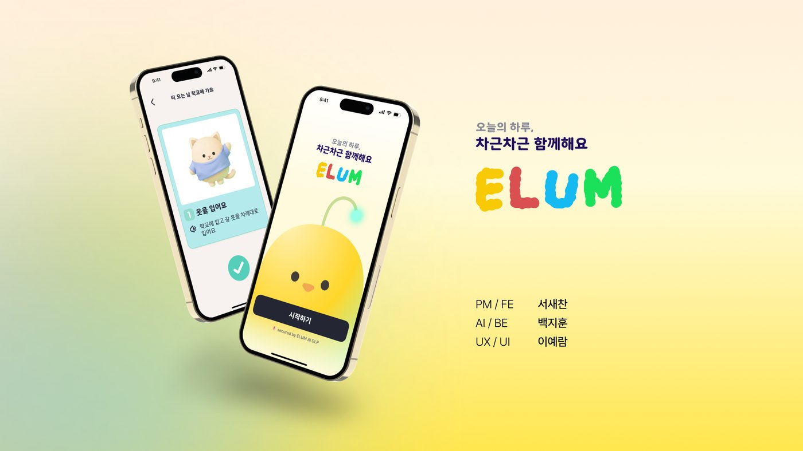
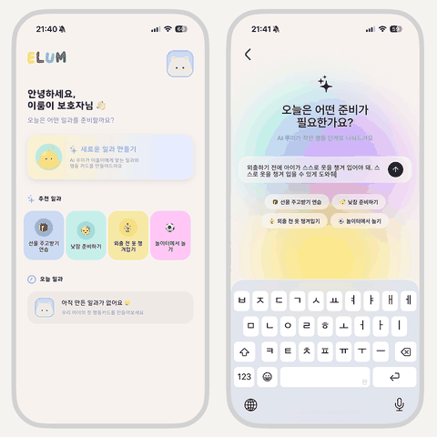
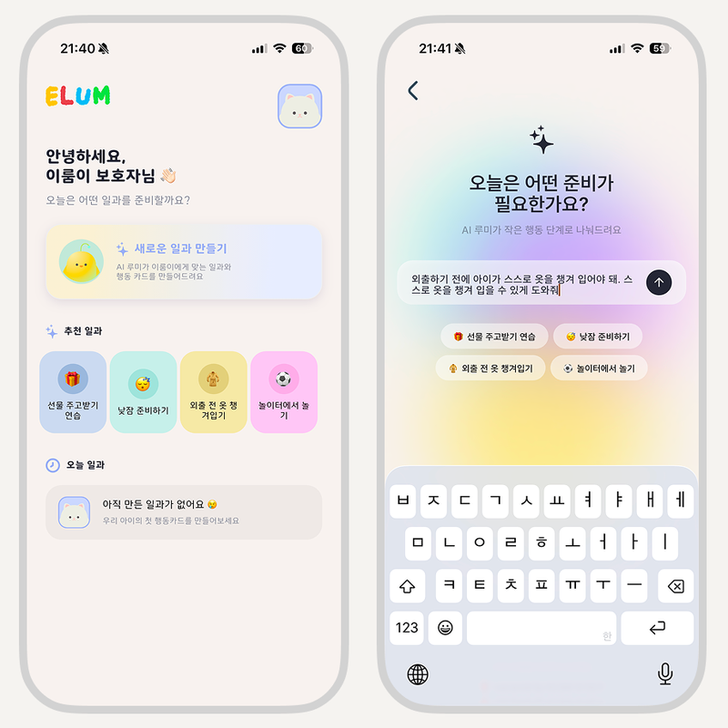
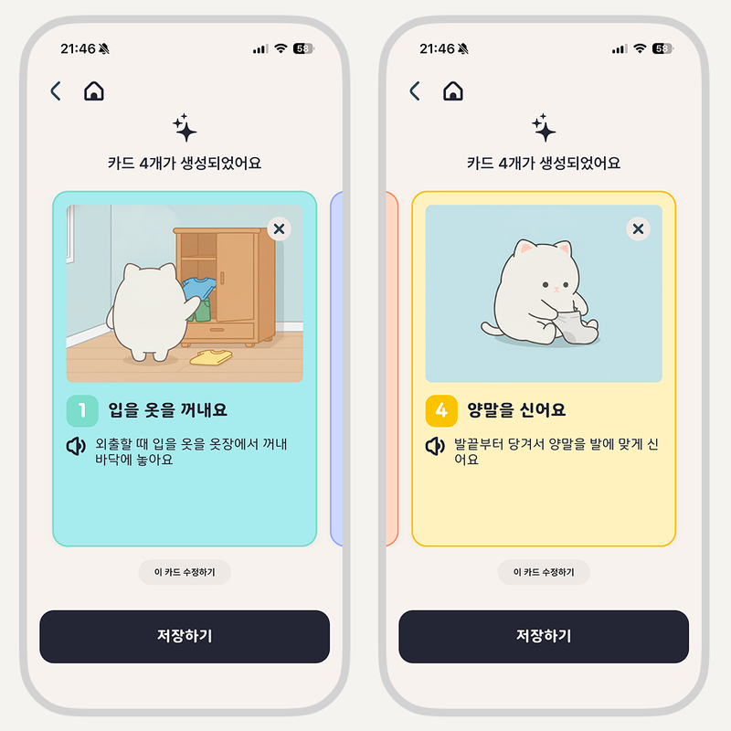
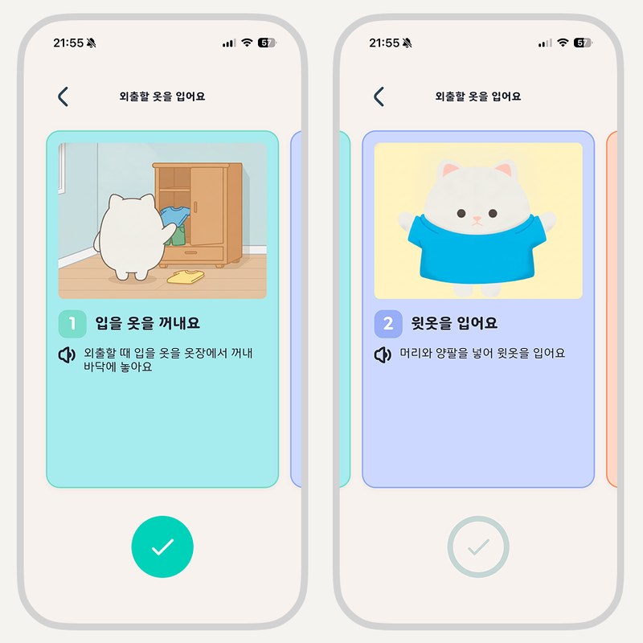
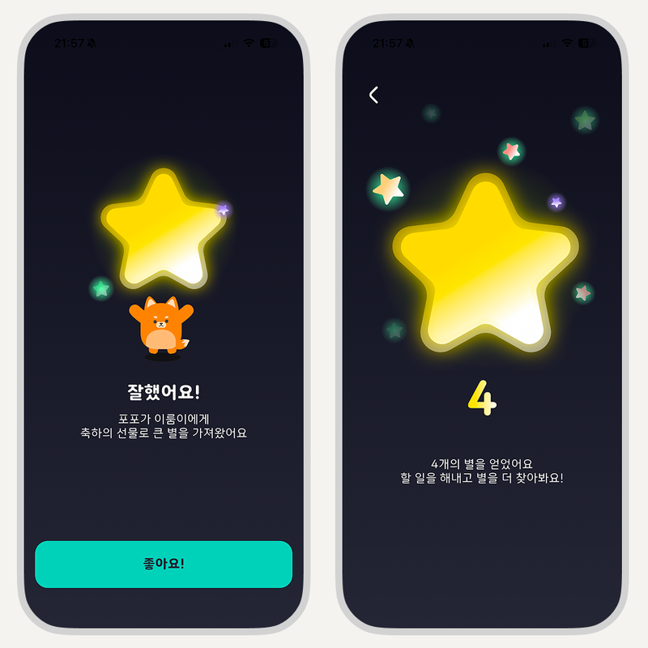

# ELUM

<!-- AUTO-VERSION-SECTION: DO NOT EDIT MANUALLY -->
## Latest Version : v2.14.0 (2026-10-02)

**English** · [한국어](README.ko.md) · [简体中文](README.zh.md) · [日本語](README.ja.md)

  

  <b>Today, step by step, together.</b> 
  A mobile service that helps people with developmental disabilities carry out their daily routines on their own.

  
  

---

## What is ELUM?

A guardian types what the day looks like, in everyday words. ELUM's AI turns it into short, illustrated **step-by-step action cards**. The person follows them one at a time, ticks each one off, and is praised with stars along the way.

For the person using it, that means a daily routine that is easy to understand and a positive experience of getting it done. For guardians, it takes away the burden of preparing the same things again and again.

  

## Why we built it

- **Guardians** repeat the same instructions endlessly, and making visual schedules and picture cards by hand takes a lot of time.
- **People with developmental disabilities** often find abstract or multi-part instructions hard to follow, and hard to turn into a sequence of actions on their own.

ELUM's goal is to be a self-reliance support service: so that a person can carry out their routine without a guardian having to step in every time.

## How it works

<table>
  <tr>
    <td align="center" width="50%">
       
      <b>1. Tell ELUM about today</b> 
      The guardian types what needs to be done. ELUM asks a few follow-up questions when it needs more context.
    </td>
    <td align="center" width="50%">
       
      <b>2. Cards are created</b> 
      The routine becomes several small steps, each with a picture. The guardian can edit the order and content, and cards are shown only after the guardian confirms.
    </td>
  </tr>
  <tr>
    <td align="center">
       
      <b>3. Follow along and check off</b> 
      The person looks at the picture, does the action, and checks it off. Small successes add up.
    </td>
    <td align="center">
       
      <b>4. Praise and stars</b> 
      Finishing an action brings praise and a star, so progress is something the person can see.
    </td>
  </tr>
</table>

## Designed with ABA principles in mind

ELUM's three-step design draws on the principles of Applied Behavior Analysis (ABA).

| Step | What happens in ELUM |
| --- | --- |
| **1. Prompt** | Each card gives a short, clear instruction for one action. |
| **2. Action** | The person carries it out one step at a time, following the picture. |
| **3. Reinforcement** | Rewards chosen by the guardian are brought up before, during, and after the action. |

The stars in the app are a way to celebrate progress. The real rewards, such as a snack, playtime, or a walk, are set by the guardian.

## Features

- **Illustrated action cards** made by AI from a plain description of the day
- **Voice guidance** that reads each card aloud
- **Friendly characters** that appear on every card
- **Guardian in control**: review and edit every card before the person sees it
- **Rewards set by the guardian**, with stars to celebrate each finished action
- **Two screens in one app**: one for the guardian and one for the person following the routine, switched with a secret passcode

## Languages

Korean is available today. English, Chinese, and Japanese are on the way.

## Help and policies

[Help](https://twin-fang.github.io/elum/) · [Privacy Policy](https://twin-fang.github.io/elum/privacy.html) · [Delete your account and data](https://twin-fang.github.io/elum/delete.html)

## Team

ELUM began at the 2026 hackathon 「장애 플러스 기술」 (Disability Plus Technology) as Team LUMLUM.

| Member | Role |
| --- | --- |
| Saechan Suh | PM, Frontend |
| Jihoon Baek | Backend, AI |
| Yeram Lee | UX/UI |

## License

© 2026 Team LUMLUM. All rights reserved. See [LICENSE](./LICENSE).
