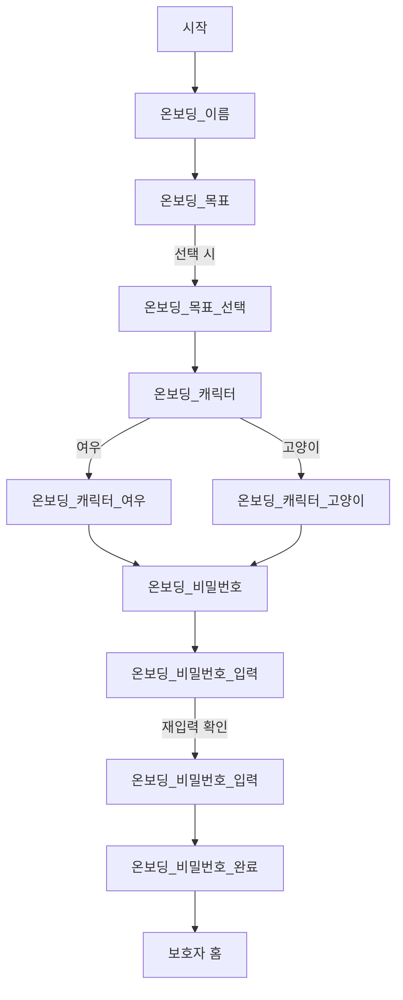

# 온보딩 플로우 명세

> 출처: Figma 섹션 `온보딩` (node `238:3022`) — 프레임 12개
> 토큰(색·폰트·간격)은 [design-system.md](./design-system.md) 참조.
>
> ⚠️ **좌표·색은 2026-07-21 덤프 기준이다. 디자이너가 계속 수정 중이므로
> 화면을 건드리기 전에 해당 노드를 다시 덤프한다.** 이 문서는 참고용이지 원본이 아니다.

## 왜 온보딩이 중요한가

온보딩은 단순 설정 화면이 아니라 **발표의 첫 번째 와우 포인트**다.
"진단명을 묻지 않고도 개인화한다"는 서비스 정체성이 여기서 증명된다.
(→ [../../docs/07-mvp-scope.md](../../docs/07-mvp-scope.md) 시연 0:10~0:45 구간)

수집하는 것은 **호칭 / 도움 목표 / 캐릭터 / PIN** 네 가지뿐이다.
진단명·장애유형·생년월일·연락처는 **묻지 않는다.**

## 전체 플로우



## 프레임 → 노드 ID

Figma URL의 `?node-id=204-1002`는 MCP 호출 시 `204:1002`로 바꿔 쓴다(하이픈→콜론).
섹션 루트 `238:3022`를 덤프하면 아래 프레임이 한 번에 나온다.

| # | Figma 프레임 | 노드 ID | 라우트 | 역할 |
| --- | --- | --- | --- | --- |
| 0 | `시작` | `238:1808` | `/` | 스플래시 · 로고 |
| 1 | `온보딩_이름` | `204:991` | `/onboarding/name` | 호칭 입력 (빈 상태) |
| 2 | `온보딩_이름` (입력됨) | `204:1174` | ↑ 동일 | 입력된 상태 |
| 3 | `온보딩_목표` | `204:1002` | `/onboarding/goals` | 도움 목표 (미선택) |
| 4 | `온보딩_목표_선택` | `204:1147` | ↑ 동일 | 선택된 상태 |
| 5 | `온보딩_캐릭터` | `204:1029` | `/onboarding/character` | 캐릭터 선택 |
| 6 | `온보딩_캐릭터_여우` | `204:1121` | ↑ 동일 | 여우 선택 상태 |
| 7 | `온보딩_캐릭터_고양이` | `204:1134` | ↑ 동일 | 고양이 선택 상태 |
| 8 | `온보딩_비밀번호` | `238:1909` | `/onboarding/pin` | PIN 안내 |
| 9 | `온보딩_비밀번호_입력` | `238:1997` | ↑ 동일 | 키패드 입력 |
| 10 | `온보딩_비밀번호_입력` (재확인) | `238:2767` | ↑ 동일 | 재입력 확인 |
| 11 | `온보딩_비밀번호_완료` | `238:2924` | — | 미사용 (아래 참고) |
| 12 | `온보딩_맞춤설정완료` | `204:1042` | `/onboarding/done` | 저장 전환 화면 |

> `238:2924`(비밀번호_완료)는 제목이 재확인 단계와 같고 CTA만 enable인 **상태 프레임**이다.
> 실제 완료 화면은 `204:1042`(맞춤설정완료)다.

> 2·4·6·7·9·10번은 **별도 화면이 아니라 상태**다. 라우트를 새로 파지 않고 위젯 상태로 표현한다.

> ⚠️ 이 표는 2026-07-21에 실제 덤프로 검증했다. 이전 버전은 **CTA 버튼 인스턴스 ID를
> 프레임 ID로 잘못 적어놨었다** (목표 `204:1009`, 비밀번호 `238:1912`).
> 노드 ID를 적을 땐 `type: FRAME`인지 확인한다.

---

## 1. 온보딩_이름 (`204:991`)

```
제목      "아이를 어떻게\n불러드릴까요?"     28/w800  #242634   x=24 y=131
설명      "정확한 실명이 아니어도 괜찮아요"    16/w400  #898B98   x=24 y=211
입력필드   344×68 r20 · #FFFFFF · 1px #EFEFEF          x=24 y=279
placeholder "이름을 입력해주세요"            20/w400  #DADADA  (중앙)
CTA       "다음" (disabled)                              y=675
```

**동작**

- 입력값이 비어있으면 CTA `disabled`, 1자 이상이면 `enabled`
- 저장 키: `childNickname`
- 이후 모든 화면 제목에서 이 값을 사용한다 → `"하늘이의 어떤 순간을..."`

> 설명 문구 "정확한 실명이 아니어도 괜찮아요"는 **개인정보 최소수집 원칙의 UI 표현**이다. 삭제 금지.

---

## 2. 온보딩_목표 (`204:1002` / 선택 상태 `204:1147`)

```
제목      "{호칭}의 어떤 순간을\n도와주고 싶으신가요?"   28/w800 #242634  x=24 y=131
설명      "여러 개를 선택할 수 있어요"                16/w400 #898B98  x=24 y=211
칩 4개    344×68 r20 · x=24 · y=279/365/451/537 (간격 18)
  아이콘   40×40 · x=38 (칩 내부 좌측 14)
  텍스트   16/w400 #000000 · x=90 (아이콘 우측 12)
CTA       "다음" 360×66 r18 · x=16 y=675
```

**선택 상태 색** (칩 배경만 바뀐다)

| 상태 | 배경 | 테두리 |
| --- | --- | --- |
| 미선택 | `#FFFFFF` | `#EFEFEF` 1px |
| 선택 | `#B5EAEC` | `#93DBCC` 2px |

> 목표 선택색(민트)은 **캐릭터 선택색과 다르다.** 여우 `#FFDAC7`, 고양이 `#CED8FF`.
> 한때 목표 칩에 여우색이 들어가 있었다 → [이슈 #11](https://github.com/Twin-Fang/elum/issues/11)

**아이콘 — 4개가 전부 같다**

`Group 5`~`Group 8`이 모두 `Ellipse 1`(40×40, `rgba(255,214,41,0.3)`) +
`fi-br-child-head`(24×24 @8,8) 조합이다. **목표별로 다르지 않다.**
아이콘 배경 원은 선택 여부와도 무관하다.

> 목표별 아이콘 차별화가 필요하면 **Figma를 먼저 바꾼다.** 코드에서 임의로 4종을 만들지 않는다.

**목표 4종** (`supportGoals`와 1:1 대응)

| 표시 문구 | enum |
| --- | --- |
| 해야 할 일을 순서대로 이해해요 | `UNDERSTAND_SEQUENCE` |
| 필요한 준비물을 스스로 챙겨요 | `PREPARE_ITEMS` |
| 새로운 상황을 미리 준비해요 | `PREPARE_NEW_SITUATIONS` |
| 혼자 끝까지 해내는 경험을 만들어요 | `COMPLETE_ALONE` |

**동작**

- **다중 선택**, 최소 1개 선택해야 CTA `enabled`
- 저장 키: `supportGoals` (List)
- 데모 시나리오 기본값: `PREPARE_ITEMS` + `PREPARE_NEW_SITUATIONS`

> enum 값은 서버 API와 맞춰야 한다. → [../../docs/06-api-spec.md](../../docs/06-api-spec.md)

---

## 3. 온보딩_캐릭터 (`204:1029` / 여우 `204:1121` / 고양이 `204:1134`)

```
제목      "{호칭}의 하루를 함께할\n친구를 골라주세요"       28/w800 #242634  x=24 y=131
설명      "선택한 친구가 카드 속 주인공이 되어 도와줘요"     16/w400 #898B98  x=24 y=211
카드 2개  176×202 r20 · x=16 / x=201 · y=279 (사이 간격 9)
  일러스트  152×152
  이름      카드 안 하단 (Figma는 회색 알약 64×16으로 비워둠)
CTA       "다음" 360×66 r18 · x=16 y=675
```

**배치 — 고양이가 왼쪽, 여우가 오른쪽**

| 위치 | Figma 노드 | 캐릭터 |
| --- | --- | --- |
| x=28 (왼쪽 카드 안) | `Component 3` (`187:853`) | 고양이 |
| x=213 (오른쪽 카드 안) | `Group 19` (`217:1649`) | 여우 |

`CardCharacter.values` 순서(`cat`, `fox`)가 이 배치와 일치한다. **enum 순서를 바꾸면 화면이 뒤집힌다.**

**선택 상태 색 — 캐릭터마다 다르다**

| 캐릭터 | 배경 | 테두리 (2px) |
| --- | --- | --- |
| 여우 | `#FFDAC7` | `#EB9B73` |
| 고양이 | `#CED8FF` | `#9CADF1` |

**동작**

- **단일 선택**. 이미 고른 것을 다시 눌러도 해제되지 않는다 (`allowDeselect: false`)
- 저장 키: `characterType`
- 선택된 캐릭터는 이후 **행동 카드 이미지의 주인공**으로 쓰인다

**캐릭터 이름**

Figma는 이름 자리를 회색 알약(`Ellipse 2`/`Ellipse 3`, 64×16)으로 비워뒀으나
이름이 정해져 텍스트로 채웠다. 서비스명 "이룸"에서 따왔다.

| 캐릭터 | 이름 |
| --- | --- |
| 고양이 | 이루미 |
| 여우 | 루미 |

> ⚠️ 임시 확정이다. 디자이너·기획 확인이 필요하다.
> 이름은 `CardCharacter.displayName`에 있다. 화면에 문자열을 직접 쓰지 않는다.

> MVP는 미리 제작한 에셋 5장을 쓰므로, 캐릭터 선택이 실제 이미지에 반영되려면
> **캐릭터별 카드 에셋**이 필요하다. 에셋이 한 종류뿐이면 선택 UI만 두고 이미지는 고정한다.

---

## 4. 온보딩_비밀번호 (`238:1909` / 입력 `238:1997` / 재확인 `238:2767`)

```
제목      "보호자님만 아는\n비밀암호를 만들어주세요"        28/w800 #242634  x=24 y=131
설명      "보호자모드로 변경할 때 사용하는 암호예요"        16/w400 #898B98  x=24 y=211
점 4개    20×20 · x=109부터 52 간격 (사이 여백 32) · 빈 점 #CDC8C3
키패드    iOS 시스템 숫자 키패드 (Figma는 Keyboard - iPhone 인스턴스)
CTA       "맞춤 설정하기"  ← "다음"이 아니다
```

**재확인 단계 제목** (`238:2767`)

```
"암호를 한번 더\n입력해주세요"
```

설명 문구는 1단계와 같다.

**동작**

- **4자리 PIN**, 입력 → 재입력 확인 2단계
- 4자리를 채워도 **자동으로 넘어가지 않는다.** CTA를 눌러야 진행한다
  (Figma가 모든 PIN 프레임에 CTA를 두고 있고, 자동 전환은 오타를 고칠 틈을 주지 않는다)
- 재입력 불일치 시 첫 단계로 되돌리고 안내 (⚠️ 에러 색상·경고 아이콘 사용 금지)
- 저장 키: `guardianPin`

**키패드는 OS 시스템 키패드를 쓴다.**

Figma의 `Keyboard - iPhone` 인스턴스가 그것이다. 자체 키패드를 그리면 iOS·Android
각각의 입력 관습(햅틱·접근성 낭독·외부 키보드·붙여넣기)을 전부 다시 구현해야 한다.

구현은 보이지 않는 `TextField`(`PinInputField`)가 시스템 키패드를 띄우고,
화면에는 `PinDots`로 자릿수만 그린다. 필드 높이를 **0으로 두지 않는다** —
0이면 일부 플랫폼에서 포커스를 못 받아 키패드가 올라오지 않는다.

> MVP 범위상 **완전한 PIN 인증은 제외**, 전환 UI만 구현한다.
> (→ [../../docs/07-mvp-scope.md](../../docs/07-mvp-scope.md))
> 저장은 `shared_preferences`로 충분하되, **평문 저장이라는 점을 발표에서 언급하지 않는다** —
> 보안 해커톤 특성상 지적 대상이 될 수 있으므로 `flutter_secure_storage` 사용을 권장한다.

---

## 5. 온보딩_맞춤설정완료 (`204:1042`)

```
아이콘    78×78 · x=158 y=303 (노란 원 + 아이 얼굴)
문구      "준비물은 눈에 보이는\n체크리스트로 보여드려요"
          24/w800 #242634 · 가운데 정렬 · x=65 y=444
```

**CTA도 뒤로가기도 없다.** 온보딩 결과를 저장하는 동안 잠깐 보였다가
보호자 홈으로 넘어가는 **전환 화면**이다.

**동작**

- 진입 즉시 `complete()`로 저장을 시작한다
- **저장 완료를 기다리지 않는다.** 최소 1.6초 머문 뒤 홈으로 이동한다
  - 로컬 저장은 대개 즉시 끝나서, 그대로 넘기면 화면이 깜빡이기만 하고 읽을 틈이 없다
  - 저장이 실패해도 진행한다 (docs 원칙 6번 — 데모는 어떤 실패에도 끝까지 진행)

## 6. 시작

로고(`Cloudsofa_namgim` 64px) + 캐릭터 일러스트. 폰트 미확보로 **이미지 에셋 처리**

---

## 온보딩 결과 데이터

```dart
// lib/features/onboarding/domain/onboarding_profile.dart
@freezed
class OnboardingProfile with _$OnboardingProfile {
  const factory OnboardingProfile({
    required String childNickname,      // 호칭 (실명 아님)
    required List<SupportGoal> supportGoals,
    required CharacterType characterType,
    required String guardianPin,        // 4자리
  }) = _OnboardingProfile;
}
```

> 이 4개 필드가 **개인화에 쓰이는 정보의 전부**다.
> 필드를 추가할 땐 "진단명 없는 개인화" 원칙을 깨는지 먼저 검토한다.

## 미확정 사항

- 목표 칩 **선택 상태** 시각 스타일 (Figma `온보딩_목표_선택` 색 토큰 미추출)
- 캐릭터 종류가 여우·고양이 2종으로 확정인지
- PIN 재입력 불일치 시 문구
- 온보딩 완료 후 진입 지점 (보호자 홈 화면 미설계)
