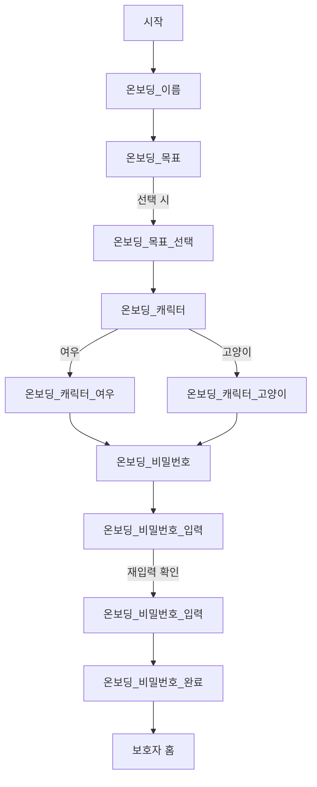

# 온보딩 플로우 명세

> 출처: Figma 섹션 `온보딩` (node `238:3022`) — 프레임 12개
> 토큰(색·폰트·간격)은 [design-system.md](./design-system.md) 참조.

## 왜 온보딩이 중요한가

온보딩은 단순 설정 화면이 아니라 **발표의 첫 번째 와우 포인트**다.
"진단명을 묻지 않고도 개인화한다"는 서비스 정체성이 여기서 증명된다.
(→ [../../docs/07-mvp-scope.md](../../docs/07-mvp-scope.md) 시연 0:10~0:45 구간)

수집하는 것은 **호칭 / 도움 목표 / 캐릭터 / PIN** 네 가지뿐이다.
진단명·장애유형·생년월일·연락처는 **묻지 않는다.**

## 전체 플로우



## 프레임 → 라우트 매핑

| # | Figma 프레임 | 라우트 | 역할 |
| --- | --- | --- | --- |
| 0 | `시작` | `/` | 스플래시 · 로고 |
| 1 | `온보딩_이름` | `/onboarding/name` | 호칭 입력 |
| 2 | `온보딩_목표` | `/onboarding/goals` | 도움 목표 (미선택) |
| 3 | `온보딩_목표_선택` | ↑ 동일 | 선택된 상태 |
| 4 | `온보딩_캐릭터` | `/onboarding/character` | 캐릭터 선택 |
| 5 | `온보딩_캐릭터_여우` | ↑ 동일 | 여우 선택 상태 |
| 6 | `온보딩_캐릭터_고양이` | ↑ 동일 | 고양이 선택 상태 |
| 7 | `온보딩_비밀번호` | `/onboarding/pin` | PIN 안내 |
| 8 | `온보딩_비밀번호_입력` | ↑ 동일 | 키패드 입력 |
| 9 | `온보딩_비밀번호_입력` (2) | ↑ 동일 | 재입력 확인 |
| 10 | `온보딩_비밀번호_완료` | `/onboarding/done` | 완료 |

> 3·5·6·8·9번은 **별도 화면이 아니라 상태**다. 라우트를 새로 파지 않고 위젯 상태로 표현한다.

---

## 1. 온보딩_이름 (`204:991`)

```
제목      "아이를 어떻게\n불러드릴까요?"     28/w800  #242634   x=24 y=131
설명      "정확한 실명이 아니어도 괜찮아요"    16/w400  #898B98   x=24 y=211
입력필드   344×68 r20 · #FFFFFF · 1px #EFEFEF          x=24 y=279
placeholder "이름을 입력해주세요"            20/w400  #DADADA  (중앙)
CTA       "다음" (disabled)                              y=675
```

**동작**

- 입력값이 비어있으면 CTA `disabled`, 1자 이상이면 `enabled`
- 저장 키: `childNickname`
- 이후 모든 화면 제목에서 이 값을 사용한다 → `"하늘이의 어떤 순간을..."`

> 설명 문구 "정확한 실명이 아니어도 괜찮아요"는 **개인정보 최소수집 원칙의 UI 표현**이다. 삭제 금지.

---

## 2. 온보딩_목표 (`204:1009`)

```
제목      "{호칭}의 어떤 순간을\n도와주고 싶으신가요?"   28/w800
설명      "여러 개를 선택할 수 있어요"                16/w400 #898B98
칩 4개    아이콘(SVG) + 텍스트 16/w400
CTA       "다음"
```

**목표 4종** (`supportGoals`와 1:1 대응)

| 표시 문구 | enum |
| --- | --- |
| 해야 할 일을 순서대로 이해해요 | `UNDERSTAND_SEQUENCE` |
| 필요한 준비물을 스스로 챙겨요 | `PREPARE_ITEMS` |
| 새로운 상황을 미리 준비해요 | `PREPARE_NEW_SITUATIONS` |
| 혼자 끝까지 해내는 경험을 만들어요 | `COMPLETE_ALONE` |

**동작**

- **다중 선택**, 최소 1개 선택해야 CTA `enabled`
- 저장 키: `supportGoals` (List)
- 데모 시나리오 기본값: `PREPARE_ITEMS` + `PREPARE_NEW_SITUATIONS`

> enum 값은 서버 API와 맞춰야 한다. → [../../docs/06-api-spec.md](../../docs/06-api-spec.md)

---

## 3. 온보딩_캐릭터 (`204:1032`)

```
제목      "{호칭}의 하루를 함께할\n친구를 골라주세요"       28/w800
설명      "선택한 친구가 카드 속 주인공이 되어 도와줘요"     16/w400
```

**동작**

- **단일 선택** (여우 / 고양이)
- 저장 키: `characterType`
- 선택된 캐릭터는 이후 **행동 카드 이미지의 주인공**으로 쓰인다

> MVP는 미리 제작한 에셋 5장을 쓰므로, 캐릭터 선택이 실제 이미지에 반영되려면
> **캐릭터별 카드 에셋**이 필요하다. 에셋이 한 종류뿐이면 선택 UI만 두고 이미지는 고정한다.

---

## 4. 온보딩_비밀번호 (`238:1912`)

```
제목      "보호자님만 아는\n비밀암호를 만들어주세요"        28/w800
설명      "보호자모드로 변경할 때 사용하는 암호예요"        16/w400
키패드    iOS 숫자 키패드 스타일 (0-9, 알파벳 보조표기)
CTA       "맞춤 설정하기"
```

**동작**

- **4자리 PIN**, 입력 → 재입력 확인 2단계
- 재입력 불일치 시 첫 단계로 되돌리고 안내 (⚠️ 에러 색상·경고 아이콘 사용 금지)
- 저장 키: `guardianPin`

> MVP 범위상 **완전한 PIN 인증은 제외**, 전환 UI만 구현한다.
> (→ [../../docs/07-mvp-scope.md](../../docs/07-mvp-scope.md))
> 저장은 `shared_preferences`로 충분하되, **평문 저장이라는 점을 발표에서 언급하지 않는다** —
> 보안 해커톤 특성상 지적 대상이 될 수 있으므로 `flutter_secure_storage` 사용을 권장한다.

---

## 5. 온보딩_비밀번호_완료 / 시작

- **완료**: 설정 완료 안내 → 보호자 홈으로 진입
- **시작**: 로고(`Cloudsofa_namgim` 64px) + 캐릭터 일러스트. 폰트 미확보로 **이미지 에셋 처리**

---

## 온보딩 결과 데이터

```dart
// lib/features/onboarding/domain/onboarding_profile.dart
@freezed
class OnboardingProfile with _$OnboardingProfile {
  const factory OnboardingProfile({
    required String childNickname,      // 호칭 (실명 아님)
    required List<SupportGoal> supportGoals,
    required CharacterType characterType,
    required String guardianPin,        // 4자리
  }) = _OnboardingProfile;
}
```

> 이 4개 필드가 **개인화에 쓰이는 정보의 전부**다.
> 필드를 추가할 땐 "진단명 없는 개인화" 원칙을 깨는지 먼저 검토한다.

## 미확정 사항

- 목표 칩 **선택 상태** 시각 스타일 (Figma `온보딩_목표_선택` 색 토큰 미추출)
- 캐릭터 종류가 여우·고양이 2종으로 확정인지
- PIN 재입력 불일치 시 문구
- 온보딩 완료 후 진입 지점 (보호자 홈 화면 미설계)
