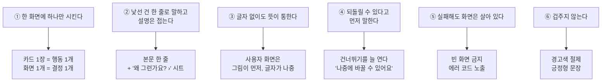
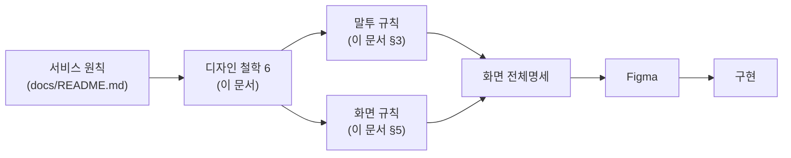

# 08. 디자인 원칙 — 이룸을 어떻게 그리는가

> **모든 화면은 이 문서에서 나온다.**
> 개별 화면 명세가 이 문서와 다르면, 명세가 틀린 것이다.
>
> 화면 명세: [2026-09-18 화면 전체명세](./superpowers/specs/2026-09-18-화면-전체명세.md)
> 서비스 원칙: [docs/README.md](./README.md)

---

# 1. 우리는 두 사람을 위해 만든다

```
        보호자                        사용자(당사자)
    ┌──────────────┐              ┌──────────────┐
    │    50대       │              │    20대       │
    │              │              │              │
    │ 일과를 만든다  │   ────────▶  │ 카드를 본다   │
    │ 카드를 고친다  │              │ 하나씩 해낸다  │
    │ 보상을 정한다  │   ◀────────  │ 다 했다고 누른다│
    └──────────────┘              └──────────────┘
      자기 휴대폰                     자기 휴대폰
```

| | 보호자 | 사용자 |
| --- | --- | --- |
| 나이 | 50대 | 20대 (연령으로 나누지 않는다) |
| 처음 겪는 것 | **낯선 개념이 많다** — 보상 · 임시저장 · 휴대폰 연결 | — |
| 못 하는 것 | 복잡한 설정을 오래 읽기 | **글자를 못 읽을 수 있다** |
| 화면이 해야 할 일 | **가르쳐 주기** | **보여 주기** |

> **한 앱에 두 사람이 있다.** 보호자 화면은 설명하고, 사용자 화면은 보여 준다.
> 이 둘을 같은 규칙으로 그리면 둘 다 실패한다.

---

# 2. 디자인 철학 6가지



## ① 한 화면에 하나만 시킨다

카드 한 장에 행동 하나. **화면 하나에 결정 하나.**

| 좋음 | 나쁨 |
| --- | --- |
| 보상만 고르는 화면 | 보상 고르고 날짜도 정하고 알림도 켜는 화면 |
| 이름만 넣는 화면 | 이름·나이·목표를 한 화면에 |

> 발달장애 당사자를 위해 과제를 쪼개는 앱이다. **화면도 같은 원리로 쪼갠다.**

## ② 낯선 건 한 줄로 말하고, 설명은 접는다

50대 보호자에게 `보상`, `임시저장`, `휴대폰 연결`은 처음 보는 개념이다.
**그렇다고 화면을 설명으로 채우면 아무도 안 읽는다.**

```
❌ 이렇게 하지 않는다              ✅ 이렇게 한다
┌──────────────────────┐        ┌──────────────────────┐
│ 다 하면 뭘 할 수      │        │ 다 하면 뭘 할 수      │
│ 있나요?              │        │ 있나요?              │
│                      │        │                      │
│ 평소에 "이거 다 하면   │        │ 미리 정해두면 끝까지   │
│ 젤리 먹자"라고 하시죠? │        │ 해낼 힘이 돼요        │
│ 미리 정해두면 카드를   │        │                      │
│ 보는 내내 그걸 기억할 │        │ [칩들]                │
│ 수 있어요. 한 달 뒤   │        │                      │
│ 선물보다 오늘 받을 수 │        │ 왜 정하나요? ›        │  ← 시트로
│ 있는 게 더 잘 통해요  │        │                      │
└──────────────────────┘        └──────────────────────┘
      아무도 안 읽는다                 읽을 사람만 읽는다
```

**규칙** — 본문 설명은 **한 줄**. 더 필요하면 `› 시트`로 접는다.

## ③ 글자 없이도 뜻이 통한다

사용자 화면은 **그림이 먼저, 글자가 나중**이다.

| 요소 | 규칙 |
| --- | --- |
| 카드 | 그림이 화면의 절반 이상 |
| 보상 | **반드시 그림이 있어야 한다.** 자유 텍스트만 받으면 의미가 없다 |
| 완료 | 체크 표시 + 색 변화 (글자 없이도 구분) |
| 진행률 | 점(`●●○○○`) — 숫자보다 먼저 |

> 보상에 프리셋을 두는 이유가 이것이다. 키가 있어야 그림을 띄운다.

## ④ 되돌릴 수 있다고 먼저 말한다

사람은 되돌릴 수 없을까 봐 버튼을 안 누른다.

| 화면 | 먼저 말하는 것 |
| --- | --- |
| 역할 선택 | `나중에 바꿀 수 있어요` |
| 보상 설정 | `건너뛰기` — 늘 활성 |
| 나갈 때 | `임시저장하면 이어서 만들 수 있어요` |
| 코드 발급 | `나중에 할게요` |

**`건너뛰기`를 없애지 않는다.** 선택 항목은 끝까지 선택으로 둔다.

## ⑤ 실패해도 화면은 살아 있다

| 상황 | 화면 |
| --- | --- |
| 못 불러옴 | 빈 화면·무한 로딩 **금지**. 상태 + `다시 시도` |
| 0건 | 로딩(스켈레톤)과 **구분되는** 빈 화면 |
| 권한 거부 | 앱은 계속 돈다. 왜 필요한지 + **우회 경로** |
| 모르는 오류 | 화면을 덮지 않는다. **작은 에러 코드**를 남긴다 |

> **에러 코드는 반드시 노출한다.** 사용자에겐 "문제가 생겼어요"로 충분하지만,
> 화면 어딘가에 `E-1023`이 있어야 제보를 받았을 때 어디서 터졌는지 안다.

## ⑥ 겁주지 않는다

**사용자 휴대폰에도 이 앱이 깔린다.** 빨간 경고가 화면을 덮으면 안 된다.

| 대신 |
| --- |
| 경고색 대신 중립색 (`임시저장` 배지) |
| 흔들림 + 짧은 문구 (PIN 틀림) |
| `사라집니다` 대신 `이어서 만들 수 있어요` |

---

# 3. 말투 — 토스 라이팅 원칙을 따른다

## 3-1. 기본 셋

| 항목 | 규칙 | 예 |
| --- | --- | --- |
| **해요체** | 하나로 통일 | `저장했어요` / ~~저장되었습니다~~ |
| **능동형** | 주어가 행동한다 | `코드를 보냈어요` / ~~코드가 발송되었습니다~~ |
| **긍정형** | 할 수 있는 걸 말한다 | `이어서 만들 수 있어요` / ~~저장 안 하면 사라집니다~~ |

## 3-2. 8원칙

| # | 원칙 | 우리 화면에서 |
| :-: | --- | --- |
| 1 | 다음을 예측할 수 있게 | 버튼에 **결과**를 쓴다 — `다음` ❌ → `사용자에게 보내기` ✅ |
| 2 | 잡초 뽑기 | `이 카드 수정하기` ❌ → `고치기` ✅ |
| 3 | 빈 문장 제거 | 공간이 비었다고 설명을 채우지 않는다 |
| 4 | 핵심만 | 이미 아는 걸 다시 말하지 않는다 |
| 5 | 말하기 쉽게 | 소리내어 읽어 어색하면 고친다 |
| 6 | 권유하되 강요 금지 | `건너뛰기`를 늘 연다 |
| 7 | 모두를 위한 단어 | 유행어·은어 금지. **50대가 아는 말만** |
| 8 | 숨은 감정 찾기 | 다 해냈을 때 축하한다 |

## 3-3. 쓰지 않는 말

| 금지 | 대신 | 왜 |
| --- | --- | --- |
| 🔴 **아이 · 아동 · 우리 아이** | **이룸이** | **20대 당사자가 자기 휴대폰에서 이 앱을 연다** |
| 기기 | **휴대폰** | 50대에게 낯설다 |
| 코드 | **연결 번호** | 처음 보는 사람이 뜻을 모른다 |
| 강화 · 강화물 · 행동중재 | **보상** | 전문 용어다 |
| 서버 | (안 쓴다) | 사용자에게 남의 일이다 |
| 승인 · 승인 대기 | **임시저장 · 이어서** | 만들다 만 것이지 심사가 아니다 |
| 발송 · 저장되었습니다 | 보냈어요 · 저장했어요 | 해요체 |

## 3-4. 🔴 우리는 사용자를 `이룸이`라고 부른다

```
아이 · 아동 · 우리 아이  ❌   →   이룸이  ✅
```

| 자리 | 문구 |
| --- | --- |
| 이름 묻기 | `이룸이를 어떻게 부를까요?` |
| 역할 선택 | `이룸이예요` |
| 설정 메뉴 | `이룸이 휴대폰 연결` |
| 카드 검토 CTA | `이룸이에게 보내기` |
| 이름 없을 때 | `이룸이` (기존 `우리 아이`) |

**이름을 알면 이름을 쓴다.** `이룸이`는 이름을 모를 때 쓰는 말이다.

> ⚠️ **법적 문구는 예외다.** 약관·법정대리인 동의처럼 법적 효력이 있는 문장은
> 임의로 바꾸지 않는다. 바꾸려면 근거를 남기고 확인을 받는다.

---

# 4. 원칙이 화면으로 내려오는 길



**새 화면을 만들 때는 위에서 아래로 내려온다.** 반대로 올라가지 않는다.

---

# 5. 화면 규칙

## 5-1. 레이아웃

| 항목 | 값 |
| --- | --- |
| 기준 프레임 | **393 × 852** |
| 좌우 여백 | **24** (콘텐츠) · **16** (하단 CTA) |
| 하단 CTA | **360 × 66 · r18** |
| 카드 · 칩 | r20 |
| 칩 세로 간격 | 18 |

## 5-2. 색

| 용도 | 값 |
| --- | --- |
| 배경 | `#F7F2EF` |
| 본문 | `#242634` |
| 설명 | `#898B98` |
| 칩 배경 | `#FFFFFF` · 테두리 `#EFEFEF` 1px |
| **선택됨** | 배경 `#B5EAEC` · 테두리 `#93DBCC` **2px** |
| 위험 | 위험색 사용 · **위계는 가장 낮게** |

> **선택 색은 용도별로 나눈다.** 목표 칩과 캐릭터 카드는 색이 다르다.
> `selectedFill` 같은 단일 토큰을 두지 않는다 — 다음 사람이 잘못 고른다.

## 5-3. 버튼 위계

```
주 버튼      ████████████████   채운 색 · 굵게
보조 버튼    ┌──────────────┐   테두리만
텍스트 버튼       계속 만들기      글자만
위험 버튼    ┌──────────────┐   위험색 테두리 · 주 버튼보다 약하게
```

| 상황 | 주 버튼 | 나머지 |
| --- | --- | --- |
| 나갈 때 팝업 | `임시저장` | `삭제`(위험) · `계속 만들기`(텍스트) |
| 보상 설정 | `다음` | `건너뛰기`(보조) |
| 설정 | — | `로그아웃` · `회원 탈퇴`(위험, 가장 약하게) |

> **위험한 일이 주 버튼이 되지 않는다.** 삭제·탈퇴는 절대 주 버튼이 아니다.

## 5-4. 상태 — 4개는 항상 그린다

```
   정상            로딩            빈 상태          실패
┌─────────┐   ┌─────────┐   ┌─────────┐   ┌─────────┐
│ ▤▤▤▤▤   │   │ ░░░░░   │   │         │   │   (!)   │
│ ▤▤▤▤▤   │   │ ░░░░░   │   │  없어요  │   │ 못 불러왔어요│
│ ▤▤▤▤▤   │   │ ░░░░░   │   │         │   │ [다시 시도]│
└─────────┘   └─────────┘   └─────────┘   └─────────┘
                스켈레톤      로딩과 구분!    에러 코드 포함
```

**빈 상태와 로딩을 같게 그리면 안 된다.** 사용자는 기다려야 할지 포기해야 할지 모른다.

## 5-5. 재사용을 먼저 찾는다

| 새로 필요한 것 | 이미 있는 것 |
| --- | --- |
| 선택 카드 | 온보딩 **도움 목표 칩** |
| 코드 입력 6칸 · 숫자패드 | **PIN 화면** |
| 보상 프리셋 칩 | 온보딩 **도움 목표 칩** |
| 카드 추가 시트 | **카드 고치기 시트** |
| 섹션 제목 | 보호자 홈 **추천 일과 제목** |
| 확인 팝업 | 기존 **다이얼로그** |

> **새로 그리기 전에 이 표를 본다.** 비슷한 게 있으면 그것을 쓴다.

---

# 6. 부드러움 — 모션

> 모션 값은 코드에 있고(`app_motion.dart`) 문서가 없었다. **여기가 그 자리다.**
> 화면에서 `250ms` 같은 숫자를 직접 쓰지 않는다.

| 토큰 | 시간 | 언제 |
| --- | :-: | --- |
| `instant` | 100ms | 손가락이 닿은 반응 |
| `fast` | 200ms | 선택 상태 · 작은 전환 |
| `normal` | 300ms | 카드·리스트 등장 |
| `slow` | 400ms | 페이지 전환 · 모달 |
| `emphasis` | 500ms | 온보딩 · 특수 진입 |
| `shake` | 440ms | **틀렸을 때** — 색 대신 움직임으로 알린다 |

## 부드럽다는 건

| 규칙 | 내용 |
| --- | --- |
| **끊기지 않는다** | 화면이 바뀔 때 요소가 사라졌다 나타나지 않는다. 이어진다 |
| **순서가 있다** | 여러 요소가 동시에 튀어나오지 않는다. 위에서 아래로 시차를 둔다 |
| **되돌아간다** | 뒤로 갈 때는 왔던 방향 그대로 |
| **기다리게 두지 않는다** | 200ms 넘게 멈춰 있으면 스켈레톤을 띄운다 |
| **모션을 끌 수 있다** | 시스템에서 애니메이션을 껐으면 따른다 ✅ 이미 대응됨 |

## 오류는 색이 아니라 움직임으로

```
PIN 틀림 · 코드 틀림
┌─────────────────┐
│  ← ⟷ →          │   한 번 흔들고 멎는다 (440ms)
│  ○ ○ ○ ○        │   빨간 테두리 ❌
└─────────────────┘   경고 아이콘 ❌
```

> **사용자 휴대폰에도 깔리는 앱이다.** 틀렸다고 화면이 빨개지면 다시 안 연다.

---

# 7. 디테일 — 손끝과 눈

## 7-1. 손끝

| 항목 | 값 | 왜 |
| --- | --- | --- |
| 최소 터치 영역 | **48 × 48** | 50대 손가락 · 20대 소근육 |
| 버튼 사이 간격 | **8 이상** | 옆 버튼 오탭 방지 |
| 위험 버튼 | 다른 버튼과 **떨어뜨린다** | 삭제를 잘못 누르면 되돌릴 수 없다 |
| 누른 느낌 | `instant`(100ms) 축소 또는 명도 변화 | 눌렸는지 모르면 두 번 누른다 |
| 스크롤 중 탭 | 무시한다 | 스크롤하다 눌리는 사고 |

## 7-2. 눈

| 항목 | 값 |
| --- | --- |
| 본문 최소 | **16** (50대 기준. 14 이하 금지) |
| 설명 최소 | **14** |
| 명암비 | 본문 **4.5:1 이상** · 큰 글자 3:1 이상 |
| 한 줄 길이 | 너무 길면 눈이 길을 잃는다. 좌우 여백 24 유지 |
| **시스템 글자 확대** | 🔴 **대응 안 되어 있다** — §8 QA 항목 |

> 🔴 **시스템 글자 크기를 키운 사용자에게 화면이 깨진다.**
> 50대 보호자가 흔히 켜 두는 설정이다. **고정 높이 컴포넌트부터 점검한다**
> (목표 칩 68 고정이 이미 문제를 내고 있다).

## 7-3. 입력

| 항목 | 규칙 |
| --- | --- |
| 키보드가 가리지 않는다 | 입력칸이 키보드 위로 밀려 올라온다 |
| 자동 넘어감 | PIN·코드는 마지막 자리 채우면 **자동 제출** |
| 글자 수 | 제한이 있으면 **미리** 보여 준다 (`0/20`) |
| 붙여넣기 | 코드 입력은 붙여넣기를 허용한다 |
| 완료 후 | 키보드를 내린다 |

## 7-4. 빠뜨리기 쉬운 것

| 항목 | 점검 |
| --- | --- |
| 뒤로가기 | 하드웨어 뒤로가기(안드로이드)도 같게 동작하는가 |
| 화면 회전 | 세로 고정인가 |
| 긴 이름 | 이름이 10자여도 제목이 안 깨지는가 |
| 0건 · 1건 · 100건 | 목록 개수가 극단이어도 괜찮은가 |
| 앱 복귀 | 백그라운드 갔다 오면 상태가 남아 있는가 |
| 연속 탭 | 버튼을 빨리 두 번 누르면 두 번 실행되는가 |

---

# 8. QA 리뷰 시트

> **화면 하나당 이 표를 채운다.** 하나라도 ❌면 아직 못 끝낸 것이다.
> 리뷰할 때 그대로 복사해서 쓴다.

## 8-1. 화면 공통 (11항목)

| # | 점검 | 결과 |
| :-: | --- | :-: |
| 1 | 이 화면에서 시키는 결정이 **하나**인가 | ☐ |
| 2 | 설명이 **한 줄**을 넘지 않는가 (넘으면 시트로 접었는가) | ☐ |
| 3 | 전문 용어가 없는가 (강화 · 기기 · 서버 · 승인) | ☐ |
| 4 | 버튼 글자가 **다음에 뭐가 나올지** 말해 주는가 | ☐ |
| 5 | 되돌릴 수 있다면 그렇다고 **먼저** 말했는가 | ☐ |
| 6 | **해요체 · 능동형 · 긍정형**인가 | ☐ |
| 7 | **로딩 · 빈 상태 · 실패**를 다 그렸는가 | ☐ |
| 8 | 실패 화면에 **에러 코드**가 있는가 | ☐ |
| 9 | 사용자 화면이라면 **글자를 가리고도** 뜻이 통하는가 | ☐ |
| 10 | 위험한 일이 **주 버튼이 아닌가** | ☐ |
| 11 | 이미 있는 컴포넌트로 되는 건 아닌가 | ☐ |

## 8-2. 손끝 (5항목)

| # | 점검 | 결과 |
| :-: | --- | :-: |
| 12 | 모든 탭 영역이 **48×48 이상**인가 | ☐ |
| 13 | 누른 느낌이 있는가 | ☐ |
| 14 | 위험 버튼이 다른 버튼과 **떨어져** 있는가 | ☐ |
| 15 | 빨리 두 번 눌러도 **한 번만** 실행되는가 | ☐ |
| 16 | 하드웨어 뒤로가기가 화면 뒤로가기와 같은가 | ☐ |

## 8-3. 눈 (4항목)

| # | 점검 | 결과 |
| :-: | --- | :-: |
| 17 | 본문이 **16 이상**인가 | ☐ |
| 18 | 명암비가 **4.5:1 이상**인가 | ☐ |
| 19 | **시스템 글자를 키워도** 안 깨지는가 🔴 | ☐ |
| 20 | 이름이 **10자**여도 제목이 안 깨지는가 | ☐ |

## 8-4. 움직임 (4항목)

| # | 점검 | 결과 |
| :-: | --- | :-: |
| 21 | 전환이 **끊기지 않는가** | ☐ |
| 22 | 여러 요소가 **동시에** 튀어나오지 않는가 | ☐ |
| 23 | 200ms 넘게 멈추면 **스켈레톤**이 뜨는가 | ☐ |
| 24 | 시스템에서 애니메이션을 끄면 따르는가 | ☐ |

## 8-5. 목록·입력이 있는 화면만 (5항목)

| # | 점검 | 결과 |
| :-: | --- | :-: |
| 25 | 목록 **0건 · 1건 · 100건**이 다 괜찮은가 | ☐ |
| 26 | 키보드가 입력칸을 **가리지 않는가** | ☐ |
| 27 | 글자 수 제한을 **미리** 보여 주는가 | ☐ |
| 28 | 마지막 자리를 채우면 **자동으로** 넘어가는가 (PIN·코드) | ☐ |
| 29 | 백그라운드 갔다 와도 **입력이 남아** 있는가 | ☐ |

## 8-6. 리뷰 기록 양식

```
화면: ____________________       리뷰: ______  날짜: 2026-__-__

공통 11 : ___/11      손끝 5 : ___/5     눈 4 : ___/4
움직임 4 : ___/4      목록·입력 5 : ___/5

❌ 항목
  #__  ____________________________________
  #__  ____________________________________

다음에 할 것
  ________________________________________
```

---

# 9. 지금 아는 문제

> **이미 찾아둔 것.** 새로 리뷰할 때 중복으로 찾지 않도록 남긴다.

| # | 화면 | 문제 | 항목 |
| :-: | --- | --- | :-: |
| 1 | 온보딩 목표 | 4번 칩 텍스트가 2줄로 깨져 `요` 한 글자만 떨어진다 (칩 높이 68 고정) | #19 · #20 |
| 2 | 온보딩 목표 | 3번 아이콘만 무채색 — 나머지 3개는 컬러 | 톤 |
| 3 | 전 화면 | **시스템 글자 확대에 대응 안 되어 있다** | #19 |
| 4 | 스플래시 | `시작하기` 버튼이 다음을 말해 주지 않는다 → 로그인 버튼을 바로 노출 | #4 |
| 5 | 카드 검토 | CTA `아이 화면으로 시작` — 뭐가 시작되는지 모른다 → `사용자에게 보내기` | #4 |
| 6 | 카드 검토 | `이 카드 수정하기` — 잡초 → `고치기` | #2 |
| 7 | 설정 | 에러 문구에 "계정을 지우지 못했어요" — 탈퇴라는 말을 안 쓴다 | #6 |

---

# 10. 금지

| 금지 | 왜 |
| --- | --- |
| 화면을 설명으로 채우기 | 길면 아무도 안 읽는다 |
| 정상 경로만 그리기 | 그 "나중"은 대개 오지 않는다 |
| 빈 상태 = 로딩 | 기다릴지 포기할지 모른다 |
| 에러 코드 숨기기 | 제보를 받아도 추적을 못 한다 |
| 삭제·탈퇴를 주 버튼으로 | 오탭으로 되돌릴 수 없는 일이 생긴다 |
| 사용자 화면에 붉은 경고 | 겁먹으면 앱을 안 연다 |
| 자유 텍스트만 받기 (보상) | 글자를 못 읽으면 의미가 없다 |
| 연령을 암시하는 말 | 20대 당사자도 쓴다 |

---

## 출처

- [토스의 8가지 라이팅 원칙들 — Toss Tech](https://toss.tech/article/8-writing-principles-of-toss)
- [2026-09-13 서울ABA연구소 1차 자문](./meetings/20260913_서울ABA연구소_1차자문/)
- 저장소 서비스 원칙 — [docs/README.md](./README.md)
