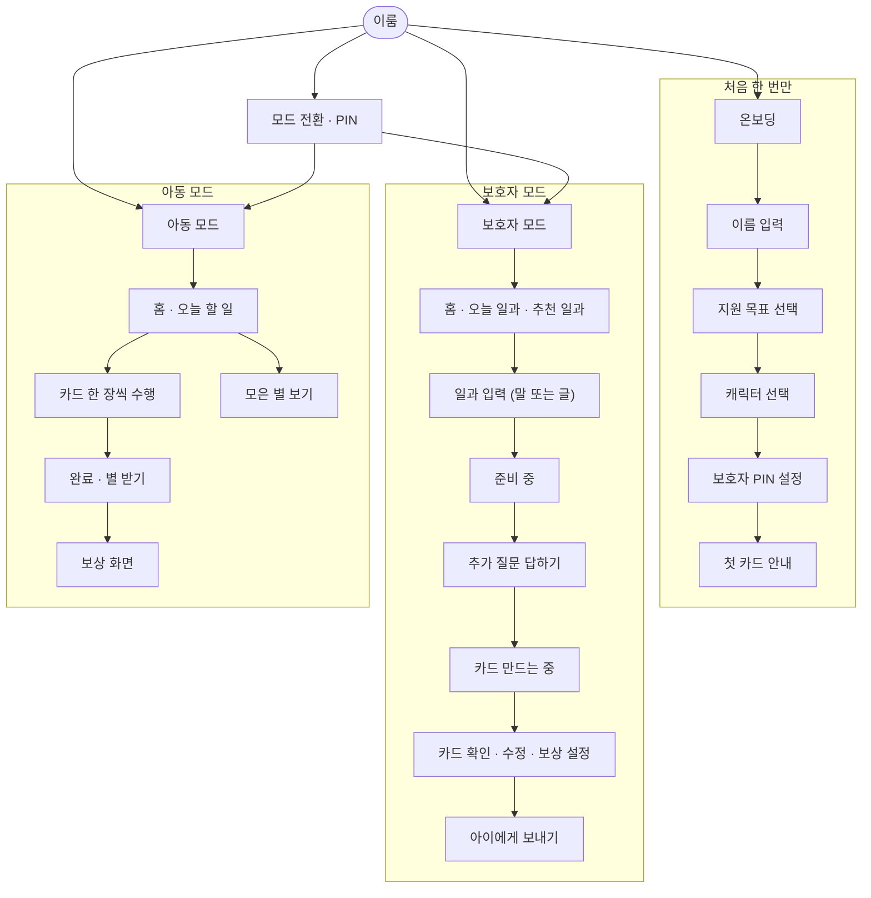
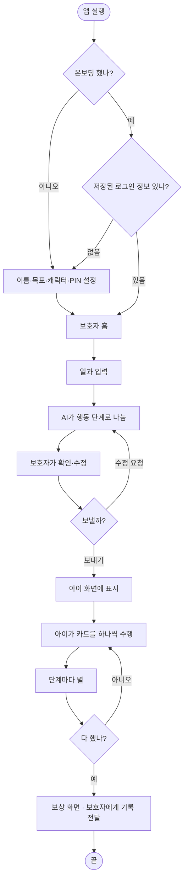
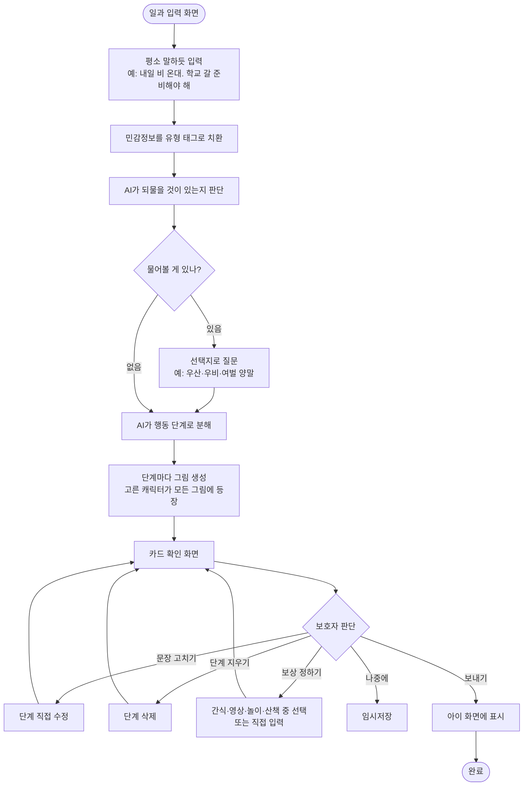
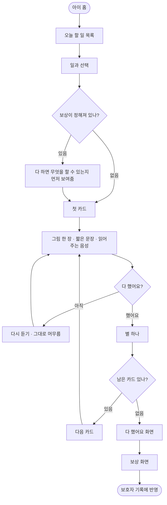
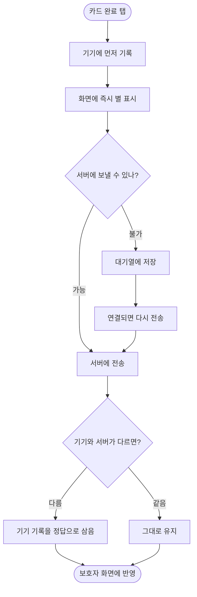
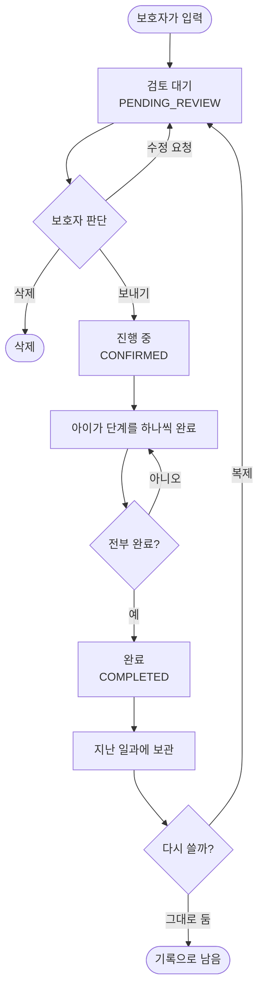
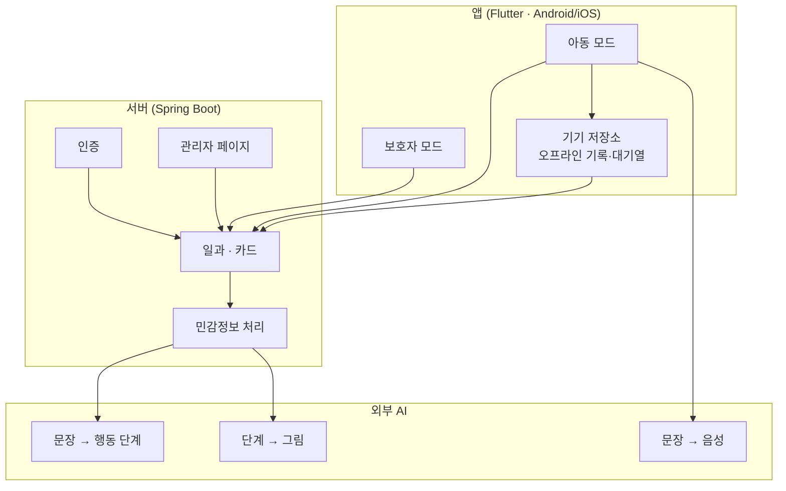

# 부록 — 플로우차트 · 메뉴 구조도

> 대회 제출 **필수 항목**입니다. 발표에서 설명하지 않고 자료집에만 싣습니다.
> 2026-09-13 기준 **실제 구현된 코드**에서 뽑았습니다 (`client/lib/core/router/app_router.dart` · `RoutineController`).

---

# 1. 메뉴 구조도

이룸은 **하나의 앱 안에 보호자 모드와 아동 모드**가 들어 있습니다.
두 모드는 **PIN으로만** 전환되며, 아동은 보호자 화면으로 넘어갈 수 없습니다.

## 화면 목록

| 구분 | 화면 | 경로 |
| --- | --- | --- |
| 공통 | 시작 화면 | `/` |
| 온보딩 | 이름 · 목표 · 캐릭터 · PIN · 첫 카드 안내 | `/onboarding/*` |
| 보호자 | 홈 | `/guardian` |
| 보호자 | 일과 입력 | `/guardian/routine/input` |
| 보호자 | 준비 중 (민감정보 처리 · 질문 준비) | `/guardian/routine/masking` |
| 보호자 | 추가 질문 | `/guardian/routine/question` |
| 보호자 | 카드 만드는 중 | `/guardian/routine/generating` |
| 보호자 | 카드 확인 · 수정 | `/guardian/routine/review` |
| 아동 | 홈 | `/child` |
| 아동 | 일과 수행 (카드 넘기기) | `/child/routine` |
| 아동 | 모은 별 | `/child/stars` |
| 아동 | 보상 | `/child/reward` |
| 공통 | 모드 전환 (PIN) | `/mode-switch` |

> **아동 모드에는 나가는 문이 없습니다.** 보호자 모드로 돌아가려면 PIN이 필요합니다.
> 아이가 실수로 설정을 바꾸거나 카드를 지우는 일을 구조로 막았습니다.

---

# 2. 전체 흐름 — 한 장으로

> **AI가 만든 카드는 보호자 승인 전에는 아이에게 보이지 않습니다.**
> 위 그림의 `H → I` 가 그 관문입니다.

---

# 3. 일과 만들기 — 보호자

**실패해도 화면은 멈추지 않습니다.**

| 어디서 실패 | 어떻게 되나 |
| --- | --- |
| AI 응답 없음·지연 | 미리 준비한 기본 카드로 대체하고 안내 문구를 띄웁니다 |
| 그림 생성 실패 | 기본 삽화로 대체합니다. 카드는 그대로 씁니다 |
| 네트워크 끊김 | 입력한 내용을 지우지 않고 재시도 버튼을 보여줍니다 |

---

# 4. 일과 수행 — 아동

> **보상을 일과 시작 전에 먼저 보여줍니다.** 다 끝난 뒤에만 알려주면
> 수행하는 동안 무엇을 위해 하는지 알 수 없기 때문입니다.

---

# 5. 오프라인에서도 끊기지 않습니다

아이가 쓰는 순간에 인터넷이 끊길 수 있습니다. 그때도 일과는 진행돼야 합니다.

**기기가 진실입니다.** 아이가 눈앞에서 한 행동이 서버 기록보다 우선합니다.
네트워크 때문에 "했는데 안 한 것으로 표시되는" 일은 없어야 하기 때문입니다.

---

# 6. 일과의 상태

> **지난 일과를 지우지 않고 접어둡니다.** 수행률 추이를 보려면 원본이 필요하고,
> 매일 같은 준비는 복제 한 번으로 끝나기 때문입니다.

---

# 7. 시스템 구성

**보호자가 쓴 문장은 그대로 AI에 가지 않습니다.** `B3`에서 이름·장소 같은 정보를
유형 태그로 바꾼 뒤 최소한만 보냅니다. 원문은 로그에도 남기지 않습니다.

---

# 8. 서버가 제공하는 기능

| 묶음 | 하는 일 |
| --- | --- |
| 인증 | 가입 · 로그인 |
| 일과 만들기 | 자연어 입력 받기 · 되물을 질문 만들기 · 행동 단계로 분해 |
| 일과 보기 | 오늘 일과 · 지난 일과 · 임시저장 · 추천 일과 |
| 카드 편집 | 단계 문장 수정 · 단계 삭제 · 그림 내려받기 |
| 보상 | 보상 설정 · 최근에 정한 보상 불러오기 |
| 수행 기록 | 단계 완료 · 완료 취소 · 오프라인 기록 동기화 |
| 일과 관리 | 아이에게 보내기 · 복제 · 삭제 |
| 관리자 | 회원 · 일과 조회 · AI 문구 관리 · 로그 모니터링 |
