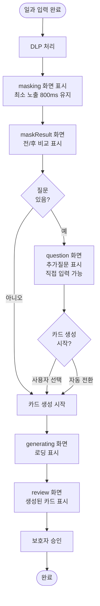

# ❗[버그][클라][일과] 일과 만들기 로딩 화면이 Figma 명세와 다르고 flow 순서가 틀림

## 개요

일과 만들기 플로우의 로딩 화면이 Figma 명세와 맞지 않고 상태 전이 순서가 잘못되어 있었다. 로딩 화면을 2종(DLP 처리 중, 카드 생성 중)으로 분리하고, 최소 노출시간을 보장하도록 수정했다. 또한 추가질문 화면에서 직접 입력 기능을 구현하고, 선택지 이모지를 폴백 목데이터에 반영했다.

## 기능 흐름

## 변경 사항

### 상태 관리 (RoutineFlowNotifier)

- **`RoutineFlowStep` enum 재정의** — 로딩 화면을 `masking` / `generating`으로 명확히 분리
  - `input`: 자연어 입력
  - `masking`: DLP 처리 중 (연출)
  - `maskResult`: 전/후 비교
  - `question`: AI 추가 질문
  - `generating`: 카드 생성 중
  - `review`: 카드 검토·승인
  - `done`: 승인 완료

- **DLP 최소 노출시간 보장** (`runDlp()`)
  - 응답이 빨라도 `AppConfig.dlpMinDelay`(800ms)만큼 `masking` 상태를 유지
  - 보안 처리를 시각적으로 강조하기 위한 연출

- **질문 화면의 자동 전환 방지** (`askQuestion()`)
  - AI 질문을 받아오기만 하고, 여기서는 카드를 생성하지 않음
  - 질문이 없으면 질문 화면이 자체적으로 로딩 화면으로 전환
  - 양쪽에서 생성하면 같은 일과가 중복 생성되는 문제 해결

- **카드 생성 중복 호출 방지** (`generateCards()`)
  - `_generating` Future를 통해 진행 중인 생성 요청을 추적
  - 중복 호출 시 기존 Future를 재사용하고 디버그 로그에 기록
  - 실패 시에만 가드를 풀어 재시도 가능하게 함
  - 성공 후에는 가드를 유지해 로딩 화면 재생성 시 재요청 방지

### 추가질문 화면 (QuestionScreen)

- **직접 입력 기능** — `_QuestionBlock` 위젯에 입력 필드 추가
  - `+ 직접 입력하기` 칩으로 입력 필드 토글
  - 최대 20자 제한 (칩 너비 초과 방지)
  - 중복 검사: 기존 값과 중복되면 칩을 만들지 않고 선택만 함
  - 빈 값은 무시하고 조용히 닫음

- **유리 재질 입력 필드** (`_CustomOptionField`)
  - Figma 262:4089 — 52h / r20 / glassSurface / blur 10
  - `BackdropFilter`로 배경 유리 효과 구현
  - `ElumTextField`(68h, 불투명)와 다른 재질로 화면 통일

- **선택 중 칩 흐려짐**
  - `AnimatedOpacity(opacity: _isWriting ? 0.4 : 1.0)` — 입력에 집중시키기
  - 어둡게 하면 '선택됨'과 색이 동일하므로 dim 처리

- **X 버튼 — 직접 추가한 칩에만**
  - `onRemove` 콜백으로 직접 추가 칩만 삭제 가능
  - 삭제 시 `answers`에서도 함께 제거 (유령 답 방지)

- **자동 전환 가드** (`QuestionScreen.build()`)
  - 질문이 없거나 이미 생성이 시작된 경우 로딩 화면 재표시 방지
  - `alreadyStarted` 플래그로 한 번만 전환

### 상태 관리 (RoutineFlowState)

- **`customOptions` 필드** — 질문별 Map<String, List<String>>
  - 보호자가 직접 적은 선택지를 질문 문구별로 구분
  - `answers`에만 넣으면 칩 목록에는 없는데 선택된 상태가 돼 화면에 보이지 않으므로 별도 저장

- **`detectedTypes` 필드** — 탐지된 민감정보 **유형만**
  - 원문은 담지 않음 (서비스 원칙 5번)
  - 탐지 결과를 "전/후 비교" 화면에 표시할 때 사용

### 폴백 목데이터

- **선택지 이모지** — 서버가 유니코드로 내려주는 값을 그대로 사용
  - 실제 응답 모양과 폴백이 일치하도록 목데이터 선택지에 이모지 포함
  - AI 생성이라 값이 고정되지 않으므로 클라이언트 매핑 불가

### 테스트

- `client/test/question_screen_test.dart` 8개 추가
  - 직접 입력 필드 열기·닫기
  - 중복 값 검사
  - 빈 값 무시
  - X 버튼으로 삭제 및 answers 동기화
  - 이미 생성 중인 경우 자동 전환 방지
  - 자동 전환 후 로딩 화면 표시

- 전체 285개 테스트 통과

## 주요 구현 내용

### 1. 로딩 화면 2종 분리의 필요성

**before**: `loading` → `question` → `loading` → `review` 순서로 같은 로딩 화면이 두 번 나타남.
이때 사용자 경험이 혼란스러웠고, Figma 명세 `보호자_새로운 일과 만들기_로딩`(262:4569)은 DLP 처리와 카드 생성을 구분하는 설계였다.

**after**: `masking` → `maskResult` → `question` → `generating` → `review` 단계별로 명확히 구분.

### 2. 중복 생성 방지의 비용

**문제**: 한 번의 일과 생성에 POST 요청이 최대 16번 나간 사례 발생.
- 로딩 화면이 재생성(토큰 만료 리다이렉트, 뒤로가기 등)되면 `initState`가 다시 돌아 API 호출 반복
- **AI 호출이므로 한 번이 곧 비용**

**대응**: `RoutineFlowNotifier._generating` Future와 `_blockedCalls` 카운터로 추적.
- 진행 중이거나 성공한 생성은 기존 결과를 재사용
- 실패만 가드를 풀어 재시도 가능하게 함
- 차단된 호출 수를 로그에 남겨 나중에 "또 사건이 났나" 감지 가능

### 3. 유형만 저장하는 DLP 검증

`detectedTypes`는 탐지된 민감정보 **유형**(예: "연락처", "의료정보")만 저장하고, 원문을 담지 않는다.
- 서비스 원칙 5번: 원문을 감사 로그·로컬에 저장하지 않는다
- "전/후 비교" 화면에는 마스킹된 텍스트와 유형만 표시

## 엣지 케이스 처리

| 상황 | 처리 방식 |
|---|---|
| 직접 입력에 공백만 | 조용히 닫음 (오타로 열었을 뿐) |
| 이미 있는 값 입력 | 칩을 새로 만들지 않고 선택만 함 |
| 20자 초과 | 입력 필드의 `maxLength`로 제한 |
| X 삭제 후 다시 추가 | `addCustomOption`에서 중복 검사해 칩 생성 여부 판단 |
| 직접 입력 중 화면 복귀 | 입력 값을 버리고 필드 닫음 (상태에는 선택 상태만 유지) |
| 질문이 없는 경우 | 질문 화면이 자체적으로 로딩 화면으로 전환 (가드: `alreadyStarted`) |
| 생성 중 토큰 만료 리다이렉트 | 기존 Future를 재사용, 비용 불필요 |

## 주의사항

### 1. DLP 최소 노출시간은 프로덕션 환경에서 조정 필요

현재 `AppConfig.dlpMinDelay = 800ms`는 데모 안전 수칙(docs/07-mvp-scope.md)에 따른 연출.
실제 보안 효과는 없으므로, 프로덕션에서는 사용자 피드백에 따라 조정 또는 제거 검토.

### 2. 직접 추가한 칩의 지속성

현재 `customOptions`는 `reset()` 호출 시 초기화된다. 이는 **홈으로 나가면 입력이 사라진다**는 뜻.
- 네비게이션 한 번이라도 돌아오면 내용이 사라짐
- 향후 요구사항에 따라 로컬 캐싱 추가 고려

### 3. 선택지 이모지의 정식 버전 확인

현재 폴백 목데이터의 이모지는 서버 응답과 일치하도록 임의로 선정했다.
실제 AI 생성 선택지가 나올 때 **모양이 다를 수 있으므로 베타 테스트 단계에서 수정 필요**.

### 4. Wrap 레이아웃의 성능

질문이 여러 개이고 각각 많은 선택지 + 직접 입력 칩이 누적되면 Wrap 계산이 무거워질 수 있다.
현재는 한 화면에 최대 3개 질문 정도만 나올 것으로 예상되므로 문제없음.
추후 대규모 데이터셋에서 성능 모니터링 필요.

## 변경된 파일

- `client/lib/features/guardian/application/routine_notifier.dart` (+55줄)
- `client/lib/features/guardian/data/routine_repository.dart` (-6줄)
- `client/lib/features/guardian/presentation/question_screen.dart` (+241줄)
- `client/test/question_screen_test.dart` (+108줄)
