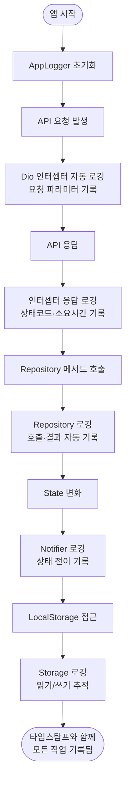

# 전체 디버깅 로그 시스템 구현

## 개요

프론트엔드 전체에 걸쳐 타임스탐프 포함 디버깅 로그 시스템을 구현했다. API 요청/응답, 상태 변화, 로컬 저장소 접근 등 모든 주요 작업이 자동으로 기록되므로, 개발 중 문제를 빠르게 추적할 수 있다.

## 기능 흐름



## 변경 사항

### 로거 인프라
- `lib/core/logger/app_logger.dart` (신규, 279줄): 공통 로그 헬퍼
  - 타임스탐프 (HH:mm:ss.SSS)
  - 카테고리별 로깅: 네트워크, 저장소, 상태관리, UI, 로컬저장, 에러, 생명주기
  - 모든 파라미터 출력 (마스킹 없음)

### 네트워크 계층
- `lib/core/network/dio_client.dart`: Dio 인터셉터 개선
  - 요청 시작 로깅 (메서드, 엔드포인트, 파라미터)
  - 응답 성공 로깅 (상태코드, 소요시간, 응답 데이터)
  - 응답 실패 로깅 (에러 데이터, 에러 메시지)
  - Stopwatch로 정확한 소요시간 측정

### 저장소 계층
- `lib/features/guardian/data/routine_repository.dart`: 모든 메서드에 로깅 추가
  - `getMyRoutines()`: 목록 조회 시작·결과
  - `getSuggestions()`: 추천 조회 시작·결과
  - `generateQuestion()`: 질문 생성 시작·결과
  - `createRoutine()`: 카드 생성 시작·결과·폴백
  - `confirm()`: 승인 시작·결과
  - `updateStep()`: 수정 시작·결과

- `lib/core/storage/local_storage.dart`: SharedPreferences 모든 접근
  - 읽기: `nickname`, `goals`, `character`, `isOnboardingCompleted`, `accessToken`
  - 쓰기: 모든 setter 메서드
  - 삭제: `clearAccessToken()`, `clearAll()`
  - 민감 정보(PIN, 토큰) 마스킹

### 상태관리 계층
- `lib/features/guardian/application/routine_notifier.dart`: 상태 전이 로깅
  - `setRawInput()`: 입력값 로깅
  - `runDlp()`: 상태 변화 (input → masking → maskResult)
  - `askQuestion()`: 질문 단계 로깅
  - `generateCards()`: 생성 중 상태 로깅
  - `updateStep()`: 수정 요청 로깅
  - `confirm()`: 승인 로깅
  - `reset()`: 리셋 및 중복 호출 차단 로깅

### 앱 생명주기
- `lib/main.dart`: 앱 시작·종료 로깅
  - 앱 시작 시 로그
  - SharedPreferences 초기화 추적

## 주요 구현 내용

### 1. 로그 포맷 통일
모든 로그는 다음 형식으로 출력된다:
```
[14:23:45.123] [네트워크] 요청 시작
  method: POST | endpoint: /api/routines | params: {key1: value1, key2: value2}
```

### 2. 카테고리별 로깅
- `[네트워크]`: API 요청/응답, 타이밍
- `[저장소]`: Repository 메서드 호출/결과
- `[상태관리]`: Notifier 상태 변화, 메서드 호출
- `[로컬저장]`: SharedPreferences 읽기/쓰기/삭제
- `[에러]`: 예외 발생, 실패 원인
- `[생명주기]`: 앱 시작/종료
- `[화면]`: UI 진입/제거

### 3. 자동 추적
- Dio 인터셉터로 **모든 HTTP 요청** 자동 로깅 (코드 수정 불필요)
- Repository 메서드 진입/완료 자동 추적
- 상태 변화 자동 기록

### 4. 파라미터 완전 노출
마스킹 없이 모든 파라미터를 출력해 디버깅 시 필요한 정보를 전부 얻을 수 있다.

## 주의사항

### 1. 민감 정보 마스킹
- PIN, accessToken은 `***`로 마스킹 (key만 표시)
- 일반 파라미터는 전부 노출

### 2. 로그 볼륨
- `DevLogBuffer`가 최근 200줄만 유지해 메모리 오버플로우 방지
- 프로덕션 빌드에서는 개발자 도구 비활성화 시 로그 수집 안 됨

### 3. 테스트 영향
- `debugPrint` 가로채기는 테스트 환경에도 적용
- 테스트에서 `DevLogBuffer.uninstall()` 호출 필요 (기존 테스트 코드 참고)

## 커밋 히스토리

| 커밋 | 내용 |
|------|------|
| `e9e8df4` | 공통 로거 시스템 구현 (AppLogger) |
| `01b13db` | 네트워크·저장소 로깅 (Dio, Repository, LocalStorage) |
| `e96ac32` | 상태관리·앱 생명주기 로깅 (Notifier, main) |
| `6b424b0` | 에셋·테스트 업데이트 |

## 다음 단계 (선택적)

- 다른 Repository 클래스에 로깅 추가 (MemberRepository, CardRepository 등)
- 화면별 진입/제거 로깅 추가 (ConsumerWidget의 생명주기)
- 로그 필터 기능 (카테고리별 표시/숨김)
