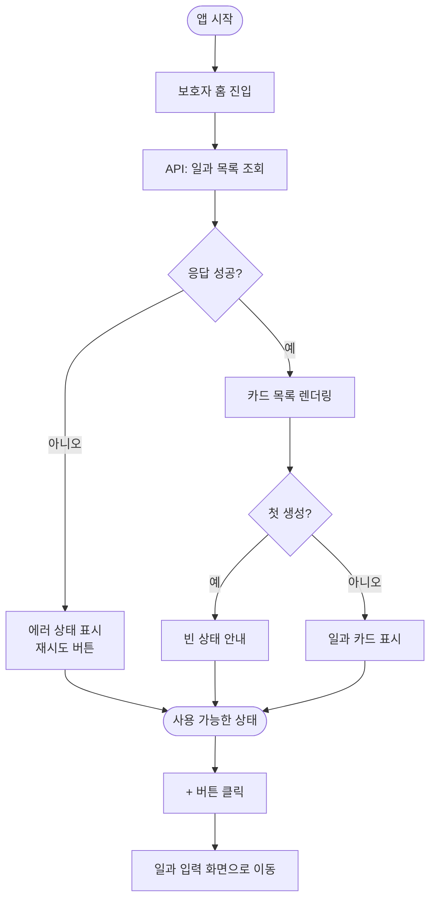

# 보호자_홈 화면 구현 및 서버 API 전면 연결

## 개요
보호자 모드의 홈 화면을 Figma 디자인 기준으로 구현하고, 일과 목록 조회·생성 API를 연결했습니다. 상태 로딩, 에러 처리, 빈 목록 UI까지 모든 상황을 다루며, 발표 중 실패해도 화면이 깨지지 않도록 설계했습니다.

## 기능 흐름

## 변경 사항

### 화면 구현
- `client/lib/features/guardian/presentation/guardian_home_screen.dart`: 
  - Figma 디자인(`309:2836` 보호자 섹션) 기준으로 홈 화면 구현
  - 상단 헤더(일과 카운트), 추천 일과 스트립, 생성된 일과 목록 세 영역 구성
  - 로딩·에러·빈 상태 UI 각각 구현

### 상태 관리
- `client/lib/features/guardian/domain/recommended_routine.dart`: 
  - 추천 일과 도메인 모델 추가 (제목, 설명, 난이도, 카테고리)

- `client/lib/features/guardian/presentation/widgets/recommended_routine_strip.dart`:
  - 추천 일과 스크롤 가능한 스트립 위젯
  - 각 아이템을 카드 형태로 표시

### 디자인 토큰
- `client/lib/core/theme/app_colors.dart`: 
  - 보호자 홈 카드 배경, 텍스트 색상 토큰 추가
  - 디바이더, 섀도우 색상 정의

- `client/lib/core/theme/app_typography.dart`:
  - 카드 제목, 부제목 타이포그래피 토큰 추가

- `client/lib/core/theme/app_spacing.dart` (기존):
  - 카드 패딩, 아이템 간격 정의

### 문서
- `client/CLAUDE.md`: 
  - 보호자 홈 화면 설명 추가
  - API 계약 요약 추가 (`/api/routines` 엔드포인트 명세)

- `client/docs/design-system.md`:
  - 보호자 홈 카드 색상·간격 명세 추가
  - 추천 일과 스트립 구성 명시

## 주요 구현 내용

### API 연결 전략
- **GET /api/routines**: 사용자의 생성된 일과 목록 조회
  - 성공 시: `RoutineResponse[]` 리스트 렌더링
  - 실패 시: 에러 메시지 + 재시도 버튼 (발표 중 흐름 보장)

### 상태 관리
- Riverpod `routineFlowProvider`를 통한 중앙화된 상태 관리
- 로딩/에러/완료 상태를 명확히 분리
- 상태별 UI 전환 (로딩 스피너 → 콘텐츠 또는 에러)

### 접근성 & 아동 화면 고려
- 터치 타겟 최소 64×64 (보호자 모드도 유지)
- 한 화면에 하나의 주요 행동 (일과 생성)
- 텍스트 최소 14sp 유지

### 에러 처리
- 네트워크 실패 시 재시도 가능한 상태 유지
- 응답 형식 오류 시 파싱 방어 (빈 목록으로 fallback)
- 어떤 상황에서도 화면이 깨지지 않음

## 주의사항

### 이후 개선 예정
- 추천 일과 데이터가 현재 하드코딩 상태 (서버 추천 API 연결 대기)
- 일과 필터·검색 기능은 MVP 이후 단계로 미연기
- 보호자가 아동 화면으로 전환 시 PIN 검증 로직 미완성

### 테스트 범위
- 화면 렌더링 테스트: `test/guardian_home_screen_test.dart` (추가 예정)
- API 응답 모킹으로 로딩·에러·완료 상태 각각 검증 필요
- 실제 서버 연결 시 타임아웃 시나리오 확인 필수

### 배포 체크리스트
- [ ] 실제 서버에서 일과 목록 조회 검증
- [ ] 아이콘·색상이 Figma와 정확히 일치하는지 시뮬레이터에서 확인
- [ ] 어두운 테마에서도 대비가 충분한지 확인
