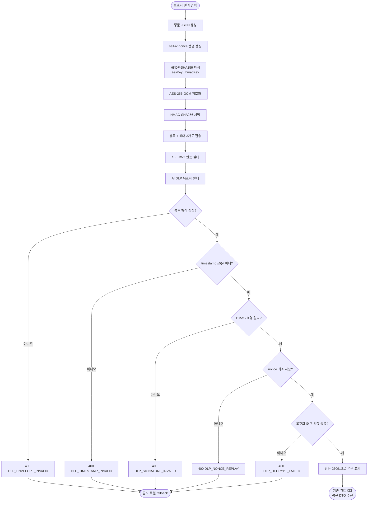

# AI DLP 진입점 요청 본문 AES-256-GCM 암호화

## 개요

보호자가 입력한 일과 원문(`rawInputText`/`text`)이 지금까지 **평문 JSON**으로 클라이언트 →
백엔드에 전송됐다. AI DLP 게이트웨이가 마스킹을 담당하지만 마스킹은 **서버 도착 이후**에
일어나므로, 네트워크 구간에서는 원문이 그대로 노출됐다.

이번 작업은 AI DLP 진입점 3경로의 요청 본문을 **클라이언트에서 AES-256-GCM으로 암호화**해
전송하고, 서버가 비즈니스 로직 이전 단계(Security 필터)에서 복호화하도록 바꿨다. 전송 구간의
기밀성(암호화)·무결성(GCM 태그)·재전송 방지(HMAC 서명 헤더)를 함께 확보한다. 기존
컨트롤러·DTO·비즈니스 로직은 손대지 않고, 클라에는 암호화 인터셉터를, 서버에는 복호화 필터를
앞단에 추가하는 구조다.

**적용 대상 3경로**

| 메서드 | 경로 | 암호화 필드 |
| --- | --- | --- |
| POST | `/api/routines` | `rawInputText` |
| POST | `/api/routines/questions` | `rawInputText` |
| POST | `/api/internal/sensitive-check` | `text` |

## 기능 흐름



## 변경 사항

### 서버 — 복호화 계층 (신규)

- `common/infrastructure/properties/AidlpProperties.java`: `elum.aidlp.secret` 바인딩.
  미설정 시 빈 문자열이며, 필터가 이를 감지하면 복호화를 건너뛴다(데모 안전).
- `common/infrastructure/security/AidlpEnvelope.java`: `{ciphertext, iv, salt}` 봉투 record.
- `common/infrastructure/security/AidlpCryptoService.java`: HKDF-SHA256 키 파생,
  AES-256-GCM 복호화, HMAC-SHA256 서명 검증(상수시간 비교)을 담당하는 순수 crypto 로직.
- `common/infrastructure/security/NonceStore.java`: 재전송 방지용 인메모리 nonce 저장소
  (TTL 10분, 만료 항목 자동 청소).
- `common/infrastructure/security/AidlpDecryptionFilter.java`: 대상 3경로 POST 요청의
  암호화 본문을 복호화해 평문 JSON으로 교체하는 `OncePerRequestFilter`. 실패 시 각 에러코드로
  400 JSON을 직접 응답.

### 서버 — 기존 파일 수정

- `common/infrastructure/exception/ErrorCode.java`: DLP 에러코드 5종 추가
  (`DLP_TIMESTAMP_INVALID`, `DLP_NONCE_REPLAY`, `DLP_SIGNATURE_INVALID`,
  `DLP_DECRYPT_FAILED`, `DLP_ENVELOPE_INVALID`).
- `common/infrastructure/config/SecurityConfig.java`: 복호화 필터를 JWT 인증 필터 뒤에 등록.

### 클라이언트 — 암호화 계층 (신규)

- `lib/core/security/aidlp_crypto.dart`: HKDF·AES-256-GCM·HMAC로 평문을 봉인하는 `seal` 유틸.
  서버와 규약(HKDF info 라벨·바이트 순서·서명 문자열)을 맞춘 대칭 구현.
- `lib/core/network/encryption_interceptor.dart`: 대상 3경로 POST 요청 본문을 봉투로 치환하고
  재전송 방지 헤더를 붙이는 Dio 인터셉터.

### 클라이언트 — 기존 파일 수정

- `lib/core/config/app_config.dart`: `aidlpSecret` getter 추가(기본값 빈 문자열).
- `lib/core/network/dio_client.dart`: 암호화 인터셉터를 로깅 인터셉터보다 먼저 등록해
  원문이 로그에 남지 않게 함.
- `.env.example`: `ELUM_AIDLP_SECRET` 키 문서화.
- `pubspec.yaml`: `cryptography` 패키지 추가(순수 Dart, build hook 없음).

### 테스트 (신규)

- 서버: `AidlpCryptoServiceTest`(AES-GCM 왕복·태그 불일치·HMAC 검증), `NonceStoreTest`
  (최초 통과·재사용 차단·TTL 만료).
- 클라: `aidlp_crypto_test.dart`(seal 왕복 복호화·서명 규약·salt마다 다른 암호문),
  `encryption_interceptor_test.dart`(대상 경로 봉투 치환·비대상 통과·secret 빈 경우 통과).

## 주요 구현 내용

### 암호화 방식 — AES-256-GCM + HKDF + HMAC

- **AES-256-GCM**: AEAD 모드라 암호화와 무결성 태그가 한 번에 처리된다. 본문 위변조는 GCM
  태그가 막는다.
- **HKDF-SHA256 키 파생**: 마스터 시크릿 1개에서 **요청마다 랜덤 salt로** AES 키·HMAC 키를
  파생한다. `info` 라벨(`elum-aes-gcm` / `elum-hmac-sha256`)을 다르게 줘 한 salt에서 두 키를
  분리한다. 같은 원문도 매번 다른 암호문이 된다.
- **HMAC-SHA256 서명 헤더**: `timestamp.nonce.ciphertext`를 서명해 `X-Elum-Signature`
  헤더로 보낸다. GCM 태그가 본문 무결성을 보장하는 것과 별개로, 이 서명은 요청 메타데이터까지
  묶어 **재전송 공격**을 막는다.

### 봉투 구조와 전송 포맷

기존 평문 필드 대신 암호문 봉투 하나로 감싼다. 서버 복호화 필터가 봉투를 열어 기존 평문 DTO로
되돌리므로 컨트롤러는 변경이 없다.

```
요청 본문: { "encrypted": { "ciphertext", "iv", "salt" } }
헤더:      X-Elum-Timestamp / X-Elum-Nonce / X-Elum-Signature
```

`ciphertext`는 암호문+GCM 태그를 이어붙인 형식으로, Java `Cipher` 출력 순서와 Dart
`SecretBox`의 `cipherText + mac` 순서를 일치시켰다.

### 필터 계층에서의 직접 에러 응답

Spring의 `@ExceptionHandler`(GlobalExceptionHandler)는 **필터 계층에서 던진 예외를 잡지
못한다.** 그래서 복호화 필터는 실패 시 `ErrorResponse`와 동일한 JSON(`{errorCode,
errorMessage}`)을 직접 기록해 400을 반환한다. `errorCode` 이름이 그대로 클라이언트 식별자가
된다.

### 실패해도 데모가 멈추지 않는 설계

- 서버: `secret`이 비면 복호화를 건너뛰고 통과시킨다. 복호화·서명·재전송 검증 실패는 각각
  전용 에러코드로 400을 반환한다.
- 클라: 암호화 자체가 실패하면 예외를 잡아 평문 그대로 전송하고, 서버 응답이 실패하면 기존
  로컬 fallback으로 카드를 만든다. 어떤 실패 경로에서도 화면이 깨지지 않는다.
- `POST /questions`는 원래 실패해도 200을 반환하는 엔드포인트라 기존 동작을 유지한다.

### 원문 비저장·비로깅 유지

복호화 서비스는 실패 시 원문·키를 로그에 남기지 않고 실패 사실만 던진다. 클라 암호화 인터셉터를
로깅 인터셉터보다 먼저 등록해, 로그에는 봉투로 바뀐 본문만 남고 원문은 새지 않는다.

## 주의사항

- **양쪽 crypto 규약이 문자 그대로 일치해야 한다.** HKDF info 라벨, salt/iv/nonce 길이
  (16/12/16), ciphertext 순서(암호문+태그), 서명 문자열(`timestamp.nonce.ciphertext`) 중
  하나라도 어긋나면 서버가 조용히 복호화 실패 → 클라가 로컬 fallback으로 빠져 증상이 드러나지
  않는다. 서버·클라 각각 왕복 테스트로 자기정합성을 검증했다.
- **마스터 시크릿은 서버 `application-prod.yml`(`elum.aidlp.secret`)과 클라
  `.env`(`ELUM_AIDLP_SECRET`)에 동일 값으로 주입해야 한다.** 값이 다르면 전부 복호화 실패,
  비어 있으면 양쪽 다 암호화를 건너뛴다(평문 통과). 배포 시 GitHub Secret
  `APPLICATION_PROD_YML`·`CLIENT_ENV_FILE` 갱신이 선행돼야 한다.
- **한계**: 클라 앱에 시크릿을 심으므로 앱 디컴파일 시 추출 가능하다. 이는 "완벽한 기밀"이
  아니라 네트워크 구간 방어 + DLP 게이트웨이 보안 시연이 목적이다.
- **nonce 저장소는 인메모리**라 단일 서버 인스턴스 데모 기준이다. 다중 인스턴스로 확장하면
  공유 저장소(예: Redis)로 옮겨야 재전송 방지가 유효하다.
