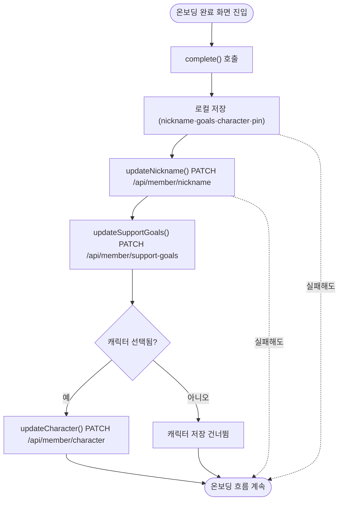

# 캐릭터 선택 화면 API 연동

## 개요

온보딩에서 고른 캐릭터가 로컬 저장소에만 남고 서버로 전달되지 않아, 앱 재설치·기기 변경 시 선택이 사라지던 문제를 해결했다. 핵심 걸림돌이던 클라이언트/서버 캐릭터 값 체계 불일치를 프론트를 서버 계약에 맞추는 방향으로 정리하고, 온보딩 완료 시점에 캐릭터를 포함한 호칭·도움목표를 서버에 함께 저장하도록 연동했다.

## 값 체계 불일치와 해결 방향

| 항목 | 클라이언트(기존 `CardCharacter.apiValue`) | 서버 `CharacterType` |
|---|---|---|
| 고양이 | `CAT` | `LULU` |
| 여우 | `FOX` | `POPO` |

클라이언트는 캐릭터를 "종류"(CAT/FOX)로, 서버는 "이름"(루루/포포)으로 표현했다. 클라이언트가 `CAT`을 보내면 서버가 역직렬화에 실패한다. 서버는 이미 배포·구현이 완료된 계약이므로, **서버를 그대로 두고 프론트를 맞추는** 방향으로 정리했다. 마침 클라이언트의 `displayName`이 이미 '루루'/'포포'라 값의 의미도 일관되게 맞아떨어진다.

추가로, 조사 과정에서 캐릭터뿐 아니라 호칭·도움목표도 서버에 저장되지 않고 있었다. `MemberRepository`에 `updateNickname`/`updateSupportGoals`가 정의만 되어 있고 아무 데서도 호출되지 않았다. 이슈의 취지("재설치·기기 변경 시 사라짐")에 맞춰 온보딩 완료 시 세 값을 함께 서버에 저장하도록 연동했다.

## 기능 흐름

## 변경 사항

### 캐릭터 값 체계 정정
- `client/lib/features/onboarding/domain/character.dart`: `CardCharacter.apiValue`를 서버 enum에 맞춰 `CAT`→`LULU`, `FOX`→`POPO`로 교체. 서버 계약임을 주석으로 명시.

### 캐릭터 저장 API 추가
- `client/lib/features/guardian/data/member_repository.dart`: `updateCharacter(String character)` 메서드 추가(`PATCH /api/member/character`). 기존 메서드처럼 예외를 삼켜 절대 throw하지 않는다. `MemberRepository`를 주입 가능한 `memberRepositoryProvider`도 신설.

### 온보딩 완료 시 서버 연동
- `client/lib/features/onboarding/application/onboarding_notifier.dart`: `complete()`에서 로컬 저장 후 `updateNickname`·`updateSupportGoals`·`updateCharacter`를 순차 호출. 캐릭터 미선택 시 캐릭터 저장은 건너뛴다.

### 테스트
- `client/test/onboarding_profile_test.dart`: `CardCharacter` 서버 계약 테스트 추가(apiValue가 LULU/POPO인지, enum 순서가 고양이·여우인지).
- `client/test/helpers/test_storage.dart`: 온보딩 화면 테스트가 실제 네트워크를 타지 않도록 `MemberRepository`를 no-op으로 교체하는 `testMemberRepoOverride()` 헬퍼 추가.
- `client/test/setup_done_screen_test.dart`: 위 override를 적용해 서버 연동 추가 후에도 pending timer 없이 통과하도록 수정.

## 주요 구현 내용

- **로컬과 서버의 역할 분리**: 로컬 저장은 즉시성(오프라인·화면 fallback), 서버 저장은 영속성(재설치·기기 변경 복원)을 담당한다.
- **실패 흡수 이중 방어**: 세 PATCH는 `MemberRepository` 안에서 예외를 삼키고, `complete()`의 로컬 저장부는 상위 try로 감싼다. 네트워크 실패·타임아웃·400(값 불일치)이 나도 로컬 값으로 fallback하며 온보딩 흐름이 끊기지 않는다(docs 원칙 6번).
- **온보딩 완료 화면은 이미 `unawaited(complete())`로 저장을 기다리지 않으므로** 서버 연동을 추가해도 안내·CTA 흐름에 지연이 없다.

## 주의사항

- 호칭·도움목표 서버 연동은 이슈 범위(캐릭터)를 넘어서지만, "재설치 시 사라짐"이라는 동일 원인을 공유하고 repository 메서드가 이미 존재해 함께 연결했다.
- `CardCharacter.apiValue`는 서버 `CharacterType`과 1:1로 묶여 있다. 서버 enum이 바뀌면 이 값과 테스트를 함께 맞춰야 한다. 계약 테스트가 회귀를 잡아준다.
