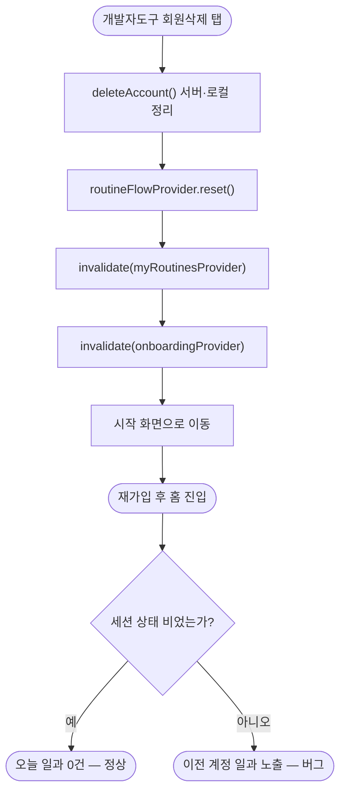

# 회원가입 직후 홈에 등록하지 않은 일과가 노출됨

## 개요

온보딩(회원가입)을 마치고 홈에 처음 진입했을 때, 만든 적 없는 일과가 이미 등록된 것처럼 "오늘 일과"에 노출되던 버그를 수정했다. 원인은 서버가 아니라 클라이언트의 상태 관리에 있었다. 개발자 도구에서 회원삭제 후 재가입하는 흐름에서, 이전 계정의 일과가 Riverpod 메모리 상태에 그대로 남아 홈 목록에 병합되고 있었다. 회원삭제 시점에 세션 종속 provider를 함께 초기화해 해결했다.

## 원인 분석

홈의 "오늘 일과" 목록(`homeRoutinesProvider`)은 두 소스를 병합한다.

- `routineFlowProvider.routine` — 방금 만든 일과 (메모리 상태, `NotifierProvider`라 앱 세션 내내 유지)
- `myRoutinesProvider` — 서버 `GET /api/routines` 조회 결과 (`FutureProvider` 캐시)

서버는 정상이었다. `getMyRoutines`는 `findAllByMemberId(memberId)`로 해당 회원의 일과만 반환하고, 회원 탈퇴 시 일과를 함께 삭제한다. 즉 신규 회원에게는 0건이 와야 한다.

문제는 개발자 도구의 회원삭제 콜백이 계정 경계에서 메모리 상태를 비우지 않은 것이다. 기존에는 `deleteAccount()`(저장소 clear)와 `invalidate(onboardingProvider)`만 호출했다. 그 결과 이전에 만든 일과가 `routineFlowProvider`에 남고, `myRoutinesProvider` 캐시도 무효화되지 않아, 재가입 직후 홈에서 이전 계정 데이터가 노출됐다.

## 기능 흐름

## 변경 사항

### 회원삭제 시 세션 상태 초기화
- `client/lib/core/dev/dev_tools_overlay.dart`: 회원삭제 콜백에서 `routineFlowProvider.reset()`과 `invalidate(myRoutinesProvider)`를 `invalidate(onboardingProvider)`와 함께 호출하도록 추가. 방금 만든 일과(메모리)와 서버 조회 캐시를 계정 경계에서 함께 비운다.

## 주요 구현 내용

`deleteAccount()` 직후 세 provider를 나란히 초기화한다.

- `routineFlowProvider.notifier.reset()` — 방금 만든 일과 메모리 상태를 초기값으로 되돌린다.
- `invalidate(myRoutinesProvider)` — 서버 조회 캐시를 무효화해 재가입 후 새 계정 기준으로 다시 조회하게 한다.
- `invalidate(onboardingProvider)` — 기존과 동일, 온보딩 입력 상태 초기화.

세 호출 모두 순수 메모리 연산이라 예외가 나지 않는다. `deleteAccount`는 서버 삭제가 실패해도 로컬을 지우고 반환하므로(기존 동작) 이 초기화 흐름은 항상 완주한다.

## 주의사항

- 이 수정은 개발자 도구의 회원삭제 지점에 한정된다. 정식 로그아웃 흐름에서도 동일한 세션 상태 잔존이 발생할 수 있으나, 현재 로그아웃 경로가 별도로 없어 이번 범위에는 포함하지 않았다. 로그아웃 기능을 추가할 때 같은 초기화를 함께 넣어야 한다.
