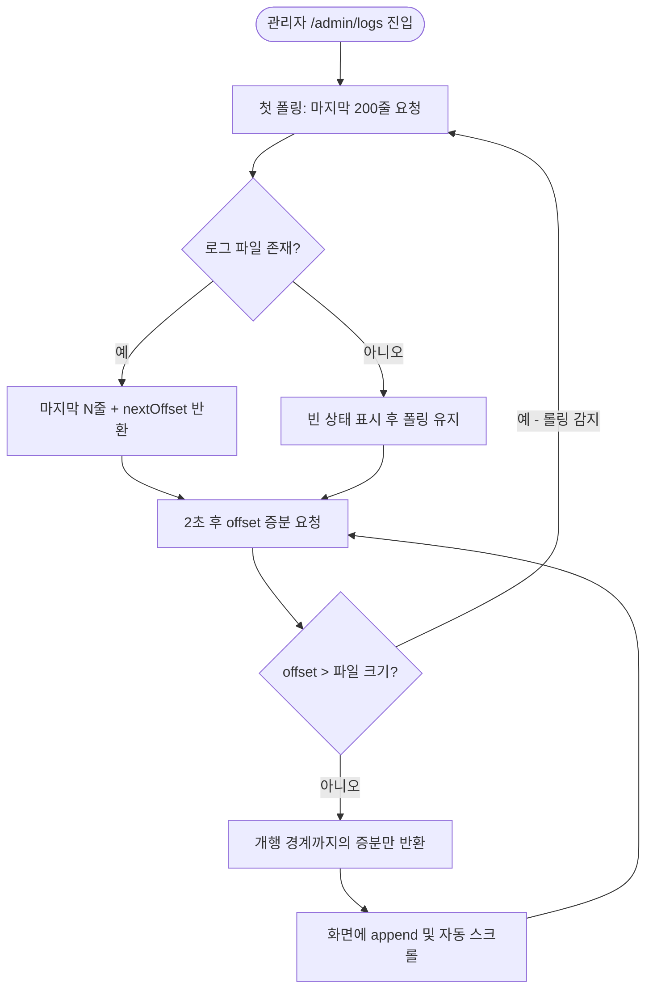

# 서버 로그 .log 파일 저장 및 관리자 로그 실시간 조회 화면 추가

## 개요

서버에 logback 설정이 없어 로그가 콘솔로만 흘러가고 파일로 남지 않던 것을, `logback-spring.xml`을 추가해 `logs/elum-server.log` 롤링 파일로도 남기게 했다. 배포 컨테이너는 `-v /volume1/project/elum/server:/app` 마운트에 `WORKDIR /app`이므로 상대경로 `logs/`가 곧 NAS 영구 저장소가 된다 — **Docker/CICD 설정 변경 없이** 마운트 경로에 로그가 쌓인다. 관리자 페이지에는 `/admin/logs` 화면을 추가해 이 파일을 2초 간격 offset 기반 폴링으로 tail 하며 실시간 조회할 수 있다.

## 기능 흐름

## 변경 사항

### 로그 파일 생성
- `server/src/main/resources/logback-spring.xml`: 콘솔 어펜더 유지 + RollingFileAppender 신규. 일 단위·10MB 롤링, 7일 보관, 총량 1GB 상한. 경로는 `ELUM_LOG_DIR`(기본 `logs`) 하나로 제어.

### 관리자 조회
- `AdminLogController`: `/admin/logs` SSR 페이지.
- `AdminLogApiController`: `GET /admin/logs/api/tail?offset=&lines=` JSON API. SSR과 분리해 `GlobalExceptionHandler`의 `assignableTypes`에 등록(JSON 에러 응답). `@LogMonitoring`은 의도적으로 제외 — 2초 폴링이 로그 파일을 스스로 오염시키는 것을 방지.
- `AdminLogService`: RandomAccessFile 기반 tail. 첫 호출은 마지막 N줄(기본 200·최대 1000), 이후 offset 증분(폴링당 256KB 상한). **증분은 항상 개행 경계까지만 잘라** 멀티바이트 한글이 중간에서 찢기지 않는다. 로그 경로는 logback과 같은 `ELUM_LOG_DIR` 키를 읽어 쓰기/읽기가 함께 움직인다.
- `templates/admin/logs.html`: daisyUI 로그 뷰어. 자동 스크롤(위로 스크롤 시 일시정지), 팔로우 토글, 지우기, 연결 상태 배지. 텍스트 노드 append로 버퍼(2MB 상한)를 O(증분)로 유지, in-flight 가드로 중복 폴링 방지.
- `admin-layout.html`: 사이드바에 "서버 로그" 메뉴 추가.
- `ErrorCode`: `LOG_FILE_READ_FAILED` 추가 (화면 노출 식별자 `E-LOG-001`).

### 테스트
- `AdminLogServiceTest`: 파일 미존재/첫 호출 마지막 N줄/offset 증분/증분 없음/쓰다 만 줄 유예/롤링 리셋/줄 수 상한 7케이스.

## 주요 구현 내용

- **실패 경로 처리**: 파일 미존재 → 빈 상태 UI + 폴링 유지, 읽기 실패 → `E-LOG-001` 포함 에러 배지 + 자동 재시도, 세션 만료 → fetch redirect 감지로 "세션 만료 — 다시 로그인" 안내(네트워크 오류와 구분), 롤링 → offset 리셋으로 자연 복구.
- SSE/WebSocket 대신 폴링을 선택한 이유: 세션(formLogin) 인증·리버스 프록시와 궁합이 좋고 기존 코드베이스에 스트리밍 인프라가 전무해 가장 단순한 안이 맞다.

## 주의사항

- 로그 파일은 배포 후 컨테이너가 첫 로그를 쓰는 시점부터 NAS `/volume1/project/elum/server/logs/`에 생성된다.
- 탭이 장시간 절전된 상태에서 10MB 롤링과 버스트 로깅이 겹치는 극단 케이스에서는 새 파일 앞부분 일부를 건너뛸 수 있다(정상 사용에서는 발생하기 어려운 수준으로 판단해 수용).
