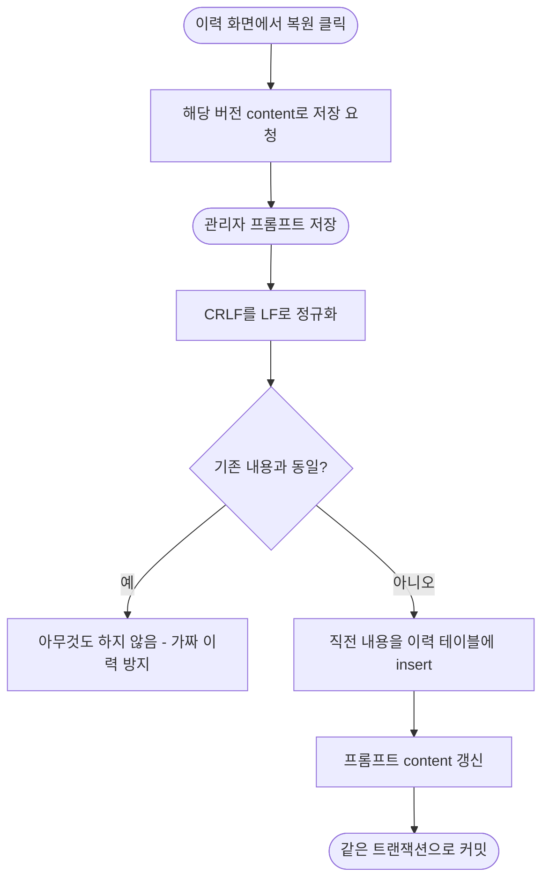

# 프롬프트 변경 이력 저장 및 관리자 이력 조회·복원 화면 추가

## 개요

관리자 페이지에서 프롬프트(`PromptTemplate`)를 수정하면 content가 덮어써져 기존 내용이 소실되던 문제를 해결했다. 수정 시 **교체되기 직전의 내용을 이력 테이블에 먼저 적재**한 뒤 갱신하도록 바꿔(같은 트랜잭션) 이력 없는 덮어쓰기가 불가능해졌고, 관리자 화면에서 프롬프트별 이력을 조회하고 원하는 버전으로 복원할 수 있다.

## 기능 흐름

## 변경 사항

### DB · 엔티티
- `PromptTemplateHistory` 엔티티: BaseEntity 상속, UUID 문자열 PK, `promptKey`(STRING) + `content`(TEXT). append-only 스냅샷.
- `PromptTemplateHistoryRepository`: `findTop50ByPromptKeyOrderByCreatedAtDesc` — 이력은 무한히 쌓이므로 화면은 최근 50건까지만.
- `V5__create_prompt_template_history.sql`: prod가 `ddl-auto: validate`라 Flyway가 테이블을 직접 생성해야 기동된다. 로컬(update) 환경과의 공존을 위해 `CREATE TABLE IF NOT EXISTS` + 인덱스.

### 서비스
- `PromptTemplateService.update()`: ① textarea가 제출하는 CRLF를 LF로 정규화(정규화 없이는 저장만 눌러도 바이트가 달라져 가짜 이력이 쌓임) ② 내용이 같으면 no-op ③ 다르면 직전 내용을 이력으로 insert 후 갱신. `getTemplate`/`getHistory` 조회 메서드 추가.
- `AdminPromptService`: 위 조회 위임 메서드 추가.

### 화면
- `AdminPromptController`: `GET /admin/prompts/{key}/history` 추가.
- `templates/admin/prompt-history.html`: 현재 적용본을 상단에, 아래로 시각 역순 이력(daisyUI collapse). 각 버전에 "이 버전으로 복원" 버튼 — 기존 저장 엔드포인트를 재사용하므로 복원 자체도 이력으로 남는다.
- `templates/admin/prompts.html`: 각 프롬프트 카드에 "이력 보기" 링크.

### 테스트
- `PromptTemplateServiceTest`: 이력 적재 검증, 동일 내용 스킵, CRLF 정규화, 이력 조회 4케이스 추가.

## 주요 구현 내용

- 이력 insert와 content 갱신이 **동일 트랜잭션**이므로 둘 중 하나만 반영되는 상태가 없다 — 이력이 남지 않은 덮어쓰기는 구조적으로 불가능.
- 실패 경로: 이력 0건은 빈 상태 UI, 존재하지 않는 key는 기존 `PROMPT_TEMPLATE_NOT_FOUND` 흐름을 그대로 따른다.

## 주의사항

- 이력 화면은 최근 50건까지 표시한다. 그 이전 버전이 필요해지면 페이지네이션을 추가한다.
- 현재와 동일한 버전을 "복원"하면 변경이 없으므로 이력이 새로 남지 않는다(의도된 동작).
