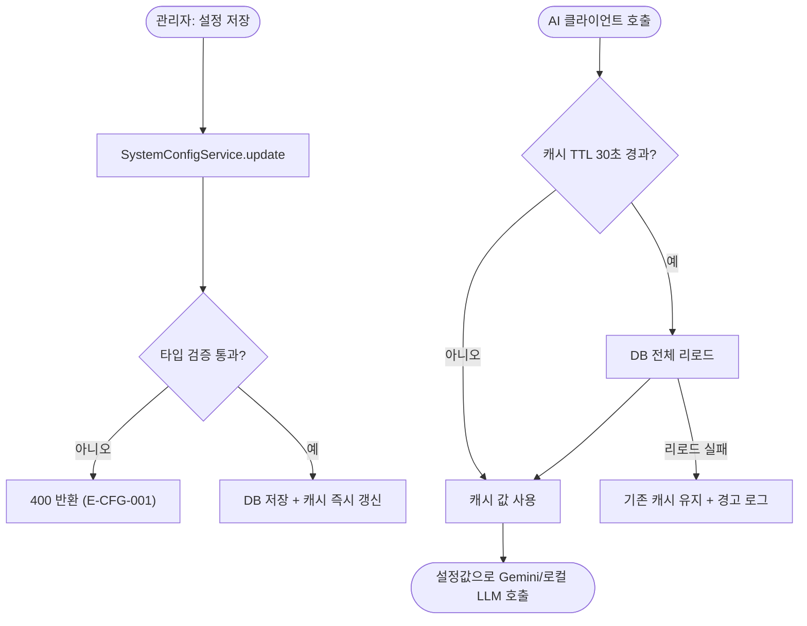

# ⚙️[기능추가][서버][관리자] SystemConfig 기반 동적 설정 관리 (AI 모델, 파라미터 실시간 교체)

## 개요

Gemini 텍스트/이미지 모델명, temperature, 이미지 비율, 로컬 LLM 모델명, AI 요금 단가가 yml/코드에 고정되어 변경 시 재배포가 필요하던 문제를 해결했다. `system_config` 테이블을 단일 진실 공급원으로 하는 동적 설정 체계를 만들고, 관리자 페이지에 "시스템 설정" 화면을 추가해 운영 중 즉시 변경할 수 있게 했다.

## 기능 흐름

## 변경 사항

### 신규 도메인 (systemconfig)

- `systemconfig/core/ConfigKey.java`: 동적 설정 8종 정의 (그룹·라벨·설명·타입·허용값·기본값)
- `systemconfig/core/ConfigGroup.java`, `ConfigValueType.java`: 화면 그룹핑과 값 타입(STRING/INTEGER/DECIMAL/SELECT)
- `systemconfig/infrastructure/entity/SystemConfig.java`: key-value 엔티티 (config_key unique)
- `systemconfig/application/service/SystemConfigService.java`: TTL 30초 메모리 캐시, 타입별 getter, 검증 포함 update, 기본값 복원
- `systemconfig/infrastructure/config/SystemConfigInitializer.java`: 없는 키만 기본값 시딩 (모델명 3종은 yml 바인딩 값 우선)

### 클라이언트 연동

- `GeminiTextClient.java`: 모델명·temperature를 호출 시점마다 설정에서 읽음
- `GeminiImageClient.java`: 모델명·aspectRatio를 설정에서 읽음
- `SensitiveInfoGuardService.java`: 로컬 LLM 모델명을 설정에서 읽음

### 관리자 화면 · 인프라

- `AdminConfigController.java` + `templates/admin/settings.html`: 그룹별 카드, SELECT 셀렉트박스, "변경됨" 배지, 저장/기본값 복원
- `db/migration/V6__create_system_config.sql`: prod(ddl-auto validate) 대응 테이블 생성
- `ErrorCode.java`: `SYSTEM_CONFIG_INVALID_VALUE` 추가

### 테스트

- `SystemConfigServiceTest.java`: 타입 검증·캐시 즉시 갱신·yml 우선 기본값·리로드 실패 방어 등 11건

## 주요 구현 내용

- **TTL 30초 캐시**: 다중 레플리카(Docker Swarm)에서 다른 인스턴스의 변경이 30초 내 수렴하면서도 AI 호출마다 DB를 두드리지 않는 절충. 값 변경 인스턴스는 즉시 반영.
- **기본값 3단 폴백**: DB 값 → yml 바인딩 값(모델명 3종) → enum 기본값. 설정 조회 실패가 AI 호출을 죽이지 않도록 리로드 실패 시 기존 캐시를 유지한다.
- **timeout·baseUrl 제외**: RestClient 빈 생성 시점에 고정되는 값이라 동적 대상에서 의도적으로 제외했다.

## 주의사항

- 요금 단가(PRICE_*)는 #133 비용 추정의 입력값이므로 실제 Gemini 가격 변동 시 관리자 화면에서 갱신해야 한다.
- 새 설정이 필요하면 `ConfigKey`에 키만 추가하면 시딩·화면 노출이 자동으로 따라온다.
