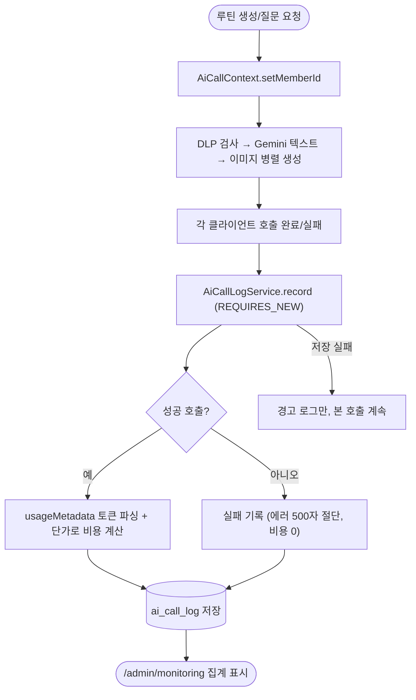

# ⚙️[기능추가][서버][관리자] AI 호출 로그, 토큰 사용량, 비용 모니터링

## 개요

Gemini·로컬 LLM 호출이 애플리케이션 로그로만 남아 호출 횟수·성공률·토큰·비용을 파악할 수 없던 문제를 해결했다. 모든 AI 호출을 `ai_call_log` 테이블에 기록하고 Gemini 응답의 usageMetadata에서 토큰을 파싱해 요금 단가 기반 추정 비용(USD)을 함께 저장한다. 회원 단위 집계가 가능해 향후 구독제 과금의 근거 데이터가 된다. 관리자 페이지에 "AI 모니터링" 화면을 추가했다.

## 기능 흐름

## 변경 사항

### 데이터 · 기록

- `ai/core/AiCallType.java`: 호출 유형 4종 (텍스트 생성/질문, 이미지, 로컬 LLM DLP)
- `ai/core/AiCallContext.java`: InheritableThreadLocal 회원 컨텍스트 — 가상 스레드 병렬 이미지 생성에도 전파
- `ai/infrastructure/entity/AiCallLog.java` + `AiCallLogRepository.java`: 로그 엔티티, 기간 요약 통계 쿼리(coalesce로 0건 방어)
- `ai/application/service/AiCallLogService.java`: REQUIRES_NEW 기록, 유형별 비용 계산(텍스트=토큰 종량 / 이미지=장당 / 로컬=0), 저장 실패 무해화
- `db/migration/V7__create_ai_call_log.sql`: 테이블 + 인덱스 3종

### 클라이언트 연동

- `GeminiGenerateContentResponse.java`: `UsageMetadata`(promptTokenCount 등) 파싱 추가, 기존 호출부 호환 생성자 유지
- `GeminiTextClient.java`: 생성/질문 유형 구분 기록
- `GeminiImageClient.java`: 이미지 추출까지 성공해야 성공으로 기록
- `LocalLlmClient.java`: HTTP 성공이어도 응답 success=false면 실패로 기록
- `RoutineService.java`: AI 파이프라인 진입 시 회원 컨텍스트 set, finally에서 clear

### 관리자 화면

- `AdminMonitoringController.java` + `AdminMonitoringService.java` + `templates/admin/monitoring.html`: 오늘/누적 통계 카드, 유형·성공 필터, 50건 페이지네이션, 회원 상세 링크

### 테스트

- `AiCallLogServiceTest.java`: 비용 계산 3종·에러 절단·usage 누락 방어·저장 실패 무해화 등 6건

## 주요 구현 내용

- **기록 시점 비용 고정**: 저장 시점의 단가(#132 시스템 설정)로 계산해 두므로 이후 단가를 바꿔도 과거 기록이 변하지 않는다.
- **가용성 우선**: 로그 저장 실패가 본 AI 호출을 실패시키지 않도록 예외를 내부에서 흡수하고 REQUIRES_NEW로 트랜잭션을 분리했다.
- **원문 미저장**: 프롬프트·응답 원문은 저장하지 않는다 (서비스 원칙 5 — 탐지 유형·건수만).

## 주의사항

- 로컬 LLM은 자체 호스팅이라 비용 0으로 기록한다. 토큰 수는 응답에 없어 null.
- 관리자 프롬프트 테스트 호출은 회원 컨텍스트가 없어 memberId null(회원 미상)로 기록된다.
