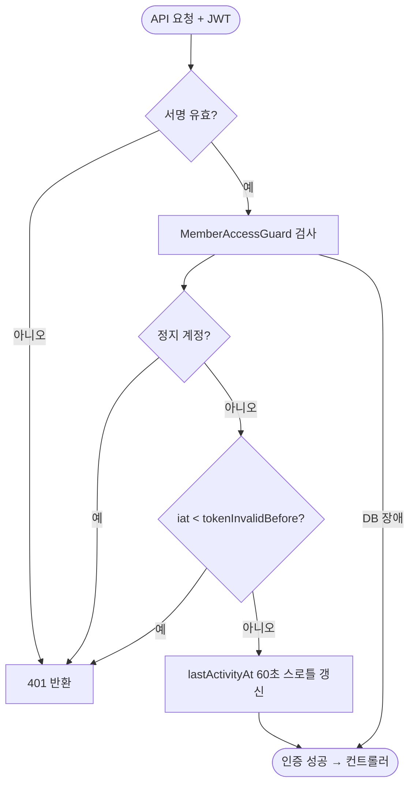

# ⚙️[기능추가][서버][회원] 회원 활동 추적, 계정 정지, 강제 로그아웃

## 개요

회원의 활동 여부를 알 수 없고 문제 계정을 차단할 수단이 없던 문제를 해결했다. 회원에 상태(활성/정지)·마지막 로그인/활동 시각·로그인 횟수·토큰 무효화 기준 시각을 추가하고, 관리자가 계정 정지/해제·강제 로그아웃을 실행할 수 있게 했다. stateless JWT 구조를 유지하면서 발급 시각(iat) 비교로 기존 토큰을 무효화한다.

## 기능 흐름

## 변경 사항

### 데이터

- `member/infrastructure/entity/Member.java`: `status`(MemberStatus)·`lastLoginAt`·`lastActivityAt`·`loginCount`·`tokenInvalidBefore` 필드 추가
- `member/infrastructure/entity/MemberStatus.java`: ACTIVE/SUSPENDED
- `db/migration/V8__add_member_activity_columns.sql`: 컬럼 5종 추가 (IF NOT EXISTS)

### 인증 · 로그인

- `common/infrastructure/jwt/TokenAccessValidator.java`: 접근 판단 인터페이스 — common이 member 패키지를 역방향 의존하지 않도록 인터페이스만 common에 배치 (기존 UserDetailsService 패턴 동일)
- `member/application/service/MemberAccessGuard.java`: 구현체 — 정지 거부, 발급시각 비교 거부, 활동 60초 스로틀 갱신, DB 장애 시 가용성 우선 통과
- `common/infrastructure/jwt/JwtAuthenticationFilter.java`: 서명 검증 후 가드 통과 시에만 인증 세팅
- `common/infrastructure/config/SecurityConfig.java`: 필터에 검증기 주입
- `auth/application/service/AuthService.java`: 정지 계정 로그인 차단(403), 로그인 이력 기록 (@Transactional 추가)
- `ErrorCode.java`: `MEMBER_SUSPENDED` 추가

### 관리자 조치

- `AdminMemberService.java` + `AdminMemberController.java`: `POST /admin/members/{id}/suspend · /unsuspend · /force-logout`

### 테스트

- `MemberAccessGuardTest.java` 7건, `AuthServiceTest.java` 2건

## 주요 구현 내용

- **블랙리스트 없는 강제 로그아웃**: 토큰 저장소 대신 회원 행의 `tokenInvalidBefore` 하나로 구현. 이 시각 이전 발급(iat) 토큰은 전부 거부되고, 재로그인으로 받은 새 토큰은 정상 통과한다.
- **60초 활동 스로틀**: 인증 요청마다 UPDATE가 나가지 않도록 lastActivityAt 갱신을 제한해 쓰기 부하를 최소화했다.
- **가용성 우선**: 상태 확인 중 DB 예외가 나면 요청을 죽이지 않고 통과시킨다 — 정지 반영이 잠시 늦는 쪽이 전체 API 장애보다 낫다는 판단.

## 주의사항

- JWT iat는 초 단위 정밀도라 강제 로그아웃과 같은 초에 발급된 토큰은 통과할 수 있다 (운영상 무시 가능한 엣지).
- 정지된 회원은 로그인(403 MEMBER_SUSPENDED)과 기존 토큰 API 사용(401) 모두 차단된다.
