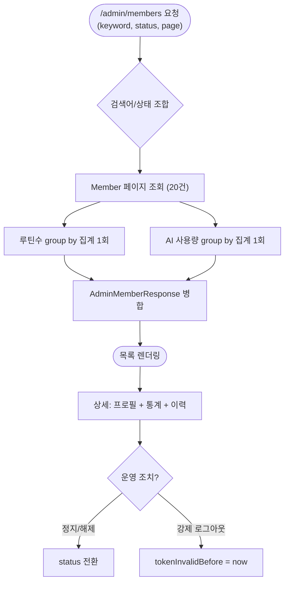

# 🚀[기능개선][서버][관리자] 회원 관리 화면 고도화 (검색, 페이지네이션, 사용량 통계, 운영 조치)

## 개요

단순 전체 목록뿐이던 회원 관리 화면을 운영 도구 수준으로 개편했다. 목록에 검색·상태 필터·페이지네이션과 회원별 루틴수·AI 사용량(호출/토큰/비용) 컬럼을 추가하고, 상세 화면에 활동 이력·통계 카드·최근 AI 호출 이력·정지/강제 로그아웃 버튼을 배치했다. 대시보드도 AI·활성 회원 지표로 확장했다.

## 기능 흐름

## 변경 사항

### 조회 · 집계

- `member/infrastructure/repository/MemberRepository.java`: 상태 필터·키워드 검색(JPQL)·활성/정지 카운트 쿼리 추가
- `routine/infrastructure/repository/RoutineRepository.java`: 회원 ID 목록 기반 루틴수 group by 집계
- `ai/infrastructure/repository/AiCallLogRepository.java`: 회원별 호출수·토큰·비용 group by 집계
- `admin/application/service/AdminMemberService.java`: 검색 조합별 쿼리 라우팅 + 집계 병합, 상세 조회에 사용량·최근 호출 20건 포함

### DTO · 화면

- `AdminMemberResponse.java` / `AdminMemberDetailResponse.java`: 캐릭터·상태·활동 이력·사용량 필드 확장
- `templates/admin/members.html`: 검색 폼·상태 필터·페이지네이션·사용량 컬럼·상태 배지
- `templates/admin/member-detail.html`: 프로필/통계 카드, 최근 AI 호출 테이블, 정지·해제·강제 로그아웃 버튼(confirm + flash)
- `templates/admin/dashboard.html` + `AdminViewController.java`: 오늘 AI 호출·비용, 최근 7일 활성 회원, 정지 회원 카드

### 테스트

- `AdminMemberServiceTest.java`: 검색 라우팅·집계 병합·조치 상태 전환 등 6건

## 주요 구현 내용

- **N+1 차단**: 회원별 루틴수·AI 사용량을 회원 수만큼 쿼리하지 않고 `in + group by` 집계 2번으로 붙인다. 회원이 늘어도 목록 쿼리는 3개(페이지 + 집계 2개)로 고정.
- **검색 쿼리 라우팅**: 검색어/상태 유무 4가지 조합을 파생 쿼리로 분기 — JPQL `:param is null` 방식의 PostgreSQL enum 바인딩 문제를 회피했다.
- **빈 상태 대응**: 검색 결과 0건·이력 0건 모두 로딩과 구분되는 빈 상태 문구를 표시한다.

## 주의사항

- 목록의 사용량 수치는 AI 호출 로그(#133) 축적 이후부터 채워진다. 그 이전 회원은 0으로 표시.
- 조치 버튼은 #134의 엔드포인트를 그대로 사용한다 — 정지 즉시 해당 회원의 로그인·API가 차단되므로 confirm 문구로 영향 범위를 안내한다.
