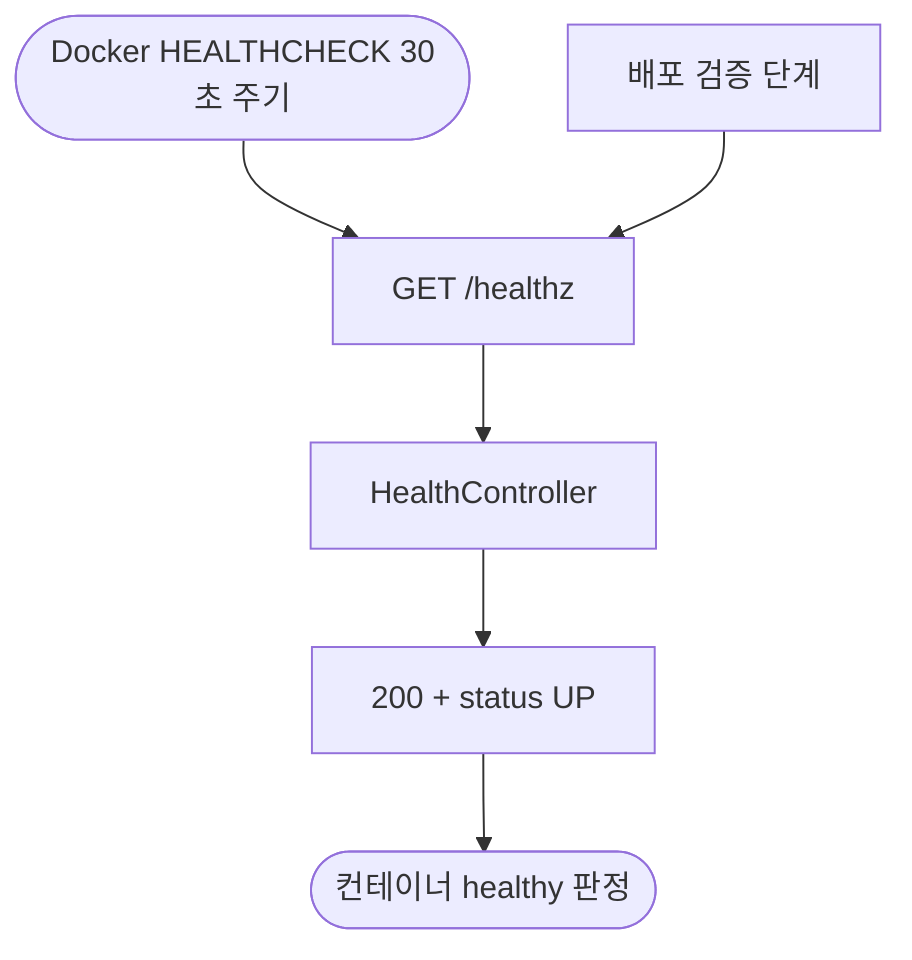

# ❗[버그][서버][배포] 헬스체크가 actuator 404로 항상 실패하며 30초마다 에러 로그 누적

## 개요

컨테이너 헬스체크가 존재하지 않는 `/actuator/health`를 30초마다 호출해 항상 404로 실패하고, 그때마다 에러 dispatch 로그가 무한 누적되던 문제를 수정했다. Actuator 의존성 추가 없이 경량 `/healthz` 엔드포인트를 만들고 Dockerfile 헬스체크 경로를 교체했다.

## 기능 흐름

## 변경 사항

### 원인

- `server/Dockerfile`의 `HEALTHCHECK`가 `curl -f http://localhost:8080/actuator/health`를 호출하지만 서버에 Spring Boot Actuator 의존성이 없어 항상 404 → 헬스체크 상시 실패 + 30초마다 `/error` dispatch 로그 누적
- 배포 워크플로우의 기동 검증은 폴백 경로(스웨거)로 통과해 문제가 드러나지 않았음

### 수정

- `common/application/controller/HealthController.java` + `HealthControllerDocs.java`: `GET /healthz` → 200 `{"status":"UP"}` liveness 엔드포인트 (Swagger 문서화 포함)
- `server/Dockerfile`: HEALTHCHECK 경로를 `/actuator/health` → `/healthz`로 교체

### 테스트

- `HealthControllerTest.java`: 200/UP 응답 검증

## 주요 구현 내용

- **Actuator 미도입**: 헬스체크 하나를 위해 의존성·노출 엔드포인트 관리 부담을 늘리지 않고, DB를 건드리지 않는 liveness 전용 경량 엔드포인트로 해결했다.
- **보안 설정 무변경**: `/healthz`는 `/api/**`·`/admin/**` 어느 securityMatcher에도 걸리지 않아 인증 없이 접근된다 (SecurityConfig의 Swagger 경로와 동일 구조).
- **모니터링 로그 제외**: 30초마다 호출되는 인프라 경로라 로그 재오염을 막기 위해 `@LogMonitoring`을 의도적으로 붙이지 않았다.
- 배포 워크플로우가 이미 `/healthz`를 검증 폴백 경로로 지원하고 있어 워크플로우 변경이 불필요했다.

## 주의사항

- 배포 후 운영 실측 확인 완료: 새 컨테이너 healthy 판정, `/healthz` 200 응답, 에러 dispatch 로그 소멸 (v1.0.94).
- `/healthz`는 DB 상태를 검사하지 않는 liveness 체크다. readiness(DB 연결 포함) 검사가 필요해지면 별도 확장이 필요하다.
