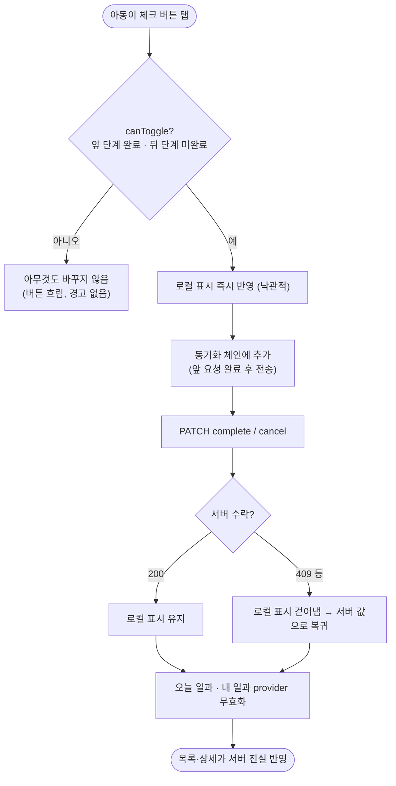

# ❗[버그][클라][카드] 서버가 거부한 완료 체크가 화면에 남아 진행률이 재진입 시 되돌아감

## 개요

아동 모드에서 카드를 전부 체크해 100%가 된 뒤 앱을 다시 열면 57%로 되돌아가던 문제를 수정했다. 원인은 클라이언트와 서버의 완료 규칙 불일치였다. 서버는 "이전 단계가 미완료면 409, 마지막 완료 단계만 취소 허용"인데 클라이언트는 아무 순서로나 체크·해제를 허용하고 거부 응답을 조용히 삼켰다. 클라이언트가 서버와 같은 순서 규칙을 먼저 지키고, 거부 시 로컬 표시를 되돌리며, 동기화를 직렬 전송하도록 바꿨다.

함께 보고된 "아동 모드에 두 번째 일과가 안 보임"은 버그가 아니다 — 해당 일과는 보호자 승인 전(PENDING_REVIEW)이라 서버가 아동 화면에서 의도적으로 제외한다(서비스 원칙 3). 운영 로그 기준 당일 일과 생성 3회, 승인 1회.

## 기능 흐름



## 변경 사항

### 원인 확정 (운영 로그, 2026-09-08 16:51, 일과 67d85f83)

```
16:51:44  4번 complete → 200
16:51:46  4번 cancel   → 200   ← 더블탭으로 체크가 풀림
16:51:47  5번 complete → 409 "이전 단계를 먼저 완료해야 합니다"
16:51:48  4번 complete → 200
16:51:50  6번 complete → 409
16:51:53  7번 complete → 409
```
서버 최종 4/7 = 57%. 화면은 로컬 메모리 Set에 7장이 남아 100%로 보였고, 로컬 상태는 메모리뿐이라 재진입 시 서버 값이 드러났다.

### 클라이언트

- `client/lib/features/child/data/step_progress_repository.dart`: `complete`/`cancel`이 성공 여부(`Future<bool>`)를 반환. 실패를 삼키지 않고 호출부가 되돌리게 함
- `client/lib/features/child/application/child_routine_notifier.dart`:
  - `canToggle()` — 서버와 같은 순서 규칙(앞 단계 전부 체크 시에만 완료, 뒤 단계 미체크 시에만 해제)
  - `toggle(routine:, card:)` — 규칙 위반 시 무변경, 통과 시 낙관적 반영 후 직렬 체인으로 동기화
  - 상태에 `uncompleted` 추가 — 서버 완료 카드를 재진입 후 해제하는 경우를 표현
  - 서버 거부 시 로컬 표시를 걷어내고, 성공·실패 모두 `todayRoutinesProvider`·`myRoutinesProvider` 무효화
  - 응답 대기 중 provider가 내려간 경우 `ref.mounted`로 방어
- `client/lib/features/child/presentation/child_routine_detail_screen.dart`: 일과를 스냅샷 대신 목록 provider에서 같은 id로 읽어 갱신 반영, 순서상 못 누르는 체크 버튼은 흐리게(빨강·경고 미사용), 규칙 위반 탭은 컨페티·보상 없이 무시
- `client/lib/features/guardian/presentation/widgets/today_routine_section.dart`, `child_home_screen.dart`: 진행률 계산이 `ChildRoutineState.isChecked`를 쓰도록 통일

### 테스트 · 문서

- `client/test/child_step_sync_test.dart` (신규, 10건): 순서 거부 · 순서 준수 시 순차 전송 · 마지막 카드만 해제 · 서버 거부 되돌림 · 서버 완료 카드 재진입 · 직렬 전송 · 보상 규칙 유지
- `client/test/child_mode_test.dart`: 보상 조건 테스트를 새 시그니처로 갱신
- `client/docs/troubleshooting.md`: 재발 방지 규칙 기록
- 후속 설계 이슈 #140 (오프라인 퍼스트 동기화) 문서 등록

## 주요 구현 내용

- **세 겹 방어**: ① 화면이 서버 규칙을 먼저 지켜 거부될 요청을 보내지 않음 ② 그래도 거부되면 되돌림 ③ 요청 순서 보장. 어느 하나가 뚫려도 화면과 서버가 어긋나지 않는다.
- **거부 시 "되돌림"의 의미**: 이전 로컬 값으로 복구가 아니라 **로컬 표시를 걷어내 서버 값으로 복귀**. 더블탭 등 연속 조작 중 일부만 실패해도 최종적으로 서버와 일치한다.
- **아동 모드 규칙 준수**: 거부를 경고로 알리지 않고 버튼 투명도만 낮춘다.

## 주의사항

- 오프라인에서는 여전히 체크가 남지 않는다(로컬 영속 없음). 로컬 저장 + 전송 대기열 + 멱등 서버 API는 이슈 #140에서 설계 후 진행한다.
- 클라이언트 변경이라 앱 빌드·배포가 있어야 팀원 기기에 반영된다.
- `flutter test` 전체 351건 중 4건 실패는 기존 결함(`Routes.onboardingDone` 미정의 3건, 색 하드코딩 검사 1건)으로 이번 변경과 무관하며 develop CI가 이미 같은 이유로 실패 중이다.
