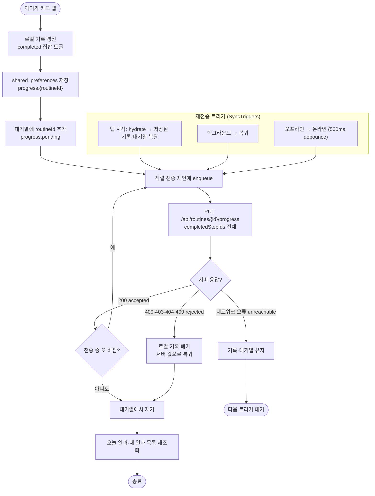

# 아동 카드 완료 상태 오프라인 퍼스트 동기화

## 개요

아동 모드의 카드 체크는 지금까지 "서버가 진실"이었다. 카드를 누를 때마다 단계별 `complete`/`cancel` 요청을 보내고, 서버가 순서 규칙(이전 단계 미완료 시 409)으로 거부하면 화면 표시를 되돌렸다(이슈 #139). 이 구조는 인터넷이 끊기면 체크 자체가 무의미해지고, 서버 규칙을 화면이 그대로 따라야 해서 아이가 순서대로만 누를 수 있었다.

이번 작업으로 **기기가 진실**이 되도록 바꿨다. 탭하면 즉시 로컬에 저장되고 화면에 반영되며, 서버 반영은 뒤에서 따라온다. 서버에는 단계별 요청 대신 **완료 집합을 통째로** 보내는 멱등 API(`PUT /api/routines/{id}/progress`)를 새로 만들어 순서 검사 없이 받아들이게 했다. 못 닿으면 대기열에 남겨 앱 시작·복귀·온라인 전환 시 다시 보내고, 서버가 거부하면 그때만 로컬 기록을 버리고 서버 값으로 돌아간다.

## 기능 흐름

## 변경 사항

### 서버 — 완료 집합 일괄 반영 API

- `server/.../routine/application/dto/request/RoutineProgressSyncRequest.java`: 완료 단계 id 목록을 받는 요청 DTO. null이면 빈 목록으로 취급해 "전부 해제"도 표현할 수 있다.
- `server/.../routine/application/service/RoutineService.java`: `syncProgress(memberId, routineId, completedStepIds)` 추가. 소유 일과·CONFIRMED/COMPLETED 상태·알 수 없는 단계 id를 검증한 뒤, 각 단계의 완료 여부를 목표 집합에 맞춘다. **순서 검사가 없다.** 별은 반영 전후 완료 개수 차이만큼만 더하고 빼며 0 아래로 내려가지 않는다. 모든 단계가 완료되면 일과 상태를 COMPLETED로, 하나라도 빠지면 CONFIRMED로 되돌린다.
- `server/.../routine/application/controller/RoutineController.java`, `RoutineControllerDocs.java`: `PUT /api/routines/{routineId}/progress` 엔드포인트와 Swagger 문서(200/403/404/409).
- `server/src/test/.../RoutineServiceTest.java`: 부분 집합 반영, 전체 완료 시 상태 전이, 해제 시 별 차감, 같은 집합 두 번 보내도 결과 동일(멱등), 순서 뒤섞인 집합 허용, 별 0 하한, 승인 전 일과 거부, 미지의 단계 id 거부 — 8건.

### 클라이언트 — 로컬 영속 저장소

- `client/lib/features/child/domain/routine_progress_record.dart`: 일과 하나의 로컬 기록(`completed`, `rewarded` 집합). JSON 왕복 가능하고 필드가 깨져 있어도 빈 집합으로 복원된다.
- `client/lib/core/storage/local_storage.dart`: `LocalStorage` 인터페이스에 일과별 진행 기록(`progress.{id}`), 동기화 대기열(`progress.pending`), 오늘 일과 캐시(`cache.todayRoutines`) 추가. `SharedPrefsStorage`·`InMemoryStorage` 모두 구현했고, `clearAll()`이 접두사로 찾아 함께 지운다(계정 전환 시 이전 아이의 체크가 남지 않게).
- `client/lib/features/child/data/progress_store.dart`: 저장소 위에서 직렬화·역직렬화를 맡는 래퍼. notifier가 저장 형식을 몰라도 되게 한다.

### 클라이언트 — 오늘 일과 오프라인 캐시

- `client/lib/shared/models/routine.dart`: `Routine.toJson()` 추가(`fromJson`과 대칭).
- `client/lib/features/guardian/data/routine_repository.dart`: `/api/routines/today` 성공 응답을 캐시하고, 실패 시 캐시 → 전체 조회 폴백 순으로 내려간다. 캐시가 깨져 있으면 무시하고 다음 폴백으로 간다.

### 클라이언트 — 전송·상태 관리

- `client/lib/features/child/data/step_progress_repository.dart`: 단계별 `complete`/`cancel`을 없애고 `syncProgress()` 하나로 교체. 결과를 `SyncOutcome {accepted, rejected, unreachable}`로 돌려주며 절대 throw하지 않는다. 400·403·404·409만 거부로, 나머지(네트워크·5xx·401)는 일시 장애로 본다.
- `client/lib/features/child/application/child_routine_notifier.dart`: 상태를 `{progress: Map<routineId, RoutineProgressRecord>, pending: Set<routineId>}`로 재설계. `toggle()`은 순서 제한 없이 즉시 로컬 반영·저장·enqueue. `hydrate()`가 앱 시작 시 저장된 기록을 복원하고 곧바로 `syncPending()`을 부른다. 전송은 직렬 체인이며, 응답 대기 중 또 바뀌면 전송한 집합과 최신 집합을 비교해 대기열을 유지하고 다시 보낸다.
- `client/lib/features/child/application/sync_triggers.dart`: 앱 트리 최상단 위젯. 앱 시작(hydrate), 백그라운드 복귀, 오프라인→온라인 전환(`connectivity_plus`, 500ms debounce) 세 시점에 재전송을 건다. 위젯 테스트처럼 플랫폼 채널이 없어도 죽지 않는다.
- `client/lib/app.dart`: `SyncTriggers`를 `DevToolsOverlay` 바깥에 부착.
- `client/pubspec.yaml`, `client/ios/Podfile.lock`: `connectivity_plus` 추가.

### 클라이언트 — 화면

- `client/lib/features/child/presentation/child_routine_detail_screen.dart`: `canToggle`·`isEnabled`·`AnimatedOpacity` 제거. 체크 버튼은 항상 활성이고 토글은 항상 상태를 바꾼다.
- `client/lib/features/child/presentation/child_home_screen.dart`, `client/lib/features/guardian/presentation/widgets/today_routine_section.dart`: `asData?.value` → `.value`. 동기화 뒤 목록을 재조회하는 동안 화면이 순간 비어 보이던 깜빡임을 없앴다. 진행률·완료 표시는 `isChecked(routineId, card)` 기준.

### 테스트·문서

- `client/test/progress_store_test.dart`, `routine_cache_test.dart`, `child_step_sync_test.dart`(전면 재작성), `sync_triggers_test.dart` 신규. `child_mode_test.dart` 보상 조건 갱신.
- `client/CLAUDE.md` API 계약 표에 PUT 행 추가, `client/docs/troubleshooting.md` #139 항목 후속 기록.
- `docs/superpowers/specs/2026-09-08-offline-first-progress-sync-design.md`, `docs/superpowers/plans/2026-09-08-offline-first-progress-sync.md`: 설계·구현 계획.

## 주요 구현 내용

**왜 단계별 API를 버리고 집합 API를 새로 만들었는가.** 오프라인에서 쌓인 조작을 나중에 단계별로 재생하면 서버 순서 규칙(409)과 재전송 순서가 얽혀 #139와 같은 롤백이 재발한다. "지금 완료된 것은 이 집합이다"를 통째로 보내면 몇 번을 보내도, 어떤 순서로 도착해도 결과가 같다(멱등). 서버는 이 API에서만 순서 검사를 하지 않고, 기존 단계별 API는 그대로 둬 다른 호출부에 영향이 없다.

**별(totalStars) 정합성.** 집합 반영 시 서버가 완료 개수의 전후 차이만큼만 별을 조정한다. 같은 집합을 반복 전송해도 별이 늘지 않고, 해제하면 그만큼 빠진다. 0 아래로 내려가지 않게 막았다.

**"기기가 진실"의 범위.** 로컬 기록이 있는 일과만 로컬 값을 쓰고, 기록이 없으면 서버 `completed`를 그대로 쓴다. 서버가 거부한 경우(승인 전 일과, 삭제된 단계 등)에만 로컬 기록을 폐기한다. 성공했어도 로컬 기록은 지우지 않는다 — 다음 오프라인 때 보여줄 값이다.

**전송 중 추가 조작.** 응답을 기다리는 동안 또 체크되면, 전송한 집합(`sent`)과 최신 집합이 다르므로 대기열에서 빼지 않고 다시 enqueue한다. 같은 일과가 체인에 두 번 들어가지 않도록 `_queued`로 막고, 전송 시점에 최신 집합을 읽는다.

**검증.** 서버 `./gradlew test` 통과. 클라이언트 `flutter test`는 이번 변경으로 새로 실패한 테스트가 없다(기존 결함 4건 — `app_transitions`·`pin_screen`·`setup_done_screen` 로드 실패, `design_token` 색 하드코딩 — 은 이전부터 있던 것). `flutter build ios --release --no-codesign` 성공으로 `connectivity_plus` 추가가 iOS 빌드를 깨지 않음을 확인했다.

## 주의사항

- **`RoutineService.syncProgress`는 순서 검사를 하지 않는다.** 기존 `completeStep`/`cancelStep`의 409 규칙과 다르다. 나중에 "순서대로만 완료" 정책을 되살리려면 이 서비스에도 같은 검사를 넣어야 하는데, 그러면 오프라인 재전송이 다시 거부될 수 있다. 정책을 바꾸기 전에 클라이언트 `canToggle` 제거 이력(#139 → #140)을 먼저 본다.
- **로컬 기록은 성공 후에도 남는다.** 보호자가 다른 기기나 관리자 화면에서 완료 상태를 바꾸면, 아동 기기의 로컬 기록이 우선 표시된다. 다음 동기화 때 로컬 집합이 서버를 덮어쓴다. 현재 서비스는 아동 기기 한 대를 전제로 하므로 문제가 없지만, 다중 기기를 지원하려면 `updatedAt` 비교 같은 충돌 해소 규칙이 필요하다.
- **`clearAll()`이 진행 기록·대기열·캐시를 함께 지운다.** 개발자 도구의 온보딩 초기화가 곧 로컬 진행 기록 초기화다. 대기열에 남아 있던 미전송 체크도 사라진다.
- **`SyncTriggers`의 온라인 전환 감지는 위젯 테스트로 고정하지 않았다.** `connectivity_plus`는 플랫폼 채널이라 테스트에서 스트림이 열리지 않는다. 앱 시작·복귀 경로만 테스트하며, 온라인 전환은 같은 `syncPending()`을 부른다는 것을 코드로 보장한다.
- **오늘 일과 캐시에는 보호자 원문(`rawInputText`)이 포함된다.** 서버 응답을 그대로 저장하므로 로그에는 길이만 남기고 값을 찍지 않는다(원칙 5번). 캐시 자체를 저장하지 않는 선택지는 오프라인 목록 표시가 불가능해 채택하지 않았다.
- **`dart format`를 디렉터리 단위로 돌리면 기존 파일이 새 포맷터 스타일로 재정렬된다.** 이번 작업에서 그렇게 바뀐 무관 파일 6개는 커밋에서 제외하고 원복했다. 포맷은 파일을 명시해 돌린다.
