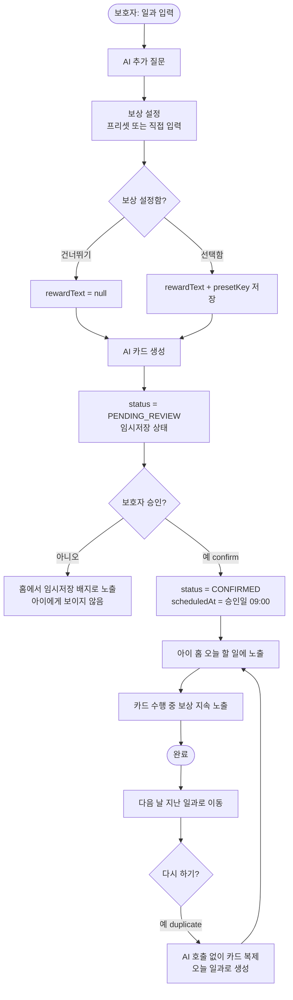

# 보상(강화물) 저장 및 API 추가

> 관련 이슈: #148 (보상 저장·API) · #149 (승인 시점 날짜 확정) · #150 (복제·삭제 API)
> 커밋: `c558da1`

## 개요

2026-09-13 서울 ABA연구소 한상민 소장님 자문에서 **강화(보상) 기능이 통째로 빠져 있다**는 지적을 받았다.
*"버스를 타세요, 내리세요처럼 순서만 알려줘도 그 행동을 하기 싫으면 하지 않는다"* 는 것이 요지였고,
이를 반영하기 위한 서버 기반을 구현했다.

함께 지적된 **"아드님이 회사에 다니는데 추천에 '학교에 가요'가 뜬다"** 문제도 같은 흐름에서 정리했고,
일과가 계속 쌓이기만 하는 구조를 오늘/지난/임시저장으로 나누는 작업까지 한 커밋에 담았다.

핵심은 **앱이 보상을 결정하지 않는다**는 것이다. 정하는 것도 실제로 주는 것도 보호자이며,
앱은 약속을 기억하고 적절한 시점에 보여주기만 한다.

## 기능 흐름



## 변경 사항

### 데이터

- `db/migration/V9__add_reward_to_routine.sql`: `reward_text`(100자) · `reward_preset_key`(30자) 컬럼 추가
- `routine/infrastructure/entity/Routine.java`: 보상 필드 2개 추가. 둘 다 nullable — 보상은 선택 항목이다

### 상수

- `routine/infrastructure/constant/RewardPreset.java` 🆕: `SNACK` / `VIDEO` / `PLAY` / `WALK` / `CUSTOM`.
  `normalize()`로 대소문자 무관 검증, 미정의 키는 null로 떨군다

### DTO

- `dto/request/RewardUpdateRequest.java` 🆕: 보상만 수정하는 요청
- `dto/response/RecentRewardResponse.java` 🆕: 최근 사용 보상
- `dto/request/RoutineCreateRequest.java`: 보상 필드 2개 추가(선택)
- `dto/response/RoutineResponse.java`: 보상 필드 2개 추가 + `from()` 매핑

### 조회

- `repository/RoutineRepository.java`: 지난 일과 · 임시저장 · 최근 보상 조회 메서드 3개 추가

### 서비스

- `service/RoutineService.java`:
  - `create()` — 보상 저장 (프리셋 정규화 + 텍스트 트림)
  - `confirm()` — **`scheduledAt`을 승인일 09:00으로 갱신**
  - `updateReward()` / `getRecentRewards()` / `duplicate()` / `delete()` / `getPastRoutines()` / `getDraftRoutines()` 신규
  - 상수 3개: 최근 보상 3개 · 지난 일과 10개 · 보상 텍스트 100자

### API

- `controller/RoutineController.java` · `RoutineControllerDocs.java`: 엔드포인트 6개 + Swagger 문서

| 메서드 | 경로 | 용도 |
| --- | --- | --- |
| `PATCH` | `/api/routines/{id}/reward` | 보상 수정·해제 |
| `GET` | `/api/routines/recent-rewards` | 최근 보상 최대 3개 |
| `GET` | `/api/routines/past` | 지난 일과 10개 |
| `GET` | `/api/routines/drafts` | 임시저장 목록 |
| `POST` | `/api/routines/{id}/duplicate` | 다시 하기 (AI 호출 없음) |
| `DELETE` | `/api/routines/{id}` | 임시저장만 삭제 |

### 테스트

- `RewardPresetTest.java` 🆕: 정규화 4케이스
- `RoutineSuggestionCatalogTest.java`: 개수 고정 검증을 회귀 방지 검증으로 교체
- `RoutineServiceTest.java`: record 필드 추가에 따른 생성자 호출 수정

## 주요 구현 내용

### 프리셋 키를 텍스트와 따로 저장하는 이유

보상을 자유 텍스트로만 받으면 **아동 화면에 글자만 나온다.** 글을 읽지 못하는 사용자에게는 아무 의미가 없다.
프리셋 키가 있어야 클라이언트가 그에 맞는 **그림**을 띄울 수 있다.
직접 입력한 경우에는 키가 null이고, 기본 아이콘과 함께 텍스트가 표시된다.

### 잘못된 프리셋 키로 요청을 실패시키지 않는다

`RewardPreset.normalize()`는 정의되지 않은 키를 예외 없이 null로 만든다.
**보상은 선택 항목이므로 이것 때문에 일과 생성 자체가 막히면 안 된다.**
클라이언트가 오타를 보내도 "보상 없는 일과"로 저장되고 흐름은 이어진다.

### 승인 시점을 일과 날짜로 삼는다

날짜 선택 UI(캘린더·피커)를 만들지 않기로 했다. `07-mvp-scope.md`의 제외 목록에
*"일정 캘린더 — 핵심 생성 흐름과 무관"* 으로 원래부터 있던 항목이고, 개발 비용 대비 얻는 것이 적다.

대신 `confirm()`에서 `scheduledAt`을 승인일로 갱신한다. 한 줄이지만 다음이 성립한다.

| 사용 패턴 | 동작 |
| --- | --- |
| 오늘 할 일 | 만들고 바로 승인 |
| 내일 병원 | 오늘 미리 만들고 **임시저장** → 내일 승인 |

아동 `today` API가 이미 `PENDING_REVIEW`를 제외하므로, 승인 전 일과는 아이에게 보이지 않는다.
**승인이 곧 "오늘 할 일로 올리기"** 가 되어 날짜 UI 없이 미리 만들기가 가능해진다.

### 복제는 AI를 호출하지 않고 원문도 복사하지 않는다

매일 같은 준비를 하는 경우 탭 한 번으로 끝나야 재사용 가치가 있다.
`POST /api/routines`는 AI 호출이라 한 번이 곧 비용이므로, 복제는 저장된 카드만 그대로 옮긴다.

원문(`rawInputText` / `sanitizedInputText`)은 복사하지 않고 제목으로 대체했다.
**원문을 계속 들고 다니지 않는다**는 서비스 원칙에 맞추기 위해서이며, 복제본은 카드만 있으면 수행에 지장이 없다.

이미 검토를 거친 카드라 `CONFIRMED`로 바로 생성한다. 같은 카드를 두 번 승인받게 할 이유가 없다.

### 완료된 일과는 삭제할 수 없다

`DELETE`는 `PENDING_REVIEW`만 허용하고 나머지는 `ROUTINE_INVALID_STATUS`로 거절한다.
완료 기록은 **수행률 추이의 원본 데이터**이고, 자문에서 요구한 리포트
(*"평소 100%이던 수행률이 30%로 떨어진 날을 찾는 용도"*)가 이 데이터에 의존한다.

보이지 않게 접어둘 뿐 지우지 않는다는 것이 설계 방향이다.

### 보상 텍스트는 로그에 남기지 않는다

`PATCH /reward`와 `GET /recent-rewards`에 `@LogMonitoring(logParameters = false, logResult = false)`를 적용했다.
보상은 보호자 자유 입력이라 *"엄마랑 마트 가기"* 처럼 개인정보가 섞일 수 있다.

## 주의사항

### record에 필드를 추가하면 기존 호출부가 전부 깨진다

`RoutineCreateRequest`에 필드 2개를 더하자 테스트의 `new RoutineCreateRequest(null, null, null)` 호출이
컴파일 에러를 냈다. record는 생성자가 자동 생성되므로 **인자 개수가 바뀌면 모든 호출부를 고쳐야 한다.**
앞으로 이 DTO에 필드를 더할 때도 같은 일이 생긴다.

### 추천 카탈로그 테스트가 개수를 하드코딩하고 있었다

`assertThat(ALL).hasSize(50)` 때문에 항목을 58개로 늘리자 테스트가 깨졌다.
숫자만 58로 고치면 다음에 항목을 추가할 때 또 깨진다. 그래서 **개수 고정을 없애고 의미 있는 검증으로 바꿨다.**

```
✅ 충분한 수의 항목을 갖는다 (50개 이상)
✅ 추천 일과에 내면 조절 표현이 들어가지 않는다
✅ 추천 일과에 성인 사용자를 위한 항목이 포함된다
```

두 번째 테스트가 중요하다. *"마음 다스리기"* 같은 항목이 다시 들어오면 **테스트가 막는다.**
자문에서 받은 원칙(눈으로 확인할 수 있는 행동만 카드가 된다)을 사람의 기억이 아니라 테스트가 지키게 했다.

### `@LogMonitoring`은 반복 적용할 수 없다

기존 메서드 앞에 새 엔드포인트를 삽입하다가 어노테이션이 겹쳐
`LogMonitoring is not a repeatable annotation interface` 에러가 났다.
컨트롤러에 메서드를 끼워 넣을 때는 **앞 메서드의 어노테이션 블록을 침범하지 않는지** 확인해야 한다.

### 아직 하지 않은 것

- **보상 텍스트의 DLP 처리** — 보호자 자유 입력이므로 일과 입력문과 동일하게 마스킹을 거쳐야
  서비스 원칙 2번이 유지된다. 현재는 저장만 하고 있다
- **반복 일과** — `duplicate`로 대체하고 본선까지 미뤘다
- **수행률 리포트** — 데이터는 쌓이고 있으므로 화면만 붙이면 된다

### 마이그레이션

`V9`는 컬럼 추가만 하므로 기존 데이터에 영향이 없다. 기존 일과는 보상이 null이 되고,
클라이언트는 그 경우 보상 UI를 띄우지 않는다.

## 검증

```
./gradlew compileJava --rerun-tasks   BUILD SUCCESSFUL
./gradlew test                        BUILD SUCCESSFUL
```

> 서버 규칙상 통합테스트·curl 수동 테스트·DB 직접 접근은 하지 않았다.
> 실제 동작 확인은 배포 후 Swagger(`/docs/swagger`)에서 진행한다.
