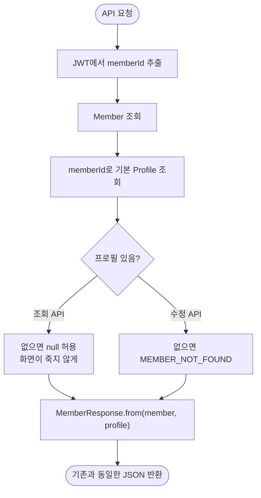

# 보호자 계정과 당사자 프로필 분리

## 개요

로그인 계정(`Member`) 하나에 보호자의 인증 정보와 당사자의 개인화 정보가 함께 들어 있었다.
이 구조에서는 당사자 기기가 서버에 접속하려면 보호자의 아이디·비밀번호를 그대로 써야 하고,
그 기기를 잃어버리면 계정 전체가 열린다. 보호자와 당사자가 각자 기기를 쓰려면 먼저 이 둘이
갈라져야 한다.

`Member`는 로그인 계정만 담고, 당사자 정보는 `Profile`로 떼어냈다. 일과는 계정이 아니라
당사자에게 속하므로 `Routine`의 소유자도 프로필로 옮겼다.

**이미 배포된 앱이 계속 동작해야 하므로 API 경로와 응답 형식은 바꾸지 않았다.**

## 기능 흐름

## 변경 사항

### 엔티티

- `member/infrastructure/entity/Profile.java`: 신규. 당사자의 이름(별명)·캐릭터·도움 목표·별 개수를
  담는다. `Member`를 `@ManyToOne`으로 참조해, 나중에 한 계정에 프로필이 여럿이 되어도 구조가 버틴다
- `member/infrastructure/entity/Member.java`: `nickname`·`character`·`supportGoals`·`totalStars` 제거.
  로그인 계정으로만 남았다
- `routine/infrastructure/entity/Routine.java`: 소유자를 `Member` → `Profile`로 변경

### 리포지토리

- `member/infrastructure/repository/ProfileRepository.java`: 신규.
  `findFirstByMemberIdOrderByCreatedAtAsc`가 "계정의 기본 프로필"을 찾는 통로다
- `routine/infrastructure/repository/RoutineRepository.java`: 조회 조건을 `profileId` 기준으로 변경.
  관리자 집계는 `r.profile.member.id`로 계정까지 거슬러 올라간다

### 서비스

- `member/application/service/MemberService.java`: 계정과 프로필을 함께 조회하도록 변경.
  탈퇴 시 일과 → 프로필 → 소셜 신원 → 세션 → 계정 순으로 지운다
- `routine/application/service/RoutineService.java`: 소유권 검사를
  `routine.getProfile().getMember().getId()`로 변경. 별 적립 대상도 프로필로 옮겼다
- `auth/application/service/AuthService.java`: 회원가입 시 계정과 프로필을 함께 만든다
- `admin/application/service/AdminMemberService.java`: 목록 조회 시 프로필을 한 번에 가져와
  맵으로 매칭한다 (회원 수만큼 쿼리가 나가지 않도록)

### 마이그레이션

- `db/migration/V10__split_profile_from_member.sql`: `profile`·`profile_support_goals` 생성,
  기존 회원 1명당 프로필 1개 생성, 일과를 프로필에 연결, 옮긴 컬럼 정리

## 주요 구현 내용

### API 계약을 그대로 두었다

내부 구조가 바뀌어도 `MemberResponse`가 내보내는 JSON은 이전과 같다.
`from(Member, Profile)`이 두 엔티티를 합쳐 기존 형식으로 만든다.

이미 심사에 제출한 앱이 동작하고 있으므로, 스키마를 바꾸면서 응답 형식까지 바꾸면
그 앱이 멈춘다. 경로와 응답을 고정해 두면 서버 내부는 자유롭게 바꿀 수 있다.

### 가입 시점에 프로필을 함께 만든다

계정만 만들고 프로필을 나중에 만들면, 이후 모든 조회가 "프로필 없음"을 분기해야 한다.
가입 즉시 기본값(캐릭터 `LULU`)으로 프로필을 만들고 온보딩에서 채운다.

다만 **조회 API는 프로필이 없어도 죽지 않게** null을 허용한다. 이전 데이터나 예외 상황에서
프로필이 비어도 화면 전체가 실패하지 않아야 한다.

### 마이그레이션을 실제 데이터로 검증했다

운영 스키마를 덤프해 로컬 임시 DB에 복원하고, 샘플 데이터를 넣은 뒤 V10~V12를 적용했다.

| 검증 항목 | 결과 |
|---|---|
| 계정 1개당 프로필 1개 | 어긋난 계정 0건 |
| 일과의 프로필 연결 | 연결 안 된 일과 0건 |
| 별·닉네임·캐릭터 이관 | 정상 |
| 도움 목표 이관 | 정상 |
| 옛 컬럼 정리 | `member`의 3개 컬럼, `routine.member_id` 삭제 확인 |

`UPDATE ... SET profile_id` 이후 `SET NOT NULL`을 거는 순서라, 프로필을 못 찾은 일과가 남으면
마이그레이션이 그 지점에서 멈춘다. 조용히 넘어가 데이터가 어긋나는 것보다 낫다.

## 주의사항

### 프로필이 여럿이 되면 호출부를 바꿔야 한다

지금은 "계정의 첫 번째 프로필"을 기본 프로필로 삼는다(`findFirstByMemberIdOrderByCreatedAtAsc`).
한 계정이 당사자 여럿을 관리하게 되면, 호출부가 **어느 프로필인지 명시**하도록 바꿔야 한다.
그 전까지는 이 헬퍼가 기존 API와 새 구조를 잇는 다리 역할을 한다.

### 탈퇴 시 AI 호출 기록에 회원 식별자가 남는다

`MemberService.withdraw()`가 `AiCallLog`를 지우지 않아 탈퇴 후에도 `memberId`가 남는다.
기록 자체에 일과 내용은 없지만 식별자는 남으므로, 탈퇴 시 연결을 끊는 익명화 처리를
넣는 편이 낫다. 개인정보처리방침에는 현재 동작에 맞춰 기재해 두었다.

### 설정 파일은 커밋되지 않는다

`application-*.yml`은 gitignore 대상이라, 로컬에서 바꾼 설정은 배포에 반영되지 않는다.
배포용 값은 저장소 Actions Secret으로 관리한다.
