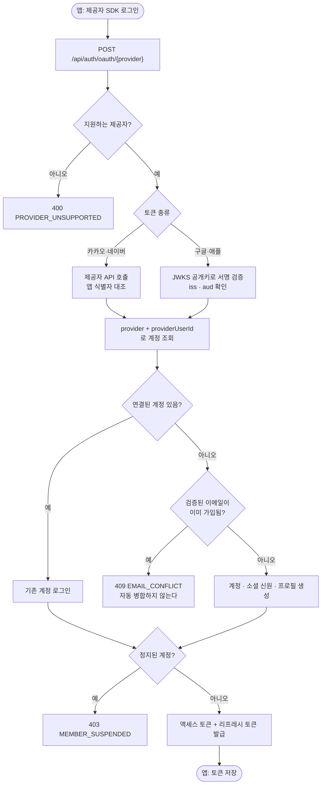
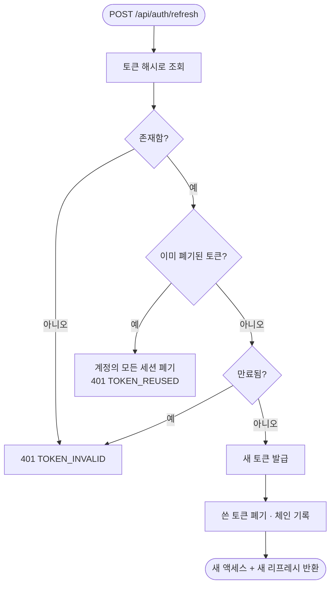

# 소셜 로그인 도입 (카카오 · 네이버 · 구글 · 애플)

## 개요

기존 로그인은 아이디와 고정 비밀번호로 가입과 로그인을 동시에 처리했다. 같은 이름을 넣으면
남의 계정으로 들어가는 구조였다. 제공자 4종 소셜 로그인을 도입하면서 이 경로를 대체하고,
액세스 토큰이 만료돼도 다시 로그인하지 않도록 리프레시 토큰을 함께 넣었다.

클라이언트가 제공자 SDK로 로그인해 받은 토큰을 서버가 확인한 뒤 **우리 토큰**을 발급한다.
제공자 토큰은 확인 후 폐기하며 저장하지 않는다.

기존 `/api/auth/signup` · `/login`은 그대로 두었다. 이미 배포된 앱이 계속 동작해야 한다.

## 기능 흐름

리프레시 흐름은 회전 방식이다.

## 변경 사항

### 제공자 검증

- `auth/infrastructure/oauth/OAuthVerifier.java`: 검증기 인터페이스
- `auth/infrastructure/oauth/IdTokenVerifier.java`: ID 토큰 방식 공통 뼈대.
  서명·발급자·대상(aud)·만료를 검사한다
- `auth/infrastructure/oauth/JwkKeyResolver.java`: 제공자 공개키(JWKS) 조회와 캐시.
  캐시에 없는 키 식별자가 오면 한 번 더 받아 온다(키 교체 대응)
- `auth/infrastructure/oauth/GoogleOAuthVerifier.java` · `AppleOAuthVerifier.java`: ID 토큰 검증
- `auth/infrastructure/oauth/KakaoOAuthVerifier.java`: 토큰 정보 조회로 앱 식별자 대조 후 이메일 조회
- `auth/infrastructure/oauth/NaverOAuthVerifier.java`: 사용자 정보 조회. 본문의 결과 코드까지 확인
- `auth/infrastructure/oauth/OAuthHttpConfig.java`: 타임아웃이 걸린 HTTP 클라이언트
- `common/infrastructure/properties/OAuthProperties.java`: 제공자별 앱 식별자 설정

### 계정 · 세션

- `auth/infrastructure/entity/AuthIdentity.java`: 소셜 신원.
  `(provider, providerUserId)`에 유니크 제약
- `auth/infrastructure/entity/RefreshToken.java`: 리프레시 토큰. 해시·기기·만료·폐기·체인 기록
- `auth/application/service/OAuthLoginService.java`: 검증 → 계정 조회 → 로그인 또는 가입
- `auth/application/service/RefreshTokenService.java`: 발급 · 회전 · 재사용 감지 · 폐기

### 엔드포인트

- `auth/application/controller/AuthController.java`:
  `POST /api/auth/oauth/{provider}` · `/refresh` · `/logout` 추가
- `auth/application/dto/response/TokenResponse.java`: `refreshToken` 필드 추가
  (기존 필드는 유지해 배포된 앱이 그대로 동작한다)

### 연동

- `admin/application/service/AdminMemberService.java`: 계정 정지·강제 로그아웃 시 세션도 끊는다
- `member/application/service/MemberService.java`: 탈퇴 시 소셜 신원과 세션을 함께 지운다

### 마이그레이션

- `db/migration/V11__create_refresh_token.sql`
- `db/migration/V12__create_auth_identity.sql`

### 앱 · 문서

- `client/lib/core/config/app_config.dart` · `client/.env.example`: 제공자 키 자리 추가
- `client/ios/Runner/Runner.entitlements`: Sign in with Apple 권한 선언
- `docs/setup/소셜로그인_설정가이드.md` · `소셜로그인_진행상황.md`

## 주요 구현 내용

### 이메일로 계정을 합치지 않는다

사람을 찾는 키는 `provider + providerUserId`다. 이메일이 아니다.

이메일로 합치면 검증되지 않은 주소를 내세워 남의 계정에 올라탈 수 있다. 애플은
"내 이메일 숨기기"로 앱마다 다른 주소를 주므로 같은 사람인지 알 수도 없고, 카카오는
이메일이 선택 동의라 아예 없을 수 있다.

검증된 이메일이 이미 가입돼 있으면 조용히 합치는 대신 **409로 알린다.** 계정 연결은
이미 로그인한 상태에서만 허용한다.

### 토큰이 우리 앱 것인지까지 확인한다

서명만 맞으면 통과시키면 안 된다. 구글이 서명한 토큰은 전 세계 모든 구글 앱의 토큰이다.
`aud`가 우리 앱인지 확인하지 않으면 아무 앱에서 받은 토큰으로 우리 계정에 들어올 수 있다.

카카오는 토큰 정보 조회의 앱 식별자를 대조해 같은 역할을 한다.

**설정이 비어 있으면 통과시키지 않고 실패시킨다.** 열린 문으로 두느니 로그인을 막는다.

### 리프레시 토큰은 원문을 저장하지 않는다

무작위 문자열을 발급하고 DB에는 SHA-256 해시만 남긴다. DB가 통째로 새도 토큰 자체는 새지 않는다.

JWT로 만들지 않은 이유는 **서버가 언제든 끊을 수 있어야** 하기 때문이다. JWT는 서명만 맞으면
유효해서 폐기할 방법이 없다.

### 회전과 재사용 감지

갱신할 때마다 새 토큰을 주고 쓴 토큰은 즉시 폐기한다. 이미 폐기된 토큰이 다시 오면
복사본이 돌아다닌다는 뜻이므로 **그 계정의 모든 세션을 끊는다.**

회전이 없으면 탈취당해도 아무도 모른다. 정상 사용자는 다시 로그인하면 되지만,
공격자가 조용히 계속 쓰는 것은 막아야 한다.

만료는 정상적인 수명 종료이므로 계정을 끊지 않고 그 토큰만 거부한다.

### 강제 로그아웃이 실제로 동작하게 했다

기존 강제 로그아웃은 액세스 토큰만 무효화했다. 리프레시 토큰이 살아 있으면 곧바로
새 액세스 토큰을 받아 다시 들어온다. 정지·강제 로그아웃 시 세션까지 끊도록 연결했다.

### 검증

- 마이그레이션: 운영 스키마 복사본에 V10~V12 적용, 이관 결과 확인
- 테스트: 리프레시 회전·재사용 감지·만료, 소셜 로그인 신규 가입·기존 로그인·이메일 충돌·정지 계정
- 전체 테스트 통과

## 주의사항

### 네이버는 토큰만으로 앱을 특정할 수 없다

네이버는 카카오의 앱 식별자나 구글의 `aud`처럼 "이 토큰이 어느 앱 것인지" 알려주는 값을
주지 않는다. 다른 네이버 앱에서 받은 토큰으로도 사용자 조회가 성공한다.

없애려면 클라이언트가 액세스 토큰 대신 **인가 코드**를 보내고 서버가 시크릿으로 교환하는
방식으로 바꿔야 한다. 설정에 클라이언트 시크릿을 미리 받아 둔 이유가 이것이다.
현재 한계는 코드 주석과 설정 가이드에 기록해 두었다.

### 갱신 요청은 한 번만 나가야 한다

회전 방식이라 같은 리프레시 토큰으로 두 번 요청하면 재사용으로 간주돼 로그아웃된다.
앱에서 액세스 토큰 만료 시 갱신 요청이 동시에 여러 번 나가지 않도록 묶어야 한다.

### 설정을 반영하지 않으면 토큰 수명이 옛 값으로 동작한다

액세스 1일 / 리프레시 180일로 바꾸었으나, 설정 파일은 gitignore 대상이라 커밋되지 않는다.
저장소 Actions Secret을 갱신하지 않으면 배포 후에도 이전 값(1시간 / 7일)으로 동작한다.

### 앱 구현이 남아 있다

서버는 완료됐지만 앱에 제공자 SDK 4종을 붙이는 작업이 남았다. 로그인 후 앱으로 돌아오는
URL 스킴은 빌드 시점에 필요해서 환경변수로 주입할 수 없고, 네이티브 설정 파일에 직접 적어야 한다.

네이버는 실 서비스 검수가 필요하며, **앱에 로그인을 붙인 뒤에야 신청이 통과된다.**
승인에 며칠 걸리므로 앱 구현이 끝나면 바로 신청해야 한다.
