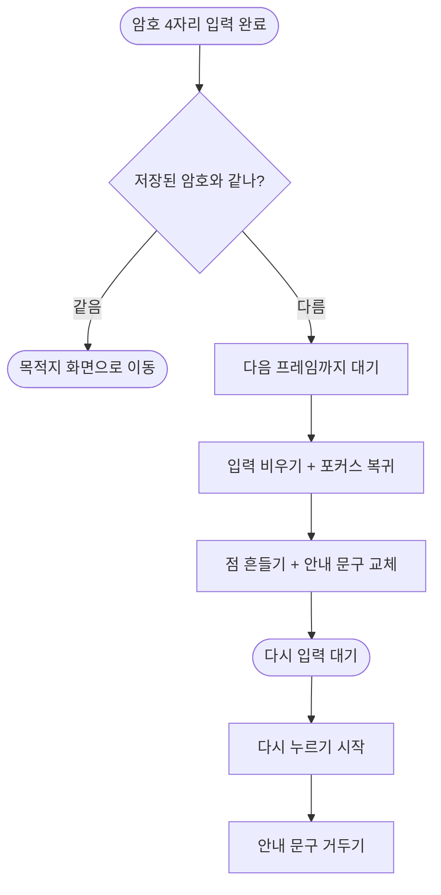

# 모드 전환 화면에서 암호를 틀려도 아무 반응이 없어 실패를 알 수 없음

## 개요

아이 화면에서 보호자 화면으로 넘어갈 때 비밀암호를 틀리면 **입력칸만 조용히 비워졌다.** 틀린 것인지, 입력이 안 먹은 것인지, 화면이 멈춘 것인지 구분할 수 없어 같은 암호를 계속 다시 누르게 됐다.

암호가 틀리면 점이 흔들리고 안내 문구가 바뀌도록 했다.

## 기능 흐름

## 변경 사항

- `features/child/presentation/mode_switch_screen.dart`: 틀린 횟수와 안내 문구 상태를 두고, 점을 `AppShake`로 감쌌다. 다시 누르기 시작하면 안내를 거둔다.
- `test/child_mode_test.dart`: "조용히 비운다"를 고정하고 있던 기존 테스트 2개를 새 동작에 맞게 고쳤다.

## 주요 구현 내용

**경고색과 에러 아이콘을 쓰지 않았다.** 아이도 보는 화면이다. 대신 온보딩 암호 화면과 같은 방식(흔들림)으로 알린다 — 앱 안에서 같은 상황을 같은 방법으로 표현해야 배울 것이 하나로 줄어든다.

입력을 비우는 것은 **다음 프레임에** 한다. 판정이 도는 시점은 입력 변화 리스너 안이라, 그 자리에서 비우면 리스너가 곧바로 다시 돌면서 방금 세운 안내 문구를 지워 버린다. 실제로 이 순서 때문에 문구가 한 프레임도 보이지 않던 상태를 겪었다.

## 주의사항

- 암호를 설정하지 않은 상태(온보딩을 건너뛴 개발 상황)에서는 그대로 통과시킨다. 여기서 막으면 화면을 열어볼 방법이 없다.
- 흔들림은 "동작 줄이기" 접근성 설정이 켜져 있으면 동작하지 않는다. 그때도 안내 문구는 바뀌므로 실패 사실 자체는 전달된다.
