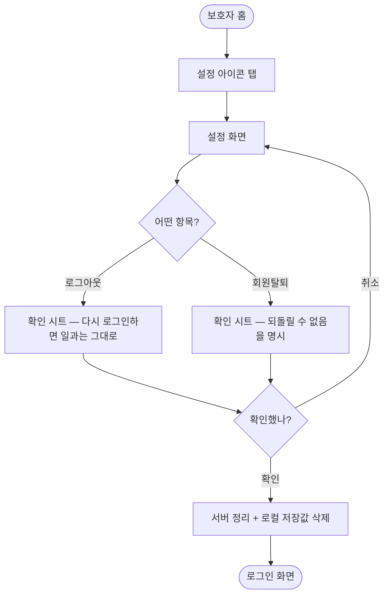

# 로그아웃할 방법이 없어 계정을 바꾸거나 정리할 수 없음

## 개요

앱에 로그아웃 수단이 없어 한 번 로그인하면 나갈 방법이 없었다. 기능 자체는 저장소에 이미 있었고 **부를 자리만 없던** 상태였다. 보호자 홈에 설정 진입점을 만들고, 그 안에서 로그아웃과 회원탈퇴를 할 수 있게 했다.

설정 화면은 **목록 구조**로 만들어 이후 항목(암호 변경·알림 설정 등)을 줄만 추가하면 되게 했다.

## 기능 흐름

## 변경 사항

### 신규
- `features/guardian/presentation/guardian_settings_screen.dart`: 설정 화면. 목록 타일, 확인 시트, 시트 버튼을 한 파일에 담았다. 항목이 늘어도 타일 한 줄만 추가하면 된다.

### 수정
- `core/router/app_router.dart`: `Routes.guardianSettings`(`/guardian/settings`) 추가 및 라우트 등록. 화면 전환은 기존 관례대로 수평 슬라이드.
- `features/guardian/presentation/guardian_home_screen.dart`: 헤더 우측에 설정 아이콘을 넣었다. 캐릭터 배지는 아이 화면으로 가는 입구라 자리를 지키고, 그 **왼쪽**에 둔다.

### 테스트
- `test/guardian_settings_test.dart`: 항목 존재, 확인 없이는 실행되지 않음, 취소가 실제로 아무 일도 하지 않음, 확인 시 실행되고 로그인 화면으로 이동. 로그아웃·회원탈퇴 각각 검증.
- `test/guardian_home_screen_test.dart`: 설정 진입점 존재와 이동 검증.

## 주요 구현 내용

**로그아웃과 회원탈퇴는 문구를 다르게 썼다.** 둘 다 확인을 받지만 성격이 다르다.

- 로그아웃: "다시 로그인하면 지금까지 만든 일과를 그대로 볼 수 있어요" — 겁주지 않는다. 실제로 서버 데이터는 남는다.
- 회원탈퇴: "만든 일과와 모은 별이 모두 사라져요 / 같은 계정으로 다시 로그인해도 되돌릴 수 없어요" — 되돌릴 수 없다는 점을 분명히 한다.

같은 문구를 쓰면 사용자가 둘을 구분할 수 없고, 그러면 확인 창이 형식만 남는다. 테스트로도 두 문구가 갈리는지 고정했다.

확인 창은 **바텀시트**로 만들었다. 카드 수정 시트와 같은 방식이라, 앱 안에서 별도의 문법을 하나 더 배우지 않아도 된다.

처리 중에는 중복 탭과 뒤로가기를 막는다. 로그아웃은 서버 요청이 섞여 있어 즉시 끝나지 않는다.

## 주의사항

- **아이 화면에는 진입점을 두지 않았다.** 아이가 계정을 정리할 이유가 없다.
- 저장소의 `logout()`/`deleteAccount()`는 **서버 요청이 실패해도 로컬을 반드시 비운다.** 그래서 화면은 결과를 따지지 않고 곧장 로그인 화면으로 보낸다. 여기서 실패를 붙잡아 두면 토큰 없는 상태로 홈에 머물게 된다.
- 설정 아이콘은 전용 에셋이 없어 Material 아이콘을 썼다. 앱 안에 같은 선례가 있어 톤이 크게 어긋나지는 않지만, 디자인 에셋이 나오면 교체하는 편이 낫다.
- 이번 이슈 설계에서는 회원탈퇴를 "이후"로 미뤘으나, 요청에 따라 함께 넣었다. 서버 엔드포인트(`DELETE /api/member/me`)와 저장소 메서드가 이미 있어 추가 작업은 화면뿐이었다.
