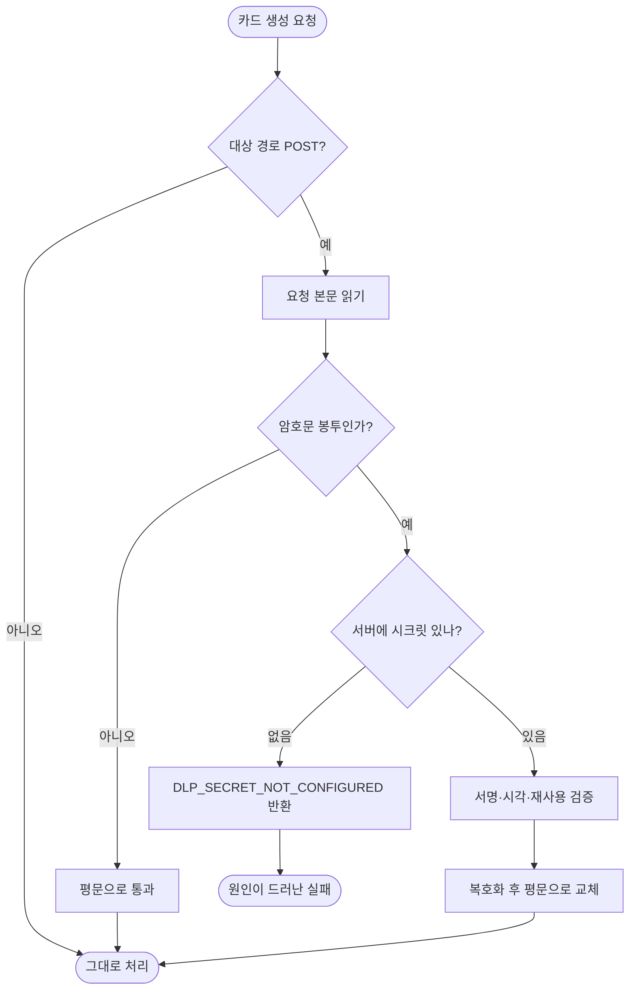

# 서버 암호화 시크릿 미설정으로 카드 생성이 항상 실패함 (E-1001)

## 개요

실기기에서 카드 생성이 100% 실패하던 문제를 복구했다. 원인은 AI도 네트워크도 아니었고, **클라이언트만 요청을 암호화하고 서버에는 복호화 시크릿이 없던 한쪽만의 설정**이었다. 서버 필터는 시크릿이 비면 복호화를 건너뛰고 통과시키도록 되어 있어, 암호문 봉투가 그대로 역직렬화되며 모든 필드가 null이 됐고 저장 단계의 not-null 제약에 걸려 500이 났다. 화면에는 `E-1001`만 떴다.

복구와 함께 **같은 사고가 조용히 반복되지 않도록** 필터의 통과 규칙을 바꾸고, 설정 누락이 기동 시점에 드러나게 했다.

## 기능 흐름

종전에는 `F`에서 "시크릿 없음"이면 **G가 아니라 Z로 빠졌다.** 그 경로가 이번 장애다.

## 변경 사항

### 서버 — 조용한 통과 제거
- `common/infrastructure/security/AidlpDecryptionFilter.java`: 시크릿 유무로 필터를 통째로 건너뛰던 `shouldNotFilter` 조건을 없앴다. 대상 경로면 항상 필터를 타고, 봉투 유무와 시크릿 유무를 본문 안에서 명시적으로 판정한다. 본문을 먼저 바이트로 읽어두어 평문 요청은 그대로 다시 흘려보낸다.
- `common/infrastructure/exception/ErrorCode.java`: `DLP_SECRET_NOT_CONFIGURED`(500) 추가. 서버 설정 누락을 400으로 뭉뚱그리면 원인이 앱 탓처럼 보인다.
- `common/infrastructure/properties/AidlpProperties.java`: 기동 시 시크릿이 비어 있으면 경고를 남긴다.

### 클라이언트 — 요청 암호화 잠시 비활성
- `core/network/dio_client.dart`: 암호화 인터셉터 등록을 주석 처리했다. **코드는 지우지 않았고**, 왜 껐는지·다시 켜는 3단계 절차·양쪽 값이 같기만 하면 된다는 사실을 주석에 남겼다.
- `core/network/encryption_interceptor.dart`: 현재 비활성 상태임을 파일 상단에 명시했다.

### 배포 설정
- GitHub Secret `APPLICATION_PROD_YML`에 `elum.aidlp.secret` 블록을 추가해 서버가 복호화할 수 있게 했다. 설정 위치는 기존 관례대로 이 Secret 한 곳으로 통일했다.
- `.github/workflows/PROJECT-SPRING-CICD.yaml`: 설정만 바뀐 경우에도 손으로 배포를 돌릴 수 있게 `workflow_dispatch`를 열었다. 배포 트리거가 `server/**` 변경에만 걸려 있어, Secret만 고친 상황에서는 반영할 방법이 없었다.

## 주요 구현 내용

핵심은 **"켜진 쪽과 꺼진 쪽이 공존해도 깨지지 않게"** 만든 것이다.

배포된 앱(암호화 켜짐)과 앞으로 나갈 앱(암호화 꺼짐)이 한동안 같이 돈다. 그래서 서버는 두 형태를 모두 받아야 한다. 봉투가 오면 복호화하고, 평문이 오면 그대로 통과시킨다. 이 조합 덕분에 클라이언트 재배포를 기다리지 않고 서버만 고쳐 이미 설치된 앱을 살릴 수 있었다.

반대로 **시크릿이 없는데 봉투가 오는 경우만은 통과시키지 않는다.** 그 경로를 열어 둔 것이 이번 장애의 직접적인 원인이었기 때문이다. 필터 주석에는 "데모 안전 — 로컬 fallback 유도"라고 적혀 있었지만, 클라이언트는 이미 로컬 폴백을 제거한 뒤였다. 한쪽은 "안 되면 로컬로 떨어지겠지" 하고 통과시키고 다른 쪽은 그 폴백을 없앤, **두 파일의 전제가 어긋난 자리**였다.

## 주의사항

- **시크릿은 양쪽이 완전히 같아야 한다.** HKDF-SHA256의 입력 키로 쓰이므로 값 자체에는 제약이 없지만, 한 글자라도 다르면 복호화가 실패한다. 클라이언트는 `CLIENT_ENV_FILE`의 `ELUM_AIDLP_SECRET`, 서버는 `APPLICATION_PROD_YML`의 `elum.aidlp.secret`이다.
- **암호화를 다시 켤 때는 서버 설정을 먼저 확인한다.** 클라이언트만 켜면 이번과 같은 상태가 된다. 다만 이제는 조용히 500이 나지 않고 `DLP_SECRET_NOT_CONFIGURED`로 원인이 드러난다.
- **배포 트리거는 경로 필터를 탄다.** 서버 배포는 `server/**`, 앱 배포는 `client/**` 변경에만 걸린다. 설정(Secret)만 바꾼 경우에는 어느 쪽도 돌지 않으므로 수동 실행으로 반영해야 한다.
- 남은 과제: 클라이언트가 실패 사유를 `E-1001` 하나로 뭉뚱그리고 있다. 서버가 사유를 구분해 주게 됐으므로, 화면에서도 구분해 보여줄 여지가 생겼다.
