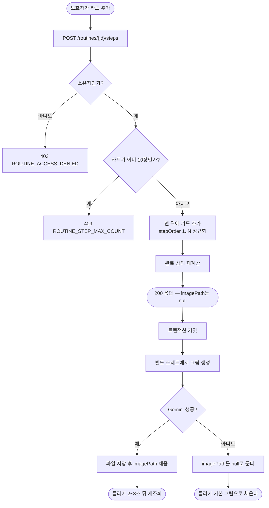

# 행동 카드 추가·순서 변경 API — 추가 시 AI 이미지 생성까지

## 개요

전문가 자문의 필수 요구 — *"생성된 카드를 수정·순서 변경·삭제할 수 있어야 한다. 쉽게."*

수정·삭제는 이미 있었고 **추가와 순서 변경이 없었다.** 두 API를 넣으면서, 코드를 읽다
발견한 **명세와 실제 동작의 어긋남 세 가지**를 함께 잡았다.

이번 작업은 **서버만** 한다. 카드 추가 버튼·순서 화살표 UI는 #198 디자인이 나와야 붙는다.

## 기능 흐름



## 변경 사항

### 새 파일

- `RoutineStepCreateRequest.java`: 카드 추가 요청. `@NotBlank`·`@Size` 제약을 **실제로** 단다
- `RoutineStepImageFiller.java`: 커밋 뒤 그림을 만들어 채우는 전용 컴포넌트
- `RoutineStepRepository.java`: 카드 한 장만 집어 고칠 때 쓴다
- `RoutineStepEditTest.java`: 신규 테스트 15건

### 고친 파일

- `RoutineController.java`: `POST /{routineId}/steps` 추가
- `RoutineControllerDocs.java`: 추가 API 문서 · **거짓이 된 기존 문구 수정**
- `RoutineService.java`: `addStep` · `moveStep` · `refreshCompletionStatus` · 상태 제약 완화
- `RoutineStepUpdateRequest.java`: `stepOrder` 추가
- `ErrorCode.java`: `ROUTINE_STEP_MAX_COUNT` 추가

## 주요 구현 내용

### 1. 카드 추가 — 그림을 기다리지 않는다

이미지 생성은 몇 초 걸린다. 응답을 그때까지 붙잡으면 화면이 멈춘다.
**카드를 먼저 만들어 응답하고, 그림은 커밋 뒤에 채운다.**

따라서 이 응답의 `imagePath`는 **거의 항상 `null`** 이다. 클라는 2~3초 뒤 재조회하고
그동안 "그림 만드는 중"을 띄운다 (#198 §9).

**그림이 실패해도 카드 추가는 성공한다.** `imagePath`를 `null`로 두고 끝낸다 —
클라가 기본 그림으로 채운다 (서비스 원칙 6).

**카드당 한 번만 부른다.** 자동 재시도를 걸지 않았다. 일과 생성 경로는 1회 재시도하지만
그쪽은 사용자가 화면 앞에서 기다리는 중이라 성공률이 곧 체감 품질이다. 여기는 카드가
이미 화면에 있고 실패가 기본 그림으로 덮이므로, 재시도는 비용만 배로 든다.

그림체는 **그 일과 프로필의 캐릭터를 그대로 넘겨** 기존 카드들과 맞춘다. 추가한 카드만
그림체가 다르면 캐러셀에서 바로 눈에 띈다.

### 2. 🔴 자기호출 프록시 함정 — 별도 빈으로 뺀 이유

처음에는 이미지 로직을 `RoutineService` 안에 두었다. **동작하지 않는다.**

```java
// ❌ 같은 빈 안에서 자기 메서드 호출 → 프록시를 타지 않는다
private void fillStepImage(...) {
    ...
    persistStepImagePath(stepId, imagePath);   // @Transactional이 안 걸린다
}
```

커밋 뒤 **다른 스레드**에서 도는 코드라 트랜잭션이 하나도 열려 있지 않다. 프록시를
타지 않으면 `@Transactional`도 무시되어, 엔티티를 고쳐도 **아무것도 저장되지 않는다.**
테스트가 초록이어도 운영에서 `imagePath`가 영영 `null`로 남았을 것이다.

`RoutineStepImageFiller`라는 별도 빈으로 빼서 프록시를 타게 했다.

### 3. 순서 변경 — 항상 연속값으로 정규화

화면은 화살표로 한 칸씩 민다(#198 §7). 목표 자리를 보내면 거기 끼워 넣고
**나머지를 1..N으로 다시 채워** 응답한다.

```java
int index = Math.clamp(desiredOrder - 1, 0, ordered.size());
ordered.add(index, target);
for (int i = 0; i < ordered.size(); i++) ordered.get(i).setStepOrder(i + 1);
```

`stepOrder`가 겹치거나 비면 **다음 이동에서 순서가 튄다.** 클라가 낙관적으로 먼저 반영하고
실패하면 되돌리는 구조라, 서버가 기준을 확정해 줘야 한다.

범위를 벗어난 값은 막지 않고 끝으로 붙인다. 화살표를 끝에서 한 번 더 눌렀을 때 400을
던지면 화면이 되돌아가야 하는데, 사용자가 보기엔 아무 일도 아니다.

### 4. 상태 제약을 풀었다

기존 `updateStep`·`deleteStep`은 **`PENDING_REVIEW`가 아니면 거부**했다.

```java
if (routine.getStatus() != RoutineStatus.PENDING_REVIEW) {
    throw new CustomException(ErrorCode.ROUTINE_INVALID_STATUS);
}
```

자문 요구가 *"이미 만든 카드도 언제든지 수정할 수 있어야 한다"* 라 **모든 상태를 허용**한다.
막는 경우가 없어도 `requireEditableRoutine()` 메서드를 남긴 이유는, 다시 조일 자리를
한 곳에 모아 두기 위함이다 — 호출부 세 곳에 흩어지면 한 군데만 고쳐져 어긋난다.

### 5. 별 정합성 — 완료 카드를 지우면 별도 거둔다

상태 제약을 풀면서 **새로 생긴 경우**다. 전에는 완료된 카드가 있을 수 없었다
(`PENDING_REVIEW`에서는 아직 아무것도 완료되지 않는다).

별은 "완료한 카드 수"를 따라간다 — `completeStep`(+1) · `cancelStep`(-1) ·
`syncProgress`(증감분)가 모두 그 규칙이다. **카드가 사라졌는데 별만 남으면** 이룸이
화면의 별 개수가 무엇을 센 것인지 설명할 수 없다.

같은 이유로 카드가 늘거나 줄면 완료 상태를 다시 계산한다. COMPLETED였던 일과에 카드를
더하면 "전부 완료"가 깨지므로 CONFIRMED로 되돌린다.

### 6. 덮어쓰기 버그

`updateStep`이 넘어온 값을 **그대로 덮어썼다.**

```java
targetStep.setTitle(request.title());          // null이 오면 제목이 지워진다
targetStep.setDescription(request.description());
```

`stepOrder`를 추가하면서 치명적이 된다 — 순서만 옮기려고 `stepOrder`만 보내면
**제목과 설명이 통째로 사라진다.** 보낸 필드만 반영하도록 고쳤다.

### 7. 10장 상한

`RoutineAiPipeline.MAX_STEPS`와 **같은 값**으로 맞췄다. 더 낮게 잡으면 AI가 만든 일과가
처음부터 상한 초과 상태가 된다 (프롬프트도 "1개 이상 10개 이하"). 같은 값이라
**기존 일과 중 상한을 넘는 것이 하나도 없다.**

카드 1장 추가 = AI 이미지 1회이므로, 상한이 곧 비용의 천장이다.

## 검증

| 항목 | 결과 |
| --- | --- |
| `./gradlew test` | **211건 전부 통과** (실패 0 · 오류 0) |
| 신규 테스트 | **15건** — 추가 6 · 순서 4 · 삭제 4 · 권한 1 |
| **실제 AI 호출** | **0건** — `GeminiImageClient`를 mock으로 두고 "예약했는가"만 본다 |

**AI를 부르지 않는다.** 카드 한 장 = 이미지 1회 = 돈이다. 이미지 생성 여부는
`RoutineStepImageFiller` mock에 대한 `verify`로 확인하고, 캐릭터가 제대로 전달되는지도
인자 검증으로 본다.

주요 검증 항목:

- 추가한 카드가 맨 뒤에 붙고 `stepOrder`가 1..N으로 이어진다
- 10장이면 409를 내고 **이미지 예약도 시작하지 않는다** (돈 쓰는 일을 먼저 막는다)
- CONFIRMED·COMPLETED에서도 추가·수정·순서 변경이 된다
- COMPLETED에 카드를 더하면 CONFIRMED로 돌아온다
- `stepOrder`만 보내면 제목·설명이 남는다
- 범위를 넘는 자리는 끝으로 붙는다
- 완료 카드 삭제 시 별 -1, 미완료 삭제 시 별 유지
- 마지막 한 장은 여전히 못 지운다
- 남의 일과는 403이고 이미지 예약도 안 한다

## 주의사항

- **`imagePath`는 추가 직후 거의 항상 `null`이다.** 클라이언트가 이걸 "실패"로 읽으면
  안 된다. 2~3초 뒤 재조회해서 채워졌는지 보고, 그동안 "그림 만드는 중"을 띄운다.
- **추가 카드 이미지는 `stepId`를 batchId로 쓴다.** 일과 생성 때의 batchId에 섞으면
  그 배치를 되돌릴 때(`deleteBatch`) 나중에 추가한 그림까지 함께 지워진다.
- **`@Transactional`을 같은 빈 안에서 자기호출하면 안 먹는다.** 커밋 뒤 비동기 경로를
  추가할 때 또 밟기 쉽다. 별도 빈으로 뺀다.
- **교체(다시 그리기) API는 만들지 않았다.** 반복 호출이라 통제가 안 된다. 나중에 열 때
  호출 횟수 제한을 함께 정한다.
- **클라이언트 작업이 남아 있다.** 카드 추가 버튼과 순서 화살표는 #198 디자인이 나와야
  붙인다. 서버 API는 준비됐다.
