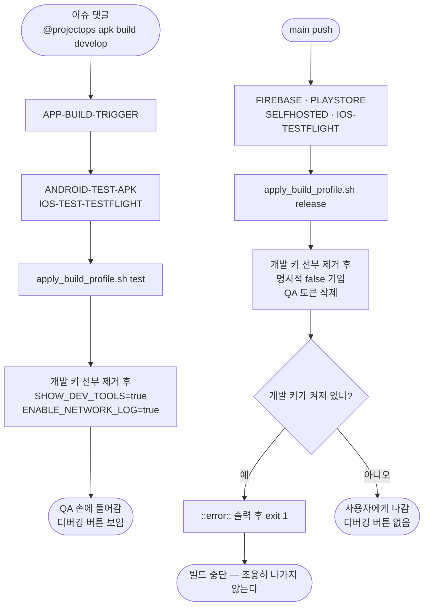

# CI/CD 전체 정리 — 빌드 프로파일로 테스트·배포 빌드를 가른다

## 개요

개발 키(디버깅 버튼·네트워크 로그 등)를 켜고 끄는 `sed`가 **워크플로 6개에 10곳** 흩어져
있었다. 키가 하나 늘면 여섯 군데를 고쳐야 하고, 한 군데만 빠뜨려도 조용히 새어 나간다.
실제로 `ELUM_ENABLE_NETWORK_LOG`가 그랬다 — 테스트 빌드가 디버깅 버튼은 켜고 네트워크
로그는 꺼 두어서, QA가 도구를 열어도 백엔드가 무슨 값을 보냈는지 볼 수 없었다.

이제 `client/tool/apply_build_profile.sh` **한 곳**에서만 정한다. 그리고 배포 빌드는 끄고
끝내는 것이 아니라 **끈 것을 확인하고, 하나라도 켜져 있으면 빌드를 세운다.**

함께, 빌드 워크플로 6개에 `permissions:` 블록이 없어 **테스트 빌드가 아예 실패하던 문제**를
고쳤다 (아래 §권한 참조).

## 기능 흐름



## 변경 사항

### 새 파일

- `client/tool/apply_build_profile.sh` (124줄): 빌드 종류에 맞게 `.env`의 개발 키를 맞추는
  유일한 진입점. `test` / `release` 두 모드.

### 워크플로 6개 — sed 10곳을 스크립트 호출로 교체

| 파일 | 프로파일 | 스텝 수 |
| --- | --- | :-: |
| `PROJECT-FLUTTER-ANDROID-TEST-APK.yaml` | `test` | 1 |
| `PROJECT-FLUTTER-IOS-TEST-TESTFLIGHT.yaml` | `test` | 2 |
| `PROJECT-FLUTTER-ANDROID-FIREBASE-CICD.yaml` | `release` | 2 |
| `PROJECT-FLUTTER-ANDROID-PLAYSTORE-CICD.yaml` | `release` | 2 |
| `PROJECT-FLUTTER-ANDROID-SELFHOSTED-CICD.yaml` | `release` | 1 |
| `PROJECT-FLUTTER-IOS-TESTFLIGHT.yaml` | `release` | 2 |

잡이 여러 개인 워크플로가 2곳인 이유는 **`.env`가 잡 경계를 넘지 못하기 때문**이다.
잡마다 `.env`를 새로 만들므로 프로파일도 잡마다 적용해야 한다.

### 문서

- `client/CLAUDE.md`: "해커톤 기간 한정 — 개발자 도구 강제 활성화" 섹션을 상시 정책인
  **빌드 프로파일** 표로 교체하고, 아래 §결정 사항을 기록했다.

## 주요 구현 내용

### 대상 키 6개 — 전부 `.env`의 문자열 스위치다 (시크릿 아님)

```
ELUM_SHOW_DEV_TOOLS       디버깅 버튼 (토큰·PIN을 평문으로 보여준다)
ELUM_ENABLE_NETWORK_LOG   요청·응답 본문을 로그에 남긴다
ELUM_SKIP_ONBOARDING      온보딩 건너뛰기 (PIN 미설정 상태가 된다)
ELUM_USE_MOCK             서버 대신 가짜 데이터
ELUM_DEV_ACCESS_TOKEN     QA 세션 주입용 (기본 비어 있음)
ELUM_DEV_REFRESH_TOKEN    QA 세션 주입용 (기본 비어 있음)
```

스크립트에는 **키 이름만** 있고 값은 하나도 없다. 값은 Secret에서 만들어진 `.env`에 있다.

### 모드별 동작

**`test`** — 개발 키를 전부 지운 뒤 `ELUM_SHOW_DEV_TOOLS=true`와
`ELUM_ENABLE_NETWORK_LOG=true` 둘만 다시 쓴다.

- `ELUM_USE_MOCK`은 켜지 않는다 — QA는 진짜 서버 응답을 봐야 한다.
- QA 토큰은 넣지 않는다 — 사람마다 다르므로 CI가 정할 수 없다.

**`release`** — 개발 키를 전부 지운 뒤 4개에 **명시적으로 `false`를 쓴다.** 지우기만 하면
`AppConfig`의 기본값을 타게 되어, 나중에 기본값이 바뀌면 의도와 다르게 동작한다.
QA 토큰은 삭제한다. 그 뒤 검사에서 하나라도 `=true`거나 토큰이 남아 있으면
`::error::`를 출력하고 `exit 1` 한다.

### 권한 — 테스트 빌드가 실패하던 원인

빌드를 실제로 돌려보니 **`진행 상황 댓글 생성` 스텝에서 죽었다.** 빌드 프로파일 스텝은
시작도 못 했다.

```
RequestError [HttpError]: Resource not accessible by integration
```

레포의 기본 워크플로 토큰 권한이 `read`인데(`default_workflow_permissions: "read"`),
빌드 워크플로 6개에 `permissions:` 블록이 **아예 없었다.** 트리거 워크플로에만 있어서
트리거까지는 성공하고, 정작 빌드가 댓글을 다는 순간 막혔다.

| 워크플로 | 전 | 후 |
| --- | --- | --- |
| `ANDROID-TEST-APK` · `IOS-TEST-TESTFLIGHT` | 없음 (읽기 전용) | `contents: read` · `issues: write` · `pull-requests: write` |
| 배포 4개 | 없음 | `contents: read` (명시) |

배포 4개는 지금도 읽기 전용이라 동작에 변화가 없지만, 기본값이 나중에 `write`로 바뀌어도
배포 빌드가 필요 이상의 권한을 갖지 않도록 함께 명시했다.

**이 워크플로들은 projectops 템플릿에서 온 것이라 같은 문제가 원본에도 있다.**
템플릿 전수 조사에서 `ANDROID-TEST-APK`(댓글 8곳) · `IOS-TEST-TESTFLIGHT`(8곳) ·
`QA-ISSUE-CREATION-BOT`(3곳, 루트·common 양쪽)이 같은 상태였다.
버그 이슈로 올렸다 — Cassiiopeia/projectops#595.

### `repository_dispatch`는 기본 브랜치의 워크플로로 돈다 ⚠️

권한을 고쳐 `develop`에 올리고 빌드를 다시 걸었는데 **똑같이 실패했다.**
`repository_dispatch` 이벤트는 워크플로 정의를 **기본 브랜치(`main`)에서** 읽기 때문이다.
`develop`에만 있는 수정은 반영되지 않는다.

```
develop:  permissions 있음  ← 내가 고친 곳
main:     permissions 없음  ← 실제로 도는 정의
```

따라서 **이 수정은 `main`에 머지된 뒤에야 효력이 생긴다.** 테스트 빌드 재검증도 그 다음이다.
빌드 워크플로를 고쳤을 때 "develop에서 안 먹네"라고 당황하지 않으려면 알아 둬야 한다.

## 결정 사항 — 출시 때도 `lib/core/dev/`를 지우지 않는다

이슈 본문의 "🔴 확인이 필요한 것"에 대한 답이다. 처음에는 출시 전에 폴더를 통째로 지우는
편을 권했으나, **지우지 않기로 했다.**

- 코드는 바이너리에 남지만 `showDevTools=false`라 **실행 경로가 없다.**
- 토큰·PIN을 노출하는 통로인 QA 토큰은 `release` 프로파일이 `.env`에서 지운다.
- 폴더 삭제를 자동화하면 `app.dart`의 오버레이 한 줄까지 빌드 중에 손대야 해
  **얻는 것보다 깨질 위험이 크다.**

**지키는 선은 코드가 아니라 값이다.** 이 판단을 `client/CLAUDE.md`에 남겼다.

## 검증

**로컬 실측 — 두 모드 통과**

- `test`: QA 토큰이 지워지고 개발 도구·네트워크 로그가 켜졌다.
- `release`: 개발 키 4개가 `false`가 되고 QA 토큰이 지워진 뒤 검증을 통과했다.
- 일부러 `ELUM_SHOW_DEV_TOOLS=true`를 남긴 채 `release`를 돌리면 `exit 1`로 빌드가 선다.

**러너 실측**

- **1차** — `진행 상황 댓글 생성`에서 실패. 원인은 `permissions:` 블록 부재
- **2차** — `develop`에 권한을 넣고 재실행했으나 **같은 자리에서 실패.**
  `repository_dispatch`가 `main`의 워크플로를 읽기 때문 (위 참조)
- **3차** — `main` 머지 후 재실행하여 `test` 프로파일 로그와 디버깅 버튼 노출을 확인한다
- `release` 프로파일은 같은 머지로 도는 배포 빌드 로그에서 확인한다

## 주의사항

- **개발 키가 새로 생기면 `DEV_KEYS` 배열 한 줄만 고친다.** 워크플로에 `sed`를 다시
  흩뿌리면 이번에 없앤 문제가 그대로 돌아온다.
- **`sed -i`를 쓰지 않는다.** GNU sed(`-i`)와 BSD sed(`-i ''`)의 문법이 갈려 Linux 러너와
  macOS 러너에서 동작이 달라진다. projectops #523에서 **macOS가 종료 코드 0으로 조용히
  통과하며 입력을 그대로 흘려보낸** 사고가 있었다 — 안전망이 켜져 있다고 믿는 상태에서
  실제로는 꺼져 있었다. `grep -Ev`로 걸러 `mv` 하는 방식은 양쪽에서 똑같이 동작한다.
- **스크립트는 `${{ github.workspace }}/client/tool/...` 절대경로로 부른다.** 이 워크플로들은
  `defaults.run.working-directory`가 `APP_ROOT`(=`client`)라, 상대경로로 쓰면
  `client/client/tool/`을 찾아 실패한다. 실제로 한 번 밟았다.
- **이 레포는 이슈별 브랜치를 따지 않고 `develop`에서 개발한다.** 따라서 테스트 빌드는
  `@projectops apk build develop`처럼 **브랜치를 명시**해야 한다. 생략하면 이슈 안내 댓글의
  브랜치를 찾는데 그 브랜치가 없어 실패한다.
- **빌드 워크플로(`repository_dispatch`) 수정은 `main`에 올라가야 효력이 생긴다.**
  `develop`에서 아무리 고쳐도 테스트 빌드는 옛 정의로 돈다.
- 워크플로를 일괄 치환으로 고치려다 정규식이 릴리스 워크플로 4개를 놓치고, iOS 테스트
  워크플로에서는 필요한 2곳 중 1곳만 넣은 일이 있었다. **기존 스텝 이름을 정확히 앵커로
  삼아** 잡 단위로 확인하는 편이 안전하다.
