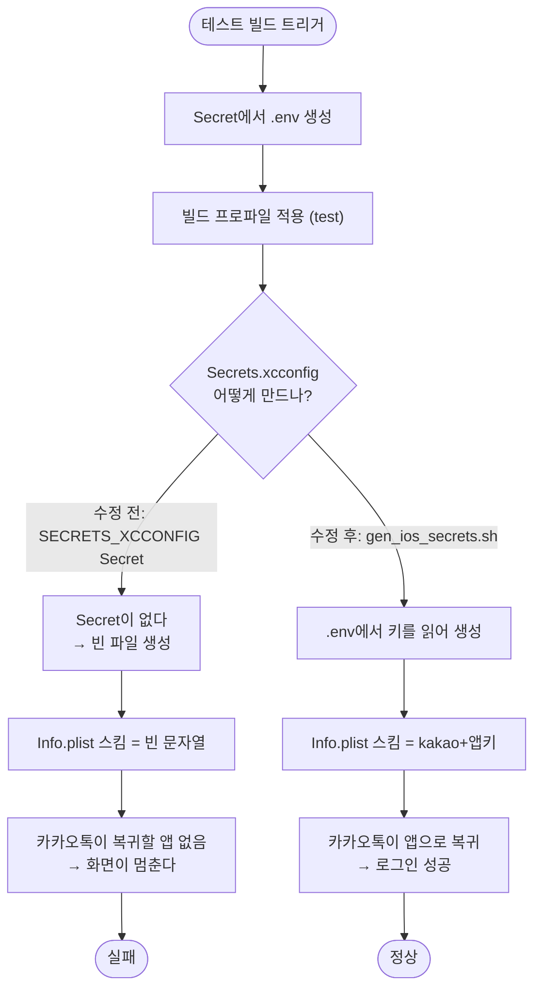

# iOS 테스트 빌드에 소셜 로그인 URL 스킴이 비어 카카오·네이버·구글이 동작하지 않는다

## 개요

iOS 테스트 TestFlight 빌드에서 카카오를 누르면 카카오톡이 열리고 그대로 멈췄다.
앱으로 돌아와도 버튼은 `연결하고 있어요` 상태로 풀리지 않았다.

원인은 앱 코드가 아니라 CI였다. 테스트 빌드 워크플로가 `ios/Flutter/Secrets.xcconfig`를
**빈 파일로** 만들어, `Info.plist`의 URL 스킴이 전부 빈 문자열로 치환된 채 빌드됐다.
카카오톡은 `kakao{네이티브앱키}://oauth`로 돌려보낼 앱을 찾지 못하고, 앱 쪽
`loginWithKakaoTalk()`의 Future는 완료되지 않는다.

배포용 워크플로에는 `gen_ios_secrets.sh` 호출 스텝이 있지만 **테스트용에는 없었다.**
그 스텝은 소셜 로그인 도입 커밋 `0d13e7a`에서 배포용에만 추가됐다.

## 기능 흐름



## 변경 사항

### CI 워크플로

- `.github/workflows/PROJECT-FLUTTER-IOS-TEST-TESTFLIGHT.yaml`
  - `prepare-test-build` 잡: 빈 파일을 만들던 `Create Secrets.xcconfig file` 스텝을
    `Generate iOS social login secrets`(`bash tool/gen_ios_secrets.sh`)로 교체
  - `build-ios-test` 잡: 같은 스텝을 추가. 아티팩트로 받은 파일에 의존하지 않고
    **실제 빌드가 도는 러너에서 다시 만든다**

두 스텝 모두 생성 직후 카카오 스킴의 **길이만** 찍고, 비어 있으면 `::warning::`을 남긴다.
키 값 자체는 로그에 남기지 않는다.

## 주요 구현 내용

### 값의 단일 출처를 `.env` 하나로 못박았다

projectops 템플릿 원형은 `secrets.SECRETS_XCCONFIG`라는 별도 Secret을 읽는다.
그 Secret은 이 레포에 존재하지 않고(Actions Secret 24개 중 없음), 없으면 빈 파일을
만들고 조용히 넘어간다.

`.env`(`CLIENT_ENV_FILE`)는 안드로이드 빌드도 같은 키를 읽는 단일 출처다.
소셜 로그인 키를 두 곳에 두면 한쪽만 갱신돼 어긋난다. `gen_ios_secrets.sh`가
`.env`를 읽어 xcconfig를 만들게 해 출처를 하나로 맞췄다.

### 빌드 잡에서도 다시 만든다

배포용 워크플로와 같은 구조다. 준비 잡이 만든 것을 아티팩트로 받지만,
아티팩트 목록에서 한 줄이 빠지는 것만으로 로그인이 통째로 죽기 때문에
**실제로 빌드에 쓰이는 러너에서 다시 생성한다.**

### 검증

| 항목 | 결과 |
|---|---|
| YAML 파싱 | 통과. 두 잡에 스텝이 들어간 것 확인 |
| `gen_ios_secrets.sh` 로컬 실행 | 기존 파일과 **바이트 동일** 재생성 (카카오 스킴 37자) |
| 스텝 셸 로직 (정상 케이스) | 경고 없음 |
| 스텝 셸 로직 (키 없는 케이스) | 스킴이 `kakao`뿐 → 경고 발동 |

원인 확정에 쓴 증거는 실행 `35339171668`(2026-09-18 20:20 KST) 로그다.

```
SECRETS_XCCONFIG_CONTENT:
ℹ️ Empty Secrets.xcconfig created (no secrets provided)
```

## 주의사항

### ⚠️ 이 수정은 `main`에 머지돼야 테스트 빌드에 적용된다

테스트 빌드는 이슈 댓글(`@projectops app build`)이 `repository_dispatch`로 띄운다.
**`repository_dispatch`는 언제나 기본 브랜치(`main`)의 워크플로 파일로 실행된다.**
워크플로가 `git pull origin <branch_name>`으로 앱 코드는 지정 브랜치 것을 가져오지만,
**실행되는 스텝 정의는 `main`의 것이다.**

따라서 `develop`에 올린 이 수정은 `main`에 들어가기 전까지 테스트 빌드에 반영되지 않는다.
일회성으로 확인하려면 Actions UI에서 `workflow_dispatch`로 `develop`을 지정해 실행한다.

### CI `.env`에 카카오 키가 있는지는 별도 확인이 필요하다

GitHub은 Secret 값을 돌려주지 않으므로 `CLIENT_ENV_FILE`에
`ELUM_KAKAO_NATIVE_APP_KEY`가 실제로 들어 있는지 여기서 확인할 수 없다.

안드로이드도 같은 키를 읽으므로(`client/android/app/build.gradle.kts` —
`manifestPlaceholders["kakaoScheme"] = "kakao" + env("ELUM_KAKAO_NATIVE_APP_KEY")`),
**안드로이드 테스트 APK에서 카카오 로그인이 되면 CI 키는 정상**이다.
다음 iOS 테스트 빌드 로그의 `카카오 스킴 NN자` 출력으로도 확인된다.

### 남은 개선점 (이번 범위 밖)

- **빌드를 세우는 가드가 없다.** 지금은 스킴이 비어도 `::warning::`만 남기고 통과한다.
  빈 값이 조용히 통과한 것이 이 사고의 본질이므로 `exit 1`까지 갈 여지가 있다.
- **앱의 소셜 로그인에 타임아웃이 없다.** `client/lib/features/auth/presentation/login_screen.dart`의
  `_signIn()`은 SDK 응답을 무한정 기다린다. 콜백이 오지 않으면 버튼이 `연결하고 있어요`로
  잠긴 채 풀리지 않고, 로그도 남지 않아 원인 추적이 불가능하다.
  에러 코드 노출·빈 화면 금지 규칙에 어긋나므로 별도 이슈로 다룰 값어치가 있다.
- **템플릿 업데이트로 스텝이 다시 사라질 수 있다.** 배포용 워크플로와 같은 경고 주석을
  달아 뒀지만 구조적 보호는 아니다.
