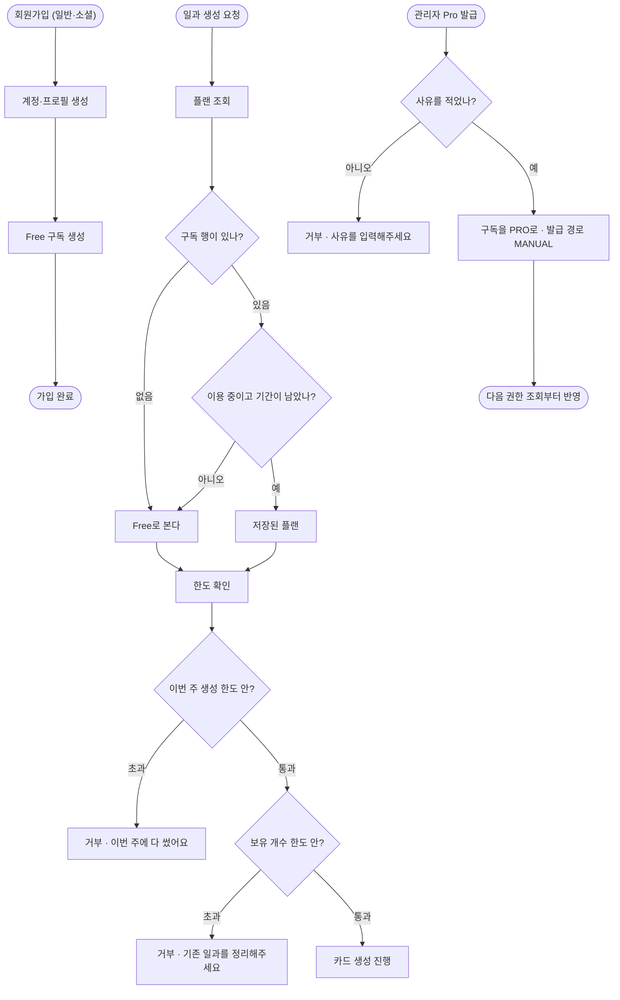

# 보호자 계정과 당사자 프로필 분리 및 라이선스 구조

## 개요

Free/Pro 요금제의 바탕을 서버에 넣었다. 가격과 한도 숫자는 아직 정해지지 않았는데, **정책이 정해졌을 때 코드를 갈아엎지 않으려면 정책이 코드가 아니라 데이터여야 했다.** 그래서 구독 상태만 새 표로 두고, 무엇이 Free고 무엇이 Pro인지는 시스템 설정 값으로 뺐다. 관리자 화면에서 숫자만 바꾸면 되고 배포가 필요 없다.

한도는 전부 무제한으로 시딩해 **지금 동작이 이전과 똑같다.** 구조만 먼저 들어간 상태이며, 실측 원가가 나온 뒤 숫자를 채운다.

## 기능 흐름



## 변경 사항

### 구독 도메인 (신규)

- `license/core/PlanType` · `SubscriptionStatus` · `SubscriptionSource`: 요금제·상태·발급 경로
- `license/core/Entitlement`: 권한 6종. 켜짐꺼짐 2개(AI 맞춤 삽화·광고 제거)와 수치 한도 4개(주당 생성·보유 개수·이룸이 명수·기록 보관). 각 권한이 플랜별 설정 키를 들고 있다
- `license/infrastructure/entity/Subscription`: 계정 1:1. 플랜·상태·기간·발급 경로·외부 식별자·사유
- `license/application/service/EntitlementService`: 권한을 묻는 **단 하나의 통로**
- `license/application/service/SystemConfigEntitlementService`: 설정 값에서 한도를 읽는 구현
- `license/application/service/SubscriptionService`: 가입 시 Free 생성, 관리자 발급·회수

### 권한 확인 지점

- `routine/application/service/RoutineQuotaGuard`: 일과 생성 길목에서 주간 생성 횟수와 보유 개수를 본다. 쿨다운 가드 옆에 선다
- `routine/application/service/RoutineService`: 생성 진입부에 가드 연결
- `ai/infrastructure/repository/AiCallLogRepository`: 기간별 성공 호출 건수 조회 추가

### 설정

- `systemconfig/core/ConfigValueType`: `BOOLEAN` 추가
- `systemconfig/core/ConfigGroup`: 플랜 그룹 2개 추가
- `systemconfig/core/ConfigKey`: 플랜 키 12개(FREE_/PRO_ 쌍)
- `systemconfig/application/service/SystemConfigService`: `getBoolean`과 불리언 검증

### 가입·응답·관리자

- `auth/application/service/AuthService` · `OAuthLoginService`: 두 가입 경로 모두 Free 구독 생성
- `member/application/dto/response/MemberResponse`: 권한 스냅샷을 함께 내려보낸다
- `member/application/service/MemberService`: 탈퇴 시 구독 정리
- `admin/.../AdminSubscriptionSummary` · `AdminMemberDetailResponse` · `AdminMemberService` · `AdminMemberController`: 요금제 조회와 Pro 발급·회수
- `templates/admin/member-detail.html`: 요금제 칸, 발급 폼, 실패 안내

### 마이그레이션

- `db/migration/V18__create_subscription.sql`: 표 생성 + 기존 계정 Free 백필. 기존 표를 건드리지 않고 행만 넣으며, 이미 있으면 건너뛰어 다시 돌려도 안전하다

### 테스트

`SubscriptionTest` · `SystemConfigEntitlementServiceTest` · `RoutineQuotaGuardTest` · `ReadOnlyTransactionWriteTest` · `WithdrawCoversMemberReferencesTest`

## 주요 구현 내용

### 정책을 데이터로 뺐다

권한마다 플랜별 설정 키를 물려 두어, **무엇이 Free고 무엇이 Pro인지가 코드에 없다.** 플랜이 셋 이상 되거나 기관별 커스텀 한도가 필요해지면 `EntitlementService` 구현만 테이블 기반으로 갈아끼운다. 부르는 쪽은 한 줄도 바뀌지 않는다.

### 구독은 계정에 붙였다

이룸이가 아니라 계정에 붙인다. 돈을 내는 쪽이 보호자이고 당사자는 로그인하지 않으며, 인앱결제도 스토어 계정에 묶이지 프로필에 묶이지 않는다. 기관이 여러 이룸이를 지원하는 경우는 별도 구독이 아니라 **이룸이 명수 권한**으로 표현된다.

### 사용량은 새 표 없이 센다

원래 구상은 구독 행에 `used` 컬럼을 두고 증가시키는 것이었다. 그러면 **실제 호출과 어긋날 수 있다** — 호출은 성공했는데 카운터 증가가 실패하면 그 뒤로 숫자가 영영 틀어지고 어느 쪽이 맞는지 알 방법이 없다.

AI 호출 기록에 이미 `member_id + created_at` 인덱스가 "회원별 사용량 집계" 목적으로 깔려 있어 그것을 진실의 출처로 썼다. 기간 리셋 배치도 필요 없다.

**일과 표를 세지 않은 이유**는 따로 있다. 일과를 지우면 행이 사라져 *만들고 지우고 다시 만들기*로 우회된다. AI 비용은 만드는 순간 나가고 지워도 돌아오지 않는다.

### 만료는 조회 시점에 계산한다

상태를 바꿔주는 배치가 없다. 기간이 지난 구독은 읽는 순간 Free로 떨어진다.

### 결제를 붙일 자리만 남겼다

앱 스토어 심사 전이라 인앱결제를 쓸 수 없다. 구독이 **어떻게** 생겼는지 기록하는 자리(발급 경로·외부 식별자)만 두었다. 영수증 검증이 생기면 그 서비스가 같은 표에 쓰면 되고, 권한을 묻는 코드는 바뀌지 않는다.

지금은 관리자 수동 발급이 Pro를 만드는 유일한 경로다. 발급할 때 **사유를 필수로 받는다** — 나중에 "이 계정은 왜 Pro지"에 답해야 한다.

## 실측 검증

운영 서버에서 직접 밟았다.

| 확인 | 결과 |
| --- | --- |
| 백필 | 회원 78 / 구독 78 / 구독 없는 회원 **0**, 전부 `FREE·ACTIVE·SIGNUP` |
| 권한 응답 | `plan=FREE`, `aiImageGeneration=true`, 수치 한도 전부 `-1` |
| Pro 발급 | DB에 `PRO·MANUAL·만료일·사유` 반영 |
| Pro 회수 | `FREE` 복귀 |
| 만료 경계 | 기간이 지난 구독은 화면에 "기간 지남" 배지 |
| 탈퇴 | `204`와 함께 구독·프로필 동시 삭제, 고아 구독 **0** |

## 구현상의 함정

### 1. 읽기 전용 트랜잭션에서 저장이 조용히 사라졌다

관리자 회원 서비스는 클래스 전체가 `@Transactional(readOnly = true)`인데, 새로 더한 발급·회수 메서드에 `@Transactional`을 붙이지 않아 그 트랜잭션에 참여했다. Hibernate가 flush를 건너뛰어 **저장이 사라지는데 예외가 나지 않는다.**

화면은 302 성공 리다이렉트를 내고, 서버 로그는 `관리자가 Pro를 발급했습니다`까지 남기는데 **DB만 그대로였다.** 컴파일도 단위 테스트도 전부 통과한 채 배포됐고, DB를 직접 대조하고서야 드러났다.

같은 실수를 잡는 `ReadOnlyTransactionWriteTest`를 더했다. 어노테이션을 일부러 떼어 실패하는 것까지 확인했다.

### 2. 구독 표가 회원을 참조해 탈퇴가 통째로 깨졌다

V18에서 표를 만들면서 탈퇴 로직에 정리 코드를 넣지 않았다. 계정을 지우려 할 때마다 외래키 제약에 걸려 500이 났다.

```
ERROR: update or delete on table "member" violates foreign key constraint
       "subscription_member_id_fkey" on table "subscription"
```

**한 기능이 덜 되는 정도가 아니라 사용자가 계정을 지울 수 없는 상태였다.** "가입할 때 만들어지는 것은 탈퇴할 때 정리되는가"를 확인하지 않은 탓이다.

회원을 참조하는 표가 탈퇴에서 모두 정리되는지 검사하는 `WithdrawCoversMemberReferencesTest`를 더했다. 앞으로 회원을 참조하는 표가 늘 때마다 같은 일이 나기 때문이다.

### 3. 권한을 물을 때마다 구독을 다시 조회했다

한도 확인이 내부에서 플랜 조회를 부르는 구조라, 일과 생성 한 번에 한도를 두 번 확인하면서 구독 조회도 두 번 나갔다. 권한이 늘면 그만큼 더 늘어난다. 플랜을 받는 오버로드를 열어 부르는 쪽이 한 번 구한 값을 나눠 쓰게 고쳤다.

## 주의사항

- **`FREE_AI_IMAGE_GENERATION`을 false로 내리려면 픽토그램(#247)이 먼저 있어야 한다.** 지금 끄면 Free 카드에 그림이 사라지고, 타겟이 *"행동 카드의 시각정보와 순서를 이해할 수 있는 발달장애인"*이라 그 상태로는 서비스가 작동하지 않는다.
- 구독 행이 없어도 코드는 Free로 본다. 백필이 실패해도 권한 판정은 안전하지만 관리자 화면에서 구독 상태가 비어 보인다.
- **사용량 집계가 실패하면 막지 않고 통과시킨다.** 우리 DB 문제로 사용자가 앱을 못 쓰는 쪽이 한도를 조금 못 세는 쪽보다 나쁘다는 판단이다.
- 만료된 Pro가 화면에 "프로"로 표시되고 "기간 지남" 배지로만 구분된다. 권한 계산은 이미 Free인데 헷갈릴 수 있다.
- 한도 숫자는 이미지 제공자 교체(#246)로 실측 원가가 나온 뒤에 채운다. 제공자에 따라 원가가 8배 달라져 지금 정하면 두 번 일한다.
