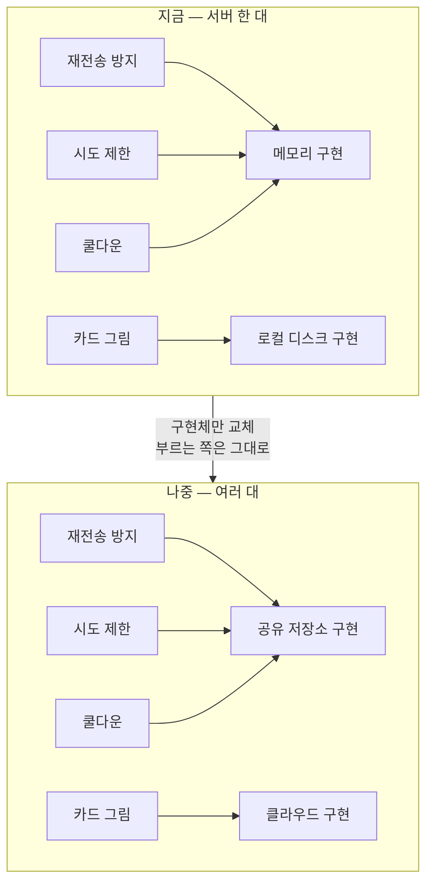
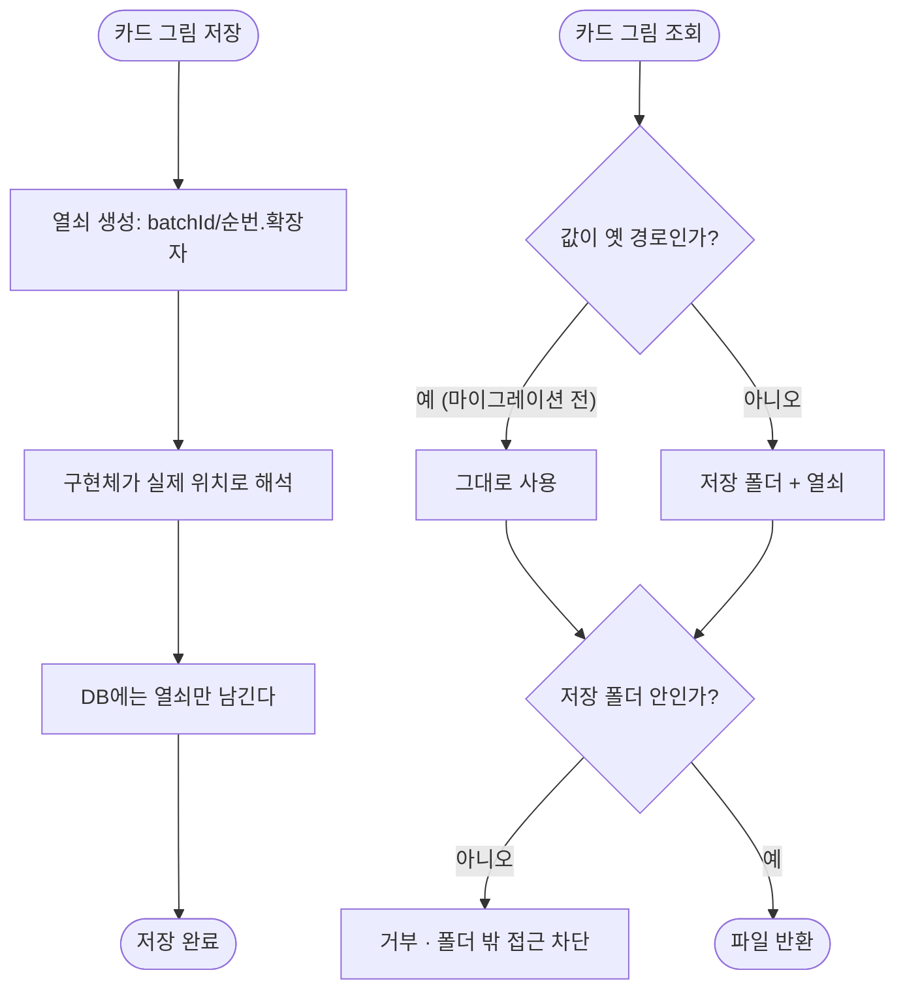

# 서버를 여러 대로 늘려도 깨지지 않게 저장 지점을 가른다

## 개요

해커톤 전제(서버 한 대)로 짜인 자리를 인터페이스 뒤로 모았다. **지금 인프라를 늘리지 않는다** — 수평 확장 여부가 아직 정해지지 않았기 때문이다. 자리만 만들고 구현은 지금 방식 그대로 두어, 나중에 정해지면 **구현체만 갈아끼우고 설정값 한 줄을 바꾸면** 된다.

동작은 이전과 완전히 같다. 기존 테스트가 그것을 증명한다.

## 기능 흐름





## 변경 사항

### 공유 상태 저장소 (신규)

- `common/infrastructure/store/SharedStateStore`: 여러 서버가 함께 봐야 하는 짧은 수명의 상태. 연산은 둘뿐이다 — **"처음인가"**(재전송 방지·쿨다운)와 **"몇 번째인가"**(시도 제한)
- `common/infrastructure/store/InMemorySharedStateStore`: 서버 한 대를 전제한 구현. 설정값으로 선택된다

### 저장 자리를 옮긴 것들

- `common/infrastructure/security/NonceStore`: 재전송 방지
- `link/application/service/RedeemRateLimiter`: 연결 암호 시도 제한
- `routine/infrastructure/guard/RoutineRequestCooldownGuard`: 일과 생성 쿨다운

세 클래스 모두 **로직은 그대로 두고 저장만 위임**했다. 공개 시그니처를 유지해 기존 테스트가 동작 보존을 증명한다.

### 그림 저장소

- `routine/infrastructure/storage/RoutineImageStorage`: 인터페이스로 전환. 저장 결과로 경로가 아니라 **열쇠**를 돌려준다
- `routine/infrastructure/storage/LocalFileRoutineImageStorage`: 로컬 디스크 구현. 설정값으로 선택된다

### 마이그레이션

- `db/migration/V19__store_routine_image_key_instead_of_path.sql`: 저장된 경로에서 열쇠만 남긴다

### 테스트

`InMemorySharedStateStoreTest` · `RoutineImageStorageTest`(확장) · `BeanConstructorAmbiguityTest`

## 주요 구현 내용

### 무엇이 깨지는지부터 전수 조사했다

추측하지 않고 코드를 훑어 인메모리 상태·로컬 파일·비동기 처리를 전부 찾았다.

| 자리 | 여러 대가 되면 |
| --- | --- |
| 카드 그림 (로컬 디스크) | A가 저장한 그림을 B가 못 읽어 **조회의 절반이 실패** |
| 재전송 방지 (메모리) | 같은 요청을 **서버 수만큼 재생** 가능 |
| 연결 암호 시도 제한 (메모리) | 분당 10회가 **분당 10 × 서버 수** |
| 일과 생성 쿨다운 (메모리) | 쿨다운이 **서버 수만큼 뚫림** |

뒤의 두 곳은 **코드 주석이 이미 경고하고 있었다** — *"여러 대로 늘리면 공유 저장소로 옮겨야 한다"*.

> 주간 생성 한도는 DB 집계라 여러 대에서도 정상 동작한다. 손댈 필요가 없었다.

### 저장 자리를 하나로 합쳤다

재전송 방지·시도 제한·쿨다운은 모두 "짧은 시간 동안 뭔가를 기억한다"는 같은 일을 한다. 그래서 저장 자리를 하나로 모았다. **나중에 공유 저장소 구현체 하나만 만들면 셋이 한꺼번에 해결된다.** 각각 따로 고치면 세 번 일한다.

경계 규칙도 인터페이스에 적어 두었다 — 정확히 기간만큼 지난 시점은 "지난 것"으로 본다. 다른 구현체를 만들 때 여기에 맞추면 동작이 어긋나지 않는다.

### 경로가 아니라 열쇠를 저장한다

지금까지는 저장 경로가 통째로 DB에 들어 있었다.

```
data/routine-images/{batchId}/1.png    ← 저장소가 바뀌면 죽는 값
{batchId}/1.png                        ← 어디에 두든 그대로 유효
```

경로를 담아두면 그림 두는 곳을 옮기는 순간 **과거 카드의 그림이 통째로 사라진다.** 열쇠만 두면 파일을 옮기고 구현체를 갈아끼우는 것으로 끝난다.

마이그레이션은 **마지막 두 조각만 남긴다.** 저장 폴더 설정이 환경마다 다르고 절대 경로일 수도 있어, 특정 접두사를 지우는 방식으로는 환경에 따라 빗나간다. 이미 열쇠 형태인 행은 조건에 걸리지 않아 **다시 돌려도 안전하다.**

마이그레이션이 늦거나 일부가 남아도 **옛 경로가 계속 읽히도록** 함께 받는다. 그 김에 저장 폴더 밖을 가리키는 값도 막았다.

### 구현체는 설정으로 고른다

인터페이스만 갈라두면 나중에 구현체를 더할 때 **같은 자리에 등록되는 것이 둘이 되어 서버가 아예 뜨지 않는다.** 설정값으로 하나만 켜지게 해 두었고, 값이 없으면 지금 방식이 그대로 쓰인다.

```
elum.store.shared-state: memory    → 나중에 redis 등
elum.store.routine-image: local    → 나중에 클라우드
```

## 실측 검증

| 확인 | 결과 |
| --- | --- |
| 마이그레이션 | `v19` 적용 성공 |
| 열쇠 전환 | `image_path` **394건 전부 열쇠 형태**, 옛 경로 0건 |
| 실제 조회 | 관리자 화면에서 이미지 **HTTP 200, 747KB PNG 1184×864** |
| 동작 보존 | 기존 테스트(분당 10회 제한·재전송 차단·쿨다운) 그대로 통과 |

## 구현상의 함정

### 서버가 아예 뜨지 않았다

쿨다운 가드를 저장소 위로 옮기면서 **인자 없는 생성자가 사라졌다.** 생성자가 둘 다 인자를 받게 되자 스프링이 어느 것으로 만들지 정하지 못했다.

```
Failed to instantiate RoutineRequestCooldownGuard: No default constructor found
  → routineService → routineController → Application run failed
```

컨트롤러 하나가 아니라 **애플리케이션 전체가 뜨지 않았다.** 컴파일도 단위 테스트 255건도 전부 통과한 뒤였고, 배포하고 로그를 보고서야 알았다.

`BeanConstructorAmbiguityTest`를 더했다. 스프링 컨텍스트를 띄우지 않고 클래스만 훑으므로 빠르고, 이 저장소의 "단위 테스트만" 규칙에도 어긋나지 않는다. 지정을 일부러 떼어 실패하는 것까지 확인했다.

### 창 경계가 만료 경계와 어긋나 있었다

두 연산이 같은 저장소에 있는데 경계 판정이 달랐다. 정확히 기간만큼 지난 시점을 한쪽은 "지난 것"으로, 다른 쪽은 "아직 안 지난 것"으로 봤다. 1밀리초 차이라 실질 영향은 없지만, **다른 구현체를 만들 때 어긋나면 찾기 어렵다.** 맞추고 인터페이스 주석에 규칙을 적었다.

## 주의사항

- **구현체를 바꾸는 것만으로는 부족하다.** 이미 디스크에 있는 그림을 새 저장소로 옮기는 일이 남는다. DB 값은 열쇠라 그대로 쓸 수 있으니 파일만 옮기면 된다.
- 이번에 하지 않은 것이 셋 있다. **그림 작업 유실 방지**(서버가 내려가면 진행 중이던 그림 작업이 사라진다 — 작업 큐가 필요해 범위가 크다), **관리자 로그 통합**(접속한 서버 것만 보인다), **한도 검사 경쟁 조건**(동시 요청이 둘 다 통과할 수 있다 — 공유 저장소가 들어오면 함께 푼다).
- 로컬 디스크 구현은 **서버가 한 대일 때만 온전히 동작한다.** 여러 대로 늘리는 순간 조회의 상당수가 실패하므로, 그때는 반드시 공유 저장소 구현체를 먼저 넣어야 한다.
