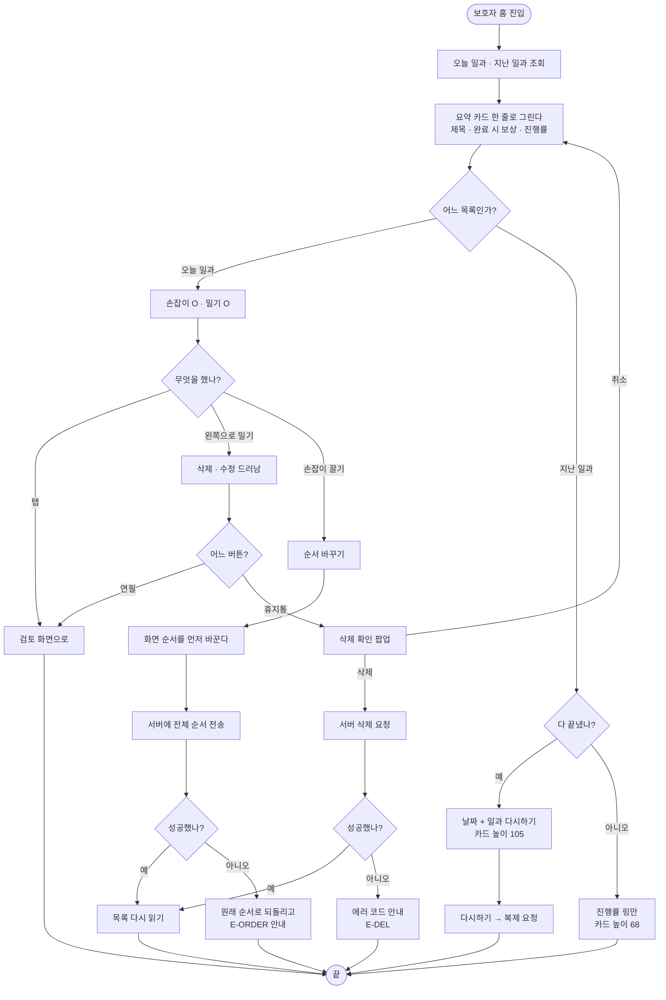

# 일과 목록 개편 — 지난 일과·순서 바꾸기·밀어서 지우기

## 개요

보호자 홈의 일과 목록을 새 시안(`931:3896` 기본 · `931:4179` 밀림 · `931:4879` 삭제 확인 · `217:2655` 빈 상태)에 맞춰 다시 짰다. **화면 하나를 고친 것이 아니라 목록의 성격이 바뀐 작업이다** — 추천 일과가 빠지고 지난 일과가 들어왔으며, 탭해서 펼치던 동작이 사라지고 밀어서 삭제·수정하고 손잡이로 순서를 바꾸는 동작이 새로 생겼다. 순서를 저장할 자리가 없어 서버를 먼저 열었고, 커밋이 서버(`64f3617`)와 클라이언트(`5ae7955`) 둘로 나뉘었다.

## 기능 흐름



## 변경 사항

### 서버 (`64f3617`)

- `routine/infrastructure/entity/Routine.java`: `displayOrder` 추가
- `routine/infrastructure/repository/RoutineRepository.java`: `findTodayOrdered()` · `maxDisplayOrder()`
- `routine/application/service/RoutineService.java`: `reorder()` 추가, 새 일과는 목록 끝으로
- `routine/application/controller/RoutineController.java`: `PATCH /api/routines/order`
- `routine/application/dto/request/RoutineReorderRequest.java`: 신규
- `db/migration/V20__add_routine_display_order.sql`: 컬럼 추가 + 예정 시각 순 백필

### 클라이언트 — 새 위젯 (`5ae7955`)

- `widgets/routine_summary_tile.dart`: 요약 카드 · 순서 손잡이 · 섹션 제목
- `widgets/routine_swipe_actions.dart`: 밀어서 삭제·수정
- `widgets/create_routine_button.dart`: 알약 모양 만들기 버튼

### 클라이언트 — 재작성

- `widgets/today_routine_section.dart`: `TodayRoutineSection`(밀기·순서) + `PastRoutineSection`(날짜·다시하기)으로 전면 교체
- `guardian_home_screen.dart`: 두 칸 구성으로 재조립, 헤더에서 배지와 설정 순서 교체

### 클라이언트 — 연결부

- `shared/models/routine.dart`: `scheduledAt` 파싱 + `scheduledDateLabel`
- `data/routine_repository.dart`: `reorder()` · `pastRoutinesProvider`
- `application/routine_notifier.dart`: `loadExisting()`
- `core/widgets/elum_dialog.dart`: `ElumDialogIcon.trash`
- `core/theme/app_colors.dart` · `app_typography.dart`: 색 9개 · 타이포 5개
- `core/assets/app_assets.dart` + SVG 4개: 휴지통 · 연필 · 지난일과 시계 · 팝업 휴지통

### 테스트

- `test/guardian_home_screen_test.dart`: 28건으로 재작성
- `test/guardian_home_golden_test.dart` + 골든 2장: 신규
- `test/helpers/fake_reward_api.dart`: `reorder()` 기본 구현 (fake 5개가 함께 풀린다)

## 주요 구현 내용

### 1. 추천 일과를 빼고 지난 일과를 넣었다

추천은 자리를 많이 쓰는 데 비해 눌리지 않았고, 그 자리에 "전에 하던 것을 또 한다"는 실제 쓰임이 들어왔다.

`RecommendedRoutineStrip` 파일은 **지우지 않고 남겨 뒀다.** 허락 없이 파일을 지우지 않는다는 규칙 때문이고 되살릴 여지도 있다. 지금은 어디서도 쓰이지 않는다.

### 2. 펼치기를 없애고 요약 한 줄로 줄였다

예전에는 타일을 탭하면 카드 목록이 펼쳐졌다. 여러 개가 펼쳐지면 화면이 끝없이 길어지고, **줄 높이가 제각각이라 순서를 바꿀 때 자리가 튄다.** 카드는 수정 화면에서 본다 — 탭과 연필 둘 다 그리로 간다.

**이번 개편에서 사용자가 가장 크게 체감할 동작 변화다.**

### 3. 밀어서 삭제·수정 — 버튼을 같은 상자 안에 둔다

버튼을 별도 레이어로 띄우지 않고 카드와 **같은 상자 오른쪽 끝에 늘 두어**, 카드가 비켜난 만큼만 보이게 했다. 목록이 흔들리지 않는다.

```
닫힘   [        카드 361        ]      ← 버튼은 카드 뒤에 가려져 있다
열림   [   카드   ]  [삭제][수정]      ← 카드가 147 비켜난다
```

대신 버튼이 **항상 위젯 트리에 있으므로** "닫혔는가"를 `findsNothing`으로 확인할 수 없다. 테스트는 투명도로 본다.

### 4. 손잡이를 쥐었을 때만 들린다

`buildDefaultDragHandles: false`. 기본값은 어디를 잡아도 들려서 밀어서 지우기와 부딪힌다.

서버가 순서를 못 받으면 화면을 원래대로 되돌리고 `E-ORDER`를 띄운다 — 화면만 바뀐 채 두면 다음에 열었을 때 바꾼 적 없는 것처럼 보인다.

### 5. 서버 — 보이는 순서를 예정 시각과 분리했다

예정 시각으로만 줄 세우면 보호자가 순서를 바꿀 수 없고, 예정 시각을 고쳐 순서를 표현하면 "몇 시에 하는 일과인가"라는 뜻이 망가진다. 그래서 보이는 순서를 따로 뒀다. 같은 값이면 예정 시각으로 갈리므로 **순서를 한 번도 바꾸지 않은 계정은 지금과 똑같은 차례로 보인다.**

순서는 화면에 보이는 전체를 그대로 받아 통째로 다시 매긴다 — 부분 갱신은 두 곳에서 동시에 바꿀 때 뒤엉킨다. 하나라도 남의 것이거나 없는 것이 섞이면 아무것도 바꾸지 않는다. 절반만 반영되면 화면과 서버가 어긋나 더 나쁘다.

그 과정에서 **오늘 일과 조회가 프로필 자리에 계정 식별자를 넘기고 있는 것을 발견해 함께 고쳤다.** 프로필을 계정에서 떼어낸 뒤로 두 값이 달라져 그 조회는 아무것도 걸리지 않았을 텐데, 기존 테스트가 그 잘못된 값을 기대하고 있어 통과로 남아 있었다.

### 6. 애니메이션

| 동작 | 어떻게 | 왜 |
|---|---|---|
| 밀기 정착 | 스프링 (감쇠비 1.0, 강성 520) | 튕기면 버튼 두 개가 같이 흔들려 지저분하다 |
| 끝을 넘김 | 넘긴 만큼 0.28배로 깎는다 | 멈춰 세우면 고장 난 것처럼 느껴진다 |
| 놓는 순간 | 빠르면 방향, 느리면 위치로 판단 | 손가락의 뜻을 존중한다 |
| 버튼 등장 | 배경은 드러나고 **그림만 뒤따라** 산다 | 배경까지 커지면 튀어나오는 것처럼 보인다 |
| 들어 올림 | 3% 확대 + 배경 한 단계 어둡게 | 더 키우면 옆 카드를 덮어 어디로 가는지 안 보인다 |
| 햅틱 | 열릴 때 가볍게 · 들 때 중간 | 무게가 다른 동작이다 |

### 7. 만들기 버튼

Flutter의 `Border`가 그라데이션을 못 받아 1px 테두리는 바깥·안쪽 두 겹 상자로 만들었다. 방사형 그라데이션 반지름은 CSS의 `farthest-corner`를 Flutter의 짧은 변 기준으로 환산해 2.7을 썼다.

## 겪은 함정

### 미완료 지난 일과가 19px 넘쳤다

68 높이 카드에 날짜 줄까지 그리고 있었다. 시안을 다시 보니 그 카드(`931:4160`)에는 **애초에 날짜가 없고**, 날짜와 `일과 다시하기`는 105 높이 카드(`931:4072`)에만 있다.

높이를 켜는 쪽과 내용을 넣는 쪽이 따로 놀면 화면이 잘린다. 높이를 내용에 따라 정하도록 고쳤다.

> **골든 이미지를 만들지 않았으면 못 찾았다.** 위젯 테스트는 통과하고 있었다.

### 스프링이 허용오차 안에서 멎어 찌꺼기가 남았다

닫힘 값에 `0.0007`이 남았다. 눈에는 안 보이지만 "닫혔는가"를 값으로 판단하는 쪽이 헷갈린다. 애니메이션이 끝나면 목적지 값을 정확히 다시 넣도록 했고, 중간에 손가락이 다시 닿으면 목적지가 바뀌므로 건드리지 않는다.

### 테스트 뷰포트가 800×600이라 `.h`가 0.70으로 눌렸다

진행률 링이 `40.w`(=81px)인데 카드는 `68.h`(=48px)라 오버플로가 났다. **코드 문제가 아니라 테스트 환경 문제였다.** 레포에 이미 있던 `useFigmaViewport()` 헬퍼를 붙여 해결했다.

> Figma 실측값을 검증하는 테스트는 뷰포트를 기기와 같게 맞춰야 한다. 안 맞추면 멀쩡한 코드를 버그로 오판한다.

## 검증

| 무엇 | 결과 |
|---|---|
| 서버 단위 테스트 | 263건 전부 통과 (exit 0) |
| 클라이언트 테스트 | 574건 전부 통과 (exit 0) |
| `flutter analyze` | 무결점 |
| 골든 대조 | 2장(일과 있는 홈·빈 홈)을 Figma PNG와 눈으로 대조 |

### 화면 대조

| 구현 (골든) | 시안 (`931:3896`) |
|---|---|
|  |  |

빈 상태.


### 배포 실측 (2026-09-20, v1.15.0)

```
10:57:44  Current version of schema "public": 19
10:57:44  Migrating schema "public" to version "20 - add routine display order"
10:57:45  Successfully applied 1 migration, now at version v20
10:58:04  Started ElumServerApplication in 34.898 seconds
```

- 기동 로그에 예외 없음
- `PATCH /api/routines/order`가 Swagger에 `일과 순서 변경`으로 노출되고, 토큰 없이 부르면 401로 막힌다

골든 대조 과정에서 두 가지를 더 잡았다.

- **빈 상태가 시안과 달랐다.** 개편 시안에는 캐릭터 배지가 없고 문구가 `오늘의 첫 행동카드를 만들어보세요`다
- **골든 픽스처가 거짓말을 하고 있었다.** 진행률 %만 넣고 카드는 미완료로 둬 서버가 절대 주지 않는 조합을 그리고 있었다. 골든이 거짓말을 하면 회귀를 못 잡는다

## 주의사항

- **탭하면 펼쳐지던 동작이 사라졌다.** 시안에 화살표가 없어 펼침 어포던스 자체가 빠진 것인데, 디자이너 확인을 한 번 받는 것이 좋다
- **다 끝낸 지난 일과에만 날짜와 다시하기가 붙는다.** 시안 두 장을 견줘 내린 판단이다(`931:4072`는 완료·105·날짜 있음 / `931:4160`은 50%·68·날짜 없음). 미완료 지난 일과에 날짜가 아예 안 보이는 것이 맞는지 확인이 필요하다
- **삭제 확인 팝업의 붉은색이 시안과 다르다.** 시안은 `#DA5050`(스와이프 삭제 버튼과 같은 색)인데 기존 공통 팝업의 `danger` 톤(`#BB3F38`)을 그대로 썼다. 톤을 하나 더 만들면 거의 같은 빨강이 둘이 되어 다음 사람이 어느 것을 쓸지 헷갈린다
- 팝업 `취소` 버튼도 시안은 흰 글자인데 기존 톤의 진한 글자를 유지했다. 연한 회색 위 흰 글자는 대비가 낮아 이 앱의 대상 사용자에게 읽히지 않는다
- `RecommendedRoutineStrip`과 `SecuredByDlpBadge`가 어디서도 쓰이지 않는 채로 남아 있다

## 함께 확인한 것 (별도 이슈 불필요)

`새로운 일과 만들기`·`일과 만들기 로딩` 화면의 **`이룸이` 표기와 AI DLP 태그 삭제는 이미 반영돼 있었다.**

- 호칭 — `f7e0eb9` (#196)에서 화면 문구 40여 곳을 이룸이·해요체로 바꿨다
- `secured by ELUM AI DLP` 배지 — `199dc41` (#207)에서 화면 전체에서 걷어냈다. DLP를 꺼 둔 상태라 보호받는다고 적어 두면 사실이 아니게 된다는 이유였다

시안(`238:1643` · `262:4569`)에는 아직 배지가 그려져 있지만 **코드가 맞다.**
