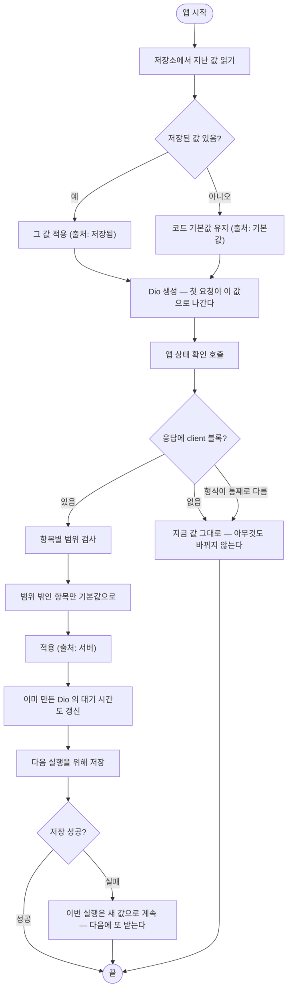

# 앱 대기·연출 시간값을 서버에서 관리하고 앱은 받아 쓴다

## 개요

앱이 쓰는 대기·연출 시간값 다섯 개를 **앱 안에서 빼내 서버로 옮겼다.** 지금까지 이 값들은 `.env`에 있어 빌드할 때 앱 안에 함께 담겼고, 설치된 앱에서는 바꿀 방법이 없었다. 값 하나를 고치려면 앱을 다시 빌드해 스토어 심사를 받아야 했다.

이제 서버가 값을 주고 관리자 화면에서 고친다. 앱 코드에는 기본값만 남는다. 전달 통로는 이미 있는 앱 상태 확인(`/api/app/status`)을 그대로 쓴다.

| 값 | 전에 | 지금 | 범위 |
|---|---|---|---|
| 서버 연결 대기 | `.env` 10초 | `APP_CONNECT_TIMEOUT_MS` | 1,000~60,000 |
| 서버 응답 대기 | `.env` 60초 | `APP_RECEIVE_TIMEOUT_MS` | 5,000~180,000 |
| 카드 만들기 최대 대기 | `.env` 45초 | `APP_LOADING_MAX_WAIT_MS` | 10,000~180,000 |
| 약관 불러오기 대기 | 코드 상수 3초 (#278) | `APP_CONSENT_FETCH_TIMEOUT_MS` | 1,000~15,000 |
| 민감정보 검사 최소 연출 | `.env` 1.5초 | `APP_DLP_MIN_DELAY_MS` | 0~10,000 |

## 기능 흐름

## 변경 사항

### 서버

- `systemconfig/core/ConfigGroup.java`: `APP_TUNING`("앱 대기·연출 시간") 그룹 추가 — 관리자 설정 화면의 탭 하나가 된다
- `systemconfig/core/ConfigKey.java`: 키 5개 추가. `minValue`/`maxValue` 필드를 새로 두고 생성자를 둘로 나눴다(`@AllArgsConstructor` 제거) — 범위가 없는 기존 키는 두 값이 `null`
- `systemconfig/application/service/SystemConfigService.java`: INTEGER 저장 시 범위 검사. 벗어나면 `SYSTEM_CONFIG_INVALID_VALUE`
- `systemconfig/application/service/SystemConfigView.java`: `minValue`/`maxValue` 노출 — 화면 입력칸이 쓴다
- `common/application/dto/response/AppStatusResponse.java`: `ClientTuning` 레코드와 `client` 필드 추가
- `common/application/controller/AppStatusController.java`: 설정에서 다섯 값을 읽어 함께 내려준다
- `common/application/controller/AppStatusControllerDocs.java`: 응답 예시 갱신
- `resources/templates/admin/settings.html`: INTEGER 전용 입력칸(`type=number` + `min`/`max`)

### 클라이언트

- `core/config/client_tuning.dart` (신규): `ClientTuning` 모델, 항목별 범위 검사, JSON 직렬화, `applyServerTuning()`, `TuningSource` enum
- `core/config/app_config.dart`: 시간값 다섯 개가 `.env` 대신 `ClientTuning`을 읽는다. `_int()` 헬퍼 제거, 테스트용 `resetTuning()` 추가
- `core/app_status/app_status.dart`: 응답의 `client` 를 파싱해 `tuning` 으로 들고 있는다
- `main.dart`: 저장해 둔 값을 **Dio 생성 전에** 적용
- `app.dart`: 앱 상태를 받자마자 적용 + 저장
- `core/storage/local_storage.dart`: `cachedClientTuningJson` 캐시 (`SharedPrefsStorage`·`InMemoryStorage` 양쪽)
- `core/dev/dev_state_dump.dart`: 지금 값과 **출처**(기본값/저장됨/서버)를 개발자 도구에 표시
- `.env.example`: 네 키 제거 + 어디로 옮겼는지 주석

### 테스트

- `client/test/client_tuning_test.dart` (신규, 11개)
- `server/.../SystemConfigServiceTest.java` (4개 추가)

## 주요 구현 내용

**통로를 새로 만들지 않았다.** 앱이 시작할 때 어차피 부르는 `/api/app/status`(#279)에 `client` 블록을 얹었다. 엔드포인트를 따로 만들면 시작할 때 왕복이 하나 늘고, 인증 없이 열어 둘 곳도 하나 더 생긴다.

**값은 세 단으로 고른다.** 서버에서 받은 값 → 지난번에 받아 저장해 둔 값 → 코드 기본값. 서버를 못 봐도 앱은 그대로 돈다.

**저장된 값은 Dio를 만들기 전에 적용한다.** 순서가 중요하다. Dio를 먼저 만들면 서버에 닿기 전 첫 요청이 옛 값으로 나가는데, **그 첫 요청이 바로 앱 상태 확인이다.** 관리자가 고친 대기 시간이 정작 그 값을 받아오는 요청에는 적용되지 않는다.

**서버 응답을 받은 뒤에는 이미 만들어진 Dio의 대기 시간도 함께 바꾼다.** `dio.options`에 한 번 박힌 값은 다시 넣지 않으면 다음 실행까지 옛 값으로 돈다.

**범위는 서버와 앱 양쪽에서 막는다.** 대기 시간에 0이나 음수가 들어가면 "끝없이 기다리기"가 된다. 관리자가 오타 한 번 내면 앱 전체가 멈추므로 한쪽만 막아서는 안 된다. 화면 입력칸(`min`/`max`) → 서버 검증 → 앱 검증의 세 겹이다.

**앱은 항목별로 거른다.** 한 값이 범위를 벗어났다고 다섯을 통째로 버리면 관리자가 고친 나머지 넷도 함께 사라진다. 응답 **형식이 통째로 다를 때만** 전부 버리고 지금 값을 유지한다.

**서버 기본값과 앱 코드 기본값을 같은 값으로 맞추고 테스트로 묶었다.** 서버를 못 본 앱과 본 앱이 다르게 돌면, 제보를 받아도 어느 쪽 문제인지 알 수 없다.

## 검증

| 대상 | 결과 |
|---|---|
| 클라이언트 `flutter test` 전체 | **636개 통과** |
| └ 신규 `client_tuning_test.dart` | 11개 — 범위 밖 항목별 폴백, 형식 불일치, 저장 실패(동기·비동기), Dio 반영, 캐시 왕복 |
| 서버 `gradle test` 전체 | **314개 통과** (failures 0 · errors 0) |
| └ 신규 `SystemConfigServiceTest` | 4개 — 범위 거절, 경계값 저장, 범위 없는 정수 회귀, 서버·앱 기본값 일치 |

## 주의사항

**범위가 없는 정수는 예전 그대로 받는다.** 플랜 한도의 `-1`은 "무제한"이라는 뜻이라 범위를 걸면 저장할 수 없게 된다. `minValue`/`maxValue`가 `null`인 키는 검사하지 않으며, 이 회귀를 테스트로 고정해 두었다. **새 INTEGER 키를 추가할 때 범위를 넣을지 말지 의식해서 정해야 한다.**

**`AppConfig`의 시간값은 정적 상태다.** 테스트끼리 값이 새어 나가므로 `tearDown(AppConfig.resetTuning)`이 필요하다. 이 값을 읽는 테스트를 새로 쓸 때 빠뜨리면 실행 순서에 따라 결과가 달라진다.

**저장 실패는 두 경로로 온다.** 저장소는 실패를 동기 예외로도, 실패한 `Future`로도 알린다. 둘 다 잡지 않으면 비동기 실패가 처리되지 않은 채 남는다. 어느 쪽이든 이번 실행은 새 값으로 계속 돈다 — 저장은 다음 실행을 위한 것이라 실패해도 지금을 막을 이유가 없다.

**옛 서버와 새 앱이 만나는 경우를 열어 두었다.** 응답에 `client`가 없으면 `null`이고, 그때는 지금 쓰던 값을 그대로 쓴다. 배포 순서(서버 먼저 / 앱 먼저)에 관계없이 동작한다.

**`.env`에는 서버 주소처럼 서버에 닿기 전에 필요한 값만 남겼다.** 앞으로 시간·연출 성격의 값을 `.env`에 새로 넣으면 같은 문제가 다시 생긴다.

## 남은 것

- [ ] **배포 후 실측** — 관리자 화면에서 값을 바꾸고 앱이 실제로 받는지 확인한다. 개발자 도구의 "시간값 출처"가 `server`로 바뀌는지, 바꾼 값이 다음 실행에도 남는지(`cached`)를 함께 본다.
