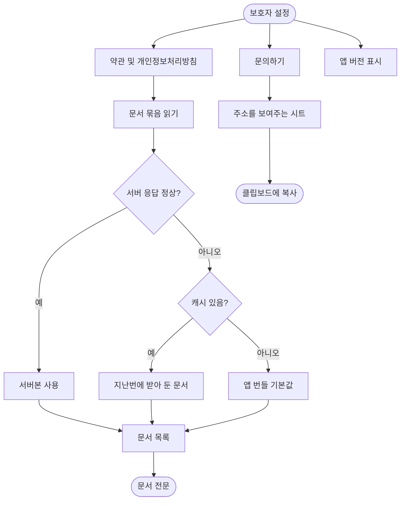

# 심사 준비: 앱 이름, iPhone 전용, 세로 고정, 설정에 약관과 문의 추가

## 개요

스토어 심사 제출 준비(#286)의 3단계를 구현했다. 홈 화면 이름을 `이룸`으로 바꾸고, iOS를 iPhone 전용으로 좁히고, 두 플랫폼 모두 세로로 고정했다. 설정 화면에는 `약관 및 개인정보처리방침`, `문의하기`, 앱 버전을 넣었다. 심사에서 걸릴 자리를 미리 막고, 스크린샷을 찍기 전에 화면 구성을 확정하는 것이 목적이다.

## 기능 흐름

## 변경 사항

### 네이티브 설정

- `client/ios/Runner.xcodeproj/project.pbxproj`: `TARGETED_DEVICE_FAMILY`를 `1,2`에서 `1`로 (Debug/Release/Profile 세 곳)
- `client/ios/Runner/Info.plist`: `CFBundleDisplayName`을 `이룸`으로, 화면 방향을 세로만 남기고 iPad 전용 키 삭제
- `client/android/app/src/main/AndroidManifest.xml`: `android:label`을 `이룸`으로, `MainActivity`에 `screenOrientation="portrait"` 추가

### 설정 화면

- `client/lib/features/guardian/presentation/guardian_settings_screen.dart`: `약관 및 개인정보처리방침`, `문의하기` 줄 추가. 맨 아래 버전 줄 추가. 목록 줄 위젯을 공통 위젯으로 교체
- `client/lib/features/auth/presentation/consent_document_list_screen.dart`: 새 화면. 동의 화면이 쓰는 문서 묶음을 목록으로 보여주고 전문 화면으로 넘긴다
- `client/lib/core/widgets/settings_tile.dart`: 설정 목록 줄을 공통 위젯으로 승격

### 설정값

- `client/lib/core/config/app_config.dart`: `supportEmail` 추가 (기본값 포함)
- `client/.env.example`: `ELUM_SUPPORT_EMAIL` 키와 설명 추가
- `client/lib/core/app_status/app_status_repository.dart`: `appVersionProvider` 추가

### 테스트

- `client/test/guardian_settings_test.dart`: 새 줄 노출, 문서 목록 진입, 전문 진입, 문의 주소 노출을 고정하는 테스트 4개 추가

## 주요 구현 내용

**약관 본문을 새로 만들지 않았다.** 동의 화면이 쓰는 `consentBundleProvider`와 `ConsentDocumentScreen`을 그대로 쓴다. 서버 → 캐시 → 앱 번들 세 층을 그대로 타므로 관리자가 고친 최신본이 보이고, 네트워크가 없어도 읽힌다. 여기에 본문을 따로 두면 동의 화면과 조용히 어긋나는데, 그 어긋남이 곧 심사 지적 사유다.

**문의하기는 메일 앱을 띄우지 않는다.** 주소를 화면에 보여주고 복사한다. 메일 앱을 여는 쪽은 의존성이 하나 더 필요하고, 메일 앱이 없는 휴대폰에서는 눌러도 아무 일이 없어 멈춘 것처럼 보인다. 주소는 코드에 박지 않고 `.env`로 뺐다. 게시된 도움말·처리방침의 보호책임자 주소와 같아야 하는데, 두 곳에 박아 두면 한쪽만 고쳐진다.

**버전은 서버에 묻지 않는다.** 이미 있는 `appStatusProvider`는 서버에 앱 상태를 물으러 간다. 버전 한 줄 때문에 설정 화면이 서버 응답을 기다리게 할 이유가 없어 패키지 정보만 읽는 provider를 따로 뒀다. 읽지 못하면 줄 자체를 그리지 않는다 — 사용자가 할 수 있는 일이 없는 실패를 오류로 보여줄 이유가 없다.

**설정 줄 위젯을 공통으로 올렸다.** 약관 목록 화면이 같은 모양을 필요로 한다. 각자 그리면 여백과 화살표가 조금씩 달라진다.

## 검증

| 확인 | 결과 |
| --- | --- |
| `flutter analyze lib test` | `No issues found!` |
| `flutter test` | 640개 전부 통과 |
| 매니페스트·plist 문법 | `plutil -lint` OK, XML 파싱 OK |
| 테스트가 실제로 잡는가 | 설정 줄 문구를 바꿔 일부러 깨뜨림 → `Found 0 widgets with text "약관 및 개인정보처리방침"`로 실패 확인 후 복구 |

## 주의사항

- **iPad 지원은 이번에 뺐다.** 한 번 iPad로 출시하면 다음 업데이트에서 다시 빼기 어렵다. 나중에 iPad를 지원하려면 레이아웃 검증과 iPad 스크린샷이 함께 필요하다.
- **Android 16(API 36)은 큰 화면에서 `screenOrientation`을 무시한다.** 휴대폰에서는 그대로 적용되지만 태블릿·폴더블 큰 화면에서는 가로로 돌아갈 수 있다.
- **게시된 페이지와 앱 문구가 아직 어긋나 있다.** 지원 페이지의 원문 보관 설명이 사실과 다르고, 게시본 처리방침에는 국외 이전 항목이 없다. #288에서 정리한다.
- **`ELUM_SUPPORT_EMAIL`은 기본값이 있어 배포 전 Secret 갱신이 필수는 아니다.** 다만 주소를 바꾸려면 `CLIENT_ENV_FILE`을 갱신해야 배포 빌드에 반영된다.
- 실기기 확인은 아직 하지 않았다. TestFlight·내부 테스트 빌드가 올라간 뒤 세로 고정과 설정 화면을 눈으로 확인해야 한다.
