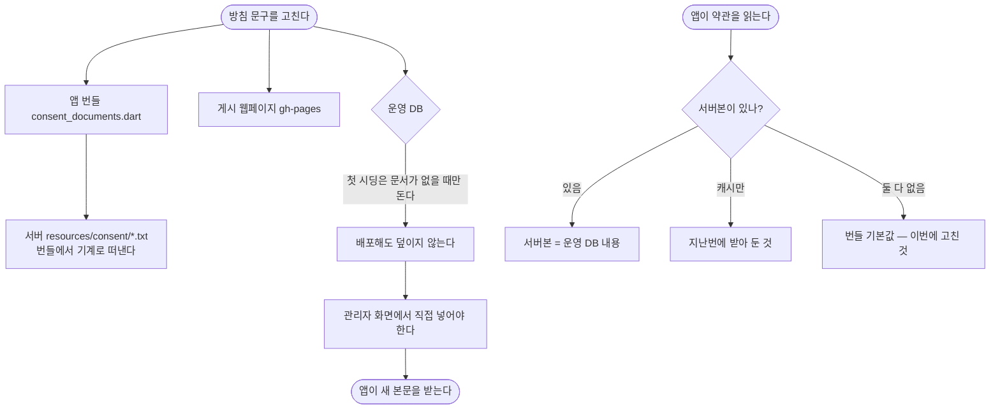

# 개인정보처리방침에 처리 위탁·국외 이전·보호책임자를 넣고 게시본과 맞춘다

## 개요

심사 준비(#286) 2단계입니다. 점검해 보니 **고지와 실제가 네 군데에서 달랐습니다.**

| 무엇이 | 어땠나 |
|---|---|
| 게시본과 앱 안 방침 | 게시본은 11개 조항, 앱 안은 7개 항목. 위탁·보호책임자·시행일이 앱에는 없었습니다 |
| 국외 이전 조항 | **양쪽 모두 없었습니다.** 게시본에서 "국외"는 0회 나옵니다 |
| 외부 AI | 운영은 Gemini와 OpenAI를 쓰는데 어느 문서에도 Google만 적혀 있었습니다 |
| 거부 안내 | "AI 카드 생성을 이용할 수 없다"고 안내하지만 실제로는 **가입 자체가 막힙니다** |

여기에 용어 불일치 하나를 더 고쳤습니다. 같은 항목을 개인정보 수집 동의서는 "이룸이를 부르는 이름"으로, 국외 이전 동의서는 "아이를 부르는 이름"으로 적고 있었습니다.

## 기능 흐름

방침은 네 곳에 있고 **넷이 같아야 합니다.** 이번에 셋을 고쳤고, 운영 DB 하나가 남았습니다.

**그래서 이번 배포만으로는 기존 사용자에게 새 문구가 보이지 않습니다.** 앱은 서버본을 먼저 쓰고, 서버본은 관리자가 고친 내용이기 때문입니다.

## 변경 사항

### 앱

- `consent_documents.dart` — `_privacy`에 **8. 처리 위탁 · 9. 국외 이전 · 10. 개인정보 보호책임자 · 11. 시행일** 추가
- `consent_documents.dart` — `_overseas`에 OpenAI 추가, 이전받는 자에 각 사 공개 방침 주소, 거부 안내 정정, "아이" → "이룸이"
- `consentVersion` `2026-09-18` → `2026-09-21`
- `test/goldens/consent_document.png` 갱신 (버전 표시 한 줄이 바뀌어 다시 떴습니다)

### 서버

- `resources/consent/privacy.txt` · `overseas.txt` — 앱 번들에서 기계로 떠냈습니다
- `ConsentDocumentInitializer.INITIAL_VERSION` `2026-09-18` → `2026-09-21`

### 게시 웹페이지 (gh-pages `443883e`)

- **6. 개인정보의 국외 이전** 조항 신설 (이전받는 자·국가·시기·방법·항목·목적·보유기간·거부 방법)
- 뒤 조항 번호를 한 칸씩 밀었습니다 (6~11 → 7~12)
- 위탁표에 `OpenAI, L.L.C.` 행 추가
- 시행일 `2026-09-17` → `2026-09-21`

## 주요 구현 내용

**국외 이전을 방침 본문에 넣었습니다.** 앱에는 국외 이전 *동의서*가 따로 있지만, 게시된 주소만 여는 심사관에게는 없는 것과 같습니다. 개인정보보호법 제28조의8이 정한 기재 사항이기도 합니다.

**제공자는 쓸 수 있는 곳을 모두 적었습니다.** 텍스트·이미지 제공자는 관리자 화면에서 언제든 바뀝니다. 바꿀 때마다 방침 네 곳을 고쳐야 한다면 언젠가 빠뜨리고, 그 순간 실제 처리와 고지가 어긋납니다.

**서버 파일은 손으로 옮기지 않았습니다.** 앱 번들에서 기계로 떠내고 글자 수까지 일치하는 것을 확인했습니다. 손으로 옮기면 한 글자씩 어긋나고, 그 어긋남이 "앱에서 본 문구와 서버가 준 문구가 다르다"가 됩니다.

**거부 안내는 문구를 실제에 맞췄습니다.** 국외 이전을 선택 동의로 바꾸는 쪽도 있었지만, AI로 카드를 만드는 것이 이룸의 본질이라 필수를 유지하고 안내를 사실대로 고쳤습니다.

## 검증

| 대상 | 결과 |
|---|---|
| 클라이언트 `flutter test` 전체 | **640개 통과** |
| 서버 `gradle test` 전체 | **314개 통과** (failures 0 · errors 0) |
| 앱 번들 ↔ 서버 파일 | `privacy.txt` 2462자 · `overseas.txt` 549자 **완전 일치** |
| 게시 페이지 실측 | 12개 조항 노출, `6. 개인정보의 국외 이전` 확인, `OpenAI` 2곳 표기 |

골든 테스트는 한 번 실패했습니다. diff 이미지를 열어 보니 **버전 표시 한 줄**(`2026-09-18` → `2026-09-21`)만 달랐고(0.04%, 121px), 추가한 본문은 스크롤 아래라 잡히지 않았습니다. 의도한 변경이라 갱신했습니다.

## 주의사항

**이전받는 자의 연락처를 공개 방침 주소로 적었습니다.** 법은 "이전받는 자의 성명과 연락처"를 요구하는데, Google과 OpenAI의 정확한 개인정보 담당 창구 주소를 확인하지 못했습니다. **추측한 이메일을 적으면 그 자체가 틀린 고지가 되므로** 각 사가 공개한 방침 주소를 적었습니다. 정확한 연락처를 확보하면 바꾸는 것이 좋습니다.

**서버 호스팅은 수탁자에 넣지 않았습니다.** 직접 운영하는 장비라 위탁이 아닙니다. 나중에 클라우드로 옮기면 수탁자와 국외 이전 양쪽에 추가해야 합니다.

**방침을 고칠 때는 네 곳을 함께 본다는 것을 잊기 쉽습니다.** 이번에도 게시본과 앱 안 방침이 이미 어긋나 있었습니다. 코드 주석에 "같아야 한다"고 적혀 있었는데도 그랬습니다.

## 남은 것

- [ ] **운영 DB 반영** — 관리자 화면 → 약관 관리에서 `개인정보 수집·이용`과 `개인정보 국외 이전` 본문을 새 내용으로 바꾸고 **버전을 2026-09-21로 올립니다.** 이 단계를 하지 않으면 앱에는 예전 문구가 계속 나갑니다
- [ ] 반영 후 앱 동의 화면에서 새 본문이 보이는지 확인
