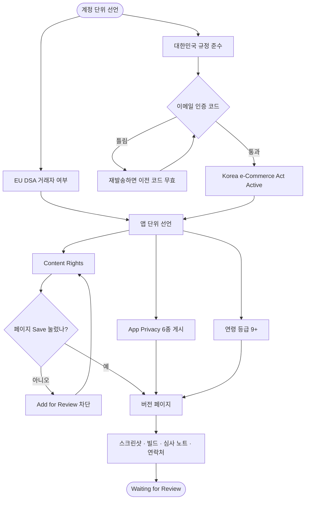

# 플레이스토어, 앱스토어 심사 제출 준비 체크리스트

## 개요

두 스토어에 심사를 넣었다. **App Store는 1.24.1 (158)이 `Waiting for Review`**, **Play 비공개 테스트는 158 (1.24.1)이 테스터에게 게시 완료**다.

콘솔에 무엇을 넣었는지는 `docs/projectops/store/20260921_스토어_문구_원본.md`에 값 그대로 남겼다. 이 보고서는 **왜 그렇게 답했는지**와 **어디서 막혔는지**를 적는다. 콘솔 화면은 다음에 열었을 때 이미 채워져 있어서 값만으로는 그때의 판단이 복원되지 않는다.

## 제출 흐름

## 변경 사항

### 문서

- `docs/projectops/store/20260921_스토어_문구_원본.md`: 콘솔에 넣은 값 전부와 제출 상태, 겪은 함정 추가
- `docs/projectops/store/20260921_앱스토어_심사노트.md`: App Review Information에 넣은 영문 원문 그대로

### 스크린샷

- `docs/projectops/store/assets/ios1_home.png` · `ios2_steps.png` · `ios3_loading.png`: 6.5형 1284×2778

## 주요 구현 내용

### 심사 계정을 주지 않기로 한 이유

이룸은 카카오·네이버·Apple 로그인만 있고 아이디·비밀번호 로그인이 없다. 공유할 카카오 계정을 만들어 넘기는 방법도 있었지만, 카카오톡이 깔리지 않은 심사 기기에서는 웹 로그인으로 빠지고 그 과정에서 본인 확인에 막힐 수 있다.

그래서 `Sign-in required`를 **끄고** 심사 노트에 *"`Apple로 계속하기`를 눌러 심사자 본인의 Apple ID로 들어오라"* 고 적었다. Sign in with Apple이 있으니 심사자가 스스로 가입할 수 있고, 계정은 `보호자 설정 > 탈퇴하기`에서 지울 수 있다는 것도 함께 적었다. 노트에는 3분짜리 확인 순서(로그인 → 보호자 선택 → 비밀암호 → 새로운 일과 만들기 → 이룸이 화면)를 넣어 심사자가 한국어 앱에서 헤매지 않게 했다.

### App Privacy를 여섯 종으로 답한 근거

수집 항목은 Name · Email Address · Other User Content · User ID · Device ID · Product Interaction 여섯이다. 전부 **계정에 연결됨**, 전부 **추적 안 함**으로 답했다. 광고·분석 SDK가 없으므로 추적은 사실이 아니다.

용도는 기본이 App Functionality고, **이름과 사용자 제작 콘텐츠에만 Product Personalization을 더했다.** 이룸이 별명과 일과 내용이 카드 생성 결과를 바꾸기 때문이다. 나머지는 개인화에 쓰이지 않으므로 붙이지 않았다.

### 연령 등급이 9+가 된 이유

폭력·선정성·비속어·약물·도박은 전부 없음으로 답했다. **보호자 통제 있음**과 **자기돌봄 주제 있음** 둘만 있다고 답했고, 그 결과가 9+다. 키즈 카테고리 표시는 켜지 않았다. 켜면 외부 링크와 분석 도구에 제한이 붙는다.

### EU DSA를 비거래자로 선언한 이유

무료 앱이고 인앱결제·광고가 없으며 사업자등록번호가 없다. 답하지 않으면 EU 27개국에서 앱이 내려가므로 비워둘 수 없는 항목이었다. 나중에 수익이 생기면 같은 화면에서 주소·전화·이메일을 추가해 거래자로 바꾼다.

## 주의사항

### Content Rights는 다이얼로그 `Done`만으로 저장되지 않는다

App Information의 Content Rights는 다이얼로그에서 답을 고르고 `Done`을 눌러도 화면에만 반영되고 **서버에 저장되지 않는다.** 페이지 위쪽 `Save`를 따로 눌러야 한다.

이걸 빠뜨리면 버전 페이지에서 `Add for Review`가 `Unable to Add for Review — You must set up Content Rights Information in App Information`으로 막힌다. 그런데 **App Information 화면은 답이 저장된 것처럼 보였다가** 새로고침하면 `Set Up Content Rights Information`으로 되돌아간다. 저장 여부는 반드시 새로고침 후에 확인한다.

같은 패턴이 ASC 곳곳에 있다. 다이얼로그 안쪽 버튼과 페이지 상단 `Save`가 따로 놀고, 다이얼로그에 `Save`가 둘 있을 때는 **아래쪽 것**이 다이얼로그용이다.

### 이메일 인증 코드는 재발송하는 순간 이전 코드가 무효가 된다

대한민국 규정 준수의 이메일 인증에서 코드가 틀렸을 때 재발송부터 누르면 **받아둔 코드가 그 자리에서 무효**가 된다. 옛 메일의 코드를 넣으면 `Incorrect verification code`가 뜨고, 이게 반복되면 원인이 코드인지 입력 방식인지 구분이 안 된다.

코드가 안 맞으면 재발송하지 말고 **가장 최근에 온 메일**을 먼저 확인한다.

### 코드 입력창은 본문이 아니라 iframe 안에 있다

인증 코드 6칸은 `id.apple.com/identity/verification` iframe 안에 있다. 본문에서 `input`을 찾으면 빈 배열이 나와 "입력창이 없다"고 오판하게 된다. iframe을 잡아 `Digit 1`~`Digit 6`을 채워야 한다.

### Play 비공개 테스트 링크는 목록에 있는 계정으로만 열린다

`https://play.google.com/apps/testing/kr.twinfang.elum`을 개발자 계정으로 열면 `App not available`이 뜬다. 앱이 게시되지 않아서가 아니라 **그 계정이 테스터 목록에 없어서**다. 지금 선택된 목록은 `규랩스 테스터 목록`(44명) 하나뿐이다. 링크가 안 된다는 제보를 받으면 게시 상태부터 의심하지 말고 계정이 목록에 있는지를 먼저 본다.

### 제출한 158보다 새 빌드 167이 이미 있다

제출 시점에 App Store Connect가 `Newer Build Available` 경고를 띄웠다. 지금 저장소는 **1.25.8 / 빌드 167**이고 TestFlight에도 167이 `Ready to Submit`으로 올라와 있다. 심사에 들어간 것은 **1.24.1 / 158**이다.

158을 고른 이유는 그 빌드가 #289(앱 이름·세로 고정·설정의 약관과 문의)와 앱 안 개인정보처리방침을 게시본과 맞춘 수정까지 포함한, 당시 확인된 마지막 릴리스 빌드였기 때문이다. 다만 그 뒤로 다른 세션의 배포가 이어져 1.25.x까지 올라갔다.

**지금 빌드를 바꾸려면 제출을 내리고 다시 넣어야 하고 심사 순서가 처음으로 돌아간다.** 1.24.1로 심사를 받고 승인 뒤 업데이트로 1.25.x를 올리는 편이 총 소요가 짧다. 바꿀지 말지는 심사 결과가 나오기 전에 정한다.

### Play 프로덕션까지는 아직 멀다

개인 개발자 계정이라 **테스터 12명 이상이 14일 이상 참여**해야 프로덕션 액세스를 신청할 수 있다. 비공개 테스트 게시는 그 시계의 시작일 뿐이고 현재 참여 테스터는 0명이다. 링크를 돌려 실제 참여 수락을 받아야 날짜가 간다.
