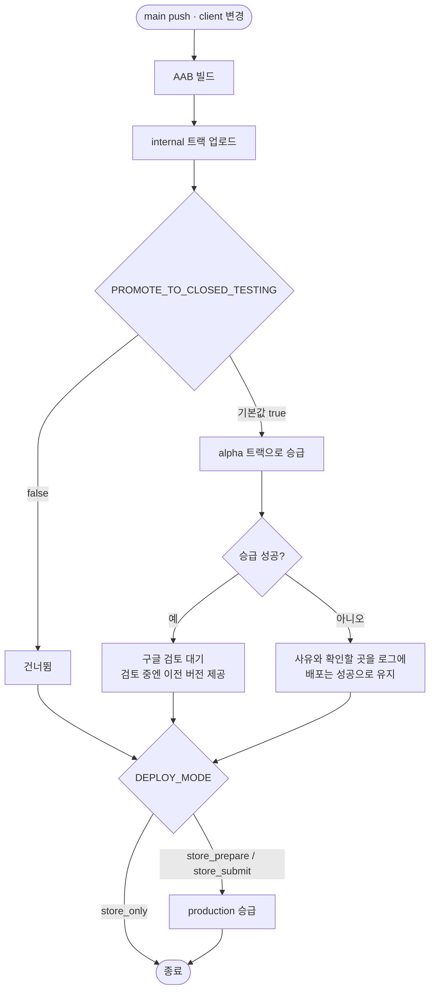

# 배포할 때 비공개 테스트 트랙에도 자동으로 올린다

## 개요

`main` 배포가 내부 테스트 트랙까지만 가고 비공개 테스트(Alpha)는 사람이 콘솔에서 손으로 올려야 했다. 그래서 내부 테스트가 179 (1.27.0)일 때 Alpha는 158 (1.24.1)로 **21개 버전이 벌어져** 있었다.

`internal`에 올린 번들을 그대로 `alpha`로 승급시키는 단계를 배포 레인에 넣었다. 이제 배포하면 두 트랙에 함께 올라간다.

## 기능 흐름

## 변경 사항

### 배포 스크립트

- `client/android/fastlane/Fastfile.playstore`
  - `promote_internal_to_closed_testing` 레인 추가 — `track_promote_to: 'alpha'`, `track_promote_release_status: 'completed'`
  - `deploy_internal`에 1.5단계로 끼움. `begin/rescue`로 감싸 승급 실패가 배포를 실패시키지 않게 함
  - 헤더 주석에 "비공개 테스트 승급은 모드와 무관하게 항상 돈다" 명시

### 워크플로

- `.github/workflows/PROJECT-FLUTTER-ANDROID-PLAYSTORE-CICD.yaml`
  - 배포 스텝에 `PROMOTE_TO_CLOSED_TESTING: ${{ vars.PROMOTE_TO_CLOSED_TESTING || 'true' }}` 전달

## 주요 구현 내용

### 왜 배포 모드와 무관하게 항상 도는가

`store_only` / `store_prepare` / `store_submit` 어디에 붙일지 고민할 수 있지만 **전부에 붙였다.**

프로덕션 액세스 조건인 *테스터 12명 · 14일*은 달력으로 흐른다. 모드별로 갈라 두면 "이번 배포는 `store_only`니까 Alpha는 안 올라갔네"가 생기고, 그걸 알아채는 건 며칠 뒤다. 빠뜨렸을 때의 손해(테스터가 옛 앱을 테스트)가 항상 도는 비용(승급 API 호출 한 번)보다 훨씬 크다.

### 왜 승급 실패를 삼키는가 — 다만 조용히는 아니다

`promote_internal_to_closed_testing`은 `begin/rescue`로 감쌌다. **internal 업로드가 이미 끝난 뒤**라 여기서 예외를 그대로 올리면 멀쩡히 배포된 빌드가 워크플로 실패로 보인다.

대신 삼키기만 하지 않는다. 실패하면 사유와 **확인할 곳 세 가지**를 로그에 찍는다.

- 서비스 계정에 `alpha` 트랙 권한이 있는지
- 비공개 테스트 트랙이 만들어져 있는지
- 같은 버전 코드가 이미 Alpha에 올라가 있지는 않은지

`rescue_changes_not_sent_for_review: false`를 유지해 fastlane이 "심사 전송 실패"를 조용히 성공으로 바꾸지 못하게 했다. 그 실패는 우리 `rescue`가 받아 로그로 드러난다.

### 끄는 스위치를 만든 이유

14일이 끝나 프로덕션으로 넘어가면 Alpha 승급은 불필요해진다. 그때 워크플로를 다시 고치게 하지 않으려고 저장소 변수 `PROMOTE_TO_CLOSED_TESTING`으로 끌 수 있게 했다.

기본값을 **Fastfile 안에도** 두어(`ENV[...] || "true"`), 워크플로에서 이 변수를 넘기지 않아도 승급은 돈다. 워크플로 파일이 어떤 이유로 되돌아가도 동작이 꺼지지 않는다.

## 검증

로컬에 fastlane이 없어 레인을 실제로 실행하지는 못했다. 할 수 있는 만큼 확인했다.

| 확인 | 결과 |
|---|---|
| `ruby -c Fastfile.playstore` | `Syntax OK` |
| 워크플로 YAML 파싱 + env 주입 | `PROMOTE_TO_CLOSED_TESTING: ${{ vars.… \|\| 'true' }}` 확인 |
| 토글 조건 8가지 입력 | 미설정·`true`·빈값·`yes` → 승급 함 / `false`·`False`·`FALSE`·`" false "` → 건너뜀 |
| 레인 목록 | `promote_internal_to_closed_testing` 정의 확인 |

**실동작 검증은 다음 배포에서 한다.** Alpha 트랙에 새 버전이 자동으로 올라오는지 보고 이 이슈에 후속 댓글로 남긴다.

## 주의사항

### 즉시 반영이 아니다

Alpha 릴리스는 **매번 구글 검토를 탄다.** 실측으로 첫 건은 제출 22:28 → 게시 23:15로 47분 걸렸지만, 구글 안내는 7일 이내이고 더 걸릴 수 있다. 배포했다고 테스터 기기에 바로 내려가지 않는다.

검토 도는 동안 테스터는 **이전 버전을 계속 쓴다.** 끊기지는 않는다.

### rescue가 잡지 못하는 경우

`rescue => e`는 `StandardError`만 잡는다. fastlane의 업로드 실패는 `FastlaneError` 계열이라 걸리지만, 만약 내부에서 프로세스를 직접 종료하면 잡히지 않는다. 배포가 1.5단계에서 통째로 실패하면 이 경로를 의심한다.

### 이 자동화는 14일 시계를 대신하지 않는다

빌드를 자동으로 올려줄 뿐, **테스터가 참여 상태를 유지하는 것**은 별개다. 조건은 테스터 12명 이상이 14일간 계속 참여하는 것이고, 시작일은 2026-09-22다 (#286).
