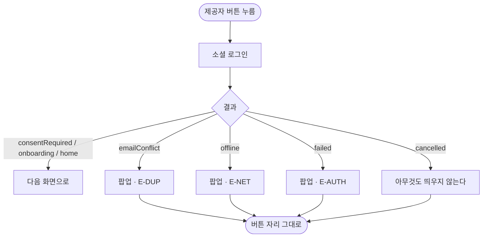

# 로그인 실패를 모달로 알리고 최근 로그인 표시를 시안대로 맞춘다

## 개요

로그인 실패를 버튼 위 회색 글자로 알리던 것을 **앱 공통 팝업**으로 옮기고, `최근 로그인` 표시를 시안 실측값대로 **버튼 우상단에 겹치는 알약**으로 바꿨다.

## 기능 흐름



## 변경 사항

### 로그인 화면

- `client/lib/features/auth/presentation/login_screen.dart`
  - `_errorMessage` 상태와 인라인 `Text` 제거
  - `_alert()` 추가 — `showElumDialog`로 실패 세 갈래를 알린다
  - `_LastUsedHint` → `_LastUsedSlot` 으로 교체. 버튼을 감싸 우상단에 알약을 얹는다

### 토큰

- `client/lib/core/theme/app_colors.dart`: `loginLastUsedBg` (`#FFFADC` 투명도 50%)
- `client/lib/core/theme/app_typography.dart`: `lastLoginBadge` (12/w500 Pretendard)

### 테스트

- `client/test/login_screen_test.dart`: 옛 문구 테스트 둘을 시안 기준 넷으로 교체

## 주요 구현 내용

### 왜 인라인 글자를 버렸나

세 가지가 겹쳤다.

- 배경이 캐릭터 그림이라 **대비가 약하고**, 글자가 버튼 바로 위라 눌린 버튼에 가린다
- 글자가 생기면서 **버튼 묶음이 위로 밀린다.** 누르려던 자리가 움직인다
- 이 앱에는 이미 공통 팝업이 있는데(#232) 로그인만 다른 방식을 썼다

팝업 아이콘은 `warning`이다. **붉은 경고는 쓰지 않는다** — 이룸이도 보는 화면이다.

### 에러 코드는 그대로 노출한다

`E-DUP` · `E-NET` · `E-AUTH`를 팝업 본문에 남겼다. 사용자에게는 뜻이 없지만, **제보를 받았을 때 어디서 터졌는지 가릴 유일한 단서다.**

`E-AUTH`가 뜻하는 것을 적어 둔다 — `AuthOutcome.failed`, 즉 *네트워크 문제도 중복 가입도 아닌 나머지 전부*다. 네 갈래가 한 코드로 뭉쳐 있다.

1. 소셜 SDK 자체가 실패
2. 서버가 200을 줬는데 응답에 토큰이 없음
3. 토큰 교환 API가 오프라인도 409도 아닌 오류
4. 그 밖의 예외

**1번은 스토어로 받은 빌드에서만 나기 쉽다.** Play가 앱을 다시 서명하므로 앱 서명 키의 SHA-1·키해시를 카카오·구글에 등록하지 않으면 그 빌드에서만 로그인이 깨진다(#286 4단계). 갈래를 코드로 나누는 일은 이번 범위에서 뺐다 — 저장소 계층을 건드려야 해서 따로 본다.

### 왜 겹쳐 놓나

시안 `로그인_iOS`(238:1808) 실측이다.

| 값 | |
|---|---|
| 알약 | 91×28 · 반지름 20 |
| 색 | `#FFFADC` · 투명도 50% |
| 자리 | 버튼 우측에서 16 · 버튼 위로 10 |
| 글자 | `최근 로그인` · Pretendard 500 · 12 · `#242634` |

**반투명인 것이 핵심이다.** 불투명하게 두면 세 제공자에서 모두 같은 크림색으로 보인다. 50%라 아래 버튼 색이 비쳐 카카오는 노랑, 네이버는 초록, 애플은 회색으로 각각 달라 보인다.

**겹치는 것도 핵심이다.** 이전 구현은 버튼 위에 한 줄을 깔아, 최근 로그인이 있을 때만 버튼 묶음이 통째로 밀렸다. 버튼 간격이 12라 위로 10 겹쳐도 레이아웃은 그대로다.

AOS 시안(`1022:4333`)에는 이 표시가 없지만 **양쪽 다 보여준다.** 같은 기능인데 안드로이드만 빼면 기기에 따라 동작이 달라진다.

## 검증

`flutter analyze` 무이슈, `flutter test` **724개 통과**.

로그인 화면 테스트 19개 중 새로 쓴 것이 넷이다.

- 문구가 `최근 로그인` 인가
- 알약이 91×28 이고 반투명인가
- **버튼 위로 겹쳐 레이아웃을 밀지 않는가** — 최근 로그인이 없을 때와 있을 때 첫 버튼의 y가 같아야 한다
- 알약이 해당 제공자 버튼에만 붙는가

**테스트가 실제로 잡는지 일부러 틀려 봤다.** 알약 폭을 140으로 바꾸니 이렇게 실패한다.

```
Expected: a numeric value within <1> of <91>
  Actual: <140.0>
```

되돌리면 다시 통과한다.

## 주의사항

### 대조 렌더에는 아직 알약이 안 잡힌다

`login_238-1808.png` 렌더는 최근 로그인이 **없는** 상태로 그려진다. 시안에는 세 버튼 모두에 알약이 있으므로 대조하면 그 부분이 어긋난 것처럼 보인다. 실제 앱에서는 한 번에 하나만 뜨는 것이 맞다 — 대조용 렌더를 따로 하나 더 두는 편이 낫다.

### `E-AUTH` 세분화가 남았다

네 갈래를 `E-AUTH-SDK` · `E-AUTH-TOKEN` · `E-AUTH-API`로 나누는 일은 이번에 하지 않았다. `AuthOutcome` 열거형과 저장소를 함께 바꿔야 해서 범위가 다르다. #346에 남겨 두었다.
