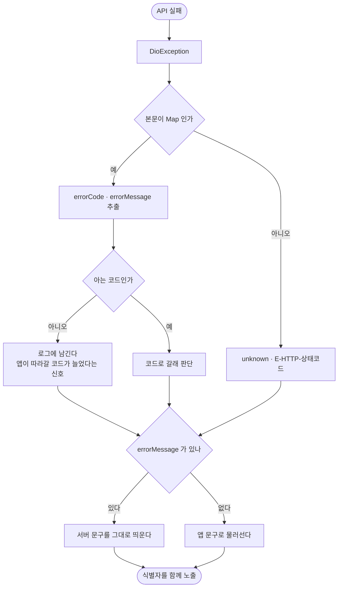

# 서버가 보낸 에러 코드와 문구를 앱이 버리고 자기 문구를 만든다

## 개요

**서버는 이미 잘 나눠져 있었다.** `ErrorCode.java` 한 파일에 62개가 있고 각각 HTTP 상태와 사용자용 한국어 문구를 함께 들고 있다. 응답도 `{errorCode, errorMessage}`로 내려온다.

문제는 앱이었다. `errorCode`를 읽는 곳이 **두 군데뿐**(점검 모드·이룸이 연결)이고 나머지는 HTTP 상태 코드만 보고 자기 문구를 만들었다.

| 서버가 보낸 것 | 사용자가 보던 것 |
|---|---|
| `MEMBER_SUSPENDED` · 정지된 계정입니다 | 로그인하지 못했어요 (E-AUTH-API) |
| `OAUTH_PROVIDER_UNSUPPORTED` · 지원하지 않는 로그인 방식입니다 | 로그인하지 못했어요 (E-AUTH-API) |

**정지된 계정에게 "잠시 후 다시 해주세요"라고 안내했다.** 사용자는 될 때까지 다시 누른다.

## 기능 흐름



## 변경 사항

### 새 파일

- `client/lib/core/network/server_error_code.dart`: 서버 enum과 **이름이 1:1로 맞는** `ServerErrorCode` 62개 + `unknown`. 섹션 주석도 서버 파일 순서 그대로 옮겨 두 파일을 눈으로 대조할 수 있게 했다
- `client/lib/core/network/server_error.dart`: 응답에서 코드·문구를 꺼내는 곳을 하나로 모은 `ServerError`와 `DioException.serverError`

### 적용

- `client/lib/features/auth/data/auth_repository.dart`: 409만 보던 분기를 서버 코드 기준으로. 실패 시 `lastServerError`에 남긴다
- `client/lib/features/auth/presentation/login_screen.dart`: `_alertFromServer()` — 서버 문구를 그대로 띄우고 식별자를 함께 붙인다

### 테스트

- `client/test/server_error_test.dart`: 10개
- `client/test/server_error_sync_test.dart`: 서버 파일을 직접 읽어 두 enum이 어긋났는지 본다

## 주요 구현 내용

### 왜 문구를 앱에 다시 쓰지 않나

서버 문구는 이미 사용자용으로 쓰여 있고, 최근에 넣은 것들은 해요체·용어 규칙까지 맞춰져 있다(`이번 주에 만들 수 있는 일과를 다 썼어요`).

**앱이 다시 쓰면 두 곳이 어긋난다.** 서버에서 문구를 고쳐도 앱은 옛 문구를 보여준다. 그래서 기본은 서버 문구를 그대로 띄우고, 앱 문구는 서버가 아무것도 주지 않았을 때만 나선다.

### 모르는 코드를 만났을 때

**서버가 새 코드를 먼저 배포하는 일은 반드시 생긴다.** 그때 앱이 멈추면 안 된다.

- 코드를 몰라도 `errorMessage`는 맞으므로 **문구는 그대로 보여준다**
- 식별자는 `E-HTTP-403`처럼 상태 코드로 대신한다 — 제보 추적 수단이 사라지면 안 된다
- 그리고 **로그에 남긴다.** 앱이 따라가야 할 코드가 늘었다는 신호다

### 어떤 본문이 와도 죽지 않는다

실패를 알리려다 앱이 죽으면 사용자는 무슨 일이 났는지조차 모른다. 네 경우를 테스트로 고정했다 — 본문이 문자열(`<html>502`), `null`, 필드가 아예 없음, 응답 자체가 없음(연결 실패).

## 검증

`flutter analyze` 무이슈, `flutter test` **737개 통과**.

**동기화 테스트가 실제로 어긋남을 잡는지 확인했다.** 서버에 `OAUTH_PROVIDER_UNAVAILABLE`을 하나 더해 보니 이렇게 실패한다.

```
Expected: empty
  Actual: Set:['OAUTH_PROVIDER_UNAVAILABLE']
```

되돌리니 다시 통과한다. **사람이 두 파일을 눈으로 맞추는 일은 반드시 빠지므로** 이 테스트가 그 자리를 대신한다.

## 주의사항

### 아직 로그인 경로에만 적용했다

`ServerError`는 공통 계층이지만 실제로 쓰는 곳은 소셜 로그인 교환뿐이다. 일과 생성 한도(`ROUTINE_CREATE_LIMIT_EXCEEDED`), 이룸이 추가 한도(`PROFILE_COUNT_LIMIT_EXCEEDED`) 같은 곳도 서버가 정확한 문구를 주고 있으므로 같은 방식으로 옮길 값이 있다.

### 서버 쪽에 남은 검토

`OAUTH_VERIFICATION_FAILED` 하나가 여러 원인(서명·만료·대상 불일치)을 덮고 있다. **이건 의도된 결정이다** — 사유를 구분해 주면 공격자에게 어디까지 통과했는지 알려주는 셈이 된다. 서버 주석에 그렇게 적혀 있어 그대로 두었다.

다만 소셜 제공자 장애는 재시도 안내가 달라지므로 `OAUTH_PROVIDER_UNAVAILABLE`을 나눌 값이 있다. 이번 범위에서는 뺐다.
