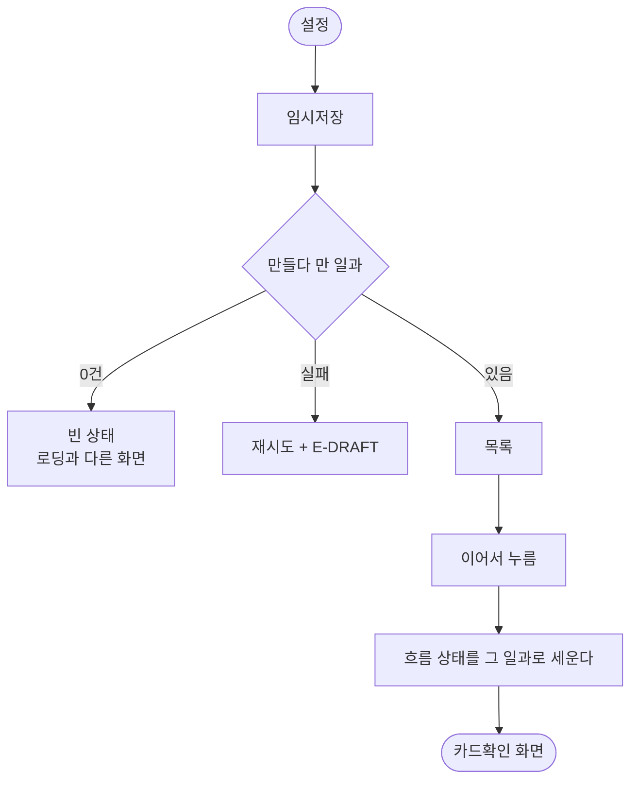

# 설정 화면을 시안에 맞추고 임시저장을 만든다

## 개요

새로 나온 설정 시안(`1022:4467` 외 5개)에 화면을 맞추고, 시안에만 있고 앱에는 없던 **임시저장**을 만들었다.

## 기능 흐름

## 변경 사항

### 토큰

- `app_typography.dart`: `settingsTileLabel` (Pretendard 400/16)
- `app_colors.dart`: `settingsDestructive`(`#DA5050`) · `settingsChevron`(`#CDCDCD`)

### 화면

- `settings_tile.dart`: 줄 높이 60 고정 · 안쪽 여백 16 · **구분선 제거** · 회원탈퇴 w500
- `guardian_settings_screen.dart`: `임시저장` 행 추가(두 번째) · `회원 탈퇴` → `회원탈퇴`
- `draft_routines_screen.dart`(새 파일): 임시저장 목록 · 빈 상태 · 실패 상태
- `routine_repository.dart`: `draftRoutinesProvider`
- `routine_notifier.dart`: `resumeDraft()`
- `app_router.dart`: `Routes.guardianDrafts`

## 주요 구현 내용

### 구분선이 없다는 것을 어떻게 확정했나

Figma 노드에는 줄마다 `RECTANGLE 361×60`이 있는데 **채움도 선도 없다** — 누르는 자리일 뿐이다. 렌더 이미지에서는 줄 사이에 옅은 선이 있는 것처럼 보였다.

그래서 **픽셀을 직접 쟀다.** 줄 경계(y=207·267·327)에서 위아래 4px씩 훑으니 배경값 `247`이 끊기지 않고 이어진다. 선이 없다. 지금 구현에는 `border`가 있었으므로 뺐다.

### 회원탈퇴 색을 `danger`와 나눈 이유

기존 `danger`는 `#BB3F38`이고 시안은 `#DA5050`이다. **값이 다르다.** danger는 팝업 버튼처럼 넓은 면을 채울 때 쓰는 짙은 쪽이고, 이건 글자 하나에 쓰는 밝은 쪽이다. 같은 값으로 합치면 목록에서 그 줄만 너무 어둡게 보인다.

### 임시저장은 시안이 비어 있다

`설정_임시저장`(1045:4910)에 **헤더 `임시저장`만 있고 내용이 없다.** 디자인이 아직 안 나왔다.

그래서 **이 앱에 이미 있는 것들로만** 짰다. 새 시각 언어를 만들면 시안이 나왔을 때 두 번 고치게 된다.

서버의 `PENDING_REVIEW`가 곧 임시저장이다 — 카드까지 만들어졌지만 보호자가 아직 확인하지 않은 상태. 전용 API를 두지 않고 내 일과 목록에서 걸러 쓴다. 한 보호자의 일과가 많지 않아서다. 길어지면 서버에 상태 필터를 다는 편이 낫다.

**`승인 대기`라 부르지 않는다.** 만들다 만 것이지 심사가 아니다 (용어 규칙).

### 보호자 홈 타일을 재사용하려다 접었다

이슈에는 "보호자 홈의 `RoutineSummaryTile`을 쓴다"고 적었는데, 실제로 얹어 보니 **고정 높이 안에서 43px 넘쳤다.**

그 타일은 진행률 링·예정일·다시하기를 전제한다. 임시저장에는 셋 다 없다. 없는 것을 그리는 자리를 비워 두느니 **필요한 것만 담은 줄**(제목 + `이어서`)을 따로 뒀다.

`이어서`를 글자로 적은 것도 이유가 있다. 화살표만 두면 눌러 보기 전에는 무엇이 되는지 모른다.

## 검증

`flutter analyze` 무이슈, `flutter test` **742개 통과** (임시저장 3개 신규).

| 테스트 | 무엇을 고정하나 |
|---|---|
| 만들다 만 일과만 보인다 | `CONFIRMED`·`COMPLETED`가 섞이지 않는다 |
| 0건이면 빈 상태 | 로딩과 구분된다 |
| 실패하면 재시도 + 코드 | 무한 로딩이 아니다 |

기존 설정 테스트의 기대값도 시안값으로 갱신했다(`회원탈퇴` 문구, `settingsDestructive`, w500).

## 주의사항

### 버전 표시는 남겼다

시안에 없지만 **빼지 않았다.** 스토어 심사·제보 대응에 필요해서 #289로 넣은 것이다. 시안이 그리지 않은 것이지 빼라고 한 것이 아니다.

### 대조 렌더를 아직 안 올렸다

`설정`·`설정_임시저장`이 시안 대조 장치에 올라가 있지 않다. **안 올라간 화면은 어긋나도 아무도 모른다.** 이번에 맞춘 값이 다음 수정에서 밀려도 드러나지 않으므로 올리는 것이 맞다.

### 임시저장 디자인이 나오면 다시 본다

지금 목록 줄·빈 상태 문구는 전부 내가 정한 것이다. 시안이 나오면 그대로 맞춘다.
