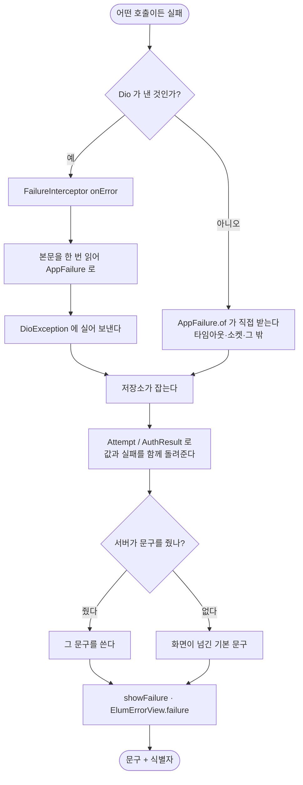

# 서버 에러를 앱 전역 한 곳에서 받는다

## 개요

서버가 `@RestControllerAdvice` **하나로** 하는 일을 앱에도 만들었다.

```
서버   throw CustomException(ErrorCode.X)
       → @RestControllerAdvice → {errorCode, errorMessage} + status

앱     어떤 호출이든 실패
       → ① FailureInterceptor(onError)   본문 파싱·로그를 여기서 한 번만
       → ② AppFailure.of(error)          문구·코드 판정을 여기서만
       → ③ showFailure / showFailureSnack / ElumErrorView.failure
```

| | 전 | 후 |
|---|---|---|
| 앱이 **직접 지어낸** 실패 문구 | **21개 파일** | **0** |
| 서버 문구·코드를 쓰는 곳 | 2곳 | **18개 파일 전부** |
| 연결 실패·타임아웃 | 통로 없음 | `E-NET-OFFLINE` · `E-NET-TIMEOUT` |

## 기능 흐름



## 무엇이 문제였나

`ServerError`(#347)를 만들어 두고도 **호출부가 각자 붙여야 해서** 두 군데밖에 안
붙었다. 나머지 21개 파일은 자기 문구를 지었다. 그래서 서버가
`MEMBER_SUSPENDED`("정지된 계정이에요")를 보내도 화면에는 **"잠시 후 다시 해주세요"**
가 떴다 — 사용자는 될 때까지 다시 누른다.

### 실패가 저장소 안에서 사라지고 있었다

더 깊은 문제가 있었다. 이 앱의 저장소는 예외를 올리지 않는다(호출부마다 catch 가
흩어지고 화면이 죽는다). 그러다 보니 실패가 **`false` 나 `null` 로 납작해져**,
서버가 알려준 이유가 화면까지 오지도 못했다.

```dart
Future<bool> updateStep(...)      // 실패했다는 것만 안다. 왜인지는 모른다
Future<Routine?> duplicate(...)   // null — 이유 없음
```

그리고 `auth_repository` 는 실패를 `lastServerError` **필드**에 담아 두고 화면이
나중에 꺼내 봤다. **실패는 그 호출의 결과지 저장소의 상태가 아니다** — 요청이
겹치면 엉뚱한 실패를 보여줄 수 있었다.

## 주요 구현 내용

### ① 인터셉터 — 호출부가 JSON 을 만지지 않는다

`onError` 에서 본문을 한 번 읽어 [AppFailure] 로 바꾸고 `DioException.error` 에 실어
보낸다. 로그도 여기서 한 줄로 남긴다.

> **맨 뒤에 붙인다.** 앞의 인증 인터셉터가 토큰을 갱신해 요청을 되살리면
> (`handler.resolve`) 그건 실패가 아니다. 먼저 붙이면 되살아날 401 까지 실패로 남고
> 점검 인터셉터의 판단보다 먼저 끼어든다.

### ② 배지는 구체적인 것부터 — `E-HTTP-500` 은 쓸모가 없다

| 아는 것 | 배지 | 왜 |
|---|---|---|
| 서버 코드 | `MEMBER_SUSPENDED` | 무엇이 문제인지까지 말한다 |
| 연결 실패 | `E-NET-OFFLINE` | 서버 잘못이 아니다 |
| 상태 코드만 | **`E-1001/500`** | 자리와 종류를 **함께** 남긴다 |
| 아무것도 | `E-1001` | 화면이 준 자리 코드 |

처음에는 `E-HTTP-500` 으로 냈는데, 그러면 **어느 화면에서 터졌는지를 잃는다.**
제보를 받은 사람은 코드로 코드베이스를 찾는데 `E-HTTP-500` 은 어디에도 없다.

### ③ 저장소가 이유를 들고 나오게 했다

`Attempt<T>` · `AuthResult` · `RedeemResult` 로 값과 실패를 함께 돌려준다.
`updateStep` · `updateReward` · `reorder` · `reorderSteps` · `delete` · `duplicate` ·
`agree` · `deleteAccount` · 회원 정보 저장 셋이 모두 바뀌었다.

### ④ 연결 실패도 같은 통로로

연결 없음·타임아웃·취소·인증서는 `errorCode` 자체가 없어 잡을 자리가 없었다.
`NetworkFault` 로 묶어 같은 모달로 보여준다 (#341 의 뿌리).

**앱이 스스로 끊은 요청(`cancel`)은 아무것도 띄우지 않는다** — 사용자가 한 적 없는
실패를 보여주는 꼴이 된다.

## 만들면서 알게 된 것

### Riverpod 3 은 실패한 로드를 스스로 다시 부른다

끝에서 끝까지 보는 테스트를 쓰다 발견했다. `DioException` 을 던지면 화면이 계속
로딩이었는데, **Riverpod 3 이 기본으로 재시도**하고 있었다. `Exception` 계열만
재시도하고 `Error` 는 프로그래밍 실수로 보고 하지 않는다 — 그래서 `StateError` 는
바로 에러 화면이 뜨고 `DioException` 은 안 떴다.

테스트에서는 `ProviderScope(retry: (count, error) => null)` 로 끈다.
**앱 동작 자체는 그대로 둔다** — 일시적 실패를 자동으로 다시 부르는 것은 이득이다.

### `dio` 의 실패 유형에 `default` 를 두지 않았다

`switch` 를 다 열거해 두면 dio 가 새 유형을 더할 때 **컴파일이 막혀 사람이 판단**하게
된다. 실제로 `transformTimeout` 이 있어서 한 번 막혔고, 타임아웃 묶음에 넣었다.
`default` 로 뭉뚱그렸으면 조용히 `앱 오류` 가 됐을 것이다.

## 변경 사항

### 새 파일

- `core/network/app_failure.dart` — `AppFailure` · `NetworkFault` · `Attempt<T>`
- `core/network/failure_interceptor.dart` — 받는 쪽 전역 처리기
- `core/widgets/show_failure.dart` — `showFailure` · `showFailureSnack`

### 고친 곳

- `core/network/dio_client.dart` — 인터셉터를 **맨 뒤에** 등록
- `core/widgets/elum_error_view.dart` — `ElumErrorView.failure` 추가
- 저장소 6개 · 화면 12개 (목록은 diff)

### 테스트

- `app_failure_test.dart` (16) — 서버 문구 우선·본문이 깨져도 안 죽음·네트워크 실패
- `failure_reaches_screen_test.dart` (3) — **끝에서 끝까지**. 서버 문구가 화면에
  그대로 뜨는지, 아무 말 없으면 화면 문구가 나서는지, 연결이 끊기면 코드로 갈리는지
- `auth_test.dart` — 서버가 준 문구가 결과에 실려 오는지 2건 추가

## 검증

```
flutter analyze   No issues found!
flutter test      769 passed
앱이 지어낸 실패 문구   21개 파일 → 0
```

## 주의사항

- **`ServerErrorCode` 에 네트워크 코드를 넣지 않는다.** 그 enum 은 서버
  `ErrorCode.java` 와 1:1 이고 `server_error_sync_test.dart` 가 지킨다. 연결 실패는
  서버가 모르는 일이라 `NetworkFault` 에 따로 둔다.
- **기본 문구를 없애지 않는다.** 서버가 문구를 못 줄 수도 있고 화면마다 맥락이
  다르다. 화면이 기본 문구를 넘기되 서버 문구가 있으면 항상 그쪽이 이긴다.
- 새 화면을 만들 때 `ElumErrorView(message: ...)` 를 **손으로 적지 않는다.**
  `ElumErrorView.failure(error, fallback: ..., fallbackCode: ...)` 를 쓴다.
  손으로 적으면 서버가 이유를 알려줘도 앱 문구가 덮는다.
- 팝업(`showFailure`)이냐 스낵바(`showFailureSnack`)냐는 **되돌릴 수 있는가**로
  정한다. 다음 화면으로 넘어가면 다시 시도할 수 없게 되는 실패는 팝업으로 막는다.
