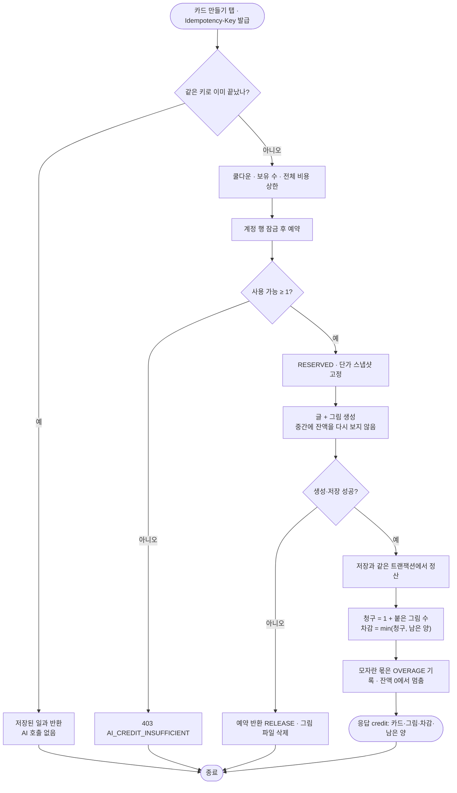

# 무료 크레딧 운영과 보호자 설정 표시

## 개요

회원 계정마다 매주 AI 크레딧 100을 주는 장부를 서버에 만들었다. 차감은 AI 호출 횟수가 아니라 **사용자가 받은 결과물** 기준이다: 저장된 일과 1건당 1, 카드에 실제로 붙은 AI 그림 1장당 1. 잔액이 1 이상일 때 시작한 일과는 그림이 몇 장이든 끝까지 만들어지고 잔액은 0에서 멈춘다. 모자란 만큼은 "초과"로 기록한다. 이 장부를 일과 생성·추가 질문·수동 카드 그림에 연결했고, 운영자가 정책·회원·작업·원가를 다루는 관리자 화면 다섯 개를 더했다. 보호자 설정 화면에는 이번 주 크레딧 카드를 두었다. 커밋 `26ec9c3`(설계·계획) · `1132fa6`(서버) · `5453446`(앱).

**설계 단계 합의**

| 항목 | 결정 |
| --- | --- |
| Free AI 그림 | 켠다. #247 픽토그램은 보류 |
| 수동 카드 그림 | 서버 `POST /steps` 에서 `generateImage` 로 명시할 때만. 설명만 있으면 그림을 자동으로 만들던 동작은 없앴다 |
| 정책 시작 | 배포 즉시 켜진다. 관리자 화면에서 끌 수 있고, 끄면 예전 횟수 한도로 돌아간다 |
| 재가입 | 장부를 유지한다. 소셜 신원의 해시로 이어 붙인다 |
| 장부 오류 | 막는다(fail-closed, 503) — 조용히 무제한이 되면 원가가 샌다 |

## 기능 흐름

## 변경 사항

### 서버 — 장부 (`credit/` 새 도메인)
- `db/migration/V26__create_ai_credit.sql`
  - 표 6개(계정·적립 묶음·작업·원장·정책 버전·설정 변경 이력)와 `ai_call_log.credit_job_id` 를 추가한다.
  - 정책 v1 을 넣는다: FREE·PRO 주 100, 일과 글 1, 그림 1, 예약 15분.
  - 활성·정지 회원 전원에게 계정과 이번 주 100 을 넣는다. 탈퇴 회원은 제외하고, 과거 호출은 소급하지 않는다. `IF NOT EXISTS`·`ON CONFLICT` 로 여러 번 돌려도 결과가 같다.
- `credit/infrastructure/entity/*`, `repository/*`: 계정 행을 `PESSIMISTIC_WRITE` 로 잠그는 조회, 원장 합계 쿼리.
- `CreditPolicyService`
  - 현재 정책을 30초 캐시로 읽는다.
  - 정책은 수정하지 않고 새 버전으로 발행한다.
  - `grantPolicyFor(주)`: 이번 주 지급량은 **주 시작 시각에 유효하던 버전**에서 읽는다. 그 주 안에 IMMEDIATE 로 발행한 버전이 있으면 그것을 쓴다.
- `CreditAccountService`
  - 잠금 조회를 먼저 하고 잠근 뒤 `refresh` 한다.
  - 이번 주 지급은 첫 요청 때 만들고, 지난 주 잔여는 EXPIRE 로 정리한다.
  - 잔액을 계산하고 재가입을 연결·분리한다.
- `CreditReservationService`: `reserve` / `settle` / `release` / `expireStale` / `findSettledRoutineId`.
- `CreditQueryService`, `CreditController`: `GET /api/credits/me`.

### 서버 — 연결
- `RoutineService.create`: 같은 키로 이미 정산된 일과는 가드보다 먼저 확인해 돌려준다. 그 밖에는 예약 → 생성 → 정산, 실패하면 반환한다. 추가 질문은 잔액이 0 이면 AI 를 부르기 전에 403.
- `RoutineCreationWriter.save`: 일과 저장과 정산이 같은 트랜잭션이다. `loadSaved` 는 볼 권한을 다시 확인한다.
- `RoutineStepImageFiller`, `addStep`: `generateImage` 를 줄 때만 그림을 예약한다. 초과는 허용하지 않고, 모자라면 카드만 저장하고 `imageSkippedReason` 을 준다. 그림이 붙으면 정산하고 그 밖의 모든 출구에서 반환한다.
  - 원래 버그도 같이 고쳤다: 새 카드 id 가 null 이라 수동 카드 그림이 늘 실패했다.
- `RoutineQuotaGuard`: 크레딧이 켜져 있으면 하루·주간 횟수를 보지 않는다. 보유 수 한도는 유지.
- `AiCallContext`, `AiCallLogService`: 모든 AI 호출 기록에 작업 id 를 남긴다. 재시도·대체 호출까지 한 작업에 묶인다.
- `OAuthLoginService`, `WithdrawnMemberService`: 새 가입 커밋 뒤에 장부를 다시 연결하고, 완전 삭제 때는 member 참조만 뗀다.
- `ErrorCode`: `AI_CREDIT_INSUFFICIENT`(403), `AI_CREDIT_JOB_IN_PROGRESS`(409), `AI_CREDIT_ACCOUNT_FROZEN`(403), `AI_CREDIT_UNAVAILABLE`(503).

### 서버 — 관리자
- `AdminCreditController`, `AdminCreditService`(쓰기·미리보기), `AdminCreditQueryService`(읽기), `templates/admin/credits*.html`:
  - 개요: 주 선택, 지급·사용·예약·남음·초과·반환·소진, 모델별 실제 USD, 크레딧당 원가, 경고(멈춘 예약·대조 불일치·꺼짐·비용 상한)
  - 회원별: 검색·정렬·필터
  - 회원 상세: 지급·차감·동결 조정. 미리보기 → 확정, 사유는 필수이고 200자까지. 작업별 실제 USD, 수동 반환, 원장
  - 정책: 발행 전 영향 미리보기(지난 4주 기반 소진 회원·예상 USD), 끄기는 한 번 더 확인
  - 작업 탐색
- `SystemConfigService`, `settings.html`: 모든 설정 변경을 변경자·이전 → 새 값·사유로 남긴다. 비밀값은 `••••` 로 적는다.

### 앱
- `features/credit/*`: `CreditSummary` 는 필수 필드가 빠지면 0 대신 실패로 다룬다. `creditSummaryProvider`, 홈 시작 게이트(3초 제한).
- `ai_credit_card.dart`, `ai_credit_summary_view.dart`: 설정 카드. 상태는 로딩·정상·보너스·잔액 11 미만·0·진행 중·실패(`E-CREDIT`)·꺼짐. 새 색 토큰 6개와 글자 토큰 4개.
- `guardian_settings_screen.dart`: 카드를 넣었고, 글꼴 2.0 에서 넘치지 않게 목록을 스크롤로 바꿨다.
- `guardian_home_screen.dart`: 잔액으로 시작할 수 없으면 팝업을 띄운다. 조회가 실패하거나 3초를 넘기면 들여보낸다. 확인하는 동안 두 번 누르면 무시한다.
- `routine_notifier.dart`, `routine_repository.dart`, `idempotency_key.dart`:
  - 생성 요청에 멱등 키를 붙인다. 다시 하기는 같은 키, 입력을 바꾸면 새 키.
  - 응답의 `credit` 을 읽는다.
  - 추가 질문에서 크레딧 차단 코드를 받으면 실패로 올려 준비 단계에서 멈춘다.
- `routine_loading_screen.dart`: 크레딧 부족·진행 중·동결이면 `다시 하기` 대신 `홈으로`.
- `credit_low_notice.dart`, `credit_usage_line.dart`: 추가 질문·보상 화면 버튼 위 안내, 카드 확인 머리 아래 `AI 그림 N장 · M크레딧 사용 · K 남음`.

## 주요 구현 내용

**계정 한 행을 잠금 지점으로 두었다.** 예약·정산·반환·관리자 조정·정책 즉시 적용이 모두 같은 계정 행을 `FOR UPDATE` 로 잠근 뒤에 일어난다. 쿨다운·스로틀은 서버 메모리라 서버가 늘면 소용없지만, 행 잠금은 DB 에 있어 여러 서버에서도 순서가 선다. 잠금 순서는 모든 경로에서 이룸이 행 → 계정 행으로 같아 교착이 없다.

**잔액을 칸 하나에 두지 않고 적립 묶음으로 나눴다.** 주간 지급, 관리자 보너스, 나중의 구매 충전이 각각 만료를 가진 묶음이고, 차감은 만료가 가까운 묶음부터 한다. 그래서 보너스를 줘도 주간분이 먼저 빠지고, 새 과금 행동이나 플랜별 지급량은 정책 JSON 키만 늘리면 된다. 주간 지급은 스케줄러 없이 그 주 첫 요청 때 만든다. 쉬는 회원에게 행이 쌓이지 않고, 여러 서버에서 두 번 지급되지 않는다.

**원장의 delta 는 "사용 가능량의 변화"다.** 원장을 모두 더하면 사용 가능량이 된다. 정산은 `RELEASE +예약량` 다음에 묶음별 `CONSUME −차감량` 을 남긴다. 그래서 "반환 건수"는 원장의 RELEASE 줄이 아니라 작업 상태(RELEASED/EXPIRED)로 센다 — 관리자 집계가 이렇게 한다.

**정산을 일과 저장과 같은 트랜잭션에 넣었다.** 일과는 저장됐는데 크레딧은 안 빠지는 경우와 그 반대가 없다. AI 생성은 20초 안팎이 걸려 트랜잭션 밖에서 하고, 시작 때 짧은 트랜잭션으로 1만 예약해 둔다. 같은 회원의 동시 요청이 둘 다 "잔액 1"을 보고 시작하지 못하게 하는 장치가 이 예약이다.

**거절은 트랜잭션이 끝난 뒤에 던진다.** 수동 카드 추가는 카드 저장 트랜잭션 안에서 그림을 예약한다. 거절을 예약 트랜잭션 안에서 던지면 바깥 트랜잭션까지 롤백 전용이 되어 "카드는 저장하고 그림만 건너뛰기"가 안 된다.

**로컬 Postgres 리허설로 실측한 것** (운영과 같은 순서: develop 코드로 스키마 → 기존 회원 샘플 → V26 → 새 코드 기동. AI 키는 가짜로 덮어써 비용 0)

| 확인 | 결과 |
| --- | --- |
| V26 두 번 적용 | 두 번째는 전부 건너뜀. 탈퇴 회원 제외, 신원 둘인 회원은 가장 오래된 신원으로 키 생성, 신원 없는 회원도 100 |
| Postgres `sha256` ↔ Java 해시 | 같은 값 |
| 새 코드 기동 뒤 스키마 | JPA 가 한 줄도 바꾸지 않음 — 엔티티와 V26 일치 |
| `GET /api/credits/me` | 스펙 필드 그대로 |
| 관리자 화면 다섯 개 + 설정 | 모두 200. 차감 미리보기 `100 → 1` 과 실제 반영이 같고, 원장에 관리자 아이디·사유가 남음 |
| AI 실패 | RESERVE −1 → RELEASE +1, 잔액 원복, `ai_call_log` 에 작업 id 연결 |
| 잔액 1 에서 수동 그림 3건 동시 | 1건만 예약, 2건은 카드만 저장 + `AI_CREDIT_INSUFFICIENT` (리뷰 수정 뒤 다시 확인) |
| 예약이 걸린 동안 새 일과 | 403 (예약분은 쓸 수 없는 양) |
| 잔액 0 에서 생성·추가 질문 | 둘 다 403, `ai_call_log` 증가 0, 작업 행 없음 |

**검증 수치**: 서버 `./gradlew test` 885 통과. 앱 `flutter analyze` 무이슈, `flutter test` 1150 통과. 앱 쪽에서 바뀐 렌더는 설정 대조 렌더 한 장뿐이다(위 이미지). 크레딧 정보가 없으면 새 요소를 그리지 않아 다른 골든은 바이트 그대로다.

**독립 리뷰에서 잡아 고친 것**
- 다음 주부터(NEXT_PERIOD) 로 발행해도, 이번 주에 아직 요청하지 않은 회원은 새 지급량을 바로 받았다.
- 잠그기 전에 읽은 계정 상태(동결 여부)를 그대로 썼다.
- 반환된 수동 그림 작업을 정산하면 초과가 남았다.
- 관리자 사유가 500자를 넘으면 오류 페이지가 떴다.
- 같은 키 재요청이 보유 수 한도·쿨다운에 먼저 막혔다.
- 앱이 추가 질문의 403 을 "질문 없음"으로 삼켰다.
- 홈에서 두 번 누르면 입력 화면이 두 번 쌓였다.

## 주의사항

- **확인하지 못한 것**
  - **AI 생성이 성공했을 때의 정산**은 실제로 밟지 않았다. 생성 API 를 부르면 비용이 나기 때문이다. 산식(잔액 1·그림 8 → 차감 1·초과 8·잔액 0 / 그림 4 → 5)은 단위 테스트로만 고정했다. 배포 뒤 운영에서 일과 1건을 만들어 원장과 `ai_call_log` 연결을 확인해야 한다.
  - 운영 배포 뒤 V26 이 실제 운영 데이터에 적용되는 것은 아직 보지 않았다. 로컬 리허설은 샘플 데이터였다.
- **배포 뒤 해야 하는 일**
  - 관리자 공지(`app_notice`)의 `하루 2개·주 10개` 문구를 이슈의 새 문구로 교체한다. 코드가 아니라 운영 DB 행이라 이 작업에 포함되지 않는다.
- **확인이 필요한 것**
  - **개인정보처리방침**: 탈퇴 뒤에도 소셜 신원의 SHA-256 해시를 남긴다(재가입 남용 방지). 방침에 적혀 있는지 확인이 필요하다. 법적 문구라 이 작업에서 바꾸지 않았다.
  - **시안 밖 요소 두 곳**(추가 질문·보상 화면의 잔액 안내, 카드 확인의 사용량 한 줄)은 이슈가 요구한 표시이지만 Figma 에 없다. 디자이너 확인이 필요하다. 설정 카드의 큰 숫자는 시안의 37 이 아니라 32 로 두었고(토큰 하나로 바꿀 수 있다), 시안의 `무료 이용` 배지는 "플랜 표시 없음" 규칙 때문에 뺐다.
- **나중에 건드리면 위험한 곳**
  - `CreditAccountService.lockAccount` 는 잠근 뒤 `refresh` 한다. 잠그기 전에 계정 필드를 바꾸고 flush 하지 않은 채 다시 잠그면 그 변경이 덮인다.
  - 정산을 `RoutineCreationWriter.save` 트랜잭션 밖으로 옮기면 "저장됐는데 안 빠진" 일과가 생긴다.
  - `CreditReservationService.reserve` 의 거절을 트랜잭션 템플릿 안으로 옮기면 수동 카드 추가에서 카드까지 롤백된다.
  - 지급량 결정은 `grantPolicyFor(주)` 한 곳이다. `current()` 로 바꾸면 NEXT_PERIOD 가 다시 이번 주로 샌다.
- **남은 한계**
  - 같은 키의 재요청이라도 **실패로 반환된** 작업이면 다시 예약하고 새로 생성한다. 이것은 의도한 동작이다. 이미 끝난 작업만 AI 없이 돌려준다.
  - 그림은 붙었는데 정산이 실패하면 그 그림 1장은 무료로 둔다. 원장에 빚을 남기지 않는 쪽을 택했다.
  - 관리자 회원별 표는 한 주 전체를 메모리에서 정렬한다. 계정이 수천 개를 넘으면 SQL 로 옮겨야 한다.
  - 기존 `ai_call_log` 비용 정책과 마찬가지로 여러 서버 간 설정 캐시는 최대 30초 늦게 반영된다.
