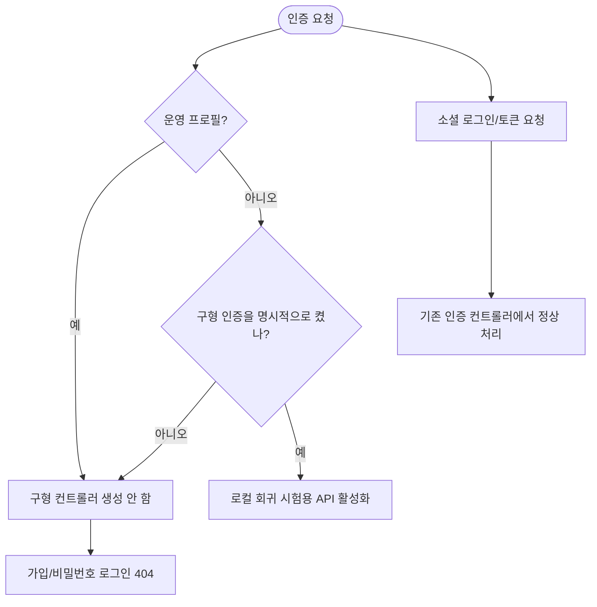

# 구형 이름 가입 계정 완전 삭제

## 개요

중간 심사 이전 APK와 과거 수동/E2E에서 생성된 구형 비밀번호 계정을 운영 DB에서 정리했다.
현재 앱의 소셜 로그인 계정은 보존했고, 구형 APK가 다시 계정을 만들지 못하도록 비밀번호 가입/로그인
API를 운영 프로필에서 차단했다. 이 보고서에는 집계값만 기록하며 개인 식별값과 접속정보는 포함하지 않는다.

## 기능 흐름

## 변경 사항

### 운영 데이터 정리

- 구형 비밀번호 계정 89건, 연결 프로필 83건, 일과 68건을 단일 트랜잭션으로 삭제했다.
- 소셜 인증 계정 6건은 모두 보존했다.
- AI 호출 및 크레딧 운영 통계는 공식 완전삭제 정책에 따라 회원 식별자만 제거하고 익명 집계로 남겼다.
- 사후 조회에서 구형 계정, 고아 프로필, 끊어진 일과 작성자/세션/휴대폰 연결/구독이 모두 0건임을 확인했다.

### 구형 인증 API 차단

- `AuthController`: 소셜 로그인, 토큰 갱신, 로그아웃만 담당하도록 구형 비밀번호 메서드를 분리했다.
- `LegacyPasswordAuthController`: 구형 가입/로그인을 제거 예정 API로 표시하고 운영이 아닌 프로필에서만 조건부 생성한다.
- `application.yml`: 구형 인증 기능의 기본값을 비활성화했다.
- `e2e_auth_test.sh`: 기본 대상을 localhost로 바꾸고 운영 주소 실행을 요청 전에 거부한다.

### 문서와 테스트

- 운영 차단 설계와 실패 경로를 `docs/superpowers/specs/`에 기록했다.
- 기본 비활성화, 개발 환경 명시 활성화, 운영 환경 강제 비활성화를 테스트로 고정했다.
- 코드 리뷰 결과 Critical/Major/Minor 이슈가 없음을 기록했다.

## 주요 구현 내용

설정 기본값만 끄면 운영 환경변수 오설정으로 API가 다시 열릴 수 있다. 그래서 기본값 `false`와
`prod` 프로필 제외를 함께 적용했다. 운영에서는 설정값과 무관하게 컨트롤러 빈이 생성되지 않는다.
반면 과거 인증 회귀 시험이 필요할 때는 운영이 아닌 로컬 서버에서만 명시적으로 기능을 열 수 있다.

구형 메서드를 기존 인증 컨트롤러에서 떼어냈기 때문에 현재 앱이 쓰는 소셜 로그인, 토큰 회전,
로그아웃 경로는 조건부 빈의 영향을 받지 않는다.

## 검증

- 전체 서버 테스트 911건 통과
- `git diff --check` 통과
- 운영 DB 재조회: 회원 6건 모두 소셜 인증 연결, 구형 비밀번호 계정 0건
- 고아 프로필 및 회원 참조가 끊긴 관련 데이터 0건
- 커밋: `79fb0b1`
- 원격 기능 브랜치 푸시 완료

## 주의사항

- DB 정리는 운영에 반영됐지만 API 차단 코드는 아직 기능 브랜치에 있어 운영 서버에는 배포되지 않았다.
- 운영 차단 완료 판정은 develop 반영, 배포, 운영 엔드포인트 404 실측 후에 한다.
- 이슈는 배포 검증 전까지 `작업중`으로 유지한다.
