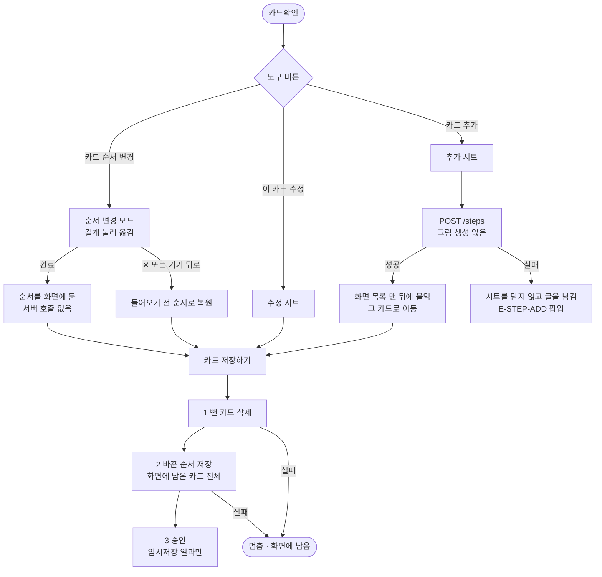

# ⚙️[기능추가][클라][카드확인] 시안 기준 버튼 3개, 순서 변경, 카드 수정/추가 시트

## 개요

보호자 카드확인을 새 시안 5장(`1173:5541` 기본 · `1197:5798` 순서 변경 · `1197:5923` 수정 시트 · `1197:6161` 수정 시트+키보드 · `1197:6044` 추가 시트)대로 바꿨다. **시안을 유일한 기준으로 삼았고**, 시안끼리·시안과 서버가 어긋난 곳은 전부 시안 쪽으로 정했다. 서버는 바꾸지 않았다(이미 있던 `POST /steps`, `PATCH /steps/order` 사용).

- 브랜치 `20260929_#444_기능추가_클라_카드확인_시안_기준_버튼_3개_순서_변경_카드_수정_추가_시트` (커밋 1개, 푸시 전)
- 설계 문서 `docs/superpowers/specs/2026-09-29-card-review-redesign-design.md`

## 기능 흐름

## 시안과 앱 렌더 대조

왼쪽이 시안, 오른쪽이 앱 렌더다. 글줄 위치는 다섯 장 모두 시안과 **1px 안에서 맞고**, 속성 대조(모서리·면 색·이펙트)는 **이상 없음**이다. 남은 차이는 카드 안 그림(시안은 셔츠 입은 고양이, 앱은 AI 생성/대체 캐릭터)과 글자 렌더 차이, 키보드(iOS가 그림)뿐이다.

### 1. 기본 (1173:5541)

### 2. 순서 변경 (1197:5798)

### 3. 수정 시트 (1197:5923)

### 4. 수정 시트 + 키보드 (1197:6161)

### 5. 추가 시트 (1197:6044)

## 변경 사항

### 화면
- `client/lib/features/guardian/presentation/card_review_screen.dart`: 하단을 도구 버튼 3개로 바꾸고 순서 변경 모드(`_reorderMode`)·카드 추가·`✕`/완료를 붙였다. 크레딧 줄(`CreditUsageLine`)은 이 화면에서 뺐다.
- `client/lib/features/guardian/presentation/widgets/card_review_parts.dart`(신규): 머리·보상 줄·도구 버튼·순서 안내·순서 모드 상단바·순서 목록·빈 화면.
- `client/lib/features/guardian/presentation/widgets/card_edit_sheet.dart`: 수정과 추가가 함께 쓰는 시트로 다시 만들었다(높이 450/488, 키보드가 오르면 y=82까지 자람, 제출 콜백으로 실패 시 열어 둠).
- `client/lib/features/guardian/presentation/widgets/routine_flow_scaffold.dart`: `topBar`·`showDraftAction`·`bottomFigmaInset` 추가. 기존 화면의 동작은 그대로다.

### 상태·저장소
- `client/lib/features/guardian/application/routine_notifier.dart`: `addStep`·`moveStep`·`snapshotOrder`·`restoreOrder` 추가, `save()`에 순서 저장 단계 추가, 뺀 카드 삭제를 `_deleteRemovedSteps` 로 뺐다.
- `client/lib/features/guardian/data/routine_repository.dart`: `addStep`(`POST /api/routines/{id}/steps`) 추가.

### 토큰·에셋·문서
- `app_colors.dart`(색 5) · `app_typography.dart`(글자 6) · `app_assets.dart` · `assets/images/icon_{interlining,pencil_edit,plus,close,sparkles_head}.svg`
- `client/docs/design-system.md`·`figma-frames.md`·`motion.md`, `docs/figma/i444/x1/`(시안 export 5장)

### 테스트
- 신규 60개: `card_review_redesign_test.dart`(31) · `card_review_add_reorder_test.dart`(22) · `card_step_repository_test.dart`(7). 옛 시안 문구 기준 테스트 갱신, 저장소 가짜 구현 10곳에 `addStep` 추가.
- 시안 대조 렌더 5장(`test/figma/card_*_*.png`)을 `figma_conformance_test.dart` 에 추가.

## 주요 구현 내용

- **순서는 로컬에 두고 `카드 저장하기`가 보낸다.** 서버 순서 API는 카드 전체를 요구한다(개수가 다르면 400). 그런데 카드 X로 뺀 카드는 저장 전까지 서버에 남아 있어서(#405), 옮길 때마다 보내면 항상 실패한다. 그래서 저장 순서를 **삭제 → 순서 → 승인**으로 고정했다(승인하는 순간 이룸이 화면에 카드가 나가므로 순서가 맞은 채로 나가야 한다).
- **카드 추가는 즉시 서버로 간다.** 새 카드의 id를 서버가 줘야 이후에 고치고 옮길 수 있다. 응답 목록을 그대로 쓰지 않고 **새로 생긴 카드만 뽑아 화면 목록 맨 뒤에 붙인다** — 서버 목록에는 보호자가 이미 뺀 카드가 남아 있어 그대로 쓰면 되살아난다.
- **그림은 만들지 않는다.** 시안에 고르는 자리가 없고, `generateImage` 를 주면 서버가 크레딧을 쓴다(#407).
- **실패하면 시트를 닫지 않는다.** 시트가 제출 콜백의 결과(true/false)로 닫힘을 정한다. 쓴 글이 사라지지 않는다.

### 시안 결정 (사용자 지시: "무조건 디자인이 기준")

| 어긋남 | 결정 |
|---|---|
| 머리 아래 `AI 그림 N장 · M크레딧`(#407) | 이 화면에서 뺐다 |
| 카드 추가의 그림 선택 | 두지 않았다 |
| 순서 모드의 카드 X | 숨겼다 |
| 추가 시안의 잔재 `설명`(`1197:6160`) · 버튼 이름 `메일 복사 버튼` | 그리지 않았다 |
| 카드 그림자 | 넣었다(#401의 "없앰"을 새 시안이 뒤집음) |
| 상단 `임시저장` | 홈 버튼과 같다(나가기 팝업 후 나감) — 사용자 결정 |

## 실기기 검증 (Android 에뮬레이터, 서버·AI 호출 없음)

개발자 도구에 카드확인 지름길이 없고 일과를 만들면 AI 비용이 들어, **임시 QA 진입점**(커밋 안 함)으로 진짜 위젯·렌더러·터치·키보드를 밟았다.

| 밟은 것 | 결과 |
|---|---|
| 기본 화면 | 시안과 같음 |
| 순서 변경 모드 진입 | 상단 `✕`+제목, 안내 문구, 눌린 버튼, 나머지 버튼 흐림, 카드 X 없음 |
| 카드 길게 눌러 끌기 | 순서가 바뀌고 **번호는 자리대로 다시 매겨짐**(가장자리 자동 스크롤로 첫 카드가 3칸 이동) |
| `✕` | 들어오기 전 순서로 정확히 복원 |
| 순서 모드에서 기기 뒤로 | 나가기 팝업 없이 모드만 닫힘 |
| 카드 추가 + 실제 키보드 | 시트가 y≈82dp까지 자라고 입력칸이 키보드 위에 남음, 빈 곳을 누르면 키보드가 내려가고 `추가하기`가 보임, 6번째 카드가 맨 뒤에 붙고 그 카드로 이동, 머리가 `카드 6개` |
| 카드 수정 + 키보드 | 값 채워져 열림, 고친 제목이 카드에 반영됨(설명은 유지) |
| 임시저장 | `임시저장에 두고 나갈까요?` 팝업 |
| `카드 저장하기` | 호출 순서 `reorderSteps c2,c3,c4,c1,c5,…`(화면 순서 그대로) → `confirm` |

## 검증 중 찾아 고친 결함 3건

1. **[보통] 글꼴 2.0 에서 상단 `임시저장`이 `임시저 / 장` 으로 꺾여 둘째 줄이 잘렸다.** 시안 폭(72) 안에 고정돼 있었다. 한 줄로 줄이도록 고쳤다.
2. **[낮음] 글꼴 2.0 에서 순서 모드 안내가 두 줄로 꺾여 46 자리 밖으로 잘렸다.** 한 줄로 줄이도록 고쳤다.
3. **[보통] 화면 9장인데 카드 추가가 `카드는 10장까지 만들 수 있습니다` 로 거절될 수 있었다.** 서버는 자기가 가진 카드를 세는데, 화면에서 뺀 카드는 저장 전까지 서버에 남아 있다. 서버 카드가 10장이 되는 경우에만 뺀 카드를 먼저 지우고 추가하도록 고쳤다(그 밖에는 "저장하기를 눌러야 빠져요"를 지킨다).

세 건 모두 **되돌림 검증**(수정을 되돌리면 새 테스트가 실패)을 했다.

## 테스트 결과

| 항목 | 결과 |
|---|---|
| `flutter analyze` (lib · test) | 0건 |
| `flutter test` | **1269 통과** |
| 골든 태그 테스트 | **104 통과** (다른 화면 대조 렌더 그대로) |
| 시안 5장 픽셀 대조 | 글줄 전부 1px 안에서 맞음 |
| 속성 대조(`figma_props`) | 이상 없음 |
| 되돌림 검증 | 순서 API 호출·뺀 카드 되살아남·삭제/순서 호출 순서·순서 dirty 표시·`✕` 폭·손잡이 위치·글꼴 2.0 한 줄 — 전부 되돌리면 실패 |

## 주의사항

- **운영 서버에 대한 실제 `POST /steps`·`PATCH /steps/order` 호출은 하지 않았다.** AI 비용과 운영 데이터 쓰기가 걸려서다. 요청 경로·본문·응답 읽기는 저장소 계약 테스트 7개로, 서버 동작은 서버 단위 테스트(`RoutineStepEditTest`·`RoutineStepImageCreditTest`)로 근거를 삼았다. **iOS 실기기도 밟지 않았다.**
- 카드 10장 상한 때문에 **카드 추가 버튼을 10장에서 막지는 않았다.** 시안에 그 상태가 없어서다 — 서버 문구가 그대로 팝업에 뜬다.
- `임시저장` 은 이미 저장한 일과(홈에서 편집)에서도 그려지고, 누르면 홈 버튼과 같은 팝업이 뜬다(시안은 항상 그린다).
- 보상을 안 정한 모습은 시안에 없어 같은 상자에 `보상 정하기 +` 를 뒀다 — 디자이너 확인이 필요하다.
- 순서 변경은 **저장하기를 누르기 전에 나가면 사라진다**(뺀 카드와 같은 규칙).
- 정리: 어디서도 쓰지 않게 된 `credit_usage_line.dart`(#407)와 옛 시안 골든 `test/figma/card_review_262-5124.png` 는 사용자 허락을 받아 삭제했다.
