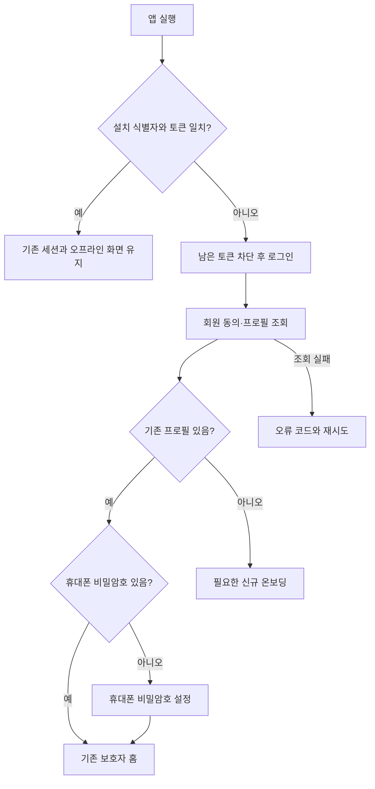

# 앱 재설치 후 인증·보호자 잠금 설계

## 개요

#560의 iPhone 재설치 문제는 로그인 토큰과 역할·온보딩 상태의 저장 수명이 다른 구조에서 발생한다. 완전 삭제 후에는 로그인부터 시작하고, 다시 로그인하면 서버에 남은 기존 프로필을 복원하도록 정책을 확정했다. 본 문서는 구현 전 설계 기록이며 완료 보고서와 검증 결과는 후속으로 남긴다.

## 기능 흐름

## 변경 사항

- 설치 식별자는 iOS·Android의 백업 제외 영역에 저장해 Keychain 잔존과 앱 설치를 분리한다.
- 기존 `/api/member/me`의 프로필과 약관 상태를 복원 기준으로 사용한다. 조회 실패를 약관 미동의로 판정하지 않는다.
- PIN은 휴대폰의 보호자 화면 잠금이며 서버에 보내지 않는다. salted PBKDF2 verifier와 오답 제한을 보안 저장소에서 관리한다.
- 갱신 타임아웃·오프라인·5xx는 세션 만료와 구분하여 진행 큐를 보존한다.

## 주요 구현 내용

`docs/superpowers/specs/2026-10-05-session-restoration-design.md`에 정상·실패 경로와 저장 책임을 명시했고 `docs/superpowers/plans/2026-10-05-session-restoration.md`에 설치 경계→로컬 잠금→회원 복원의 구현·테스트 순서를 작성했다. 사용자는 코드 검증 후 커밋·푸시·배포를 승인했고 실기기 검증은 직접 수행하기로 했다.

## 주의사항

정상 업데이트는 기존 세션을 유지한다. 설치 결합이 없는 레거시 토큰에 한하여 일관된 로컬 상태가 있으면 일회 이전하고, 상태가 없는 재설치나 설치 결합 불일치는 로그인으로 보낸다. 구버전 데이터 전체가 OS 백업으로 복원된 경우 최초 이전의 한계가 있으므로 토큰만으로 완전 구분한다고 가정하지 않는다. 같은 계정의 미동기화 큐를 보존하고 다른 계정에 넘기지 않도록 비교한다. PIN 부재는 인증 증거가 아니며 이룸이 휴대폰에서 새 PIN을 만들어 보호자 화면을 여는 우회를 허용하지 않는다. 실기기 검증은 아직 수행하지 않았으며 코드 검증 결과와 함께 완료를 과장하지 않는다.

## 진행 상태

사용자가 설계 커밋·푸시를 먼저 요청하여 본 산출물만 우선 커밋한다. 제품 구현·배포 완료 보고서가 아니다. 서버 기존 테스트는 `./gradlew test` 통과했으나 신규 클라이언트 정책 구현 검증은 아직 완료하지 않았다.
