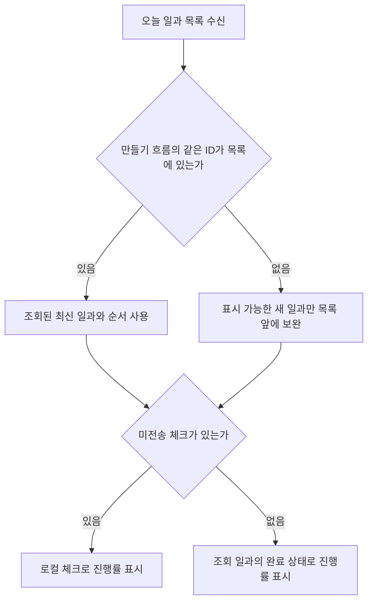

# 공동 보호자 일과 완료 상태 정합성 수정

## 문제와 확인

관련 이슈: https://github.com/Twin-Fang/elum/issues/561

같은 이룸이의 완료 일과가 보호자 홈과 보호자 휴대폰의 이룸이 화면에서 다른 진행률로 표시됐다. 두 홈의 목록 provider가 만들기 흐름에 남은 일과를 우선 사용하고, 같은 ID의 서버 일과를 목록에서 제외하고 있었다. 서버가 COMPLETED를 돌려줘도 옛 CONFIRMED 값이 남으며, 옛 값이 임시저장이면 최신 승인 일과까지 제외됐다.

2026-10-05 운영 로그에서 두 보호자의 생성 및 확정 요청은 같은 프로필을 지정했다. 13:07 완료 요청은 모두 200이며 마지막 완료 집합은 두 일과에서 각각 5개와 4개였다. 로그에는 응답 본문이 없어 실제 조회 응답의 완료 값까지 확정한 것은 아니다. 제보의 생성자별 불일치 방향을 이 결함 하나로 단정하지 않는다.

## 변경

- 보호자 홈과 이룸이 홈은 같은 ID가 조회 목록에 있으면 최신 조회 일과를 사용한다.
- 서버 목록의 순서를 유지하고, 아직 조회 목록에 없는 새 일과만 앞에 보완한다.
- 진행률의 미전송 로컬 체크 우선 규칙은 유지한다.
- 회귀 테스트에서 두 보호자의 생성 일과, 새 일과 즉시 노출, 오프라인 해제 보존, 임시저장 상태 잔존을 검증한다.

## 검증

- 수정 전 신규 회귀 테스트 4건 중 2건 실패: 서버 완료 일과가 CONFIRMED로 표시됨, 서버 승인 일과가 목록에서 사라짐.
- 수정 후 신규 회귀 테스트 및 기존 진행률·보호자 홈·주기 갱신 테스트 47건 모두 통과.
- flutter analyze --no-pub: 문제 없음.
- 전용 worktree의 최신 origin/develop에서 검증했다. 기존 공유 작업트리의 변경은 건드리지 않았다.

## 주의사항과 남은 확인

미전송 체크 대기열을 지우거나 서버 값만 강제로 쓰면 오프라인에서 방금 한 조작이 사라진다. 이 변경은 목록 병합 우선순위만 조정한다.

아직 푸시·배포하지 않았다. 새 빌드에서 실제 보호자 2명과 이룸이 휴대폰의 진행률이 일치하는지는 후속 실기기 확인이 필요하다. 이름 표시 문제 #562와 서버 동시 갱신 정합성은 이 수정의 완료 범위에 포함하지 않는다.
