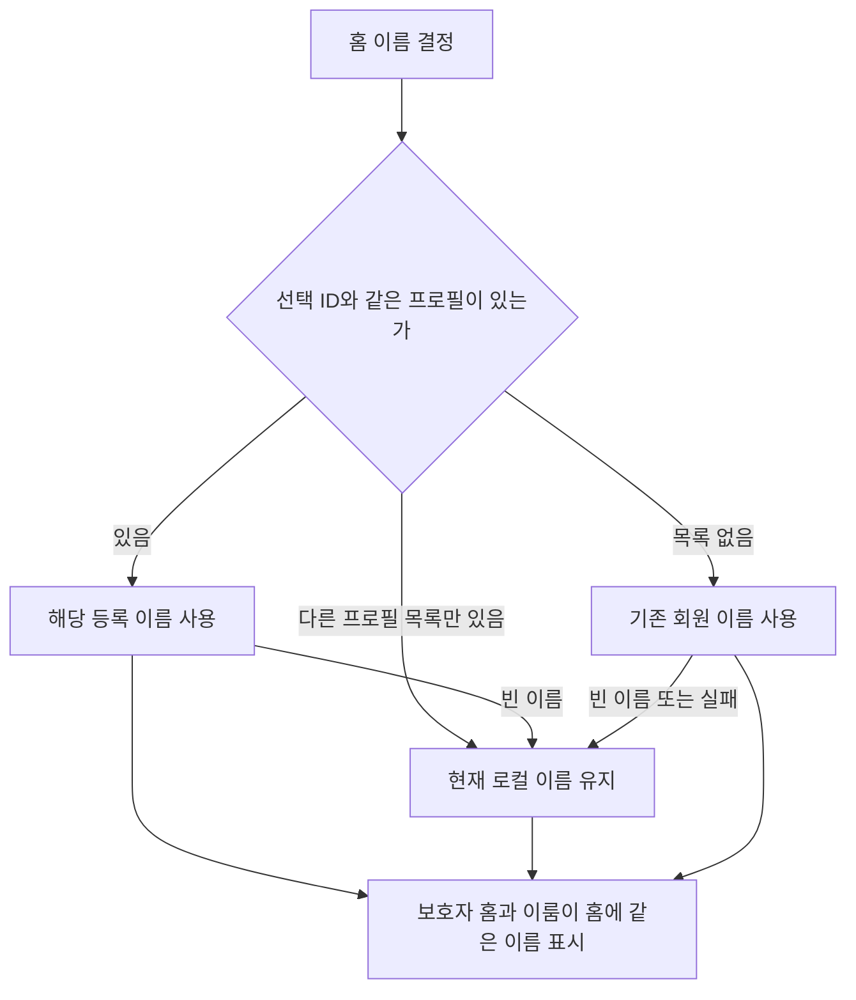

# 연결된 이룸이 이름 표시 정합성 수정

관련 이슈: https://github.com/Twin-Fang/elum/issues/562

## 문제와 변경

보호자 홈과 이룸이 홈이 회원 응답의 nickname을 직접 사용해, 같은 QA 프로필을 보고 있어도 기본 이름이나 이전 이름이 표시될 수 있었다. 두 홈이 공통 이름 결정 함수를 사용하도록 바꿨다. 선택한 프로필의 이름을 우선하고, 이전 프로필 목록만 남으면 합류·선택 과정에서 맞춘 로컬 이름을 유지한다. 목록 없는 구버전 및 이룸이 휴대폰은 기존 회원 이름 경로를 유지한다. 빈 문자열은 등록 이름으로 취급하지 않는다.

운영 로그에는 회원 조회 200 응답은 있지만 응답 본문이 없어 제보 당시 nickname 값은 확정하지 못했다. 서버 이름 저장이나 프로필 연결 데이터 자체는 이 변경에서 수정하지 않았다.

## 검증

- 관련 이름·프로필 세션·보호자 홈·이룸이 화면·공동 일과 테스트 102건 모두 통과.
- 보호자 홈과 보호자 휴대폰의 이룸이 홈에서 기본 회원 이름 대신 QA를 표시하는 위젯 테스트 통과.
- 조회 대기·조회 실패·빈 이름·이전 프로필 목록·구버전 응답 호환 검증.
- flutter analyze --no-pub: 문제 없음. git diff --check 통과.

## iOS 재빌드

사용자가 출시 버전 충돌 해소를 요청하여 버전 관리 도구로 2.16.2 → 2.16.3을 설정하고 Flutter·Spring 버전 파일을 동기화했다. 이전 #452 수정은 출시 버전을 감지해 빌드를 중단하는 기능이며 자동 버전 상향은 당시 보류했다고 커밋 abf43c9b에 기록되어 있다. 이번에는 승인된 버전 상향 후 develop 빌드를 다시 요청한다. main 릴리스와 앱스토어 심사 제출은 수행하지 않는다.

## 남은 확인

새 테스트 앱에서 보호자 두 명과 이룸이 휴대폰이 QA 및 동일한 완료 상태를 표시하는지 실기기 확인이 필요하다. TestFlight 성공 여부는 워크플로우 결과로 별도 확인한다.
