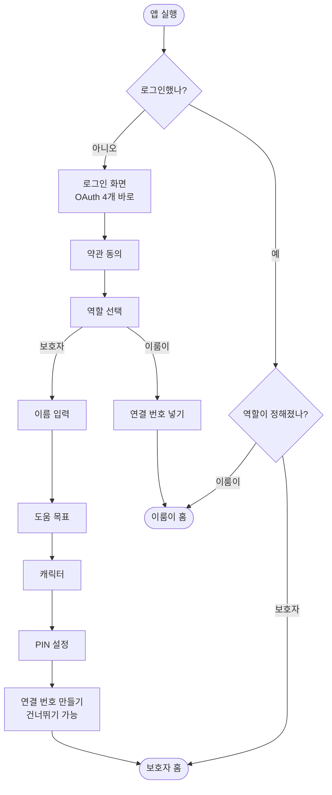
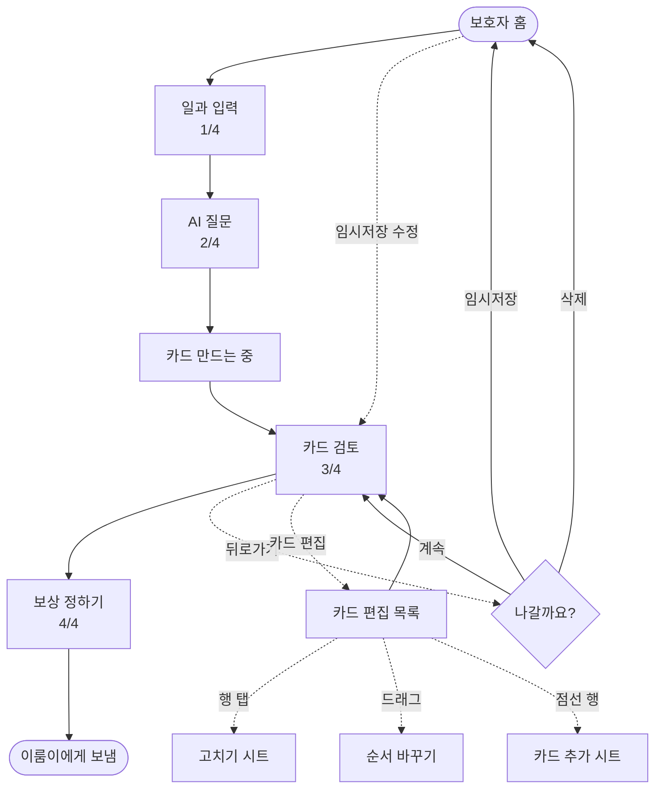
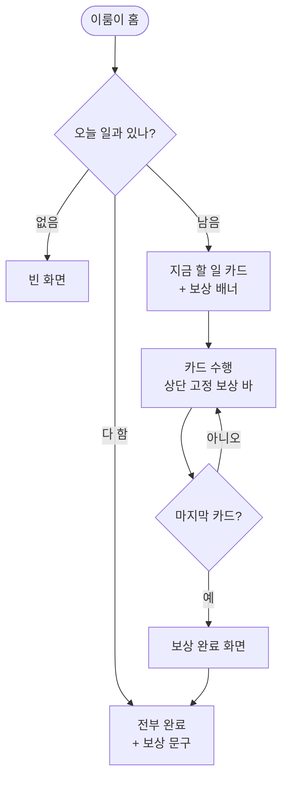
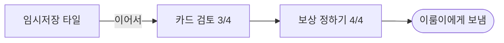

# 디자인 명세 — 2026-09-18

> 📮 **디자이너에게 주는 문서는 이것 하나다.**
> 모든 화면 · 모든 문구 · 모든 흐름 · 작업량 · 에셋이 여기 다 있다.
>
> | | |
> | --- | --- |
> | **무엇을 그리나** | §0 작업량 14건 · 에셋 6종 |
> | **안 그려도 되는 것** | §0 — 6개 화면은 손대지 않는다 |
> | **어떻게 그리나** | [docs/08-design-principles.md](../../08-design-principles.md) — 철학 · 말투 · QA 시트 |
> | **왜 이렇게 정했나** | [회의록](../../meetings/20260918_디자인회의_전면개편.md) |
>
> 이전 문서와 다르면 **이쪽을 따른다.**

---

# 0. 먼저 — 안 그려도 되는 것

메모에 적혀 있지만 **이미 앱에 있고 잘 동작한다.** 손댈 필요 없다.

| 화면 | 상태 |
| --- | --- |
| 약관 동의 · 약관 전문 | ✅ 그대로 |
| 온보딩 — 이름 입력 | ✅ 그대로 |
| 온보딩 — 캐릭터 선택 | ✅ 그대로 |
| 온보딩 — PIN 설정 | ✅ 그대로 |
| 일과 입력 · AI 질문 · 카드 만드는 중 | ✅ 그대로 |
| 별 모으기 | ✅ 그대로 |

> **"전부 다시 그려야 한다"가 아니다.** 위 6개는 건드리지 않는다.
> 로그인은 버튼 배치만 바뀌고 버튼 자체는 그대로 쓴다.

---

# 0-2. 작업량 — 14건

## 🆕 새로 그리는 것 7

| # | 화면 · 요소 | 어디 |
| :-: | --- | :-: |
| 1 | **역할 선택** — 보호자인가, 이룸이인가 | §4-3 |
| 2 | **연결 번호 만들기** (QR + 6자리) | §5-1 |
| 3 | **연결 번호 넣기** | §5-2 |
| 4 | **보상 정하기** | §7-4 |
| 5 | 보상 안내 시트 (`왜 정하나요?`) | §7-4 |
| 6 | 나갈 때 팝업 | §7-5 |
| 7 | 설정 시트 | §8 |

## 🔧 고치는 것 7

| # | 화면 | 무엇을 | 어디 |
| :-: | --- | --- | :-: |
| 8 | **로그인** | `시작하기` 없애고 OAuth 버튼 바로 | §4-1 |
| 9 | 온보딩 목표 | 아이콘 톤 하나만 맞춘다 | §6-2 |
| 10 | **카드 검토** | 버튼을 `카드 편집` 하나로 · 보상 줄 · CTA 문구 | §7-2 |
| 11 | **카드 편집 목록** | 🆕 순서·고치기·삭제·추가를 여기서 | §7-3 |
| 12 | **보호자 홈** | 섹션 4구역 + 설정 아이콘 | §8 |
| 13 | 이룸이 홈 | 보상 배너 + 전부 완료 | §9-1 |
| 14 | 이룸이 수행 · 완료 | 상단 고정 보상 바 + 보상 문구 | §9-2·3 |

## 🎨 에셋 6

| 에셋 | 개수 | 급함 |
| --- | :-: | :-: |
| **카드 기본 그림** | 1~3 | 🔴 **대체 불가** |
| 보상 프리셋 그림 | 5 | 나중 — 이룸이 화면만 필요. 이모지로 버틴다 |
| 역할 선택 그림 | 2 | 중간 |
| 설정 아이콘 (알림·연결) | 2 | 낮음 |
| 목표 3번 아이콘 컬러 보정 | 1 | 낮음 |
| 드래그 핸들 | 1 | 낮음 |

---

# 0-3. 형태를 처음부터 잡을 건 5개뿐

나머지는 **이미 있는 걸 그대로 쓴다.**

| 새 요소 | 그대로 쓸 것 |
| --- | --- |
| 역할 선택 카드 | 온보딩 **도움 목표 칩** |
| 연결 번호 6칸 · 숫자패드 | **PIN 화면** |
| 보상 프리셋 칩 | 온보딩 **도움 목표 칩** |
| 카드 추가 시트 | **카드 고치기 시트** |
| 홈 섹션 제목 | 보호자 홈 **추천 일과 제목** |
| 나갈 때 팝업 | 기존 **확인 다이얼로그** |
| 설정 시트 | 기존 **시트 스타일** |
| 진행률 · 완료 타일 | 기존 것 |

**처음부터 그릴 것**

1. QR + 6자리 연결 번호 화면
2. 보상 정하기 레이아웃 (글자 칩 2열)
3. 상단 고정 보상 바
4. 카드 편집 목록 (드래그 순서 변경)
5. **그림 없는 카드**

---

# 1. 두 사람을 위해 만든다

| | 보호자 | 이룸이(당사자) |
| --- | --- | --- |
| 나이 | **50대** | **20대** |
| 기기 | 자기 휴대폰 | 자기 휴대폰 |
| 하는 일 | 일과 만들기 · 카드 고치기 · 보상 정하기 | 카드 보고 수행하기 |
| 어려움 | **처음 보는 개념이 많다** (보상 · 임시저장 · 기기 연결) | 글자를 못 읽을 수 있다 |

## 그래서 이렇게 쓴다

| 원칙 | 하는 법 |
| --- | --- |
| **짧게 쓰고, 깊은 설명은 접는다** | 본문 한 줄 + `왜 그런가요? ›` → 시트에서 풀어 준다 |
| **전문 용어를 안 쓴다** | 아이 ❌ → **이룸이** · 기기 ❌ → 휴대폰 · 코드 ❌ → 연결 번호 |
| **그림으로도 알 수 있게 한다** | 이룸이 화면은 글자 없이도 뜻이 통해야 한다 |
| **다음에 뭐가 나올지 알려준다** | 버튼에 결과를 쓴다 |

---

# 2. 말투 — 토스 라이팅 원칙을 따른다

## 2-1. 기본

| 항목 | 규칙 | 예 |
| --- | --- | --- |
| 말투 | **해요체** 하나로 통일 | `저장했어요` (○) / `저장되었습니다` (✕) |
| 태 | **능동형** | `번호를 보냈어요` (○) / `번호가 발송되었습니다` (✕) |
| 방향 | **긍정형** | `이어서 만들 수 있어요` (○) / `저장 안 하면 사라집니다` (✕) |

## 2-2. 8원칙 — 우리 화면에 옮기면

| # | 원칙 | 우리 화면 |
| :-: | --- | --- |
| 1 | **다음을 예측할 수 있게** | 버튼에 **바로 다음에 올 것**을 쓴다 — 검토 화면은 `보상 정하기`, 보상 화면은 `이룸이에게 보내기` |
| 2 | **잡초 뽑기** | `앞으로 결제를 하시겠습니까?` → `결제할까요?` |
| 3 | **빈 문장 제거** | 공간이 비었다고 설명을 채우지 않는다 |
| 4 | **핵심만** | 이미 아는 걸 다시 말하지 않는다 |
| 5 | **말하기 쉽게** | 소리내어 읽어 어색하면 고친다 |
| 6 | **권유하되 강요하지 않는다** | `건너뛰기`를 늘 열어 둔다 |
| 7 | **모두를 위한 단어** | 유행어·은어 안 쓴다. 50대가 아는 말만 |
| 8 | **숨은 감정 찾기** | 다 해냈을 때 축하한다 |

## 2-3. 바꿀 문구

| 지금 | 바꿔서 |
| --- | --- |
| 이룸을 시작해볼까요? | **이룸** |
| 필수 항목에 모두 동의합니다 | **모두 동의하기** |
| 이 기기는 누가 사용하나요? | **서비스를 누가 사용하나요?** |
| 아직 아이에게 보내지 않았어요 | **아직 저장하지 않았어요** |
| 아이를 어떻게 불러드릴까요? | **이룸이를 어떻게 부를까요?** |
| 보호자님 계정으로 로그인하면 아이 정보가 안전하게 보관돼요. | **로그인하면 이룸이 정보가 안전하게 보관돼요** |
| 우리 아이 (이름 없을 때) | **이룸이** |
| 계정을 지우지 못했어요. 잠시 후 다시 시도해주세요. | **탈퇴하지 못했어요. 잠시 후 다시 해주세요** |

> 🔴 **"아이"를 전부 "이룸이"로 바꾼다.** 20대 당사자가 자기 휴대폰에서 이 앱을 연다.
> **"기기"는 "휴대폰"으로.** 50대에게 기기는 낯선 말이다. (원칙 5·7)

---

# 3. 전체 흐름

## 3-1. 진입



> 🔴 **`시작하기` 버튼을 없앤다.** 첫 화면에 로그인 버튼이 바로 나온다. → §4-1

## 3-2. 일과 만들기



## 3-3. 이룸이



---

# 4. 진입 화면

## 4-1. 🔴 로그인 — `시작하기`를 없앤다

### 지금 (2단계)

```
스플래시                      로그인
┌──────────────────┐        ┌──────────────────┐
│                  │        │ 이룸을            │
│    [병아리]       │        │ 시작해볼까요?      │
│                  │  탭    │                  │
│    [로고]         │  ───▶  │ [카카오로 시작하기]│
│                  │        │ [네이버로 시작하기]│
│  [ 시작하기 ]     │        │ [Google로 시작하기]│
│                  │        │ [Apple로 시작하기] │
└──────────────────┘        └──────────────────┘
       ↑
   의미 없는 한 단계
```

### 바꿔서 (1단계)

```
┌──────────────────────────────┐
│                              │
│         [병아리]              │
│                              │
│         [로고]                │
│                              │
│    할 일을 카드로 만들어요      │  ← 한 줄
│                              │
│  ┌────────────────────────┐ │
│  │   카카오로 시작하기      │ │
│  └────────────────────────┘ │
│  ┌────────────────────────┐ │
│  │   네이버로 시작하기      │ │
│  └────────────────────────┘ │
│  ┌────────────────────────┐ │
│  │   Google로 시작하기     │ │
│  └────────────────────────┘ │
│  ┌────────────────────────┐ │
│  │   Apple로 시작하기      │ │  ← iOS만
│  └────────────────────────┘ │
│                              │
│   지난번에 카카오로 했어요     │  ← 재방문일 때만
│                              │
└──────────────────────────────┘
```

| 항목 | 값 |
| --- | --- |
| 제목 | 로고로 대신한다. **글자 제목 없음** |
| 설명 | `할 일을 카드로 만들어요` — 한 줄 |
| 버튼 | 4개 세로 · 브랜드 색 유지 |
| 재방문 힌트 | `지난번에 ○○로 했어요` — 해당 버튼 **바로 위** |
| 처리 중 | 누른 버튼만 `연결 중...` · 나머지 비활성 |

> **왜 없애나.** `시작하기`는 다음에 뭐가 나올지 말해 주지 않는다 (원칙 1).
> 누를 것이 하나뿐인 화면은 그 자체로 잡초다 (원칙 2).

### 상태

| 상태 | 화면 |
| --- | --- |
| 처음 | 위 그대로 |
| 재방문 | 지난번 수단 위에 힌트 |
| **다른 수단으로 시도** | `처음 가입할 때 쓰신 방법으로 로그인해주세요` |
| **실패** | `로그인하지 못했어요. 잠시 후 다시 해주세요` + 에러 코드 |

## 4-2. 약관 동의

```
┌──────────────────────────────┐
│ ←                            │
│                              │
│  약관에 동의해주세요           │
│                              │
│ ┌──────────────────────────┐ │
│ │ ○ 모두 동의하기           │ │  ← 굵게
│ └──────────────────────────┘ │
│ ──────────────────────────── │
│  ○ (필수) 서비스 이용약관  ›  │
│  ○ (필수) 개인정보 처리방침 › │
│  ○ (선택) 마케팅 정보 받기    │
│                              │
│                              │
│     [ 동의하고 계속하기 ]      │
└──────────────────────────────┘
```

| 항목 | 값 |
| --- | --- |
| 제목 | `약관에 동의해주세요` |
| 전체 동의 | `모두 동의하기` — 선택 항목까지 포함 |
| `›` | 전문 보기 |
| 버튼 | `동의하고 계속하기` · **필수 다 체크해야 활성** |

> ⚠️ **선택 항목이 접히면 안 된다.** `모두 동의하기`가 안 보이는 항목까지 켜면
> 사용자가 뭘 동의했는지 모른다 (원칙 6).

## 4-3. 🆕 역할 선택

```
┌──────────────────────────────┐
│                              │
│  서비스를 누가 사용하나요?     │
│                              │
│  나중에 바꿀 수 있어요          │
│                              │
│ ┌──────────────────────────┐ │
│ │ [그림]                    │ │
│ │ 보호자예요                 │ │
│ │ 일과를 만들어요             │ │
│ └──────────────────────────┘ │
│                              │
│ ┌──────────────────────────┐ │
│ │ [그림]                    │ │
│ │ 이룸이예요                 │ │
│ │ 만들어 준 일과를 해요        │ │
│ └──────────────────────────┘ │
│                              │
└──────────────────────────────┘
```

| 항목 | 값 |
| --- | --- |
| 제목 | `서비스를 누가 사용하나요?` |
| 안심 문구 | `나중에 바꿀 수 있어요` — 되돌릴 수 있음을 먼저 말한다 |
| 진행 | **탭하면 바로 넘어간다.** `다음` 버튼 없음 |
| 뒤로 | 없음 |

### 🔴 여기서 `연결 번호`를 말하지 않는다

처음 이 화면을 보는 이룸이는 **번호를 받은 적이 없다.**
`받은 코드로 연결해요`라고 쓰면 *"무슨 코드? 어디서 받지?"* 에서 막힌다.

```
❌ 이렇게 쓰면 막힌다              ✅ 이렇게 쓴다
┌──────────────────────┐        ┌──────────────────────┐
│ 제가 써요             │        │ 이룸이예요            │
│ 받은 코드로 연결해요    │        │ 만들어 준 일과를 해요  │
└──────────────────────┘        └──────────────────────┘
  받은 적 없는데?                   내가 뭘 하는 사람인지만
  어디서 받지?                      말한다
```

**이 화면은 "누구인가"만 묻는다.** 번호는 다음 화면에서 처음 나오고,
거기서 **어디서 받는지까지 같이** 알려준다. (원칙 ① 한 화면에 하나만)

> 두 선택지가 **관계로 짝을 이룬다** — 한쪽은 만들고, 한쪽은 만들어 준 걸 한다.
> `코드`를 몰라도 자기가 어느 쪽인지 안다.

---

---

# 5. 🆕 이룸이 휴대폰 연결

## 5-1. 연결 번호 만들기 (보호자 휴대폰)

```
┌──────────────────────────────┐
│ ←                            │
│                              │
│  이룸이 휴대폰에                │
│  이 번호를 넣어주세요           │
│                              │
│     ┌──────────────┐         │
│     │              │         │
│     │   [QR 코드]   │         │
│     │              │         │
│     └──────────────┘         │
│                              │
│      4 8 2   1 9 3           │
│                              │
│      [ 번호 복사 ]            │
│                              │
│   10분 동안 쓸 수 있어요       │
│                              │
│  [ 번호 다시 만들기 ]          │
│  [ 나중에 할게요 ]             │
└──────────────────────────────┘
```

| 항목 | 값 |
| --- | --- |
| 제목 | `이룸이 휴대폰에 이 번호를 넣어주세요` — 뭘 해야 하는지 바로 (원칙 1) |
| 연결 번호 | **화면에서 가장 큰 글자** · 3-3 묶음 · 자간 넓게 |
| 유효 시간 | `10분 동안 쓸 수 있어요` — 카운트다운보다 덜 쫓기게 (원칙 6) |
| 1분 남으면 | `1분 남았어요` |
| 복사 | 누르면 `복사했어요` 토스트 |

### 상태

| 상태 | 화면 |
| --- | --- |
| 정상 | 위 그대로 |
| **만료** | QR·숫자 흐리게 + `번호가 만료됐어요` · `번호 다시 만들기`를 주 버튼으로 |
| **연결됨** | `연결됐어요` + 체크 → 홈으로 |
| **발급 실패** | `번호를 만들지 못했어요. 다시 해주세요` + 에러 코드 |

## 5-2. 연결 번호 넣기 (이룸이 휴대폰)

```
┌──────────────────────────────┐
│ ←                            │
│                              │
│  보호자에게 연결 번호를        │
│  받아주세요                   │
│                              │
│ ┌──────────────────────────┐ │
│ │  보호자 휴대폰에서          │ │  ← 🔴 어디서 받는지
│ │                          │ │
│ │  설정 → 이룸이 휴대폰 연결  │ │
│ │                          │ │
│ │  6자리 번호가 나와요        │ │
│ └──────────────────────────┘ │
│                              │
│   ┌─┐┌─┐┌─┐  ┌─┐┌─┐┌─┐      │
│   │ ││ ││ │  │ ││ ││ │      │
│   └─┘└─┘└─┘  └─┘└─┘└─┘      │
│                              │
│      [ QR로 연결하기 ]         │
│                              │
│   ┌──────────────────┐       │
│   │  1    2    3     │       │
│   │  4    5    6     │       │
│   │  7    8    9     │       │
│   │       0    ⌫     │       │
│   └──────────────────┘       │
└──────────────────────────────┘
```

### 🔴 "어디서 받는지"를 화면에 그린다

이 화면에 오는 사람은 **번호가 뭔지도, 어디 있는지도 모른다.**
보호자가 설정에서 만들어 줘야 하는데 그걸 알 방법이 없다.

**보호자 휴대폰의 실제 경로를 그대로 적는다.**

```
보호자 휴대폰에서
설정 → 이룸이 휴대폰 연결
6자리 번호가 나와요
```

> 📌 **이건 "설명은 시트로 접는다"의 예외다.**
> 아무것도 모르는 상태로 시작하는 유일한 화면이라, **본문에 있어야 한다.**
> 시트로 접으면 `›`를 안 누르는 사람은 영영 못 본다.

> 💡 **보호자가 대신 넣어 줄 수도 있다.** 이 안내는 보호자가 읽어도 말이 된다.

### `코드` 대신 `연결 번호`

| 안 쓴다 | 쓴다 | 왜 |
| --- | --- | --- |
| 코드 | **연결 번호** | 50대·20대 둘 다에게 `번호`가 쉽다 |
| 기기 | **휴대폰** | 손에 든 물건 이름 그대로 |

### 상태

| 상태 | 문구 |
| --- | --- |
| 입력 중 | 6자리 채우면 **자동으로 넘어간다** |
| **틀림** | 칸 흔들림 + `번호가 맞지 않아요` |
| **만료** | `번호가 만료됐어요. 새 번호를 받아주세요` |
| **카메라 거부** | `번호를 직접 넣어주세요` — QR 버튼 자리에. **앱은 그대로 쓸 수 있다** |
| 연결됨 | `연결됐어요` → 이룸이 홈 |

> ⚠️ **붉은 경고를 크게 쓰지 않는다.** PIN 화면과 같은 톤. 에러 코드는 작게 구석에.

---

---

# 6. 온보딩

## 6-1. 이름 → 목표 → 캐릭터 → PIN (기존)

```
이름                  목표                  캐릭터               PIN
┌──────────┐        ┌──────────┐        ┌──────────┐      ┌──────────┐
│ 어떻게    │        │ ○○의 어떤 │        │ 함께할    │      │ 비밀번호   │
│ 부를까요? │  ───▶  │ 순간을... │  ───▶  │ 친구를... │ ───▶ │ 4자리     │
│          │        │ [칩 4개]  │        │ [3종]     │      │ ○ ○ ○ ○  │
└──────────┘        └──────────┘        └──────────┘      └──────────┘
   ✅ 유지              🔧 칩 깨짐          ✅ 유지            ✅ 유지
```

## 6-2. 도움 목표 — 문구 그대로

선택지 4개 문구는 **바꾸지 않는다.** 변경 기록이 없어 현행 유지로 확정했다.

| # | 문구 |
| :-: | --- |
| 1 | 해야 할 일을 순서대로 이해해요 |
| 2 | 필요한 준비물을 스스로 챙겨요 |
| 3 | 새로운 상황을 미리 준비해요 |
| 4 | 혼자 끝까지 해내는 경험을 만들어요 |

**아이콘** — 3번(체크리스트)만 무채색이다. 나머지 3개는 컬러라 혼자 안 띈다. 맞춘다.

---

# 7. 일과 만들기

## 7-1. 흐름과 진행 표시

```
 1/4          2/4          (로딩)        3/4           4/4
┌────────┐  ┌────────┐  ┌────────┐  ┌────────┐  ┌────────┐
│ 일과    │  │ AI      │  │ 카드    │  │ 카드    │  │ 보상    │
│ 입력    │─▶│ 질문    │─▶│ 만드는  │─▶│ 검토    │─▶│ 정하기  │
│        │  │        │  │ 중      │  │        │  │        │
└────────┘  └────────┘  └────────┘  └────────┘  └────────┘
  ✅ 유지      ✅ 유지      ✅ 유지      🔧 변경      🆕 신규
```

## 7-2. 🔧 카드 검토 — 보는 화면

**검토 화면은 훑어보는 곳이다.** 편집은 여기서 하지 않는다.

```
┌────────────────────────────────┐
│ ←                       3 / 4  │
│                                │
│  비 오는 날 학교 가기            │
│                                │
│   ┌──┐ ┌──────────┐ ┌──┐      │
│   │  │ │  [그림]   │ │  │      │
│   │  │ │          │ │  │      │
│   │  │ │ 가방을    │ │  │      │
│   │  │ │ 챙겨요    │ │  │      │
│   └──┘ └──────────┘ └──┘      │
│          ● ● ○ ○               │
│                                │
│         [ 카드 편집 ]           │
│                                │
│ ────────────────────────────── │
│  다 하면: 젤리 먹기     [ 바꾸기 ]│
│ ────────────────────────────── │
│                                │
│      [ 보상 정하기 ]            │
└────────────────────────────────┘
```

| 요소 | 문구 | 위계 |
| --- | --- | --- |
| `카드 편집` | 편집 화면으로 | **보조 버튼** |
| 보상 줄 | 있음 `다 하면: ○○` + `바꾸기` / 없음 `+ 보상 정하기` | 인라인 |
| CTA | **`보상 정하기`** — 다음 단계 이름을 그대로 쓴다 | **주 버튼** |

> **CTA를 바꾸는 이유** — 기존 `아이 화면으로 시작`은 뭐가 시작되는지 모른다.
> 그리고 **이 화면 다음은 보상 정하기다.** 여기서 보내지 않는다.
> 버튼에는 **바로 다음에 올 화면**을 쓴다 (원칙 1).

### 🔴 왜 버튼을 늘어놓지 않는가

```
❌ 이렇게 하지 않는다              ✅ 이렇게 한다
┌──────────────────────┐        ┌──────────────────────┐
│   [고치기]  [삭제]     │        │                      │
│  [+ 카드 추가] [⇅ 순서]│        │     [ 카드 편집 ]     │
│                      │        │                      │
│  [ 보내기 ]           │        │   [ 보상 정하기 ]     │
└──────────────────────┘        └──────────────────────┘
  버튼 5개. 뭘 눌러야 할지          진짜 결정은 둘뿐이다 —
  고르는 것부터 일이 된다            고칠까, 넘어갈까
```

캐러셀은 **보는 뷰**다. 순서·삭제·추가는 목록에서 해야 손에 잡힌다.
한 화면에 둘을 얹으면 둘 다 나빠진다. (원칙 ① 한 화면에 하나만)

---

## 7-3. 🆕 카드 편집 — 목록 화면

**순서 · 고치기 · 삭제 · 추가를 여기서 전부 한다.**

```
┌──────────────────────────────┐
│ ←      카드 편집     [ 완료 ] │
│                              │
│ ┌──────────────────────────┐ │
│ │ [썸] 1  가방을 챙겨요   ☰ │ │
│ ├──────────────────────────┤ │
│ │ [썸] 2  신발을 신어요   ☰ │ │
│ ├──────────────────────────┤ │
│ │ [썸] 3  우산을 챙겨요   ☰ │ │
│ ├──────────────────────────┤ │
│ │ [썸] 4  문을 나서요     ☰ │ │
│ └──────────────────────────┘ │
│                              │
│ ┌ ─ ─ ─ ─ ─ ─ ─ ─ ─ ─ ─ ─ ┐ │
│ │       + 카드 추가        │ │
│ └ ─ ─ ─ ─ ─ ─ ─ ─ ─ ─ ─ ─ ┘ │
│                              │
└──────────────────────────────┘
```

| 동작 | 어떻게 | 왜 이렇게 |
| --- | --- | --- |
| **순서** | `☰`를 **끌어서** 옮긴다 | 목록에서 끄는 건 다들 아는 동작 |
| **고치기** | **행을 탭**한다 → 시트 | 가장 흔한 동작이라 가장 쉬운 자리 |
| **삭제** | 시트 안에서 | 오탭으로 사라지면 안 된다 |
| **추가** | 맨 아래 **점선 행** | 목록의 끝이 곧 추가 자리 |

**행 구성** — 썸네일 + 순번 + 제목 + 드래그 핸들.
썸네일이 있어야 끌면서 "어느 카드인지"를 안다.

### 드래그

| 상태 | 화면 |
| --- | --- |
| 잡음 | 행이 살짝 들리고 그림자 |
| 끄는 중 | 나머지 행이 부드럽게 비켜난다 |
| 놓음 | 순번이 다시 매겨진다 |
| **저장 실패** | `순서를 저장하지 못했어요` + 원래 순서로 되돌린다 |

## 7-4. 카드 고치기 · 추가 시트

```
행을 탭했을 때                    + 카드 추가를 눌렀을 때
┌──────────────────────┐        ┌──────────────────────┐
│  카드 고치기           │        │  카드 추가            │
│                      │        │                      │
│  무엇을 하나요?        │        │  무엇을 하나요?        │
│  ┌──────────────┐    │        │  ┌──────────────┐    │
│  │ 가방을 챙겨요  │    │        │  │              │    │
│  └──────────────┘    │        │  └──────────────┘    │
│                      │        │                      │
│  설명 (선택)          │        │  설명 (선택)          │
│  ┌──────────────┐    │        │  ┌──────────────┐    │
│  └──────────────┘    │        │  └──────────────┘    │
│                      │        │                      │
│  [ 삭제 ]   [ 저장 ]  │        │  [ 취소 ]   [ 추가 ]  │
└──────────────────────┘        └──────────────────────┘
```

| 요소 | 규칙 |
| --- | --- |
| `삭제` | 위험색 · **주 버튼보다 약하게** · 카드가 1장이면 **비활성** |
| `저장` · `추가` | 주 버튼 · 제목이 비면 비활성 |

> 카드가 1장뿐일 때 `삭제`를 누르면 `카드는 최소 한 장이 필요해요`.

> 📌 **시트에는 제목과 설명뿐이다.** 그림에 관한 항목도 안내 문구도 넣지 않는다.
> 이유는 §7-5 — **디자이너가 알아야 할 제약이지 화면에 드러낼 말이 아니다.**

## 7-5. 카드 그림 — 디자이너 참고 (화면에 쓰지 않는다)

> 📌 **화면에 "그림을 바꿀 수 없어요"라고 쓰지 않는다.**
> 기능을 안 만들면 그만이다. 없는 기능을 굳이 설명하면 없다는 사실만 커 보인다.

**AI 이미지 생성 비용 때문에 이미 만든 카드의 그림을 다시 만들지 않는다.**

| 동작 | 그림 |
| --- | --- |
| 고치기 | 그대로 둔다 — 시트에 그림 항목 자체가 없다 |
| 추가 | **기본 그림이 조용히 들어간다** — 안내 없음 |
| 순서 · 삭제 | 그림이 따라간다 |

**그림이 마음에 안 들면 그 카드를 지우고 다시 만든다.** 그게 유일한 방법이고,
그 방법을 화면에서 안내하지도 않는다. 지우기와 추가가 이미 있으므로 길은 열려 있다.

### 🎨 그림 없는 카드 — 두 안 중 하나

```
A안 — 기본 그림 (권장)            B안 — 글자 중심
┌─────────────────┐            ┌─────────────────┐
│                 │            │                 │
│   [기본 그림]     │            │                 │
│                 │            │   가방을 챙겨요   │
│                 │            │                 │
│  가방을 챙겨요     │            │                 │
└─────────────────┘            └─────────────────┘
 다른 카드와 형태가 같다           그림 자리가 없어 어색함이 없다
 그림이 내용과 무관해 보인다        카드들이 서로 달라 보인다
```

캐러셀에서 나란히 넘어가므로 **형태가 다르면 눈에 띈다. A안 권장.**
기본 그림은 **내용을 암시하지 않는 중립적인 것**이어야 한다.

> 🎨 **대체할 것이 없어 가장 급한 에셋이다.**

---

## 7-6. 🆕 보상 정하기

**위치** — 카드 검토 다음 · 진행 `4 / 4` · 마지막 단계

```
┌──────────────────────────────┐
│ ←                     4 / 4  │
│                              │
│  다 하면 뭘 할 수 있나요?      │
│                              │
│  미리 정해두면 끝까지 해낼      │
│  힘이 돼요                    │
│                              │
│  최근에 정한 보상              │  ← 없으면 섹션째 숨김
│  [ 젤리 ]  [ 유튜브 10분 ]     │
│                              │
│  ┌───────────┐ ┌───────────┐│
│  │ 좋아하는   │ │ 유튜브     ││
│  │ 간식      │ │ 10분      ││
│  └───────────┘ └───────────┘│
│  ┌───────────┐ ┌───────────┐│
│  │ 좋아하는   │ │ 산책      ││
│  │ 놀이      │ │           ││
│  └───────────┘ └───────────┘│
│  ┌─────────────────────────┐│
│  │ 직접 입력                ││
│  └─────────────────────────┘│
│                              │
│  왜 정하나요? ›               │
│                              │
│ [건너뛰기] [이룸이에게 보내기] │
└──────────────────────────────┘
```

| 항목 | 값 |
| --- | --- |
| 제목 | `다 하면 뭘 할 수 있나요?` |
| 설명 | `미리 정해두면 끝까지 해낼 힘이 돼요` — **한 줄** |
| 프리셋 칩 | **글자만** · 2열 그리드 · 온보딩 도움 목표 칩 스타일 |
| 최근 보상 칩 | 같은 형태, **작게** · 최대 3개 |
| 직접 입력 | 탭하면 아래에 입력칸이 열린다 · **최대 20자** |
| `건너뛰기` | 보조 버튼 · **항상 활성** (원칙 6) |
| `이룸이에게 보내기` | **아무것도 안 골라도 활성** — 여기가 실제로 보내는 자리다 |

> 📌 **이 화면에는 그림을 넣지 않는다.** 보호자가 보는 화면이고 글자로 충분하다.
> 그림이 필요한 건 **이룸이 화면**이다 (§9).

### 상태 2가지

| 상태 | 화면 |
| --- | --- |
| 최근 보상 **있음** | `최근에 정한 보상` 섹션 노출 |
| 최근 보상 **없음** | **섹션 전체 숨김** (제목도 안 보인다) |

### 프리셋 5종

| 라벨 |
| --- |
| 좋아하는 간식 |
| 유튜브 10분 |
| 좋아하는 놀이 |
| 산책 |
| 직접 입력 |

### 🔴 긴 설명은 시트로 접는다 — 50대 가이드의 핵심 패턴

```
┌──────────────────────────────┐
│  왜 보상을 정하나요?           │
│                              │
│  할 일만 알려주면              │
│  하고 싶어지진 않아요.          │
│                              │
│  끝나고 뭐가 있는지 알면        │
│  지금 하는 일에 의미가 생겨요.   │
│                              │
│  이런 게 잘 통해요             │
│  · 오늘 바로 받을 수 있는 것    │
│  · 평소에 좋아하던 것          │
│                              │
│       [ 알겠어요 ]            │
└──────────────────────────────┘
```

**본문은 한 줄, 설명은 시트.** 낯선 개념마다 이 패턴을 쓴다.

| 낯선 개념 | 본문 한 줄 | 시트 |
| --- | --- | --- |
| 보상 | `미리 정해두면 끝까지 해낼 힘이 돼요` | `왜 정하나요? ›` |
| 임시저장 | `이어서 만들 수 있어요` | — (문구로 충분) |
| 연결 번호 | `보호자에게 연결 번호를 받아주세요` | — (§5-2에서 본문에 경로를 적는다) |

> ⚠️ **`강화`, `행동중재` 같은 말을 화면에 쓰지 않는다.** (원칙 5·7)

## 7-7. 🆕 나갈 때

```
┌──────────────────────────────┐
│  아직 저장하지 않았어요         │
│                              │
│  임시저장하면 나중에            │
│  이어서 만들 수 있어요           │
│                              │
│  [ 삭제 ]        [ 임시저장 ]  │
│                              │
│      계속 만들기               │
└──────────────────────────────┘
```

| 버튼 | 위계 |
| --- | --- |
| `임시저장` | **주 버튼** |
| `삭제` | 위험색 · 주 버튼보다 약하게 |
| `계속 만들기` | 텍스트 버튼 |

> **"사라집니다"라고 겁주지 않는다.** 할 수 있는 것을 말한다 (원칙 6 · 긍정형).

---

# 8. 🔧 보호자 홈

```
┌────────────────────────────────┐
│ 안녕하세요, ○○님         [설정] │
│                                │
│ ┌────────────────────────────┐ │
│ │   + 새로운 일과 만들기       │ │
│ └────────────────────────────┘ │
│                                │
│ 오늘 일과                       │
│ ┌────────────────────────────┐ │
│ │ 비 오는 날 학교 가기         │ │
│ │ ●●●○○  3/5                 │ │
│ │ 다 하면: 젤리 먹기          │ │
│ └────────────────────────────┘ │
│                                │
│ 진행 중                         │
│ ┌────────────────────────────┐ │
│ │ 아침 등교 준비               │ │
│ │ ●●○○○  2/5                 │ │
│ │ 다 하면: 산책                │ │
│ └────────────────────────────┘ │
│                                │
│ 임시저장                        │
│ ┌────────────────────────────┐ │
│ │ 병원 가기                    │ │
│ │ 이어서 만들 수 있어요         │ │
│ │                  [ 이어서 ] │ │  ← 🔴
│ └────────────────────────────┘ │
│                                │
│ 최근 일과                       │
│ ┌────────────────────────────┐ │
│ │ 아침 등교 준비      5/5      │ │
│ │              [ 다시 하기 ]  │ │
│ └────────────────────────────┘ │
│                                │
│ 추천 일과                       │
└────────────────────────────────┘
```

| 섹션 | 무엇이 | 0건이면 |
| --- | --- | --- |
| **오늘 일과** | 오늘 할 일 · 시작 전 | `오늘은 만든 일과가 없어요` |
| **진행 중** | 오늘 것 중 하다 만 것 | 섹션 숨김 |
| **임시저장** | 만들다 만 것 · 이룸이에게 안 보임 | 섹션 숨김 |
| **최근 일과** | 지난 날짜 · 10개 | 섹션 숨김 |
| **추천 일과** | 기존 유지 | 유지 |

> **오늘 일과와 진행 중은 타일 디자인이 같다.** 섹션 제목만 다르다.

## 🔴 `이어서`가 핵심이다

> 메모 원문: *"수정을 눌러서 그 화면에서 생성"*

**임시저장 타일의 `이어서`를 누르면 카드 검토 화면으로 바로 간다.**
거기서 고치고, 보상 정하고, 보내는 것까지 끝낸다.



> **`수정` 대신 `이어서`로 쓴다.** 고치는 게 아니라 **만들다 만 것을 마저 만드는 것**이다 (원칙 1).

## 🆕 설정

```
┌──────────────────────────────┐
│  설정                         │
│                              │
│  알림                     ›  │
│  이룸이 휴대폰 연결        ›  │
│ ──────────────────────────── │
│  로그아웃                     │
│  회원 탈퇴                    │
└──────────────────────────────┘
```

| 항목 | 상태 | 확인 문구 |
| --- | :-: | --- |
| 알림 | 🆕 | — |
| 이룸이 휴대폰 연결 | 🆕 | → §5-1 |
| 로그아웃 | ✅ | `로그아웃할까요?` |
| 회원 탈퇴 | ✅ | `정말 탈퇴할까요?` · **되돌릴 수 없다고 말한다** |

> **탈퇴는 위험색을 쓰되 가장 눈에 안 띄게.** 오탭으로 계정이 날아가면 안 된다.

## 상태

| 상태 | 화면 |
| --- | --- |
| **로딩** | 스켈레톤 — 빈 상태와 **반드시 구분** |
| **실패** | `불러오지 못했어요` + `다시 시도` + 에러 코드 |
| 전부 0건 | `새로운 일과 만들기` + 추천 일과만 |

---

# 9. 🔧 이룸이 화면

## 9-1. 이룸이 홈

```
평소                            오늘 다 함
┌──────────────────────┐      ┌──────────────────────┐
│ ⭐12         하늘이    │      │ ⭐15         하늘이    │
│                      │      │                      │
│ [그림]                │      │        🎉            │
│ 다 하면 젤리 먹어요!    │      │  오늘 할 일을 다 했어요!│
│                      │      │                      │
│  지금 할 일           │      │  [그림] 젤리를 먹어요  │
│ ┌──────────────────┐ │      │                      │
│ │     [그림]        │ │      ├──────────────────────┤
│ │   학교 가기 준비   │ │      │ ✓ 학교 가기 준비      │
│ │    ●●○○○         │ │      │ ✓ 아침 약 먹기        │
│ │    [ 시작 ]       │ │      └──────────────────────┘
│ └──────────────────┘ │
│                      │
│ ✓ 아침 약 먹기        │
└──────────────────────┘
```

| 상태 | 화면 |
| --- | --- |
| 남음 | `지금 할 일` 카드 **하나만 크게** |
| **다 함** | 카드 자리를 축하 + 보상 문구로 **교체** (원칙 8) |
| 0건 | 기존 빈 화면 |
| **보상 없음** | **배너를 띄우지 않는다** |

## 9-2. 카드 수행

```
┌─────────────────────────┐
│ [그림] 젤리    ●●○○○    │  ← 🔴 고정. 카드 넘겨도 유지
├─────────────────────────┤
│                         │
│       [카드 그림]         │
│                         │
│      가방을 챙겨요        │
│                         │
│       [ 했어요! ]         │
└─────────────────────────┘
```

| 규칙 | 내용 |
| --- | --- |
| 위치 | **상단 고정** |
| 높이 | 카드 그림을 **가리지 않는 최소 높이** |
| 보상 없음 | 바를 숨기고 진행률만 |

> 🔴 **전문가 자문의 핵심 요구다.** *"수행하는 동안 최종 보상을 계속 볼 수 있어야 한다."*

## 9-3. 보상 완료

```
┌────────────────────────┐
│    [캐릭터]              │
│                        │
│     축하해요!            │
│  할 일을 해내서 루미가    │
│  하늘이에게 별을 가져왔어요│
│                        │
│  ──────────────────    │
│  [그림] 이제 젤리를 먹어요│  ← 보상 있을 때만
│  ──────────────────    │
│                        │
│      [ 오예! ]          │
└────────────────────────┘
```

**보상이 없으면 기존 화면 그대로.**

---

# 10. 실패했을 때도 그린다

> **행복 경로만 그린 디자인은 미완성이다.**

| 상황 | 그려야 할 것 |
| --- | --- |
| 불러오기 실패 | 빈 화면·무한 로딩 금지. **상태 + 다시 시도** |
| 0건 | **로딩(스켈레톤)과 구분되는** 빈 화면 |
| 권한 거부 | 거부해도 앱은 돈다. **왜 필요한지 + 우회 경로** |
| 예상 못 한 오류 | 붉게 덮지 않는다. **작은 에러 코드**를 남긴다 |

## 에러 문구도 해요체로

| 지금 | 바꿔서 |
| --- | --- |
| 계정을 지우지 못했어요. 잠시 후 다시 시도해주세요. (E-DEL) | **탈퇴하지 못했어요. 잠시 후 다시 해주세요 (E-DEL)** |
| 동의를 저장하지 못했어요. 잠시 후 다시 눌러주세요. (E-CONSENT) | **동의를 저장하지 못했어요. 다시 해주세요 (E-CONSENT)** |
| 수정 내용을 서버에 저장하지 못했어요 (E-STEP) | **고친 내용을 저장하지 못했어요 (E-STEP)** |

> **"서버"를 안 쓴다.** 사용자에게 서버는 남의 일이다 (원칙 7).

---

# 11. 변경점 한눈에

| # | 화면 | 변경 | 크기 |
| :-: | --- | --- | :-: |
| 1 | **로그인** | `시작하기` 없애고 OAuth 버튼 바로 | 🔴 큼 |
| 2 | 약관 | 문구만 | 작음 |
| 3 | **역할 선택** | 신규 | 🆕 |
| 4 | **연결 번호 만들기** | 신규 | 🆕 |
| 5 | **연결 번호 넣기** | 신규 | 🆕 |
| 6 | 도움 목표 | 아이콘 톤 | 작음 |
| 7 | **카드 검토** | 버튼을 하나로 정리 · CTA 문구 · 보상 줄 | 🔴 큼 |
| 8 | 카드 고치기 시트 | 삭제 버튼을 시트 안으로 | 작음 |
| 9 | **카드 추가 시트** | 신규 | 🆕 |
| 10 | **카드 편집 목록** | 신규 — 순서·삭제·추가 | 🆕 |
| 11 | **보상 정하기** | 신규 | 🆕 |
| 12 | **보상 안내 시트** | 신규 | 🆕 |
| 13 | **나갈 때 팝업** | 신규 | 🆕 |
| 14 | **보호자 홈** | 섹션 4구역 · 설정 아이콘 | 🔴 큼 |
| 15 | **설정 시트** | 신규 | 🆕 |
| 16 | 이룸이 홈 | 보상 배너 · 다 함 상태 | 중간 |
| 17 | 카드 수행 | 상단 고정 보상 바 | 중간 |
| 18 | 보상 완료 | 문구 한 줄 | 작음 |

**전 화면 문구를 해요체·능동형·긍정형으로 손본다.**

---

# 12. 🔴 `아이` → `이룸이` 치환 목록

> 화면에 나가는 문구 **12곳** + 서버 AI 프롬프트 **3곳**.
> 나머지 200여 곳은 주석·변수명이라 화면에 안 나온다.

## 12-1. 클라이언트 — 화면 문구

| 파일 | 지금 | 바꿔서 |
| --- | --- | --- |
| `name_screen.dart:63` | 아이를 어떻게\n불러드릴까요? | **이룸이를 어떻게\n부를까요?** |
| `login_screen.dart:121` | 보호자님 계정으로 로그인하면\n아이 정보가 안전하게 보관돼요. | **로그인하면 이룸이 정보가\n안전하게 보관돼요** |
| `mode_switch_screen.dart:147` | 암호를 입력하면 아이 화면으로 전환돼요 | **암호를 넣으면 이룸이 화면으로 바뀌어요** |
| `routine_input_screen.dart:361` | 아이의 정보를 안전하게 보호해요 | **이룸이 정보를 안전하게 지켜요** |
| `routine_stage.dart:23` | 아이를 알아볼 수 있는 정보는 가려요 | **이룸이를 알아볼 수 있는 정보는 가려요** |
| `routine_suggestion.dart:75` | 아이와 함께 병원에 가야 하는데… | **이룸이와 함께 병원에 가야 하는데…** |
| `routine_suggestion.dart:85` | …아이가 마음의 준비를 하게 돕고 싶어요 | **…이룸이가 마음의 준비를 하게 돕고 싶어요** |
| `onboarding_profile.dart:31` | 우리 아이 *(이름 없을 때)* | **이룸이** |
| `reward_character.dart:54` | 우리 아이 *(이름 없을 때)* | **이룸이** |
| `consent_documents.dart:65` | 아이 정보를 대신 입력하는 분임을 확인해요 | **이룸이 정보를 대신 입력하는 분임을 확인해요** |
| `dev_tools_overlay.dart:507~509` | 아이 홈 · 아이 · 별 모으기 · 아이 · 보상 | **이룸이 홈 · 이룸이 · 별 모으기 · 이룸이 · 보상** |

## 12-2. ⚠️ 법적 문구 — 바꾸지 않는다

| 파일 | 문구 |
| --- | --- |
| `consent_documents.dart:63` | `만 14세 이상이며 아이의 법정대리인입니다` |

**법정대리인 동의 항목이다.** 법적 효력이 있는 문장이라 임의로 바꾸지 않는다.
바꾸려면 근거를 남기고 확인을 받는다.

## 12-3. 서버 — AI 프롬프트 톤

**AI가 만드는 카드 문구의 말투를 여기서 정한다.** 20대 당사자에게 "아이에게 말하듯"은 맞지 않는다.

| 파일 | 지금 | 바꿔서 |
| --- | --- | --- |
| `PromptDefaults.java:151` | "~해요" 체를 사용하고, **아이에게 말하듯** 다정하고 친근하게 씁니다. | **"~해요" 체로 다정하고 친근하게 씁니다. 나이를 짐작하게 하는 말투를 쓰지 않습니다.** |
| `GeminiTextClient.java:166` | **아이 친화적인** '~해요' 체로 작성 | **'~해요' 체로 작성** |
| `GeminiTextClient.java:183` | **아동에게** 소리 내어 읽어줄 문장 | **소리 내어 읽어줄 문장** |

## 12-4. 🔴 서버 — 건드리면 안 되는 곳

| 파일 | 문구 | 왜 |
| --- | --- | --- |
| `PromptDefaults.java:38` | `"아이", "아동", "선생님", "학교", "병원", "우리 집"은 이름이 아닙니다.` | **DLP 마스킹 판별 규칙이다.** 이 단어를 사람 이름으로 오인해 가리지 않도록 막는다. 지우면 마스킹이 오작동한다 |

> 보호자는 실제로 "우리 아이가…"라고 입력한다. **입력에서 들어오는 `아이`는 그대로 받고,
> 화면에 나가는 `아이`만 바꾼다.**

---

## 에셋

| 에셋 | 개수 | 급함 |
| --- | :-: | :-: |
| **카드 기본 그림** | 1~3 | 🔴 **대체 불가** |
| 보상 프리셋 그림 | 5 | 나중 — 보호자 화면은 글자만 쓰고, 이룸이 화면은 이모지로 버틴다 |
| 역할 선택 그림 | 2 | 중간 |
| 설정 아이콘 | 2 | 낮음 |
| 목표 3번 아이콘 컬러 | 1 | 낮음 |
| 드래그 핸들 | 1 | 낮음 |

---

## 출처

- [토스의 8가지 라이팅 원칙들 — Toss Tech](https://toss.tech/article/8-writing-principles-of-toss)
- [토스의 8가지 라이팅 원칙 정리](https://weeklyuxuichallenge.oopy.io/0ad48209-9ef8-4eba-a986-67d42e2a81f3)
- [토스 UX 라이팅에 숨어있는 전략](https://brunch.co.kr/@lunda/32)
