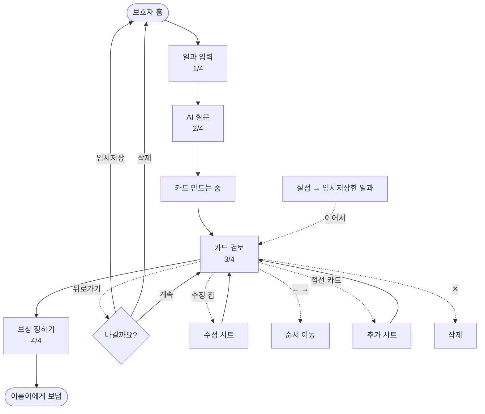
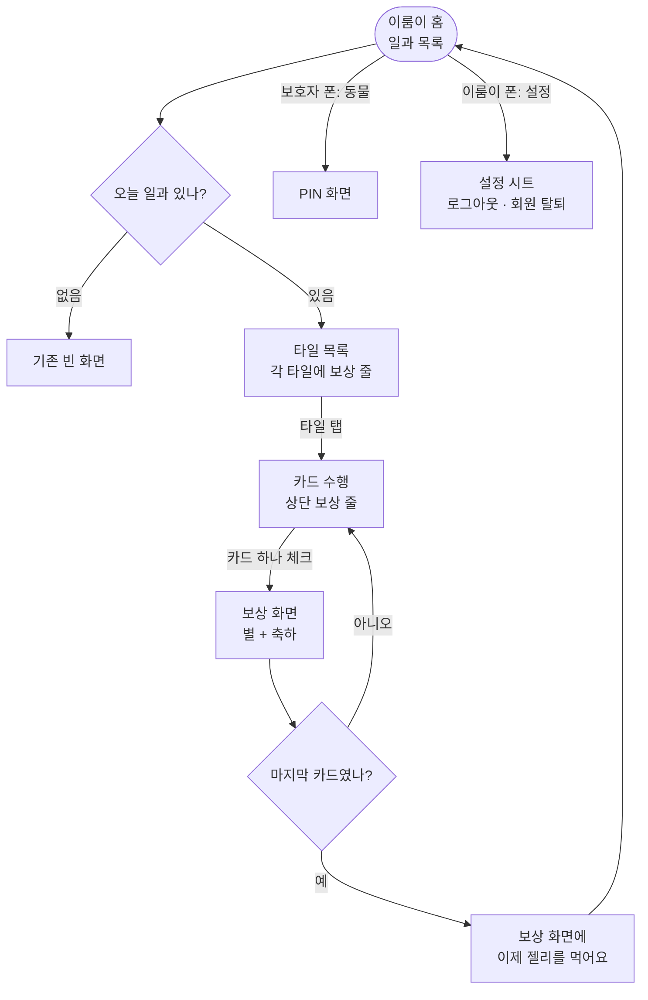
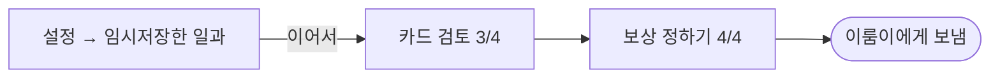

# 디자인 명세 — 2026-09-18

> 📮 **디자이너에게 주는 문서는 이것 하나다.**
> 모든 화면 · 모든 문구 · 모든 흐름 · 작업량 · 에셋이 여기 다 있다.
>
> | | |
> | --- | --- |
> | **무엇을 그리나** | §0 작업량 14건 · 에셋 6종 |
> | **안 그려도 되는 것** | §0 — 6개 화면은 손대지 않는다 |
> | **어떻게 그리나** | [docs/08-design-principles.md](../../08-design-principles.md) — 철학 · 말투 · QA 시트 |
> | **왜 이렇게 정했나** | [회의록](../../meetings/20260918_디자인회의_전면개편.md) |
>
> 이전 문서와 다르면 **이쪽을 따른다.**

---

# 0. 먼저 — 안 그려도 되는 것

메모에 적혀 있지만 **이미 앱에 있고 잘 동작한다.** 손댈 필요 없다.

| 화면 | 상태 |
| --- | --- |
| 약관 동의 · 약관 전문 | ✅ 그대로 |
| 온보딩 — 이름 입력 | ✅ 그대로 |
| 온보딩 — 캐릭터 선택 | ✅ 그대로 |
| 온보딩 — PIN 설정 | ✅ 그대로 |
| 일과 입력 · AI 질문 · 카드 만드는 중 | ✅ 그대로 |
| 별 모으기 | ✅ 그대로 |

> **"전부 다시 그려야 한다"가 아니다.** 위 6개는 건드리지 않는다.
> 로그인은 버튼 배치만 바뀌고 버튼 자체는 그대로 쓴다.

---

# 0-2. 작업량 — 16건

## 🆕 새로 그리는 것 10

| # | 화면 · 요소 | 어디 |
| :-: | --- | :-: |
| 1 | **역할 선택** — 보호자인가, 이룸이인가 | §4-3 |
| 2 | **연결 암호 만들기** (영문+숫자 6자리) | §5-1 |
| 3 | **연결 암호 넣기** | §5-2 |
| 4 | 카드 추가 시트 (기존 수정 시트 재사용) | §7-3 |

| 6 | **보상 정하기** | §7-6 |
| 7 | 보상 안내 시트 (`왜 정하나요?`) | §7-6 |
| 8 | 나갈 때 팝업 | §7-7 |
| 9 | **일과 상세** (보낸 뒤 보는 화면) | §8-3 |
| 10 | 설정 시트 · **이룸이 휴대폰(연결 끊기)** · **임시저장한 일과** | §8-4~6 |

## 🔧 고치는 것 6

| # | 화면 | 무엇을 | 어디 |
| :-: | --- | --- | :-: |
| 11 | **로그인** | `시작하기` 없애고 OAuth 버튼 바로 | §4-1 |
| 12 | 온보딩 목표 | 아이콘 톤 하나만 맞춘다 | §6-2 |
| 13 | **카드 검토** | 🆕 **순서 화살표 · 추가 카드** · 보상 줄 · CTA 문구 | §7-2 |
| 14 | **보호자 홈** | 섹션 3구역 · 설정 점 배지 · 타일 밀어서 삭제 | §8 |
| 15 | 이룸이 홈 | 타일에 **보상 줄** · 상단 바에 **설정 아이콘**(이룸이 폰) | §9-1·2 |
| 16 | 이룸이 수행 · 완료 | 상단에 보상 줄 · 완료 화면에 문구 한 줄 | §9-3·4 |

## 🎨 에셋 6

| 에셋 | 개수 | 급함 |
| --- | :-: | :-: |
| **카드 기본 그림** | 1~3 | 🔴 **대체 불가** |
| 보상 프리셋 그림 | 5 | 나중 — 이룸이 화면만 필요. 이모지로 버틴다 |
| 역할 선택 그림 | 2 | 중간 |
| 설정 아이콘 (알림·연결·임시저장) | 3 | 낮음 |
| 목표 3번 아이콘 컬러 보정 | 1 | 낮음 |
| 드래그 핸들 | 1 | 낮음 |

---

# 0-3. 형태를 처음부터 잡을 건 5개뿐

나머지는 **이미 있는 걸 그대로 쓴다.**

| 새 요소 | 그대로 쓸 것 |
| --- | --- |
| 역할 선택 카드 | 온보딩 **도움 목표 칩** |
| 연결 암호 6칸 | **PIN 화면 박스** (키보드는 시스템 것) |
| 보상 프리셋 칩 | 온보딩 **도움 목표 칩** |
| 카드 추가 시트 | **카드 고치기 시트** |
| 홈 섹션 제목 | 보호자 홈 **추천 일과 제목** |
| 나갈 때 팝업 | 기존 **확인 다이얼로그** |
| 설정 시트 | 기존 **시트 스타일** |
| 진행률 · 완료 타일 | 기존 것 |

**처음부터 그릴 것**

1. 연결 암호 만들기 화면 (여섯 글자가 주인공)
2. 보상 정하기 레이아웃 (글자 칩 2열)
3. 수행 화면 상단 보상 줄
4. 캐러셀 마지막 점선 추가 카드
5. **그림 없는 카드**

---

# 1. 두 사람을 위해 만든다

| | 보호자 | 이룸이(당사자) |
| --- | --- | --- |
| 나이 | **50대** | **20대** |
| 기기 | 자기 휴대폰 | 자기 휴대폰 |
| 하는 일 | 일과 만들기 · 카드 고치기 · 보상 정하기 | 카드 보고 수행하기 |
| 어려움 | **처음 보는 개념이 많다** (보상 · 임시저장 · 기기 연결) | 글자를 못 읽을 수 있다 |

## 그래서 이렇게 쓴다

| 원칙 | 하는 법 |
| --- | --- |
| **짧게 쓰고, 깊은 설명은 접는다** | 본문 한 줄 + `왜 그런가요? ›` → 시트에서 풀어 준다 |
| **전문 용어를 안 쓴다** | 아이 ❌ → **이룸이** · 기기 ❌ → 휴대폰 · 코드 ❌ → **연결 암호** |
| **화면마다 말을 고른다** | 보호자 화면 `완료하면` · 이룸이 화면 `다 하면` |
| **그림으로도 알 수 있게 한다** | 이룸이 화면은 글자 없이도 뜻이 통해야 한다 |
| **다음에 뭐가 나올지 알려준다** | 버튼에 결과를 쓴다 |

---

# 2. 말투 — 토스 라이팅 원칙을 따른다

## 2-1. 기본

| 항목 | 규칙 | 예 |
| --- | --- | --- |
| 말투 | **해요체** 하나로 통일 | `저장했어요` (○) / `저장되었습니다` (✕) |
| 태 | **능동형** | `암호를 만들었어요` (○) / `암호가 생성되었습니다` (✕) |
| 방향 | **긍정형** | `이어서 만들 수 있어요` (○) / `저장 안 하면 사라집니다` (✕) |

## 2-2. 8원칙 — 우리 화면에 옮기면

| # | 원칙 | 우리 화면 |
| :-: | --- | --- |
| 1 | **다음을 예측할 수 있게** | 버튼에 **바로 다음에 올 것**을 쓴다 — 검토 화면은 `보상 정하기`, 보상 화면은 `이룸이에게 보내기` |
| 2 | **잡초 뽑기** | `앞으로 결제를 하시겠습니까?` → `결제할까요?` |
| 3 | **빈 문장 제거** | 공간이 비었다고 설명을 채우지 않는다 |
| 4 | **핵심만** | 이미 아는 걸 다시 말하지 않는다 |
| 5 | **말하기 쉽게** | 소리내어 읽어 어색하면 고친다 |
| 6 | **권유하되 강요하지 않는다** | `건너뛰기`를 늘 열어 둔다 |
| 7 | **모두를 위한 단어** | 유행어·은어 안 쓴다. 50대가 아는 말만 |
| 8 | **숨은 감정 찾기** | 다 해냈을 때 축하한다 |

## 2-3. 바꿀 문구

| 지금 | 바꿔서 |
| --- | --- |
| 이룸을 시작해볼까요? | **이룸** |
| 필수 항목에 모두 동의합니다 | **모두 동의하기** |
| 이 기기는 누가 사용하나요? | **서비스를 누가 사용하나요?** |
| 아직 아이에게 보내지 않았어요 | **아직 저장하지 않았어요** |
| 아이를 어떻게 불러드릴까요? | **이룸이를 어떻게 부를까요?** |
| 보호자님 계정으로 로그인하면 아이 정보가 안전하게 보관돼요. | **로그인하면 이룸이 정보가 안전하게 보관돼요** |
| 우리 아이 (이름 없을 때) | **이룸이** |
| 계정을 지우지 못했어요. 잠시 후 다시 시도해주세요. | **탈퇴하지 못했어요. 잠시 후 다시 해주세요** |

> 🔴 **"아이"를 전부 "이룸이"로 바꾼다.** 20대 당사자가 자기 휴대폰에서 이 앱을 연다.
> **"기기"는 "휴대폰"으로.** 50대에게 기기는 낯선 말이다. (원칙 5·7)

---

# 3. 전체 흐름

## 3-1. 진입


> 🔴 **`시작하기` 버튼을 없앤다.** 첫 화면에 로그인 버튼이 바로 나온다. → §4-1

## 3-2. 일과 만들기



## 3-3. 이룸이



---

# 4. 진입 화면

## 4-1. 🔴 로그인 — `시작하기`를 없앤다

### 지금 (2단계)

```
스플래시                      로그인
┌──────────────────┐        ┌──────────────────┐
│                  │        │ 이룸을            │
│    [병아리]       │        │ 시작해볼까요?      │
│                  │  탭    │                  │
│    [로고]         │  ───▶  │ [카카오로 시작하기]│
│                  │        │ [네이버로 시작하기]│
│  [ 시작하기 ]     │        │ [Google로 시작하기]│
│                  │        │ [Apple로 시작하기] │
└──────────────────┘        └──────────────────┘
       ↑
   의미 없는 한 단계
```

### 바꿔서 (1단계)

```
┌──────────────────────────────┐
│                              │
│         [병아리]              │
│                              │
│         [로고]                │
│                              │
│    할 일을 카드로 만들어요      │  ← 한 줄
│                              │
│  ┌────────────────────────┐ │
│  │   카카오로 시작하기      │ │
│  └────────────────────────┘ │
│  ┌────────────────────────┐ │
│  │   네이버로 시작하기      │ │
│  └────────────────────────┘ │
│  ┌────────────────────────┐ │
│  │   Google로 시작하기     │ │
│  └────────────────────────┘ │
│  ┌────────────────────────┐ │
│  │   Apple로 시작하기      │ │  ← iOS만
│  └────────────────────────┘ │
│                              │
│   지난번에 카카오로 했어요     │  ← 재방문일 때만
│                              │
└──────────────────────────────┘
```

| 항목 | 값 |
| --- | --- |
| 제목 | 로고로 대신한다. **글자 제목 없음** |
| 설명 | `할 일을 카드로 만들어요` — 한 줄 |
| 버튼 | 4개 세로 · 브랜드 색 유지 |
| 재방문 힌트 | `지난번에 ○○로 했어요` — 해당 버튼 **바로 위** |
| 처리 중 | 누른 버튼만 `연결 중...` · 나머지 비활성 |

> **왜 없애나.** `시작하기`는 다음에 뭐가 나올지 말해 주지 않는다 (원칙 1).
> 누를 것이 하나뿐인 화면은 그 자체로 잡초다 (원칙 2).

### 상태

| 상태 | 화면 |
| --- | --- |
| 처음 | 위 그대로 |
| 재방문 | 지난번 수단 위에 힌트 |
| **다른 수단으로 시도** | `처음 가입할 때 쓰신 방법으로 로그인해주세요` |
| **실패** | `로그인하지 못했어요. 잠시 후 다시 해주세요` + 에러 코드 |

## 4-2. 약관 동의

```
┌──────────────────────────────┐
│ ←                            │
│                              │
│  약관에 동의해주세요           │
│                              │
│ ┌──────────────────────────┐ │
│ │ ○ 모두 동의하기           │ │  ← 굵게
│ └──────────────────────────┘ │
│ ──────────────────────────── │
│  ○ (필수) 서비스 이용약관  ›  │
│  ○ (필수) 개인정보 처리방침 › │
│  ○ (선택) 마케팅 정보 받기    │
│                              │
│                              │
│     [ 동의하고 계속하기 ]      │
└──────────────────────────────┘
```

| 항목 | 값 |
| --- | --- |
| 제목 | `약관에 동의해주세요` |
| 전체 동의 | `모두 동의하기` — 선택 항목까지 포함 |
| `›` | 전문 보기 |
| 버튼 | `동의하고 계속하기` · **필수 다 체크해야 활성** |

> ⚠️ **선택 항목이 접히면 안 된다.** `모두 동의하기`가 안 보이는 항목까지 켜면
> 사용자가 뭘 동의했는지 모른다 (원칙 6).

## 4-3. 🆕 역할 선택

```
┌──────────────────────────────┐
│                              │
│  서비스를 누가 사용하나요?     │
│                              │
│  나중에 바꿀 수 있어요          │
│                              │
│ ┌──────────────────────────┐ │
│ │ [그림]                    │ │
│ │ 보호자예요                 │ │
│ │ 일과를 만들어요             │ │
│ └──────────────────────────┘ │
│                              │
│ ┌──────────────────────────┐ │
│ │ [그림]                    │ │
│ │ 이룸이예요                 │ │
│ │ 만들어 준 일과를 해요        │ │
│ └──────────────────────────┘ │
│                              │
└──────────────────────────────┘
```

| 항목 | 값 |
| --- | --- |
| 제목 | `서비스를 누가 사용하나요?` |
| 안심 문구 | `나중에 바꿀 수 있어요` — 되돌릴 수 있음을 먼저 말한다 |
| 진행 | **탭하면 바로 넘어간다.** `다음` 버튼 없음 |
| 뒤로 | 없음 |

### 🔴 여기서 `연결 암호`를 말하지 않는다

처음 이 화면을 보는 이룸이는 **암호를 받은 적이 없다.**
`받은 코드로 연결해요`라고 쓰면 *"무슨 코드? 어디서 받지?"* 에서 막힌다.

```
❌ 이렇게 쓰면 막힌다              ✅ 이렇게 쓴다
┌──────────────────────┐        ┌──────────────────────┐
│ 제가 써요             │        │ 이룸이예요            │
│ 받은 코드로 연결해요    │        │ 만들어 준 일과를 해요  │
└──────────────────────┘        └──────────────────────┘
  받은 적 없는데?                   내가 뭘 하는 사람인지만
  어디서 받지?                      말한다
```

**이 화면은 "누구인가"만 묻는다.** 암호는 다음 화면에서 처음 나오고,
거기서 **어디서 받는지까지 같이** 알려준다. (원칙 ① 한 화면에 하나만)

> 두 선택지가 **관계로 짝을 이룬다** — 한쪽은 만들고, 한쪽은 만들어 준 걸 한다.
> `코드`를 몰라도 자기가 어느 쪽인지 안다.

---

---

# 5. 🆕 이룸이 휴대폰 연결하기

> 🔴 **QR을 쓰지 않는다.** 카메라 권한·촬영 흐름까지 만들 여력이 없다.
> **6자리 연결 암호 하나로만** 연결한다.

## 5-0. 연결 암호 규칙

```
        A 7 K   3 M 9
        └─3─┘   └─3─┘
```

| 항목 | 값 |
| --- | --- |
| 길이 | **6자리** |
| 문자 | **영문 대문자 + 숫자** |
| 표시 | 3-3으로 묶고 자간을 넓게 |
| 유효 | **10분 · 1회용** |

### 🔴 헷갈리는 글자를 빼고 만든다

보호자가 **불러주고** 이룸이가 **받아적는다.** `0`과 `O`가 섞이면 그 자리에서 막힌다.

```
쓰지 않는다:  0  O  1  I  L  U
쓴다:  2 3 4 5 6 7 8 9
       A B C D E F G H J K M N P Q R S T V W X Y Z
```

30자 × 6자리 = 7억 가지. 충분하다.

### 소문자로 쳐도 대문자로 받는다

`a7k3m9`라고 쳐도 **`A7K3M9`로 인식**한다. 화면에도 대문자로 보인다.
대소문자를 구분하지 않으므로 **어느 쪽으로 쳐도 된다.**

> 💡 **왜 `번호`가 아니라 `암호`인가** — 영문이 섞여서 `번호`라고 부르면 맞지 않는다.
> 앱이 이미 PIN을 **암호**라고 부른다(`암호를 입력하면…`). 같은 말을 쓴다.

---

## 5-1. 연결 암호 만들기 (보호자 휴대폰)

**진입 2곳** — PIN 설정 직후 / 홈 → 설정 → `이룸이 휴대폰 연결하기`

```
┌──────────────────────────────┐
│ ←                            │
│                              │
│  이룸이 휴대폰에                │
│  이 암호를 넣어주세요           │
│                              │
│                              │
│      A 7 K   3 M 9           │  ← 화면에서 가장 큰 글자
│                              │
│      [ 암호 복사 ]            │
│                              │
│                              │
│   10분 동안 쓸 수 있어요       │
│                              │
│  [ 암호 다시 만들기 ]          │
│  [ 나중에 할게요 ]             │  ← 온보딩에서만
└──────────────────────────────┘
```

| 요소 | 값 |
| --- | --- |
| 제목 | `이룸이 휴대폰에 이 암호를 넣어주세요` |
| 암호 | **화면에서 가장 큰 글자** · 3-3 묶음 · 자간 넓게 |
| 유효 시간 | `10분 동안 쓸 수 있어요` — 카운트다운보다 덜 쫓기게 |
| 1분 남으면 | `1분 남았어요` |
| 복사 | 누르면 `복사했어요` 토스트 |

> **QR이 빠지면서 화면이 비었다.** 암호를 더 크게 키우고 여백을 넉넉히 준다.
> 이 화면의 주인공은 **여섯 글자**다.

### 상태

| 상태 | 화면 |
| --- | --- |
| 정상 | 위 그대로 |
| **만료** | 암호 흐리게 + `암호가 만료됐어요` · `다시 만들기`를 주 버튼으로 |
| **연결됨** | `연결됐어요` + 체크 → 홈 |
| **발급 실패** | `암호를 만들지 못했어요. 다시 해주세요` + 에러 코드 |

---

## 5-2. 연결 암호 넣기 (이룸이 휴대폰)

```
┌──────────────────────────────┐
│ ←                            │
│                              │
│  보호자에게 연결 암호를        │
│  받아주세요                   │
│                              │
│ ┌──────────────────────────┐ │
│ │ 보호자 휴대폰에서           │ │  ← 🔴 어디서 받는지
│ │                          │ │
│ │ 설정 →                    │ │
│ │ 이룸이 휴대폰 연결하기       │ │
│ │                          │ │
│ │ 여섯 글자가 나와요          │ │
│ └──────────────────────────┘ │
│                              │
│   ┌─┐┌─┐┌─┐  ┌─┐┌─┐┌─┐      │
│   │A││7││K│  │ ││ ││ │      │  ← PIN 6칸 스타일 그대로
│   └─┘└─┘└─┘  └─┘└─┘└─┘      │
│                              │
│                              │
│      (시스템 키보드)           │  ← 🔴 숫자패드 아님
└──────────────────────────────┘
```

### 🔴 숫자패드를 쓸 수 없다

기존 PIN 화면은 **숫자만** 치는 커스텀 패드다. 연결 암호는 영문이 섞여서 그 패드로는 못 친다.

| | PIN 화면 | 연결 암호 |
| --- | --- | --- |
| 칸 | 4칸 | **6칸** |
| 입력 | **커스텀 숫자패드** | 🔴 **시스템 키보드** |
| 문자 | 숫자만 | **영문 + 숫자** |

**6칸 박스 모양은 PIN 화면 것을 그대로 쓴다.** 키보드만 시스템 것으로 바뀐다.

| 규칙 | 내용 |
| --- | --- |
| 자동 대문자 | 소문자로 쳐도 **대문자로 보인다** |
| 자동 제출 | 6자리를 채우면 바로 넘어간다 |
| 붙여넣기 | **허용한다** — 보호자가 복사해서 보내줄 수 있다 |
| 키보드 | 영문+숫자 · **자동완성·자동수정 끈다** |

> 💡 **보호자가 대신 넣어 줄 수 있다.** 이 안내는 보호자가 읽어도 말이 된다.

### 상태

| 상태 | 문구 |
| --- | --- |
| 입력 중 | 6자리 채우면 **자동으로 넘어간다** |
| **틀림** | 칸 흔들림 + `암호가 맞지 않아요` · 입력 초기화 |
| **만료** | `암호가 만료됐어요. 새 암호를 받아주세요` |
| **네트워크 실패** | `연결하지 못했어요` + `다시 시도` |
| 연결됨 | `연결됐어요` → 이룸이 홈 |

> ⚠️ **붉은 경고를 크게 쓰지 않는다.** PIN 화면과 같은 톤. 에러 코드는 작게 구석에.

---


# 6. 온보딩

## 6-1. 이름 → 목표 → 캐릭터 → PIN (기존)

```
이름                  목표                  캐릭터               PIN
┌──────────┐        ┌──────────┐        ┌──────────┐      ┌──────────┐
│ 어떻게    │        │ ○○의 어떤 │        │ 함께할    │      │ 비밀번호   │
│ 부를까요? │  ───▶  │ 순간을... │  ───▶  │ 친구를... │ ───▶ │ 4자리     │
│          │        │ [칩 4개]  │        │ [3종]     │      │ ○ ○ ○ ○  │
└──────────┘        └──────────┘        └──────────┘      └──────────┘
   ✅ 유지              🔧 칩 깨짐          ✅ 유지            ✅ 유지
```

## 6-2. 도움 목표 — 문구 그대로

선택지 4개 문구는 **바꾸지 않는다.** 변경 기록이 없어 현행 유지로 확정했다.

| # | 문구 |
| :-: | --- |
| 1 | 해야 할 일을 순서대로 이해해요 |
| 2 | 필요한 준비물을 스스로 챙겨요 |
| 3 | 새로운 상황을 미리 준비해요 |
| 4 | 혼자 끝까지 해내는 경험을 만들어요 |

**아이콘** — 3번(체크리스트)만 무채색이다. 나머지 3개는 컬러라 혼자 안 띈다. 맞춘다.

---

# 7. 일과 만들기

## 7-1. 흐름과 진행 표시

```
 1/4          2/4          (로딩)        3/4           4/4
┌────────┐  ┌────────┐  ┌────────┐  ┌────────┐  ┌────────┐
│ 일과    │  │ AI      │  │ 카드    │  │ 카드    │  │ 보상    │
│ 입력    │─▶│ 질문    │─▶│ 만드는  │─▶│ 검토    │─▶│ 정하기  │
│        │  │        │  │ 중      │  │        │  │        │
└────────┘  └────────┘  └────────┘  └────────┘  └────────┘
  ✅ 유지      ✅ 유지      ✅ 유지      🔧 변경      🆕 신규
```

## 7-2. 🔧 카드 검토 — 지금 화면에 세 가지만 더한다

> 🔴 **전문가 자문 필수 요구** — *"생성된 카드를 수정·순서 변경·삭제할 수 있어야 한다. 쉽게."*

**삭제와 수정은 이미 있다.** 없는 건 **순서 이동**과 **카드 추가** 둘뿐이다.

| 동작 | 지금 | |
| --- | :-: | --- |
| **삭제** | ✅ **있다** | 카드 그림 **우상단 `✕`** (30×30 · 터치 44×44) · 마지막 1장이면 숨는다 |
| **문구 수정** | ✅ **있다** | 하단 `이 카드 수정하기` 칩 → 시트 |
| **순서 배지** | ✅ **있다** | 제목 왼쪽 `②` (40×40 r12) |
| **순서 이동** | ❌ 없다 | 🆕 |
| **카드 추가** | ❌ 없다 | 🆕 |

```
┌────────────────────────────────┐
│ ←                       3 / 4  │
│                                │
│  비 오는 날 학교 가기            │
│                                │
│   ┌──┐ ┌──────────┐ ┌ ─ ─ ┐   │
│   │  │ │ [그림]  ✕ │ │  +  │   │ ← 🆕 마지막 자리에
│   │  │ │          │ │     │   │    점선 추가 카드
│   │  │ │② 가방을   │ │ 카드 │   │
│   │  │ │  챙겨요   │ │ 추가 │   │
│   └──┘ └──────────┘ └ ─ ─ ┘   │
│          ● ● ○ ○               │
│                                │
│   [ ← ] [ 이 카드 수정하기 ] [ → ]│ ← 🆕 칩 양옆에 화살표
│                                │
│ ────────────────────────────── │
│  완료하면: 젤리 먹기    [ 바꾸기 ]│ ← 🆕 보상 줄
│ ────────────────────────────── │
│                                │
│      [ 보상 정하기 ]            │ ← 🆕 문구 (기존 `아이 화면으로 시작`)
└────────────────────────────────┘
```

### 🆕 순서 이동 — 화면을 옮기지 않는다

**지금 보고 있는 카드를 앞뒤로 민다.** 수정 칩 양옆에 화살표를 둔다.

```
   [ ← ]   [ 이 카드 수정하기 ]   [ → ]
     ↑            기존 그대로        ↑
  앞으로 보내기                 뒤로 보내기
```

| 규칙 | 내용 |
| --- | --- |
| 대상 | **지금 보고 있는 카드** — 수정 칩과 같은 대상이다 |
| `←` | **첫 장이면 비활성** |
| `→` | **마지막 장이면 비활성** |
| 누르면 | 카드가 옆자리와 자리를 바꾸고 **캐러셀이 따라 움직인다** |
| 순서 배지 | 바뀐 자리 숫자로 **바로 갱신** |
| 저장 실패 | `순서를 저장하지 못했어요` + 원래 자리로 되돌린다 |

> **별도 편집 화면을 만들지 않는다.** 카드를 보면서 그 자리에서 옮기는 게 가장 쉽다.
> 일과는 보통 3~7장이라 한두 번 누르면 원하는 자리에 간다.

### 🆕 카드 추가 — 캐러셀 마지막 자리

```
┌ ─ ─ ─ ─ ─ ┐
│           │
│     +     │   점선 테두리 · 빈 카드
│           │
│   카드 추가 │
│           │
└ ─ ─ ─ ─ ─ ┘
```

| 규칙 | 내용 |
| --- | --- |
| 자리 | **캐러셀 맨 뒤** · 항상 있다 |
| 누르면 | **기존 수정 시트**가 빈 상태로 열린다 |
| 추가되면 | 새 카드가 **마지막 자리**에 들어가고 캐러셀이 그 카드로 이동 |
| 점 표시 | `● ● ○ ○` 에 **추가 카드는 세지 않는다** |

### 그대로 두는 것

| 요소 | |
| --- | --- |
| 삭제 `✕` | 그림 우상단 · **위치·크기 그대로** |
| 순서 배지 `②` | 제목 왼쪽 40×40 r12 · **그대로** |
| `이 카드 수정하기` 칩 | **문구까지 그대로** |
| 카드 캐러셀 · 점 표시 | 그대로 |

> **버튼을 새로 만들지 않는다.** 화살표 둘과 점선 카드 하나가 전부다.

---

## 7-3. 카드 수정 · 추가 시트

```
수정 칩을 눌렀을 때                + 카드 추가를 눌렀을 때
┌──────────────────────┐        ┌──────────────────────┐
│  카드 수정             │        │  카드 추가            │
│                      │        │                      │
│  무엇을 하나요?        │        │  무엇을 하나요?        │
│  ┌──────────────┐    │        │  ┌──────────────┐    │
│  │ 가방을 챙겨요  │    │        │  │              │    │
│  └──────────────┘    │        │  └──────────────┘    │
│                      │        │                      │
│  설명 (선택)          │        │  설명 (선택)          │
│  ┌──────────────┐    │        │  ┌──────────────┐    │
│  └──────────────┘    │        │  └──────────────┘    │
│                      │        │                      │
│  [ 취소 ]   [ 저장 ]  │        │  [ 취소 ]   [ 추가 ]  │
└──────────────────────┘        └──────────────────────┘
```

**기존 수정 시트를 그대로 쓴다.** 추가는 같은 시트를 빈 상태로 여는 것뿐이다.
삭제는 카드 우상단 `✕`에 있으므로 시트에 두지 않는다.
제목이 비면 주 버튼 비활성.

---

## 7-4. 카드 그림 — 디자이너 참고 (화면에 쓰지 않는다)

> 📌 **화면에 "그림을 바꿀 수 없어요"라고 쓰지 않는다.**
> 기능을 안 만들면 그만이다. 없는 기능을 굳이 설명하면 없다는 사실만 커 보인다.

**AI 이미지 생성 비용 때문에 이미 만든 카드의 그림을 다시 만들지 않는다.**

| 동작 | 그림 |
| --- | --- |
| 고치기 | 그대로 둔다 — 시트에 그림 항목 자체가 없다 |
| 추가 | **기본 그림이 조용히 들어간다** — 안내 없음 |
| 순서 · 삭제 | 그림이 따라간다 |

**그림이 마음에 안 들면 그 카드를 지우고 다시 만든다.** 그게 유일한 방법이고,
그 방법을 화면에서 안내하지도 않는다. 지우기와 추가가 이미 있으므로 길은 열려 있다.

### 🎨 그림 없는 카드 — 두 안 중 하나

```
A안 — 기본 그림 (권장)            B안 — 글자 중심
┌─────────────────┐            ┌─────────────────┐
│                 │            │                 │
│   [기본 그림]     │            │                 │
│                 │            │   가방을 챙겨요   │
│                 │            │                 │
│  가방을 챙겨요     │            │                 │
└─────────────────┘            └─────────────────┘
 다른 카드와 형태가 같다           그림 자리가 없어 어색함이 없다
 그림이 내용과 무관해 보인다        카드들이 서로 달라 보인다
```

캐러셀에서 나란히 넘어가므로 **형태가 다르면 눈에 띈다. A안 권장.**
기본 그림은 **내용을 암시하지 않는 중립적인 것**이어야 한다.

> 🎨 **대체할 것이 없어 가장 급한 에셋이다.**

---

## 7-5. 🆕 보상 정하기

**위치** — 카드 검토 다음 · 진행 `4 / 4` · 마지막 단계

```
┌──────────────────────────────┐
│ ←                     4 / 4  │
│                              │
│  완료하면 뭘 할 수 있나요?     │
│                              │
│  미리 정해두면 끝까지 해낼      │
│  힘이 돼요                    │
│                              │
│  최근에 정한 보상              │  ← 없으면 섹션째 숨김
│  [ 젤리 ]  [ 유튜브 10분 ]     │
│                              │
│  ┌───────────┐ ┌───────────┐│
│  │ 좋아하는   │ │ 유튜브     ││
│  │ 간식      │ │ 10분      ││
│  └───────────┘ └───────────┘│
│  ┌───────────┐ ┌───────────┐│
│  │ 좋아하는   │ │ 산책      ││
│  │ 놀이      │ │           ││
│  └───────────┘ └───────────┘│
│  ┌─────────────────────────┐│
│  │ 직접 입력                ││
│  └─────────────────────────┘│
│                              │
│  왜 정하나요? ›               │
│                              │
│ [건너뛰기] [이룸이에게 보내기] │
└──────────────────────────────┘
```

| 항목 | 값 |
| --- | --- |
| 제목 | `완료하면 뭘 할 수 있나요?` |
| 설명 | `미리 정해두면 끝까지 해낼 힘이 돼요` — **한 줄** |
| 프리셋 칩 | **글자만** · 2열 그리드 · 온보딩 도움 목표 칩 스타일 |
| 최근 보상 칩 | 같은 형태, **작게** · 최대 3개 |
| 직접 입력 | 탭하면 아래에 입력칸이 열린다 · **최대 20자** |
| `건너뛰기` | 보조 버튼 · **항상 활성** (원칙 6) |
| `이룸이에게 보내기` | **아무것도 안 골라도 활성** — 여기가 실제로 보내는 자리다 |

> 📌 **이 화면에는 그림을 넣지 않는다.** 보호자가 보는 화면이고 글자로 충분하다.
> 그림이 필요한 건 **이룸이 화면**이다 (§9).

### 상태 2가지

| 상태 | 화면 |
| --- | --- |
| 최근 보상 **있음** | `최근에 정한 보상` 섹션 노출 |
| 최근 보상 **없음** | **섹션 전체 숨김** (제목도 안 보인다) |

### 프리셋 5종

| 라벨 |
| --- |
| 좋아하는 간식 |
| 유튜브 10분 |
| 좋아하는 놀이 |
| 산책 |
| 직접 입력 |

### 🔴 긴 설명은 시트로 접는다 — 50대 가이드의 핵심 패턴

```
┌──────────────────────────────┐
│  왜 보상을 정하나요?           │
│                              │
│  할 일만 알려주면              │
│  하고 싶어지진 않아요.          │
│                              │
│  끝나고 뭐가 있는지 알면        │
│  지금 하는 일에 의미가 생겨요.   │
│                              │
│  이런 게 잘 통해요             │
│  · 오늘 바로 받을 수 있는 것    │
│  · 평소에 좋아하던 것          │
│                              │
│       [ 알겠어요 ]            │
└──────────────────────────────┘
```

**본문은 한 줄, 설명은 시트.** 낯선 개념마다 이 패턴을 쓴다.

| 낯선 개념 | 본문 한 줄 | 시트 |
| --- | --- | --- |
| 보상 | `미리 정해두면 끝까지 해낼 힘이 돼요` | `왜 정하나요? ›` |
| 임시저장 | `이어서 만들 수 있어요` | — · **설정 안에 둔다** (§8-1) |
| 연결 암호 | `보호자에게 연결 암호를 받아주세요` | — (§5-2에서 본문에 경로를 적는다) |

> ⚠️ **`강화`, `행동중재` 같은 말을 화면에 쓰지 않는다.** (원칙 5·7)

## 7-6. 🆕 나갈 때

```
┌──────────────────────────────┐
│  아직 저장하지 않았어요         │
│                              │
│  임시저장하면 나중에            │
│  이어서 만들 수 있어요           │
│                              │
│  [ 삭제 ]        [ 임시저장 ]  │
│                              │
│      계속 만들기               │
└──────────────────────────────┘
```

| 버튼 | 위계 |
| --- | --- |
| `임시저장` | **주 버튼** |
| `삭제` | 위험색 · 주 버튼보다 약하게 |
| `계속 만들기` | 텍스트 버튼 |

> **"사라집니다"라고 겁주지 않는다.** 할 수 있는 것을 말한다 (원칙 6 · 긍정형).

---

# 8. 🔧 보호자 홈

```
┌────────────────────────────────┐
│ 안녕하세요, ○○님         [설정] │
│                                │
│ ┌────────────────────────────┐ │
│ │   + 새로운 일과 만들기       │ │
│ └────────────────────────────┘ │
│                                │
│ 오늘 일과                       │
│ ┌────────────────────────────┐ │
│ │ 비 오는 날 학교 가기         │ │
│ │ ●●●○○  3/5                 │ │
│ │ 완료하면: 젤리 먹기          │ │
│ └────────────────────────────┘ │
│                                │
│ 진행 중                         │
│ ┌────────────────────────────┐ │
│ │ 아침 등교 준비               │ │
│ │ ●●○○○  2/5                 │ │
│ │ 완료하면: 산책               │ │
│ └────────────────────────────┘ │
│                                │
│ 최근 일과                       │
│ ┌────────────────────────────┐ │
│ │ 아침 등교 준비      5/5      │ │
│ │              [ 다시 하기 ]  │ │
│ └────────────────────────────┘ │
│                                │
│ 추천 일과                       │
└────────────────────────────────┘
```

| 섹션 | 무엇이 | 0건이면 |
| --- | --- | --- |
| **오늘 일과** | 오늘 할 일 · 시작 전 | `오늘은 만든 일과가 없어요` |
| **진행 중** | 오늘 것 중 하다 만 것 | 섹션 숨김 |
| **최근 일과** | 지난 날짜 · 10개 | 섹션 숨김 |
| **추천 일과** | 기존 유지 | 유지 |

> **오늘 일과와 진행 중은 타일 디자인이 같다.** 섹션 제목만 다르다.

## 8-1. 🔴 임시저장은 홈에 두지 않는다

만들다 만 일과는 **설정 안으로 넣는다.** 홈은 오늘 할 일을 보는 곳이다.

```
❌ 섹션 4개                    ✅ 섹션 3개
오늘 일과                       오늘 일과
진행 중                         진행 중
임시저장   ← 자주 안 생긴다       최근 일과
최근 일과
```

임시저장은 **카드 검토 중에 나갈 때만** 생긴다. 흔한 일이 아닌데 홈에 자리를 차지하면
매일 보는 화면이 그만큼 길어진다.

### 다만 — 잊어버리지 않게 표시한다

설정으로 넣으면 **만들다 만 게 있다는 걸 모른다.** 설정은 자주 들어가지 않는다.

```
┌────────────────────────────────┐
│ 안녕하세요, ○○님        [설정•] │  ← 임시저장이 있으면 점
└────────────────────────────────┘
```

| 상태 | 설정 아이콘 |
| --- | --- |
| 임시저장 **0건** | 점 없음 |
| 임시저장 **1건 이상** | **작은 점** (숫자 아님 · 중립색) |

> **숫자 배지를 쓰지 않는다.** 읽지 않은 알림이 아니라 **하다 만 일**이다.
> 빨간 배지는 재촉하는 느낌을 준다 (원칙 6).

## 8-2. 🔴 타일을 누르면 · 밀면 · 길게 누르면

**타일마다 무엇을 할 수 있는지 정한다.** 이게 없으면 디자이너가 그릴 수 없다.

| 섹션 | 탭 | 왼쪽으로 밀기 | 길게 누르기 |
| --- | --- | --- | --- |
| **오늘 일과** | 일과 상세 (§8-3) | `삭제` | — |
| **진행 중** | 일과 상세 (§8-3) | `삭제` | — |
| **최근 일과** | 일과 상세 (읽기) | `삭제` | — |
| **추천 일과** | 그 내용으로 일과 만들기 시작 | — | — |

> **탭이 주 경로다.** 밀기는 아는 사람만 쓰는 지름길이다.
> 50대 보호자에게 밀기는 발견하기 어렵다. **밀어야만 되는 동작을 만들지 않는다.**
> 삭제는 상세 화면 안에도 반드시 있다.

> **길게 누르기는 쓰지 않는다.** 일과에는 순서 개념이 없다 — 날짜순으로 정렬된다.
> 순서를 바꾸는 건 **카드**이고, 그건 카드 검토 화면의 화살표로 한다 (§7-2).

### 왼쪽으로 밀면

```
평소                              민 뒤
┌────────────────────────────┐   ┌──────────────────┬─────────┐
│ 비 오는 날 학교 가기         │   │ 비 오는 날 학교   │         │
│ ●●●○○  3/5                 │ ← │ ●●●○○  3/5      │  삭제   │
│ 완료하면: 젤리 먹기          │   │ 완료하면: 젤리    │         │
└────────────────────────────┘   └──────────────────┴─────────┘
```

| 항목 | 값 |
| --- | --- |
| 나오는 것 | **`삭제` 하나만** |
| 색 | 위험색 |
| 끝까지 밀면 | **바로 지우지 않는다** — 확인 팝업을 띄운다 |
| 다른 타일을 밀면 | 먼저 열린 것이 닫힌다 |
| 화면을 스크롤하면 | 열린 것이 닫힌다 |

> **끝까지 밀어서 바로 삭제되는 동작을 넣지 않는다.** 되돌릴 수 없는 일이다 (원칙 6).

### 지울 때 — 이룸이 화면에서도 사라진다

```
오늘 일과 · 진행 중                최근 일과
┌──────────────────────────┐    ┌──────────────────────────┐
│  일과를 지울까요?          │    │  일과를 지울까요?          │
│                          │    │                          │
│  이룸이 화면에서도         │    │  기록이 사라져요           │
│  사라져요                 │    │                          │
│                          │    │                          │
│  [ 취소 ]     [ 지우기 ]  │    │  [ 취소 ]     [ 지우기 ]  │
└──────────────────────────┘    └──────────────────────────┘
```

| 버튼 | 위계 |
| --- | --- |
| `취소` | 텍스트 버튼 · **기본 동작** |
| `지우기` | 위험색 · 주 버튼 **아님** |

> **`지우기`를 주 버튼으로 두지 않는다.** 실수로 누르면 되돌릴 수 없다.

---

## 8-3. 🆕 일과 상세 — 카드 검토와 같은 화면, 다른 상태

**보내기 전이 카드 검토(§7-2)이고, 보낸 뒤가 일과 상세다.** 레이아웃이 같다.

```
보내기 전 (카드 검토 3/4)          보낸 뒤 (일과 상세)
┌────────────────────────────┐   ┌────────────────────────────┐
│ ←                   3 / 4  │   │ ←                     [⋯]  │
│                            │   │                            │
│  비 오는 날 학교 가기        │   │  비 오는 날 학교 가기        │
│                            │   │  오늘 · 3/5 완료            │  ← 🆕
│   [카드 캐러셀]              │   │   [카드 캐러셀 · 완료 표시]  │  ← 🆕
│    ● ● ○ ○                 │   │    ✓ ✓ ✓ ○ ○              │
│                            │   │                            │
│      [ 카드 편집 ]          │   │      [ 카드 편집 ]          │
│                            │   │                            │
│ ────────────────────────── │   │ ────────────────────────── │
│ 완료하면: 젤리 먹기 [ 바꾸기 ]│   │ 완료하면: 젤리 먹기 [ 바꾸기 ]│
│ ────────────────────────── │   │ ────────────────────────── │
│                            │   │                            │
│     [ 보상 정하기 ]         │   │   (하단 버튼 없음)          │  ← 🆕
└────────────────────────────┘   └────────────────────────────┘
```

| 차이 | 보내기 전 | 보낸 뒤 |
| --- | --- | --- |
| 진행 표시 | `3 / 4` (만드는 단계) | **`오늘 · 3/5 완료`** (수행 진행률) |
| 카드 | 전부 같은 모습 | **끝낸 카드에 체크** |
| 하단 CTA | `보상 정하기` | **없음** — 이미 보냈다 |
| 우측 상단 | 없음 | **`⋯` 메뉴** |

### `⋯` 메뉴

```
┌──────────────────────────┐
│  다시 하기                │  ← 최근 일과에만
│  일과 지우기              │  ← 위험색
└──────────────────────────┘
```

| 섹션 | `⋯`에 들어가는 것 |
| --- | --- |
| 오늘 일과 · 진행 중 | `일과 지우기` |
| 최근 일과 | `다시 하기` · `일과 지우기` |

> **삭제가 여기에도 있어야 한다.** 미는 걸 모르는 사람이 지울 방법이 없으면 안 된다.

### 최근 일과를 열면

```
┌────────────────────────────┐
│ ←                     [⋯]  │
│                            │
│  아침 등교 준비             │
│  9월 15일 · 5/5 완료        │
│                            │
│   [카드 캐러셀 · 전부 체크]  │
│    ✓ ✓ ✓ ✓ ✓              │
│                            │
│      [ 다시 하기 ]          │  ← 주 버튼
│                            │
│ ────────────────────────── │
│ 완료하면: 산책              │  ← `바꾸기` 없음 (끝난 일과)
│ ────────────────────────── │
└────────────────────────────┘
```

| 항목 | 값 |
| --- | --- |
| `카드 편집` | **없다** — 끝난 일과는 고치지 않는다 |
| `다시 하기` | **주 버튼** — 같은 카드로 오늘 일과를 새로 만든다 |
| 보상 줄 | 보여만 준다 · `바꾸기` 없음 |

> **`다시 하기`는 복사다.** 원래 일과는 그대로 두고 **오늘 날짜로 새로 만든다.**
> 카드 내용·보상을 그대로 가져오고, **완료 표시만 지운 상태**로 시작한다.

---

## 8-4. 🆕 설정

```
연결 전                           연결 뒤
┌────────────────────────────┐   ┌────────────────────────────┐
│  설정                       │   │  설정                       │
│                            │   │                            │
│  임시저장한 일과       2  ›  │   │  임시저장한 일과       2  ›  │
│  이룸이 휴대폰 연결하기    ›  │   │  이룸이 휴대폰    연결됨  ›  │
│  알림                    ›  │   │  알림                    ›  │
│ ────────────────────────── │   │ ────────────────────────── │
│  로그아웃                   │   │  로그아웃                   │
│  회원 탈퇴                  │   │  회원 탈퇴                  │
└────────────────────────────┘   └────────────────────────────┘
```

| 항목 | 상태 | 문구 |
| --- | :-: | --- |
| **임시저장한 일과** | 🆕 | 개수 표시 · **0건이면 항목째 숨김** |
| **이룸이 휴대폰 연결하기** | 🆕 | 누르면 §5-1 번호 만들기 |
| **이룸이 휴대폰** `연결됨` | 🆕 | 연결된 뒤로 바뀐다 · 누르면 **§8-5 연결 끊기** |
| 알림 | 🆕 | |
| 로그아웃 | ✅ | `로그아웃할까요?` |
| 회원 탈퇴 | ✅ | `정말 탈퇴할까요?` · **되돌릴 수 없다고 말한다** |

> **`연결`이 아니라 `연결하기`다.** 명사로 끝나면 눌러도 되는 항목인지 모른다.
> `하기`가 붙으면 그 자리에서 할 일이 있다는 게 보인다.

> 연결된 뒤에는 할 일이 없으므로 **상태를 보여주는 줄로 바뀐다.**

> **탈퇴는 위험색을 쓰되 가장 눈에 안 띄게.** 오탭으로 계정이 날아가면 안 된다.

## 8-5. 🆕 이룸이 휴대폰 — 연결 상태와 끊기

설정에서 `이룸이 휴대폰 · 연결됨 ›`을 누르면 열린다. **연결 전에는 이 화면이 없다**
(그때는 §5-1 번호 만들기로 바로 간다).

```
┌──────────────────────────────┐
│ ←    이룸이 휴대폰             │
│                              │
│  연결됨                       │
│  9월 18일부터                 │
│                              │
│                              │
│                              │
│      [ 연결 끊기 ]            │  ← 위험색 · 주 버튼 아님
│                              │
│  끊으면 이룸이 휴대폰에서       │
│  일과를 볼 수 없어요           │
└──────────────────────────────┘
```

| 요소 | 값 |
| --- | --- |
| 상태 | `연결됨` + **언제부터** |
| `연결 끊기` | 위험색 · **주 버튼 아님** |
| 설명 | 버튼 아래 한 줄 — 끊으면 어떻게 되는지 |

### 🔴 왜 필요한가 — 이룸이 폰이 손에 없을 때

| 상황 | 이룸이 폰에서 로그아웃하면 되나 |
| --- | :-: |
| 이룸이 폰을 **잃어버렸다** | ❌ 폰이 없다 |
| 이룸이 폰을 **새로 바꿨다** | ❌ 헌 폰 연결이 살아 있다 |
| 실수로 **다른 사람 폰**에 연결했다 | ❌ 그 사람이 안 눌러주면 끝 |

**셋 다 잃어버린 폰이 계속 일과를 본다.** 보호자가 끊을 길이 없으면 방법이 없다.

> 이룸이 폰에는 `연결 끊기`를 따로 두지 않는다. 거기서는 **`로그아웃`이 곧 연결 끊기**라
> 두 개를 두면 같은 일을 하는 버튼이 둘이 된다.

### 끊을 때

```
┌──────────────────────────────┐
│  연결을 끊을까요?              │
│                              │
│  이룸이 휴대폰에서            │
│  일과를 볼 수 없어요           │
│                              │
│  다시 연결하려면              │
│  새 암호를 만들면 돼요         │
│                              │
│  [ 취소 ]     [ 연결 끊기 ]   │
└──────────────────────────────┘
```

> **되돌릴 수 있다고 함께 말한다.** 번호를 다시 만들면 되므로 탈퇴처럼 무겁지 않다 (원칙 ④).

### 끊은 뒤

| 화면 | 상태 |
| --- | --- |
| 보호자 설정 | `이룸이 휴대폰 연결하기`로 **되돌아간다** |
| 이룸이 폰 | 다음에 열 때 **로그인 화면**으로 · `연결이 끊어졌어요` |

---


## 8-6. 🆕 임시저장한 일과

```
┌──────────────────────────────┐
│ ←    임시저장한 일과           │
│                              │
│ ┌──────────────────────────┐ │
│ │ 병원 가기                 │ │
│ │ 9월 15일                  │ │
│ │ 완료하면: 유튜브 10분      │ │
│ │              [ 이어서 ]   │ │
│ └──────────────────────────┘ │
│ ┌──────────────────────────┐ │
│ │ 미용실 가기               │ │
│ │ 9월 12일                  │ │
│ │              [ 이어서 ]   │ │
│ └──────────────────────────┘ │
│                              │
└──────────────────────────────┘
```

| 요소 | 값 |
| --- | --- |
| 타일 | 제목 + **만든 날짜** + 보상(있으면) + `이어서` |
| 날짜 | 언제 만들다 말았는지 알아야 한다 |
| **0건** | 설정에서 **항목째 안 보인다.** 이 화면에 들어올 일이 없다 |

### 타일을 누르면 · 밀면

| 동작 | 결과 |
| --- | --- |
| **탭** · `이어서` | 카드 검토(3/4)로 — 타일 어디를 눌러도 같다 |
| **왼쪽으로 밀기** | `삭제` |
| 길게 누르기 | — |

```
┌──────────────────┬─────────┐
│ 병원 가기         │         │
│ 9월 15일         │  삭제   │
│ 완료하면: 유튜브   │         │
└──────────────────┴─────────┘
```

**지울 때**

```
┌──────────────────────────┐
│  만들다 만 일과를 지울까요? │
│                          │
│  이룸이는 아직 본 적 없어요 │
│                          │
│  [ 취소 ]     [ 지우기 ]  │
└──────────────────────────┘
```

> 이룸이에게 간 적이 없는 일과다. **`이룸이 화면에서도 사라져요`라고 쓰지 않는다.**
> 없는 걱정을 만들지 않는다 (원칙 4 · 핵심만).

### 🔴 `이어서`가 핵심이다

**`이어서`를 누르면 카드 검토 화면으로 바로 간다.** 거기서 고치고, 보상 정하고,
보내는 것까지 끝낸다.



> **`수정` 대신 `이어서`로 쓴다.** 고치는 게 아니라 **만들다 만 것을 마저 만드는 것**이다 (원칙 1).

## 8-7. 상태

| 상태 | 화면 |
| --- | --- |
| **로딩** | 스켈레톤 — 빈 상태와 **반드시 구분** |
| **실패** | `불러오지 못했어요` + `다시 시도` + 에러 코드 |
| 전부 0건 | `새로운 일과 만들기` + 추천 일과만 |

---

# 9. 🔧 이룸이 화면

## 9-1. 이룸이 홈 — 지금 화면 그대로, 보상만 얹는다

> 🔴 **화면을 다시 만들지 않는다.** 지금 구조를 유지하고 **보상이 보이게만** 한다.

```
지금                                고쳐서
┌──────────────────────┐          ┌──────────────────────┐
│ [캐릭터]  ⭐12  [보호자]│          │ [캐릭터]  ⭐12  [보호자]│
│                      │          │                      │
│ 오늘 하늘이가          │          │ 오늘 하늘이가          │
│ 할 일들이야. 힘내보자!  │          │ 할 일들이야. 힘내보자!  │
│                      │          │                      │
│ ┌──────────────────┐ │          │ ┌──────────────────┐ │
│ │ 비 오는 날 학교 ◐ >│ │          │ │ 비 오는 날 학교 ◐ >│ │
│ └──────────────────┘ │          │ │ 🍪 다 하면 젤리    │ │ ← 🆕 한 줄
│ ┌──────────────────┐ │          │ └──────────────────┘ │
│ │ 아침 약 먹기   ● >│ │          │ ┌──────────────────┐ │
│ └──────────────────┘ │          │ │ 아침 약 먹기   ● >│ │
└──────────────────────┘          │ └──────────────────┘ │ ← 보상 없으면 그대로
                                   └──────────────────────┘
```

**바뀌는 건 타일 하나뿐이다.** 상단 바·인사 문구·빈 상태·완료 색은 **손대지 않는다.**

| 그대로 두는 것 | |
| --- | --- |
| 상단 바 | 캐릭터 · 별 개수 · 보호자 모드 버튼 |
| 인사 | `오늘 {이름}가 할 일들이야. 힘내보자!` |
| 타일 목록 | 일과를 **세로로 나열** |
| 완료 표시 | 타일 배경색이 바뀐다 (`childTileDone`) |
| 진행률 | 타일 우측 링 |
| 0건 | 기존 빈 상태 그대로 |

### 🔴 보상은 일과마다 다르다

**상단에 배너 하나를 두면 안 된다.** 일과가 여러 개면 보상도 여러 개다.
**타일 안에** 그 일과의 보상을 넣는다.

```
┌──────────────────────────────┐
│ 비 오는 날 학교 가기      ◐  > │
│ 🍪 다 하면 젤리                │  ← 그 일과의 보상
└──────────────────────────────┘
┌──────────────────────────────┐
│ 아침 등교 준비            ◐  > │
│ 🚶 다 하면 산책                │  ← 다른 보상
└──────────────────────────────┘
```

### 타일 높이

지금 타일은 **68 고정**이다. 보상 줄이 들어가면 높이가 늘어야 한다.

| 상태 | 높이 |
| --- | --- |
| 보상 **없음** | **68 그대로** |
| 보상 **있음** | 한 줄만큼 늘어난다 (88 안팎 — 디자이너가 확정) |

> **높이가 섞여도 괜찮다.** 내용이 다르면 높이가 다른 게 자연스럽다.
> 억지로 다 늘리면 보상 없는 일과에 빈 공간만 남는다.

### 보상 줄

| 요소 | 규칙 |
| --- | --- |
| 그림 | **이모지 또는 프리셋 그림** — 글자 없이도 뜻이 통해야 한다 |
| 문구 | `다 하면 {보상}` — 이룸이 화면이므로 `완료하면`이 아니다 |
| 길면 | 한 줄로 자른다 (`…`) |
| 색 | 제목보다 **약하게** — 주인공은 일과 제목이다 |

### 상태

| 상태 | 화면 |
| --- | --- |
| 보상 있음 | 타일에 보상 줄 |
| **보상 없음** | **줄을 넣지 않는다.** 타일 높이도 그대로 |
| 완료된 일과 | 기존 완료 색 + 보상 줄은 **그대로 보인다** (뭘 받는지 계속 보여야 한다) |
| 0건 | 기존 빈 상태 |

### 이룸이 화면은 탭 하나뿐이다

| 동작 | 결과 |
| --- | --- |
| 타일 탭 | 카드 수행 화면 (지금과 같다) |
| 밀기 · 길게 누르기 | ❌ **없다** |

> 🔴 **이룸이 화면에는 숨은 동작을 만들지 않는다.**
> 밀기·길게 누르기는 배워야 알 수 있다. **보이는 것만 누르면 된다.**
> 지우기·고치기는 전부 보호자 화면에만 있다.


## 9-2. 🔴 상단 바 — 폰마다 다르다

```
지금 (한 가지뿐)
┌────────────────────────────────┐
│ [로고]              [⭐12] [동물]│
└────────────────────────────────┘
                              ↑
                    PIN → 보호자 홈
```

**이룸이 폰에서는 저 동물 배지가 막힌다.** 연결 암호로 붙은 폰은 보호자 모드에 들어갈 수 없다.
PIN을 맞춰도 갈 곳이 없다.

```
보호자 폰 (그대로)                  이룸이 폰 (연결 암호로 들어온 폰)
┌──────────────────────────┐     ┌──────────────────────────┐
│ [로고]        [⭐12] [동물]│     │ [로고]     [⚙️] [⭐12]    │
└──────────────────────────┘     └──────────────────────────┘
                        ↑                    ↑
              PIN → 보호자 ↔ 이룸이      설정 시트
                        ↓                    ↓
              보호자 홈 → 설정 →        로그아웃 · 회원 탈퇴
              로그아웃 · 회원 탈퇴
```

| | 보호자 폰 | 이룸이 폰 |
| --- | --- | --- |
| **동물 배지** | 있다 · PIN → 보호자 모드 | 🔴 **숨긴다** — 갈 곳이 없다 |
| **설정 아이콘** | 없다 (보호자 홈에 있다) | 🆕 **별 왼쪽에 둔다** |
| 별 배지 | 탭하면 별 모으기 화면 | **그대로** |
| 로고 | 좌측 | **그대로** |

> **같은 화면인데 배치가 하나 다르다.** 이룸이 폰에서만 동물이 빠지고 그 자리 대신
> 별 왼쪽에 설정이 들어간다.

### 이룸이 폰 설정 시트

```
┌──────────────────────────┐
│  설정                     │
│                          │
│  로그아웃                 │
│  회원 탈퇴                │  ← 위험색 · 가장 약하게
└──────────────────────────┘
```

| 항목 | 값 |
| --- | --- |
| 여는 법 | 별 왼쪽 **⚙️** 탭 |
| 항목 | **로그아웃 · 회원 탈퇴 둘뿐** |
| PIN | **묻지 않는다** — 이룸이 폰에는 보호자 모드가 없다 |
| 그 외 | 일과 만들기·고치기·지우기는 **넣지 않는다.** 전부 보호자 폰에 있다 |

### 로그아웃

```
┌──────────────────────────┐
│  로그아웃할까요?           │
│                          │
│  다시 쓰려면 보호자에게     │
│  연결 암호를 받아야 해요    │
│                          │
│  [ 취소 ]   [ 로그아웃 ]  │
└──────────────────────────┘
```

되돌리려면 **보호자가 새 암호를 만들어 줘야** 한다. 이룸이 혼자서는 못 돌아온다.
그래서 **무슨 일이 생기는지 먼저 말한다.** 끝나면 로그인 화면으로 간다.

### 회원 탈퇴

```
┌──────────────────────────┐
│  정말 탈퇴할까요?          │
│                          │
│  모아둔 별과 일과가        │
│  모두 사라져요             │
│                          │
│  되돌릴 수 없어요          │
│                          │
│  [ 취소 ]   [ 탈퇴하기 ]  │
└──────────────────────────┘
```

| 버튼 | 위계 |
| --- | --- |
| `취소` | 텍스트 버튼 · **기본 동작** |
| `탈퇴하기` | 위험색 · **주 버튼 아님** |

> ⚠️ **탈퇴가 무엇을 지우는지 서버와 맞춰야 한다.**
> 보호자 계정 전체인지, 이룸이 프로필만인지에 따라 문구가 달라진다.
> 이룸이 폰에서 **보호자 계정까지 지워지면 안 된다** — [#158](https://github.com/Twin-Fang/elum/issues/158)의 계정 구조를 따른다.
> 화면은 위 문구로 그리되, **확정 전까지는 문구가 바뀔 수 있다.**

> 🔴 **이룸이 화면에는 밀기·길게 누르기를 만들지 않는다.** 배워야 알 수 있는 동작이다.
> **보이는 것만 누르면 되게 한다.**


## 9-3. 카드 수행 — 상단에 보상 한 줄

> 🔴 **화면을 다시 만들지 않는다.** 지금 구조에 **보상 줄 하나만** 얹는다.

```
지금                              고쳐서
┌─────────────────────────┐     ┌─────────────────────────┐
│ ←   비 오는 날 학교 가기   │     │ ←   비 오는 날 학교 가기   │
│                         │     │     🍪 다 하면 젤리        │  ← 🆕 고정
├─────────────────────────┤     ├─────────────────────────┤
│                         │     │                         │
│     [카드 그림]           │     │     [카드 그림]           │
│                         │     │                         │
│    가방을 챙겨요           │     │    가방을 챙겨요           │
│                         │     │                         │
│        (  )              │     │        (  )              │
│    88×88 체크 버튼        │     │    88×88 체크 버튼        │
└─────────────────────────┘     └─────────────────────────┘
```

| 그대로 두는 것 | |
| --- | --- |
| 상단 바 | 뒤로가기(64×64) + 일과 제목(가운데) |
| 카드 | 좌우로 넘기는 캐러셀 |
| 체크 버튼 | **88×88** · 체크하면 채워지고 색종이가 터진다 |

| 보상 줄 | 규칙 |
| --- | --- |
| 위치 | 일과 제목 **바로 아래** · **카드가 바뀌어도 그대로 있다** |
| 구성 | 그림 + `다 하면 {보상}` |
| 높이 | **카드 그림을 밀어내지 않는 최소 높이** |
| 길면 | 한 줄로 자른다 |
| **보상 없음** | **줄을 넣지 않는다** — 지금 화면 그대로 |

> 🔴 **자문의 핵심 요구다.** *"수행하는 동안 최종 보상을 계속 확인할 수 있어야 한다."*
> 그래서 **카드를 넘겨도 사라지지 않아야** 한다.

## 9-4. 보상 완료 — 두 상태로 나눈다

> 🔴 **이 화면은 카드 하나를 끝낼 때마다 뜬다.** 일과를 다 끝냈을 때가 아니다.
> (`toggle()`이 처음 완료로 바뀔 때 `true`를 돌려주고, 그때마다 이 화면이 열린다)

**별은 카드마다 준다. 보상은 일과를 다 끝냈을 때 한 번이다.**

```
아직 남았을 때                      마지막 카드를 끝냈을 때
┌────────────────────┐            ┌────────────────────┐
│    [캐릭터]          │            │    [캐릭터]          │
│                    │            │                    │
│     축하해요!        │            │     축하해요!        │
│                    │            │                    │
│  할 일을 해내서 루미가│            │  할 일을 해내서 루미가│
│  하늘이에게 별을     │            │  하늘이에게 별을     │
│  가져왔어요          │            │  가져왔어요          │
│                    │            │                    │
│                    │            │  ────────────────  │
│                    │            │  🍪 이제 젤리를      │  ← 🆕 여기서만
│                    │            │     먹어요!          │
│                    │            │  ────────────────  │
│                    │            │                    │
│     [ 오예! ]       │            │     [ 오예! ]       │
└────────────────────┘            └────────────────────┘
      기존 그대로                    보상 줄 하나만 추가
```

| 상태 | 보상 문구 |
| --- | :-: |
| 카드를 끝냈지만 **남은 게 있다** | ❌ **넣지 않는다** — 기존 화면 그대로 |
| **마지막 카드**를 끝냈다 + 보상 있음 | ✅ 보상 줄 |
| **마지막 카드**를 끝냈다 + 보상 없음 | ❌ 기존 화면 그대로 |

> 🔴 **아직 남았는데 "이제 젤리를 먹어요"가 뜨면 안 된다.**
> 5장 중 1장을 끝낸 사람에게 다 했다고 말하는 꼴이다.
> 약속이 어긋나면 다음부터 그 말을 안 믿는다.

### 그대로 두는 것

| 항목 | |
| --- | --- |
| 캐릭터 일러스트 | 캐릭터마다 다르다 |
| 제목 · 메시지 | **캐릭터마다 문구가 다르다.** 건드리지 않는다 |
| 버튼 | 캐릭터마다 라벨이 다르다 (`오예!` 등) |
| 배경 · 등장 애니메이션 | 그대로 |

### 보상 줄

| 항목 | 값 |
| --- | --- |
| 위치 | 캐릭터 메시지 **아래** · 버튼 위 |
| 구성 | 그림 + `이제 {보상}!` |
| 구분 | 위아래 **얇은 선**으로 메시지와 나눈다 |
| 길면 | 두 줄까지 · 그 이상은 자른다 |

> **`다 하면`이 아니라 `이제`다.** 이미 다 했으니 지금 받는다는 말이 맞다.


---

# 10. 실패했을 때도 그린다

> **행복 경로만 그린 디자인은 미완성이다.**

| 상황 | 그려야 할 것 |
| --- | --- |
| 불러오기 실패 | 빈 화면·무한 로딩 금지. **상태 + 다시 시도** |
| 0건 | **로딩(스켈레톤)과 구분되는** 빈 화면 |
| 권한 거부 | 거부해도 앱은 돈다. **왜 필요한지 + 우회 경로** |
| 예상 못 한 오류 | 붉게 덮지 않는다. **작은 에러 코드**를 남긴다 |

## 에러 문구도 해요체로

| 지금 | 바꿔서 |
| --- | --- |
| 계정을 지우지 못했어요. 잠시 후 다시 시도해주세요. (E-DEL) | **탈퇴하지 못했어요. 잠시 후 다시 해주세요 (E-DEL)** |
| 동의를 저장하지 못했어요. 잠시 후 다시 눌러주세요. (E-CONSENT) | **동의를 저장하지 못했어요. 다시 해주세요 (E-CONSENT)** |
| 수정 내용을 서버에 저장하지 못했어요 (E-STEP) | **고친 내용을 저장하지 못했어요 (E-STEP)** |

> **"서버"를 안 쓴다.** 사용자에게 서버는 남의 일이다 (원칙 7).

---

# 11. 변경점 한눈에

| # | 화면 | 변경 | 크기 |
| :-: | --- | --- | :-: |
| 1 | **로그인** | `시작하기` 없애고 OAuth 버튼 바로 | 🔴 큼 |
| 2 | 약관 | 문구만 | 작음 |
| 3 | **역할 선택** | 신규 | 🆕 |
| 4 | **연결 암호 만들기** | 신규 | 🆕 |
| 5 | **연결 암호 넣기** | 신규 | 🆕 |
| 6 | 도움 목표 | 아이콘 톤 | 작음 |
| 7 | **카드 검토** | 버튼을 하나로 정리 · CTA 문구 · 보상 줄 | 🔴 큼 |
| 8 | 카드 고치기 시트 | 삭제 버튼을 시트 안으로 | 작음 |
| 9 | **카드 추가 시트** | 신규 | 🆕 |
| 10 | **카드 순서 이동 · 추가** | 카드 검토 화면 안에서 | 🆕 |
| 11 | **보상 정하기** | 신규 | 🆕 |
| 12 | **보상 안내 시트** | 신규 | 🆕 |
| 13 | **나갈 때 팝업** | 신규 | 🆕 |
| 14 | **보호자 홈** | 섹션 3구역 · 설정 아이콘 + 점 배지 | 🔴 큼 |
| 15 | **설정 시트** | 신규 | 🆕 |
| 15-b | **임시저장한 일과 목록** | 신규 | 🆕 |
| 15-e | **이룸이 휴대폰 · 연결 끊기** | 신규 — 폰을 잃어버렸을 때 유일한 길 | 🆕 |
| 15-c | **일과 상세** | 신규 — 카드 검토의 '보낸 뒤' 상태 | 🆕 |
| 15-d | **타일 밀어서 삭제 + 확인 팝업** | 신규 | 🆕 |
| 16 | 이룸이 홈 | 타일에 보상 줄 · **설정 아이콘 + 시트** | 중간 |
| 17 | 카드 수행 | 상단 보상 줄 | 작음 |
| 18 | 보상 완료 | **마지막 카드일 때만** 문구 한 줄 | 작음 |

**전 화면 문구를 해요체·능동형·긍정형으로 손본다.**

---

# 12. 🔴 `아이` → `이룸이` 치환 목록

> 화면에 나가는 문구 **12곳** + 서버 AI 프롬프트 **3곳**.
> 나머지 200여 곳은 주석·변수명이라 화면에 안 나온다.

## 12-1. 클라이언트 — 화면 문구

| 파일 | 지금 | 바꿔서 |
| --- | --- | --- |
| `name_screen.dart:63` | 아이를 어떻게\n불러드릴까요? | **이룸이를 어떻게\n부를까요?** |
| `login_screen.dart:121` | 보호자님 계정으로 로그인하면\n아이 정보가 안전하게 보관돼요. | **로그인하면 이룸이 정보가\n안전하게 보관돼요** |
| `mode_switch_screen.dart:147` | 암호를 입력하면 아이 화면으로 전환돼요 | **암호를 넣으면 이룸이 화면으로 바뀌어요** |
| `routine_input_screen.dart:361` | 아이의 정보를 안전하게 보호해요 | **이룸이 정보를 안전하게 지켜요** |
| `routine_stage.dart:23` | 아이를 알아볼 수 있는 정보는 가려요 | **이룸이를 알아볼 수 있는 정보는 가려요** |
| `routine_suggestion.dart:75` | 아이와 함께 병원에 가야 하는데… | **이룸이와 함께 병원에 가야 하는데…** |
| `routine_suggestion.dart:85` | …아이가 마음의 준비를 하게 돕고 싶어요 | **…이룸이가 마음의 준비를 하게 돕고 싶어요** |
| `onboarding_profile.dart:31` | 우리 아이 *(이름 없을 때)* | **이룸이** |
| `reward_character.dart:54` | 우리 아이 *(이름 없을 때)* | **이룸이** |
| `consent_documents.dart:65` | 아이 정보를 대신 입력하는 분임을 확인해요 | **이룸이 정보를 대신 입력하는 분임을 확인해요** |
| `dev_tools_overlay.dart:507~509` | 아이 홈 · 아이 · 별 모으기 · 아이 · 보상 | **이룸이 홈 · 이룸이 · 별 모으기 · 이룸이 · 보상** |

## 12-2. ⚠️ 법적 문구 — 바꾸지 않는다

| 파일 | 문구 |
| --- | --- |
| `consent_documents.dart:63` | `만 14세 이상이며 아이의 법정대리인입니다` |

**법정대리인 동의 항목이다.** 법적 효력이 있는 문장이라 임의로 바꾸지 않는다.
바꾸려면 근거를 남기고 확인을 받는다.

## 12-3. 서버 — AI 프롬프트 톤

**AI가 만드는 카드 문구의 말투를 여기서 정한다.** 20대 당사자에게 "아이에게 말하듯"은 맞지 않는다.

| 파일 | 지금 | 바꿔서 |
| --- | --- | --- |
| `PromptDefaults.java:151` | "~해요" 체를 사용하고, **아이에게 말하듯** 다정하고 친근하게 씁니다. | **"~해요" 체로 다정하고 친근하게 씁니다. 나이를 짐작하게 하는 말투를 쓰지 않습니다.** |
| `GeminiTextClient.java:166` | **아이 친화적인** '~해요' 체로 작성 | **'~해요' 체로 작성** |
| `GeminiTextClient.java:183` | **아동에게** 소리 내어 읽어줄 문장 | **소리 내어 읽어줄 문장** |

## 12-4. 🔴 서버 — 건드리면 안 되는 곳

| 파일 | 문구 | 왜 |
| --- | --- | --- |
| `PromptDefaults.java:38` | `"아이", "아동", "선생님", "학교", "병원", "우리 집"은 이름이 아닙니다.` | **DLP 마스킹 판별 규칙이다.** 이 단어를 사람 이름으로 오인해 가리지 않도록 막는다. 지우면 마스킹이 오작동한다 |

> 보호자는 실제로 "우리 아이가…"라고 입력한다. **입력에서 들어오는 `아이`는 그대로 받고,
> 화면에 나가는 `아이`만 바꾼다.**

---

## 에셋

| 에셋 | 개수 | 급함 |
| --- | :-: | :-: |
| **카드 기본 그림** | 1~3 | 🔴 **대체 불가** |
| 보상 프리셋 그림 | 5 | 나중 — 보호자 화면은 글자만 쓰고, 이룸이 화면은 이모지로 버틴다 |
| 역할 선택 그림 | 2 | 중간 |
| 설정 아이콘 | 2 | 낮음 |
| 목표 3번 아이콘 컬러 | 1 | 낮음 |
| 드래그 핸들 | 1 | 낮음 |

---

## 출처

- [토스의 8가지 라이팅 원칙들 — Toss Tech](https://toss.tech/article/8-writing-principles-of-toss)
- [토스의 8가지 라이팅 원칙 정리](https://weeklyuxuichallenge.oopy.io/0ad48209-9ef8-4eba-a986-67d42e2a81f3)
- [토스 UX 라이팅에 숨어있는 전략](https://brunch.co.kr/@lunda/32)
