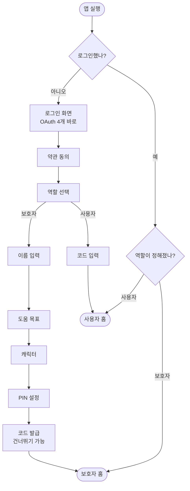
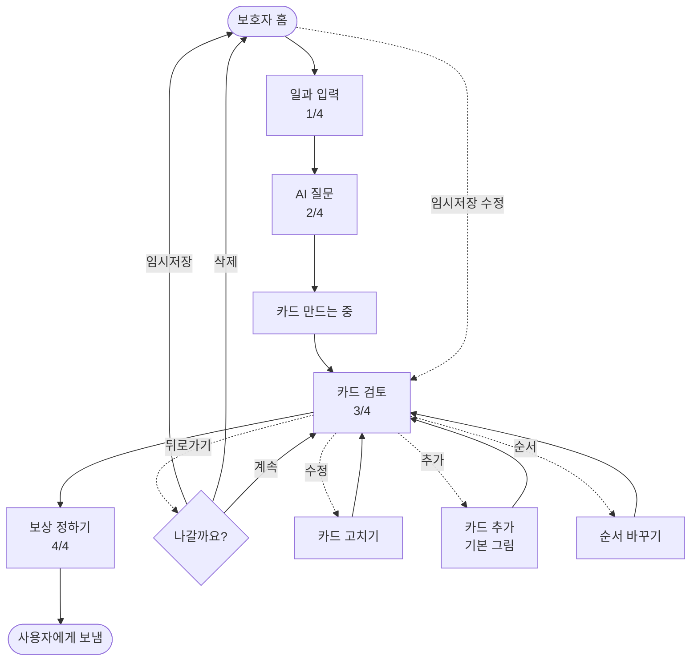
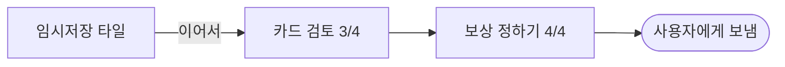

# 화면 전체 명세 — 2026-09-18

> **모든 화면 · 모든 문구 · 모든 흐름.** 이 문서가 최신 기준이다.
> 이전 문서와 다르면 이쪽을 따른다.
>
> [0918 디자이너 작업목록](./2026-09-18-디자이너-작업목록.md) · [0917 전체 화면 재정리](./2026-09-17-디자인-전체화면-재정리.md)

---

# 1. 두 사람을 위해 만든다

| | 보호자 | 사용자(당사자) |
| --- | --- | --- |
| 나이 | **50대** | **20대** |
| 기기 | 자기 휴대폰 | 자기 휴대폰 |
| 하는 일 | 일과 만들기 · 카드 고치기 · 보상 정하기 | 카드 보고 수행하기 |
| 어려움 | **처음 보는 개념이 많다** (보상 · 임시저장 · 기기 연결) | 글자를 못 읽을 수 있다 |

## 그래서 이렇게 쓴다

| 원칙 | 하는 법 |
| --- | --- |
| **짧게 쓰고, 깊은 설명은 접는다** | 본문 한 줄 + `왜 그런가요? ›` → 시트에서 풀어 준다 |
| **전문 용어를 안 쓴다** | 강화물 ❌ → 보상 · 기기 ❌ → 휴대폰 |
| **그림으로도 알 수 있게 한다** | 사용자 화면은 글자 없이도 뜻이 통해야 한다 |
| **다음에 뭐가 나올지 알려준다** | 버튼에 결과를 쓴다 |

---

# 2. 말투 — 토스 라이팅 원칙을 따른다

## 2-1. 기본

| 항목 | 규칙 | 예 |
| --- | --- | --- |
| 말투 | **해요체** 하나로 통일 | `저장했어요` (○) / `저장되었습니다` (✕) |
| 태 | **능동형** | `코드를 보냈어요` (○) / `코드가 발송되었습니다` (✕) |
| 방향 | **긍정형** | `이어서 만들 수 있어요` (○) / `저장 안 하면 사라집니다` (✕) |

## 2-2. 8원칙 — 우리 화면에 옮기면

| # | 원칙 | 우리 화면 |
| :-: | --- | --- |
| 1 | **다음을 예측할 수 있게** | 버튼에 결과를 쓴다 — `다음` 대신 `사용자에게 보내기` |
| 2 | **잡초 뽑기** | `앞으로 결제를 하시겠습니까?` → `결제할까요?` |
| 3 | **빈 문장 제거** | 공간이 비었다고 설명을 채우지 않는다 |
| 4 | **핵심만** | 이미 아는 걸 다시 말하지 않는다 |
| 5 | **말하기 쉽게** | 소리내어 읽어 어색하면 고친다 |
| 6 | **권유하되 강요하지 않는다** | `건너뛰기`를 늘 열어 둔다 |
| 7 | **모두를 위한 단어** | 유행어·은어 안 쓴다. 50대가 아는 말만 |
| 8 | **숨은 감정 찾기** | 다 해냈을 때 축하한다 |

## 2-3. 바꿀 문구

| 지금 | 바꿔서 |
| --- | --- |
| 이룸을 시작해볼까요? | **이룸** |
| 보호자님 계정으로 로그인하면 아이 정보가 안전하게 보관돼요. | **로그인하면 아이 정보가 안전하게 보관돼요** |
| 필수 항목에 모두 동의합니다 | **모두 동의하기** |
| 이 기기는 누가 사용하나요? | **이 휴대폰, 누가 쓰나요?** |
| 아직 아이에게 보내지 않았어요 | **아직 안 보냈어요** |
| 계정을 지우지 못했어요. 잠시 후 다시 시도해주세요. | **탈퇴하지 못했어요. 잠시 후 다시 해주세요** |

> **"기기"를 "휴대폰"으로 바꾼다.** 50대에게 기기는 낯선 말이다. (원칙 5·7)

---

# 3. 전체 흐름

## 3-1. 진입



> 🔴 **`시작하기` 버튼을 없앤다.** 첫 화면에 로그인 버튼이 바로 나온다. → §4-1

## 3-2. 일과 만들기



## 3-3. 사용자


---

# 4. 진입 화면

## 4-1. 🔴 로그인 — `시작하기`를 없앤다

### 지금 (2단계)

```
스플래시                      로그인
┌──────────────────┐        ┌──────────────────┐
│                  │        │ 이룸을            │
│    [병아리]       │        │ 시작해볼까요?      │
│                  │  탭    │                  │
│    [로고]         │  ───▶  │ [카카오로 시작하기]│
│                  │        │ [네이버로 시작하기]│
│  [ 시작하기 ]     │        │ [Google로 시작하기]│
│                  │        │ [Apple로 시작하기] │
└──────────────────┘        └──────────────────┘
       ↑
   의미 없는 한 단계
```

### 바꿔서 (1단계)

```
┌──────────────────────────────┐
│                              │
│         [병아리]              │
│                              │
│         [로고]                │
│                              │
│    할 일을 카드로 만들어요      │  ← 한 줄
│                              │
│  ┌────────────────────────┐ │
│  │   카카오로 시작하기      │ │
│  └────────────────────────┘ │
│  ┌────────────────────────┐ │
│  │   네이버로 시작하기      │ │
│  └────────────────────────┘ │
│  ┌────────────────────────┐ │
│  │   Google로 시작하기     │ │
│  └────────────────────────┘ │
│  ┌────────────────────────┐ │
│  │   Apple로 시작하기      │ │  ← iOS만
│  └────────────────────────┘ │
│                              │
│   지난번에 카카오로 했어요     │  ← 재방문일 때만
│                              │
└──────────────────────────────┘
```

| 항목 | 값 |
| --- | --- |
| 제목 | 로고로 대신한다. **글자 제목 없음** |
| 설명 | `할 일을 카드로 만들어요` — 한 줄 |
| 버튼 | 4개 세로 · 브랜드 색 유지 |
| 재방문 힌트 | `지난번에 ○○로 했어요` — 해당 버튼 **바로 위** |
| 처리 중 | 누른 버튼만 `연결 중...` · 나머지 비활성 |

> **왜 없애나.** `시작하기`는 다음에 뭐가 나올지 말해 주지 않는다 (원칙 1).
> 누를 것이 하나뿐인 화면은 그 자체로 잡초다 (원칙 2).

### 상태

| 상태 | 화면 |
| --- | --- |
| 처음 | 위 그대로 |
| 재방문 | 지난번 수단 위에 힌트 |
| **다른 수단으로 시도** | `처음 가입할 때 쓰신 방법으로 로그인해주세요` |
| **실패** | `로그인하지 못했어요. 잠시 후 다시 해주세요` + 에러 코드 |

## 4-2. 약관 동의

```
┌──────────────────────────────┐
│ ←                            │
│                              │
│  약관에 동의해주세요           │
│                              │
│ ┌──────────────────────────┐ │
│ │ ○ 모두 동의하기           │ │  ← 굵게
│ └──────────────────────────┘ │
│ ──────────────────────────── │
│  ○ (필수) 서비스 이용약관  ›  │
│  ○ (필수) 개인정보 처리방침 › │
│  ○ (선택) 마케팅 정보 받기    │
│                              │
│                              │
│     [ 동의하고 계속하기 ]      │
└──────────────────────────────┘
```

| 항목 | 값 |
| --- | --- |
| 제목 | `약관에 동의해주세요` |
| 전체 동의 | `모두 동의하기` — 선택 항목까지 포함 |
| `›` | 전문 보기 |
| 버튼 | `동의하고 계속하기` · **필수 다 체크해야 활성** |

> ⚠️ **선택 항목이 접히면 안 된다.** `모두 동의하기`가 안 보이는 항목까지 켜면
> 사용자가 뭘 동의했는지 모른다 (원칙 6).

## 4-3. 🆕 역할 선택

```
┌──────────────────────────────┐
│                              │
│  이 휴대폰, 누가 쓰나요?       │
│                              │
│  나중에 바꿀 수 있어요          │
│                              │
│ ┌──────────────────────────┐ │
│ │ [그림]                    │ │
│ │ 보호자예요                 │ │
│ │ 일과를 만들고 관리해요       │ │
│ └──────────────────────────┘ │
│                              │
│ ┌──────────────────────────┐ │
│ │ [그림]                    │ │
│ │ 제가 써요                  │ │
│ │ 받은 코드로 연결해요         │ │
│ └──────────────────────────┘ │
│                              │
└──────────────────────────────┘
```

| 항목 | 값 |
| --- | --- |
| 진행 | **탭하면 바로 넘어간다.** `다음` 버튼 없음 |
| 뒤로 | 없음 |
| 안심 문구 | `나중에 바꿀 수 있어요` — 되돌릴 수 있음을 먼저 말한다 (원칙 6) |

> **"아이"라고 쓰지 않는다.** 20대 당사자도 이 화면을 본다 (원칙 7).

---

# 5. 🆕 휴대폰 연결

## 5-1. 코드 발급 (보호자)

```
┌──────────────────────────────┐
│ ←                            │
│                              │
│  사용자 휴대폰에                │
│  이 코드를 넣어주세요           │
│                              │
│     ┌──────────────┐         │
│     │              │         │
│     │   [QR 코드]   │         │
│     │              │         │
│     └──────────────┘         │
│                              │
│      4 8 2   1 9 3           │
│                              │
│      [ 코드 복사 ]            │
│                              │
│   10분 동안 쓸 수 있어요       │
│                              │
│  [ 코드 다시 만들기 ]          │
│  [ 나중에 할게요 ]             │
└──────────────────────────────┘
```

| 항목 | 값 |
| --- | --- |
| 제목 | `사용자 휴대폰에 이 코드를 넣어주세요` — 뭘 해야 하는지 바로 (원칙 1) |
| 코드 | **화면에서 가장 큰 글자** · 3-3 묶음 · 자간 넓게 |
| 유효 시간 | `10분 동안 쓸 수 있어요` — 카운트다운보다 덜 쫓기게 (원칙 6) |
| 1분 남으면 | `1분 남았어요` |
| 복사 | 누르면 `복사했어요` 토스트 |

### 상태

| 상태 | 화면 |
| --- | --- |
| 정상 | 위 그대로 |
| **만료** | QR·숫자 흐리게 + `코드가 만료됐어요` · `코드 다시 만들기`를 주 버튼으로 |
| **연결됨** | `연결됐어요` + 체크 → 홈으로 |
| **발급 실패** | `코드를 만들지 못했어요. 다시 해주세요` + 에러 코드 |

## 5-2. 코드 입력 (사용자)

```
┌──────────────────────────────┐
│                              │
│  받은 코드 6자리를 넣어주세요    │
│                              │
│   ┌─┐┌─┐┌─┐  ┌─┐┌─┐┌─┐      │
│   │4││8││2│  │ ││ ││ │      │
│   └─┘└─┘└─┘  └─┘└─┘└─┘      │
│                              │
│      [ QR로 연결하기 ]         │
│                              │
│   ┌──────────────────┐       │
│   │  1    2    3     │       │
│   │  4    5    6     │       │
│   │  7    8    9     │       │
│   │       0    ⌫     │       │
│   └──────────────────┘       │
└──────────────────────────────┘
```

| 상태 | 문구 |
| --- | --- |
| 입력 중 | 6자리 채우면 **자동으로 넘어간다** |
| **틀림** | 칸 흔들림 + `코드가 맞지 않아요` |
| **만료** | `코드가 만료됐어요. 새 코드를 받아주세요` |
| **카메라 거부** | `숫자로 넣어주세요` — QR 버튼 자리에. **앱은 그대로 쓸 수 있다** |
| 연결됨 | `연결됐어요` → 홈 |

> ⚠️ **붉은 경고를 크게 쓰지 않는다.** PIN 화면과 같은 톤. 에러 코드는 작게 구석에.

---

# 6. 온보딩

## 6-1. 이름 → 목표 → 캐릭터 → PIN (기존)

```
이름                  목표                  캐릭터               PIN
┌──────────┐        ┌──────────┐        ┌──────────┐      ┌──────────┐
│ 어떻게    │        │ ○○의 어떤 │        │ 함께할    │      │ 비밀번호   │
│ 부를까요? │  ───▶  │ 순간을... │  ───▶  │ 친구를... │ ───▶ │ 4자리     │
│          │        │ [칩 4개]  │        │ [3종]     │      │ ○ ○ ○ ○  │
└──────────┘        └──────────┘        └──────────┘      └──────────┘
   ✅ 유지              🔧 칩 깨짐          ✅ 유지            ✅ 유지
```

## 6-2. 🔧 도움 목표 — 칩이 깨진다

```
지금                                     고쳐서
┌──────────────────────────────────┐    ┌──────────────────────────────────┐
│ [퍼즐] 혼자 끝까지 해내는 경험을 만들어│    │ [퍼즐] 혼자 끝까지 해내는          │
│        요                         │    │        경험을 만들어요             │
└──────────────────────────────────┘    └──────────────────────────────────┘
      "요" 한 글자만 떨어진다                    2줄이면 2줄답게 나뉜다
```

**칩 높이가 68로 고정인데 4번 문구만 한 줄에 안 들어간다.**

| 안 | 내용 |
| --- | --- |
| **A (권장)** | 68을 **최소** 높이로. 2줄이면 늘어난다 |
| B | 4번 문구를 줄인다 — `혼자 끝까지 해내요` |

**아이콘** — 3번(체크리스트)만 무채색이다. 나머지 3개는 컬러. 맞춘다.

**문구는 그대로 간다.** (변경 기록이 없어 현행 유지로 확정)

---

# 7. 일과 만들기

## 7-1. 흐름과 진행 표시

```
 1/4          2/4          (로딩)        3/4           4/4
┌────────┐  ┌────────┐  ┌────────┐  ┌────────┐  ┌────────┐
│ 일과    │  │ AI      │  │ 카드    │  │ 카드    │  │ 보상    │
│ 입력    │─▶│ 질문    │─▶│ 만드는  │─▶│ 검토    │─▶│ 정하기  │
│        │  │        │  │ 중      │  │        │  │        │
└────────┘  └────────┘  └────────┘  └────────┘  └────────┘
  ✅ 유지      ✅ 유지      ✅ 유지      🔧 변경      🆕 신규
```

## 7-2. 🔧 카드 검토

```
┌────────────────────────────────┐
│ ←                       3 / 4  │
│                                │
│  비 오는 날 학교 가기            │
│                                │
│   ┌──┐ ┌──────────┐ ┌──┐      │
│   │  │ │  [그림]   │ │  │      │
│   │  │ │          │ │  │      │
│   │  │ │ 가방을    │ │  │      │
│   │  │ │ 챙겨요    │ │  │      │
│   └──┘ └──────────┘ └──┘      │
│          ● ● ○ ○               │
│                                │
│   [ 고치기 ]        [ 삭제 ]    │
│   [ + 카드 추가 ]  [ ⇅ 순서 ]   │
│                                │
│ ────────────────────────────── │
│  다 하면: 젤리 먹기      [고치기]│
│ ────────────────────────────── │
│                                │
│    [ 사용자에게 보내기 ]         │
└────────────────────────────────┘
```

| 버튼 | 문구 | 활성 조건 |
| --- | --- | --- |
| 고치기 | `고치기` (기존 `이 카드 수정하기` → 잡초 제거) | 항상 |
| 삭제 | `삭제` | **카드 2장 이상** |
| 추가 | `+ 카드 추가` | 항상 |
| 순서 | `⇅ 순서` | **카드 2장 이상** |
| 보상 줄 | 있음 `다 하면: ○○` / 없음 `+ 보상 정하기` | — |
| CTA | **`사용자에게 보내기`** (기존 `아이 화면으로 시작`) | 항상 |

> **CTA를 바꾸는 이유** — `시작`은 뭐가 시작되는지 모른다. `보내기`는 결과가 보인다 (원칙 1).

> ⚠️ **버튼이 4개다.** 한 줄에 넣으면 좁다. 2줄로 나누거나 부가 동작을 아이콘으로 줄인다.

### 🔴 카드 그림은 다시 만들지 않는다

```
카드 고치기                        카드 추가
┌──────────────────────┐        ┌──────────────────────┐
│  카드 고치기           │        │  카드 추가             │
│                      │        │                      │
│  무엇을 하나요?        │        │  무엇을 하나요?        │
│  ┌──────────────┐    │        │  ┌──────────────┐    │
│  │ 가방을 챙겨요  │    │        │  │              │    │
│  └──────────────┘    │        │  └──────────────┘    │
│                      │        │                      │
│  설명 (선택)          │        │  설명 (선택)          │
│  ┌──────────────┐    │        │  ┌──────────────┐    │
│  └──────────────┘    │        │  └──────────────┘    │
│                      │        │                      │
│  ❌ 그림 바꾸기 없음   │        │  기본 그림이 들어가요  │
│                      │        │                      │
│  [취소]      [저장]   │        │  [취소]      [추가]   │
└──────────────────────┘        └──────────────────────┘
```

| 동작 | 그림 |
| --- | --- |
| 고치기 | **그대로 둔다** — 그림 교체 버튼이 없다 |
| 추가 | **기본 그림** — 안내 한 줄로 미리 알린다 |
| 순서 · 삭제 | 그림이 따라간다 |

> 🎨 **기본 그림 에셋이 필요하다.** 대체할 것이 없어서 가장 급하다.

## 7-3. 🆕 순서 바꾸기

```
┌──────────────────────────────┐
│ ←   순서 바꾸기       [ 완료 ] │
│                              │
│  ☰  1  가방을 챙겨요          │
│  ☰  2  신발을 신어요          │  ← 드래그 중: 들리고 그림자
│  ☰  3  우산을 챙겨요          │
│  ☰  4  문을 나서요            │
│                              │
└──────────────────────────────┘
```

| 상태 | 문구 |
| --- | --- |
| 저장 실패 | `순서를 저장하지 못했어요` + 원래 순서로 되돌린다 |

> **캐러셀에서 직접 끌지 않는다.** 좁은 화면에서 오조작이 난다.

## 7-4. 🆕 보상 정하기

```
┌──────────────────────────────┐
│ ←                     4 / 4  │
│                              │
│  다 하면 뭘 할 수 있나요?      │
│                              │
│  미리 정해두면 끝까지 해낼      │  ← 한 줄
│  힘이 돼요                    │
│                              │
│  최근에 정한 보상              │  ← 없으면 섹션째 숨김
│  [간식] [유튜브 10분]          │
│                              │
│  ┌──────────┐ ┌──────────┐  │
│  │ [그림]    │ │ [그림]    │  │
│  │ 간식      │ │ 유튜브    │  │
│  └──────────┘ └──────────┘  │
│  ┌──────────┐ ┌──────────┐  │
│  │ [그림]    │ │ [그림]    │  │
│  │ 놀이      │ │ 산책      │  │
│  └──────────┘ └──────────┘  │
│  ┌──────────────────────┐   │
│  │ 직접 입력             │   │
│  └──────────────────────┘   │
│                              │
│  왜 정하나요? ›               │  ← 시트로
│                              │
│  [ 건너뛰기 ]      [ 다음 ]   │
└──────────────────────────────┘
```

| 항목 | 값 |
| --- | --- |
| 제목 | `다 하면 뭘 할 수 있나요?` |
| 설명 | `미리 정해두면 끝까지 해낼 힘이 돼요` — **한 줄** |
| 직접 입력 | 탭하면 아래에 입력칸이 열린다 · **최대 20자** |
| `건너뛰기` | 보조 버튼 · **항상 활성** (원칙 6) |
| `다음` | **아무것도 안 골라도 활성** |

### 🔴 긴 설명은 시트로 접는다 — 50대 가이드의 핵심 패턴

```
┌──────────────────────────────┐
│  왜 보상을 정하나요?           │
│                              │
│  할 일만 알려주면              │
│  하고 싶어지진 않아요.          │
│                              │
│  끝나고 뭐가 있는지 알면        │
│  지금 하는 일에 의미가 생겨요.   │
│                              │
│  이런 게 잘 통해요             │
│  · 오늘 바로 받을 수 있는 것    │
│  · 평소에 좋아하던 것          │
│                              │
│       [ 알겠어요 ]            │
└──────────────────────────────┘
```

**본문은 한 줄, 설명은 시트.** 이 패턴을 낯선 개념마다 쓴다.

| 낯선 개념 | 본문 한 줄 | 시트 |
| --- | --- | --- |
| 보상 | `미리 정해두면 끝까지 해낼 힘이 돼요` | `왜 정하나요? ›` |
| 임시저장 | `이어서 만들 수 있어요` | — (문구로 충분) |
| 휴대폰 연결 | `사용자 휴대폰에 이 코드를 넣어주세요` | — (그림으로 충분) |
| 도움 목표 | `여러 개를 선택할 수 있어요` | — |

> ⚠️ **`강화`, `행동중재` 같은 말을 화면에 쓰지 않는다.** (원칙 5·7)

## 7-5. 🆕 나갈 때

```
┌──────────────────────────────┐
│  아직 안 보냈어요              │
│                              │
│  임시저장하면 이어서           │
│  만들 수 있어요                │
│                              │
│  [ 삭제 ]        [ 임시저장 ]  │
│                              │
│      계속 만들기               │
└──────────────────────────────┘
```

| 버튼 | 위계 |
| --- | --- |
| `임시저장` | **주 버튼** |
| `삭제` | 위험색 · 주 버튼보다 약하게 |
| `계속 만들기` | 텍스트 버튼 |

> **"사라집니다"라고 겁주지 않는다.** 할 수 있는 것을 말한다 (원칙 6 · 긍정형).

---

# 8. 🔧 보호자 홈

```
┌────────────────────────────────┐
│ 안녕하세요, ○○님         [설정] │
│                                │
│ ┌────────────────────────────┐ │
│ │   + 새로운 일과 만들기       │ │
│ └────────────────────────────┘ │
│                                │
│ 오늘 일과                       │
│ ┌────────────────────────────┐ │
│ │ 비 오는 날 학교 가기         │ │
│ │ ●●●○○  3/5                 │ │
│ │ 다 하면: 젤리 먹기          │ │
│ └────────────────────────────┘ │
│                                │
│ 진행 중                         │
│ ┌────────────────────────────┐ │
│ │ 아침 등교 준비               │ │
│ │ ●●○○○  2/5                 │ │
│ │ 다 하면: 산책                │ │
│ └────────────────────────────┘ │
│                                │
│ 임시저장                        │
│ ┌────────────────────────────┐ │
│ │ 병원 가기                    │ │
│ │ 이어서 만들 수 있어요         │ │
│ │                  [ 이어서 ] │ │  ← 🔴
│ └────────────────────────────┘ │
│                                │
│ 최근 일과                       │
│ ┌────────────────────────────┐ │
│ │ 아침 등교 준비      5/5      │ │
│ │              [ 다시 하기 ]  │ │
│ └────────────────────────────┘ │
│                                │
│ 추천 일과                       │
└────────────────────────────────┘
```

| 섹션 | 무엇이 | 0건이면 |
| --- | --- | --- |
| **오늘 일과** | 오늘 할 일 · 시작 전 | `오늘은 만든 일과가 없어요` |
| **진행 중** | 오늘 것 중 하다 만 것 | 섹션 숨김 |
| **임시저장** | 만들다 만 것 · 사용자에게 안 보임 | 섹션 숨김 |
| **최근 일과** | 지난 날짜 · 10개 | 섹션 숨김 |
| **추천 일과** | 기존 유지 | 유지 |

> **오늘 일과와 진행 중은 타일 디자인이 같다.** 섹션 제목만 다르다.

## 🔴 `이어서`가 핵심이다

> 메모 원문: *"수정을 눌러서 그 화면에서 생성"*

**임시저장 타일의 `이어서`를 누르면 카드 검토 화면으로 바로 간다.**
거기서 고치고, 보상 정하고, 보내는 것까지 끝낸다.



> **`수정` 대신 `이어서`로 쓴다.** 고치는 게 아니라 **만들다 만 것을 마저 만드는 것**이다 (원칙 1).

## 🆕 설정

```
┌──────────────────────────────┐
│  설정                         │
│                              │
│  알림                     ›  │
│  사용자 휴대폰 연결        ›  │
│ ──────────────────────────── │
│  로그아웃                     │
│  회원 탈퇴                    │
└──────────────────────────────┘
```

| 항목 | 상태 | 확인 문구 |
| --- | :-: | --- |
| 알림 | 🆕 | — |
| 사용자 휴대폰 연결 | 🆕 | → §5-1 |
| 로그아웃 | ✅ | `로그아웃할까요?` |
| 회원 탈퇴 | ✅ | `정말 탈퇴할까요?` · **되돌릴 수 없다고 말한다** |

> **탈퇴는 위험색을 쓰되 가장 눈에 안 띄게.** 오탭으로 계정이 날아가면 안 된다.

## 상태

| 상태 | 화면 |
| --- | --- |
| **로딩** | 스켈레톤 — 빈 상태와 **반드시 구분** |
| **실패** | `불러오지 못했어요` + `다시 시도` + 에러 코드 |
| 전부 0건 | `새로운 일과 만들기` + 추천 일과만 |

---

# 9. 🔧 사용자 화면

## 9-1. 홈

```
평소                            오늘 다 함
┌──────────────────────┐      ┌──────────────────────┐
│ ⭐12         하늘이    │      │ ⭐15         하늘이    │
│                      │      │                      │
│ [그림]                │      │        🎉            │
│ 다 하면 젤리 먹어요!    │      │  오늘 할 일을 다 했어요!│
│                      │      │                      │
│  지금 할 일           │      │  [그림] 젤리를 먹어요  │
│ ┌──────────────────┐ │      │                      │
│ │     [그림]        │ │      ├──────────────────────┤
│ │   학교 가기 준비   │ │      │ ✓ 학교 가기 준비      │
│ │    ●●○○○         │ │      │ ✓ 아침 약 먹기        │
│ │    [ 시작 ]       │ │      └──────────────────────┘
│ └──────────────────┘ │
│                      │
│ ✓ 아침 약 먹기        │
└──────────────────────┘
```

| 상태 | 화면 |
| --- | --- |
| 남음 | `지금 할 일` 카드 **하나만 크게** |
| **다 함** | 카드 자리를 축하 + 보상 문구로 **교체** (원칙 8) |
| 0건 | 기존 빈 화면 |
| **보상 없음** | **배너를 띄우지 않는다** |

## 9-2. 카드 수행

```
┌─────────────────────────┐
│ [그림] 젤리    ●●○○○    │  ← 🔴 고정. 카드 넘겨도 유지
├─────────────────────────┤
│                         │
│       [카드 그림]         │
│                         │
│      가방을 챙겨요        │
│                         │
│       [ 했어요! ]         │
└─────────────────────────┘
```

| 규칙 | 내용 |
| --- | --- |
| 위치 | **상단 고정** |
| 높이 | 카드 그림을 **가리지 않는 최소 높이** |
| 보상 없음 | 바를 숨기고 진행률만 |

> 🔴 **전문가 자문의 핵심 요구다.** *"수행하는 동안 최종 보상을 계속 볼 수 있어야 한다."*

## 9-3. 보상 완료

```
┌────────────────────────┐
│    [캐릭터]              │
│                        │
│     축하해요!            │
│  할 일을 해내서 루미가    │
│  하늘이에게 별을 가져왔어요│
│                        │
│  ──────────────────    │
│  [그림] 이제 젤리를 먹어요│  ← 보상 있을 때만
│  ──────────────────    │
│                        │
│      [ 오예! ]          │
└────────────────────────┘
```

**보상이 없으면 기존 화면 그대로.**

---

# 10. 실패했을 때도 그린다

> **행복 경로만 그린 디자인은 미완성이다.**

| 상황 | 그려야 할 것 |
| --- | --- |
| 불러오기 실패 | 빈 화면·무한 로딩 금지. **상태 + 다시 시도** |
| 0건 | **로딩(스켈레톤)과 구분되는** 빈 화면 |
| 권한 거부 | 거부해도 앱은 돈다. **왜 필요한지 + 우회 경로** |
| 예상 못 한 오류 | 붉게 덮지 않는다. **작은 에러 코드**를 남긴다 |

## 에러 문구도 해요체로

| 지금 | 바꿔서 |
| --- | --- |
| 계정을 지우지 못했어요. 잠시 후 다시 시도해주세요. (E-DEL) | **탈퇴하지 못했어요. 잠시 후 다시 해주세요 (E-DEL)** |
| 동의를 저장하지 못했어요. 잠시 후 다시 눌러주세요. (E-CONSENT) | **동의를 저장하지 못했어요. 다시 해주세요 (E-CONSENT)** |
| 수정 내용을 서버에 저장하지 못했어요 (E-STEP) | **고친 내용을 저장하지 못했어요 (E-STEP)** |

> **"서버"를 안 쓴다.** 사용자에게 서버는 남의 일이다 (원칙 7).

---

# 11. 변경점 한눈에

| # | 화면 | 변경 | 크기 |
| :-: | --- | --- | :-: |
| 1 | **로그인** | `시작하기` 없애고 OAuth 버튼 바로 | 🔴 큼 |
| 2 | 약관 | 문구만 | 작음 |
| 3 | **역할 선택** | 신규 | 🆕 |
| 4 | **코드 발급** | 신규 | 🆕 |
| 5 | **코드 입력** | 신규 | 🆕 |
| 6 | 도움 목표 | 칩 높이 · 아이콘 톤 | 작음 |
| 7 | **카드 검토** | 버튼 4개 · CTA 문구 · 보상 줄 | 🔴 큼 |
| 8 | 카드 고치기 시트 | 그림 교체 제거 | 작음 |
| 9 | **카드 추가 시트** | 신규 (기본 그림) | 🆕 |
| 10 | **순서 바꾸기** | 신규 | 🆕 |
| 11 | **보상 정하기** | 신규 | 🆕 |
| 12 | **보상 안내 시트** | 신규 | 🆕 |
| 13 | **나갈 때 팝업** | 신규 | 🆕 |
| 14 | **보호자 홈** | 섹션 4구역 · 설정 아이콘 | 🔴 큼 |
| 15 | **설정 시트** | 신규 | 🆕 |
| 16 | 사용자 홈 | 보상 배너 · 다 함 상태 | 중간 |
| 17 | 카드 수행 | 상단 고정 바 | 중간 |
| 18 | 보상 완료 | 문구 한 줄 | 작음 |

**전 화면 문구를 해요체·능동형·긍정형으로 손본다.**

---

## 에셋

| 에셋 | 개수 | 급함 |
| --- | :-: | :-: |
| **카드 기본 그림** | 1~3 | 🔴 대체 불가 |
| **보상 프리셋 그림** | 5 | 🔴 이모지로 임시 가능 |
| 역할 선택 그림 | 2 | 중간 |
| 설정 아이콘 | 2 | 낮음 |
| 목표 3번 아이콘 컬러 | 1 | 낮음 |
| 드래그 핸들 | 1 | 낮음 |

---

## 출처

- [토스의 8가지 라이팅 원칙들 — Toss Tech](https://toss.tech/article/8-writing-principles-of-toss)
- [토스의 8가지 라이팅 원칙 정리](https://weeklyuxuichallenge.oopy.io/0ad48209-9ef8-4eba-a986-67d42e2a81f3)
- [토스 UX 라이팅에 숨어있는 전략](https://brunch.co.kr/@lunda/32)
